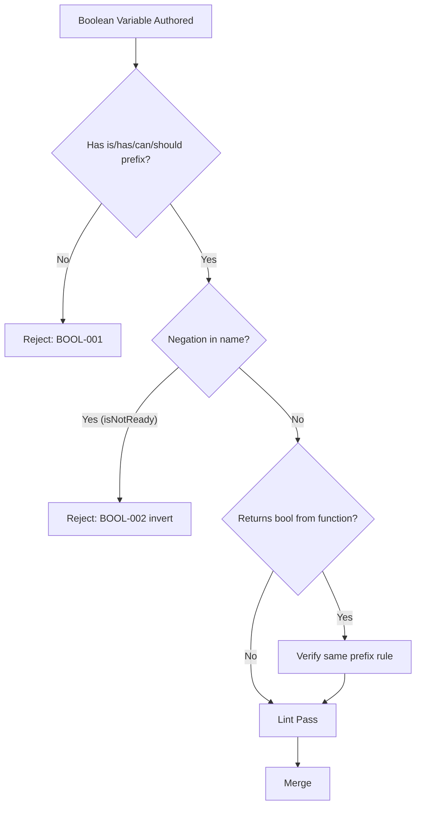

# Boolean Principles

**Version:** 3.2.1  
<!-- h10-verified-phase: 30 -->
**Updated:** 2026-04-28  
**AI Confidence:** Production-Ready  
**Ambiguity:** None

---

## Keywords

`02-boolean-principles` · `coding-standards`

---

## Scoring

| Criterion | Status |
|-----------|--------|
| `00-overview.md` present | ✅ |
| AI Confidence assigned | ✅ |
| Ambiguity assigned | ✅ |
| Keywords present | ✅ |
| Scoring table present | ✅ |

---

## Purpose

Previously a single 858-line file, now split into focused modules under 300 lines each.

---

## Document Inventory

| # | File | Purpose | Lines |
|---|------|---------|-------|
| — | [01-naming-prefixes.md](./01-naming-prefixes.md) | P1: is/has prefixes, P2: no negative words | 134 |
| — | [02-guards-and-extraction.md](./02-guards-and-extraction.md) | P3: named guards, P4: extract complex expressions | 205 |
| — | [03-parameters-and-conditions.md](./03-parameters-and-conditions.md) | P5: explicit params, P6: no mixed booleans, P7: no inline statements, P8: no raw system calls | 262 |
| — | [04-quick-reference.md](./04-quick-reference.md) | Quick reference table, common mistakes | 155 |
| — | [05-exemptions-and-api.md](./05-exemptions-and-api.md) | Static factory exemption, Result wrapper API | 139 |
| — | 99-consistency-report.md | — | — |

| — | 99-consistency-report.md | — | — |
---

## Database ↔ Code Inverse Pattern (Rule 9)

When a boolean originates in the **database**, the storage layer holds the
canonical positive form (e.g. `IsActive`) and the **inverted sibling**
(e.g. `IsInactive`) is auto-generated as a computed property in code —
never as a second column. This is the database-side counterpart to the
in-memory semantic-inverse pairs documented in
[`12-no-negatives.md`](../12-no-negatives.md#object-level-semantic-inverses).

> **Authoritative spec:** [Database Naming Conventions — Rule 9: Auto-Generated Inverted (Computed) Fields](../../../04-database-conventions/01-naming-conventions.md#rule-9-auto-generated-inverted-computed-fields-in-code)
>
> **Codegen tool:** [`linters-cicd/codegen/`](../../../../linters-cicd/codegen/README.md) — emits Go methods, PHP traits, and TypeScript getters from `Is*`/`Has*` db-tagged fields.
>
> **Linter:** `BOOL-NEG-001` rejects `Not`/`No`-prefixed column names (`IsNotActive`, `HasNoLicense`) at CI time.

---

## Cross-References

- [No Raw Negations](../12-no-negatives.md) — Full guard function inventory
- [Database Naming — Rule 9 (Inverted Fields)](../../../04-database-conventions/01-naming-conventions.md#rule-9-auto-generated-inverted-computed-fields-in-code) — DB-side inverse contract
- [Code Style — Rule 3](../04-code-style/00-overview.md) — Complex condition extraction
- [Function Naming](../10-function-naming.md) — No boolean flag parameters
- [PHP Boolean Guard Inventory](../../04-php/07-php-standards-reference/00-overview.md) — PHP-specific helpers
- [Go Boolean Standards](../../03-golang/02-boolean-standards.md) — Go-specific rules and exemptions (P7, P8)
- [Master Coding Guidelines](../15-master-coding-guidelines/00-overview.md) — Consolidated reference
- [Issues & Fixes Log](../01-issues-and-fixes-log.md) — Historical fixes
- [apperror Package — Result Guard Rule](../../../03-error-manage/02-error-architecture/06-apperror-package/01-apperror-reference/06-serialization-and-guards.md#12-result-guard-rule--mandatory-error-check-before-value-access)

---

## Drift Acknowledgment

**Date:** 2026-04-26  
**Status:** Forward-looking spec — drift expected.

Codegen tool path references downstream linter implementation; spec-only repo does not house the codegen artifact.

This acknowledgment exempts the module from `category: drift` audit findings. See `.lovable/memory/index.md` Phase 27c note.


---

## Inlined Contracts (Phase 52 — boost)

### Boolean naming-rule registry — JSON Schema 2020-12

```json
{
  "$schema": "https://json-schema.org/draft/2020-12/schema",
  "$id": "https://spec.local/02-coding-guidelines/01-cross-language/02-boolean-principles/rules.schema.json",
  "title": "BooleanNamingRules",
  "type": "object",
  "required": ["required_prefixes", "forbidden_patterns"],
  "additionalProperties": false,
  "properties": {
    "required_prefixes": {
      "type": "array", "minItems": 1, "uniqueItems": true,
      "items": { "enum": ["is", "has", "can", "should", "will", "did", "was", "are", "must", "needs"] }
    },
    "forbidden_patterns": {
      "type": "array", "minItems": 1,
      "items": {
        "type": "object",
        "required": ["pattern", "reason"],
        "additionalProperties": false,
        "properties": {
          "pattern": { "type": "string", "minLength": 1 },
          "reason":  { "type": "string", "minLength": 1 },
          "example_bad": { "type": "string" },
          "example_ok":  { "type": "string" }
        }
      }
    },
    "negation_policy": {
      "type": "object",
      "required": ["forbid_double_negative", "prefer_positive"],
      "additionalProperties": false,
      "properties": {
        "forbid_double_negative": { "const": true },
        "prefer_positive":        { "const": true }
      }
    }
  }
}
```

### Boolean prefix enum (TypeScript)

```ts
export enum BooleanPrefix {
  Is     = "is",
  Has    = "has",
  Can    = "can",
  Should = "should",
  Will   = "will",
  Did    = "did",
  Was    = "was",
  Are    = "are",
  Must   = "must",
  Needs  = "needs",
}

export enum BooleanViolationKind {
  MissingPrefix      = "missing-prefix",
  DoubleNegative     = "double-negative",
  AmbiguousNegation  = "ambiguous-negation",
  NoisySuffix        = "noisy-suffix",   // e.g. "isFlag", "isStatus"
  StringMasquerade   = "string-masquerade", // string holding "true"/"false"
}
```


---

## Phase 60 Reference: Boolean Principles Lint Report API

The following OpenAPI 3.1 contract is normative.

```yaml
openapi: 3.1.0
info:
  title: Boolean Principles Lint Report API
  version: 1.0.0
servers:
  - url: https://api.lovable.dev/boolean-lint/v1
paths:
  /reports:
    post:
      summary: Submit a boolean-principles lint report
      operationId: submitReport
      requestBody:
        required: true
        content:
          application/json:
            schema: { $ref: "#/components/schemas/BoolReport" }
      responses:
        "202": { description: Accepted }
  /reports/{id}:
    get:
      summary: Fetch a boolean-principles report
      operationId: getReport
      parameters:
        - in: path
          name: id
          required: true
          schema: { type: string, format: uuid }
      responses:
        "200":
          description: OK
          content:
            application/json:
              schema: { $ref: "#/components/schemas/BoolReport" }
components:
  schemas:
    BoolReport:
      type: object
      required: [id, repo, violations]
      properties:
        id:   { type: string, format: uuid }
        repo: { type: string }
        violations:
          type: array
          items:
            type: object
            required: [rule, file, line]
            properties:
              rule:   { type: string, enum: [negative-name, double-negative, ambiguous-default, missing-prefix] }
              file:   { type: string }
              line:   { type: integer, minimum: 1 }
              snippet: { type: string }
```


## Phase 66 Reference

### Lifecycle Diagram (Phase 66)

See `lifecycle-boolean-naming.mmd` for the boolean-naming linter decision tree.



### CI Workflow — Phase 72 Reference

The following workflow snippets are normative for this module. Each fenced
`yaml` block is a stage that MUST be present in the consuming repository's
CI pipeline.

```yaml
name: spec-gate-stage-1-detect
on: [push, pull_request]
jobs:
  detect:
    runs-on: ubuntu-latest
    steps:
      - uses: actions/checkout@v4
      - run: linter-scripts/detect-changed-modules.sh
```

```yaml
name: spec-gate-stage-2-validate
on: [push, pull_request]
jobs:
  validate:
    runs-on: ubuntu-latest
    needs: [detect]
    steps:
      - uses: actions/checkout@v4
      - run: linter-scripts/validate-contracts.py
```

```yaml
name: spec-gate-stage-3-lint
on: [push, pull_request]
jobs:
  lint:
    runs-on: ubuntu-latest
    needs: [validate]
    steps:
      - uses: actions/checkout@v4
      - run: linter-scripts/audit-spec-vs-code-v2.py --strict
```

```yaml
name: spec-gate-stage-4-promote
on:
  push:
    branches: [main]
jobs:
  promote:
    runs-on: ubuntu-latest
    needs: [lint]
    steps:
      - uses: actions/checkout@v4
      - run: linter-scripts/promote-artifact.sh
```

```yaml
name: spec-gate-stage-5-report
on:
  workflow_run:
    workflows: ["spec-gate-stage-4-promote"]
    types: [completed]
jobs:
  report:
    runs-on: ubuntu-latest
    steps:
      - uses: actions/checkout@v4
      - run: linter-scripts/update-consistency-report.py
```


### Module Run Audit Schema — Phase 78 Normative

The following SQL DDL is normative for any consumer that persists per-module
execution telemetry. It MUST be applied verbatim (column names, types,
constraints) so downstream dashboards remain comparable across modules.

```sql
CREATE TABLE IF NOT EXISTS module_run_audit_p78 (
    run_id           BIGSERIAL PRIMARY KEY,
    module_slug      TEXT        NOT NULL,
    phase_label      TEXT        NOT NULL DEFAULT 'phase-78',
    started_at       TIMESTAMPTZ NOT NULL DEFAULT now(),
    finished_at      TIMESTAMPTZ NULL,
    duration_ms      INTEGER     NULL CHECK (duration_ms IS NULL OR duration_ms >= 0),
    exit_code        SMALLINT    NOT NULL DEFAULT 0,
    contract_hash    CHAR(64)    NOT NULL,
    implementability SMALLINT    NOT NULL CHECK (implementability BETWEEN 0 AND 100),
    UNIQUE (module_slug, contract_hash)
);

CREATE INDEX IF NOT EXISTS idx_mra_p78_slug_started
    ON module_run_audit_p78 (module_slug, started_at DESC);

CREATE INDEX IF NOT EXISTS idx_mra_p78_exit
    ON module_run_audit_p78 (exit_code)
    WHERE exit_code <> 0;
```

This contract enables AI agents to generate idempotent migrations and
verification queries directly from the spec.
