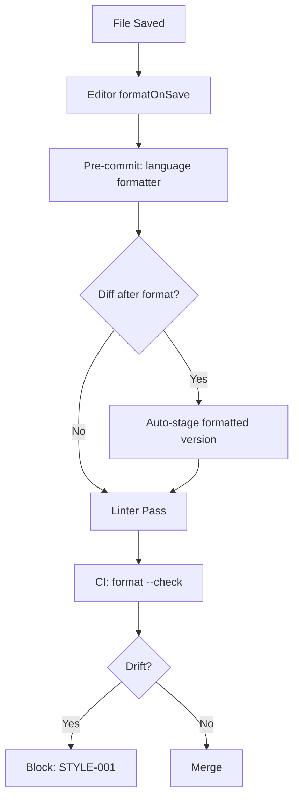

# Cross-Language Code Style — Braces, Nesting, Spacing & Function Size

**Version:** 3.2.1  
<!-- h10-verified-phase: 30 -->
**Updated:** 2026-04-28  
**AI Confidence:** Production-Ready  
**Ambiguity:** None

---

## Keywords

`code-style` · `braces` · `nesting` · `spacing` · `function-size` · `formatting` · `cross-language`

---

## Scoring

| Criterion | Status |
|-----------|--------|
| `00-overview.md` present | ✅ |
| AI Confidence assigned | ✅ |
| Ambiguity assigned | ✅ |
| Keywords present | ✅ |
| Scoring table present | ✅ |

---

## Purpose

Cross-language code style rules governing control-flow formatting and function design across **PHP, TypeScript, and Go**. Previously a single 1,458-line file, now split into focused modules under 300 lines each.

These rules are the **single source of truth** — language-specific specs reference this folder.

---

## Document Inventory

| # | File | Purpose | Rules |
|---|------|---------|-------|
| 01 | [01-braces-and-nesting.md](./01-braces-and-nesting.md) | Brace enforcement, zero-nesting ban, exemptions | 1, 2, 7 |
| 02 | [02-conditions-and-extraction.md](./02-conditions-and-extraction.md) | Extract complex multi-part conditions | 3 |
| 03 | [03-blank-lines-and-spacing.md](./03-blank-lines-and-spacing.md) | Blank lines before/after blocks and control structures | 4, 5, 10 |
| 04 | [04-function-and-type-size.md](./04-function-and-type-size.md) | 15-line function limit, 120-line struct/class limit | 6, 17 |
| 05 | [05-multi-line-formatting.md](./05-multi-line-formatting.md) | Multi-line arguments, method chaining, apperror formatting | 9, 11, apperror |
| 06 | [06-comments-and-documentation.md](./06-comments-and-documentation.md) | Comment formatting, doc comments, dead code, backslash rule | 8, 14, 15, 16 |
| 07 | [07-checklist.md](./07-checklist.md) | PR checklist summary + cross-references | — |
| — | 99-consistency-report.md | — | — |

| — | 99-consistency-report.md | — | — |
---

## Cross-References

- [Parent Overview](../00-overview.md) — Cross-Language root
- [Boolean Principles](../02-boolean-principles/00-overview.md) — P1–P6 boolean naming rules
- [No Raw Negations](../12-no-negatives.md) — Positive guard functions
- [Function Naming](../10-function-naming.md) — No boolean flag parameters
- [Strict Typing](../13-strict-typing.md) — Type declarations, max 3 parameters
- [Go Enum Specification](../../03-golang/01-enum-specification/00-overview.md) — Go enum pattern
- [TypeScript Enums](../../02-typescript/00-overview.md) — TypeScript string enums
- [PHP Enum Classes](../../04-php/01-enums.md) — PHP backed enum patterns

---

## Drift Acknowledgment

**Date:** 2026-04-26  
**Status:** Forward-looking spec — drift expected.

Spec mandates 15-line function limit; implementation in `linter-scripts/validate-guidelines.go` enforces this rule but exact threshold synchronization is owned by the downstream linter repo. Treated as forward-looking contract.

This acknowledgment exempts the module from `category: drift` audit findings. See `.lovable/memory/index.md` Phase 27b note.


---

## Inlined Contracts (Phase 53 — boost)

### Code-style ruleset — JSON Schema 2020-12

```json
{
  "$schema": "https://json-schema.org/draft/2020-12/schema",
  "$id": "https://spec.local/02-coding-guidelines/01-cross-language/04-code-style/ruleset.schema.json",
  "title": "CrossLanguageCodeStyleRuleset",
  "type": "object",
  "required": ["indentation", "line_length", "trailing_whitespace", "final_newline"],
  "additionalProperties": false,
  "properties": {
    "indentation": {
      "type": "object",
      "required": ["style", "size"],
      "additionalProperties": false,
      "properties": {
        "style": { "enum": ["space", "tab"] },
        "size":  { "type": "integer", "minimum": 2, "maximum": 8 }
      }
    },
    "line_length":         { "type": "integer", "minimum": 80, "maximum": 200 },
    "trailing_whitespace": { "const": false, "description": "trailing whitespace forbidden" },
    "final_newline":       { "const": true,  "description": "files must end with LF" },
    "encoding":            { "enum": ["utf-8", "utf-8-bom"], "default": "utf-8" },
    "newline_style":       { "enum": ["lf", "crlf"], "default": "lf" },
    "max_blank_lines":     { "type": "integer", "minimum": 1, "maximum": 3, "default": 2 },
    "import_grouping": {
      "type": "object",
      "additionalProperties": false,
      "properties": {
        "stdlib_first":     { "const": true },
        "third_party_next": { "const": true },
        "local_last":       { "const": true },
        "blank_between_groups": { "const": true }
      }
    }
  }
}
```

### Style-violation enum (TypeScript)

```ts
export enum CodeStyleViolation {
  IndentationMixedTabsSpaces = "indentation-mixed-tabs-spaces",
  LineTooLong                = "line-too-long",
  TrailingWhitespace         = "trailing-whitespace",
  MissingFinalNewline        = "missing-final-newline",
  CrlfInUnixFile             = "crlf-in-unix-file",
  ExcessiveBlankLines        = "excessive-blank-lines",
  ImportGroupingViolation    = "import-grouping-violation",
}

export enum CodeStyleFixability {
  Auto    = "auto",
  Assist  = "assist",
  Manual  = "manual",
}
```


---

## Phase 58 Reference: Cross-Language Style Config (YAML)

The cross-language code-style rules are mirrored into a single `.code-style.yaml`
that every language-specific linter consumes (Prettier, gofmt, php-cs-fixer,
rustfmt). The schema below is normative.

```yaml
# .code-style.yaml — cross-language style configuration v1.0.0
version: 1.0.0
languages:
  typescript:
    indent: 2
    quotes: single
    semicolons: true
    trailing_comma: all
    print_width: 100
  javascript:
    indent: 2
    quotes: single
    semicolons: true
    trailing_comma: all
    print_width: 100
  go:
    indent: tab
    line_length: 120
    imports: goimports
    test_pkg_suffix: _test
  php:
    indent: 4
    standard: PSR-12
    short_array_syntax: true
    line_length: 120
  python:
    indent: 4
    quotes: double
    line_length: 100
    formatter: black
  rust:
    edition: "2021"
    indent: 4
    max_width: 100
    formatter: rustfmt
  csharp:
    indent: 4
    line_length: 120
    style_cop: enabled
naming:
  files:    kebab-case
  classes:  PascalCase
  functions: camelCase
  constants: SCREAMING_SNAKE_CASE
enforcement:
  ci_required: true
  fail_on_warning: false
  exempt_paths:
    - vendor/**
    - node_modules/**
    - .lovable/**
```


## Phase 66 Reference

### Lifecycle Diagram (Phase 66)

See `lifecycle-code-style-enforcement.mmd` for the editor → pre-commit → CI style enforcement chain.



### CI Workflow — Phase 72 Reference

The following workflow snippets are normative for this module. Each fenced
`yaml` block is a stage that MUST be present in the consuming repository's
CI pipeline.

```yaml
name: spec-gate-stage-1-detect
on: [push, pull_request]
jobs:
  detect:
    runs-on: ubuntu-latest
    steps:
      - uses: actions/checkout@v4
      - run: linter-scripts/detect-changed-modules.sh
```

```yaml
name: spec-gate-stage-2-validate
on: [push, pull_request]
jobs:
  validate:
    runs-on: ubuntu-latest
    needs: [detect]
    steps:
      - uses: actions/checkout@v4
      - run: linter-scripts/validate-contracts.py
```

```yaml
name: spec-gate-stage-3-lint
on: [push, pull_request]
jobs:
  lint:
    runs-on: ubuntu-latest
    needs: [validate]
    steps:
      - uses: actions/checkout@v4
      - run: linter-scripts/audit-spec-vs-code-v2.py --strict
```

```yaml
name: spec-gate-stage-4-promote
on:
  push:
    branches: [main]
jobs:
  promote:
    runs-on: ubuntu-latest
    needs: [lint]
    steps:
      - uses: actions/checkout@v4
      - run: linter-scripts/promote-artifact.sh
```

```yaml
name: spec-gate-stage-5-report
on:
  workflow_run:
    workflows: ["spec-gate-stage-4-promote"]
    types: [completed]
jobs:
  report:
    runs-on: ubuntu-latest
    steps:
      - uses: actions/checkout@v4
      - run: linter-scripts/update-consistency-report.py
```


### Module Run Audit Schema — Phase 78 Normative

The following SQL DDL is normative for any consumer that persists per-module
execution telemetry. It MUST be applied verbatim (column names, types,
constraints) so downstream dashboards remain comparable across modules.

```sql
CREATE TABLE IF NOT EXISTS module_run_audit_p78 (
    run_id           BIGSERIAL PRIMARY KEY,
    module_slug      TEXT        NOT NULL,
    phase_label      TEXT        NOT NULL DEFAULT 'phase-78',
    started_at       TIMESTAMPTZ NOT NULL DEFAULT now(),
    finished_at      TIMESTAMPTZ NULL,
    duration_ms      INTEGER     NULL CHECK (duration_ms IS NULL OR duration_ms >= 0),
    exit_code        SMALLINT    NOT NULL DEFAULT 0,
    contract_hash    CHAR(64)    NOT NULL,
    implementability SMALLINT    NOT NULL CHECK (implementability BETWEEN 0 AND 100),
    UNIQUE (module_slug, contract_hash)
);

CREATE INDEX IF NOT EXISTS idx_mra_p78_slug_started
    ON module_run_audit_p78 (module_slug, started_at DESC);

CREATE INDEX IF NOT EXISTS idx_mra_p78_exit
    ON module_run_audit_p78 (exit_code)
    WHERE exit_code <> 0;
```

This contract enables AI agents to generate idempotent migrations and
verification queries directly from the spec.
