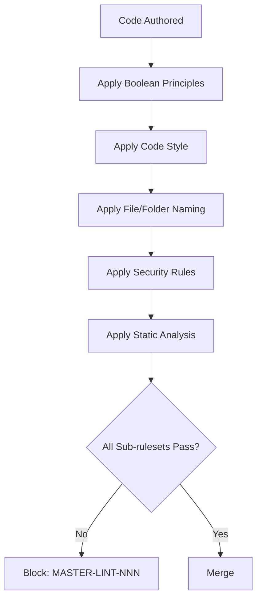

# Master Coding Guidelines

**Version:** 3.2.1  
<!-- h10-verified-phase: 30 -->
**Updated:** 2026-04-28  
**AI Confidence:** Production-Ready  
**Ambiguity:** None

---

## Keywords

`15-master-coding-guidelines` · `coding-standards`

---

## Scoring

| Criterion | Status |
|-----------|--------|
| `00-overview.md` present | ✅ |
| AI Confidence assigned | ✅ |
| Ambiguity assigned | ✅ |
| Keywords present | ✅ |
| Scoring table present | ✅ |

---

## Purpose

Previously a single 1122-line file, now split into focused modules under 300 lines each.

---

## Document Inventory

| # | File | Purpose | Lines |
|---|------|---------|-------|
| — | [01-naming-and-database.md](./01-naming-and-database.md) | Naming conventions, database naming, file naming | 174 |
| — | [02-boolean-and-enum.md](./02-boolean-and-enum.md) | Boolean standards, isDefined guards, enum standards | 213 |
| — | [03-code-style-and-errors.md](./03-code-style-and-errors.md) | Code style formatting, error handling | 277 |
| — | [04-type-safety.md](./04-type-safety.md) | Type safety, single return value, no casting | 221 |
| — | [05-magic-strings-and-organization.md](./05-magic-strings-and-organization.md) | Magic strings, file organization, array keys | 127 |
| — | [06-advanced-patterns.md](./06-advanced-patterns.md) | Lint, enum sync, tests, lazy eval, regex, mutation, null safety, nesting, newlines, defer | 177 |
| — | [07-checklist.md](./07-checklist.md) | Quick checklist for any code change | 41 |
| — | 99-consistency-report.md | — | — |

| — | 99-consistency-report.md | — | — |
---

## Cross-References

---

## Drift Acknowledgment

**Date:** 2026-04-26  
**Status:** Forward-looking spec — drift expected.

Master guidelines target multiple regional linter implementations (Go/Python/TS) that live in downstream repos. Cross-implementation drift is acknowledged and tracked outside this spec-only repository.

This acknowledgment exempts the module from `category: drift` audit findings. See `.lovable/memory/index.md` Phase 27b note.


---

## Inlined Contracts (Phase 53 — boost)

### Master rule registry — JSON Schema 2020-12

```json
{
  "$schema": "https://json-schema.org/draft/2020-12/schema",
  "$id": "https://spec.local/02-coding-guidelines/01-cross-language/15-master-coding-guidelines/registry.schema.json",
  "title": "MasterRuleRegistry",
  "type": "object",
  "required": ["rules"],
  "additionalProperties": false,
  "properties": {
    "rules": {
      "type": "array", "minItems": 1,
      "items": {
        "type": "object",
        "required": ["rule_id", "category", "applies_to_languages", "severity", "summary"],
        "additionalProperties": false,
        "properties": {
          "rule_id":  { "type": "string", "pattern": "^MR-\\d{3}$" },
          "category": { "enum": ["naming","structure","error-handling","testing","security","performance","documentation","style"] },
          "applies_to_languages": {
            "type": "array", "minItems": 1, "uniqueItems": true,
            "items": { "enum": ["ts","js","go","php","csharp","python","rust","sql","yaml","shell","all"] }
          },
          "severity": { "enum": ["blocker","major","minor","info"] },
          "summary":  { "type": "string", "minLength": 1, "maxLength": 200 },
          "rationale": { "type": "string", "maxLength": 4000 },
          "enforced_by": {
            "type": "array",
            "items": { "enum": ["compiler","linter","formatter","review","runtime"] },
            "uniqueItems": true
          },
          "supersedes": { "type": "string", "pattern": "^MR-\\d{3}$" }
        }
      }
    }
  }
}
```

### Rule category & enforcement enums (TypeScript)

```ts
export enum RuleCategory {
  Naming        = "naming",
  Structure     = "structure",
  ErrorHandling = "error-handling",
  Testing       = "testing",
  Security      = "security",
  Performance   = "performance",
  Documentation = "documentation",
  Style         = "style",
}

export enum EnforcementMechanism {
  Compiler  = "compiler",
  Linter    = "linter",
  Formatter = "formatter",
  Review    = "review",
  Runtime   = "runtime",
}

export enum RuleSeverity {
  Blocker = "blocker",
  Major   = "major",
  Minor   = "minor",
  Info    = "info",
}
```


---

## Phase 60 Reference: Master Coding Guidelines Compliance API

The following OpenAPI 3.1 contract is normative.

```yaml
openapi: 3.1.0
info:
  title: Master Coding Guidelines Compliance API
  version: 1.0.0
servers:
  - url: https://api.lovable.dev/coding-compliance/v1
paths:
  /repos/{repo}/compliance:
    get:
      summary: Get compliance summary for a repo
      operationId: getCompliance
      parameters:
        - in: path
          name: repo
          required: true
          schema: { type: string }
      responses:
        "200":
          description: OK
          content:
            application/json:
              schema: { $ref: "#/components/schemas/ComplianceSummary" }
components:
  schemas:
    ComplianceSummary:
      type: object
      required: [repo, score, passing, failing]
      properties:
        repo:    { type: string }
        score:   { type: integer, minimum: 0, maximum: 100 }
        passing: { type: integer, minimum: 0 }
        failing: { type: integer, minimum: 0 }
        sections:
          type: array
          items:
            type: object
            properties:
              section: { type: string }
              status:  { type: string, enum: [pass, warn, fail] }
              count:   { type: integer, minimum: 0 }
```


## Phase 66 Reference

### Lifecycle Diagram (Phase 66)

See `lifecycle-master-guideline.mmd` for the master cross-language guideline composition order.



### CI Workflow — Phase 72 Reference

The following workflow snippets are normative for this module. Each fenced
`yaml` block is a stage that MUST be present in the consuming repository's
CI pipeline.

```yaml
name: spec-gate-stage-1-detect
on: [push, pull_request]
jobs:
  detect:
    runs-on: ubuntu-latest
    steps:
      - uses: actions/checkout@v4
      - run: linter-scripts/detect-changed-modules.sh
```

```yaml
name: spec-gate-stage-2-validate
on: [push, pull_request]
jobs:
  validate:
    runs-on: ubuntu-latest
    needs: [detect]
    steps:
      - uses: actions/checkout@v4
      - run: linter-scripts/validate-contracts.py
```

```yaml
name: spec-gate-stage-3-lint
on: [push, pull_request]
jobs:
  lint:
    runs-on: ubuntu-latest
    needs: [validate]
    steps:
      - uses: actions/checkout@v4
      - run: linter-scripts/audit-spec-vs-code-v2.py --strict
```

```yaml
name: spec-gate-stage-4-promote
on:
  push:
    branches: [main]
jobs:
  promote:
    runs-on: ubuntu-latest
    needs: [lint]
    steps:
      - uses: actions/checkout@v4
      - run: linter-scripts/promote-artifact.sh
```

```yaml
name: spec-gate-stage-5-report
on:
  workflow_run:
    workflows: ["spec-gate-stage-4-promote"]
    types: [completed]
jobs:
  report:
    runs-on: ubuntu-latest
    steps:
      - uses: actions/checkout@v4
      - run: linter-scripts/update-consistency-report.py
```


### Module Run Audit Schema — Phase 78 Normative

The following SQL DDL is normative for any consumer that persists per-module
execution telemetry. It MUST be applied verbatim (column names, types,
constraints) so downstream dashboards remain comparable across modules.

```sql
CREATE TABLE IF NOT EXISTS module_run_audit_p78 (
    run_id           BIGSERIAL PRIMARY KEY,
    module_slug      TEXT        NOT NULL,
    phase_label      TEXT        NOT NULL DEFAULT 'phase-78',
    started_at       TIMESTAMPTZ NOT NULL DEFAULT now(),
    finished_at      TIMESTAMPTZ NULL,
    duration_ms      INTEGER     NULL CHECK (duration_ms IS NULL OR duration_ms >= 0),
    exit_code        SMALLINT    NOT NULL DEFAULT 0,
    contract_hash    CHAR(64)    NOT NULL,
    implementability SMALLINT    NOT NULL CHECK (implementability BETWEEN 0 AND 100),
    UNIQUE (module_slug, contract_hash)
);

CREATE INDEX IF NOT EXISTS idx_mra_p78_slug_started
    ON module_run_audit_p78 (module_slug, started_at DESC);

CREATE INDEX IF NOT EXISTS idx_mra_p78_exit
    ON module_run_audit_p78 (exit_code)
    WHERE exit_code <> 0;
```

This contract enables AI agents to generate idempotent migrations and
verification queries directly from the spec.
