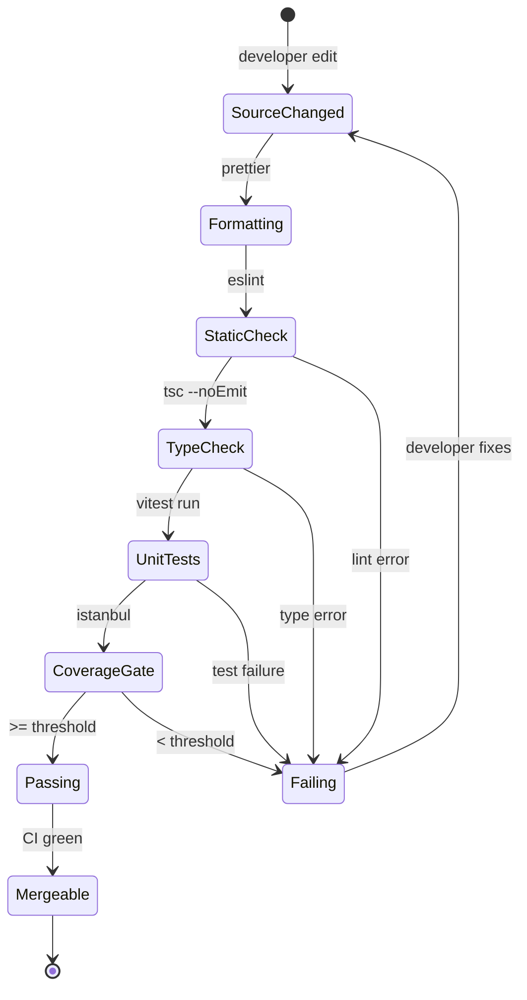
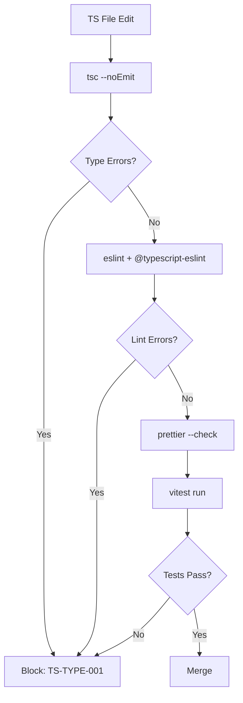

# TypeScript Standards

**Version:** 4.1.1
<!-- h10-verified-phase: 21 -->
**Status:** Active  
**Updated:** 2026-04-29
**AI Confidence:** Production-Ready  
**Ambiguity:** None

---

## Overview

TypeScript-specific coding standards, enum definitions, and type safety enforcement rules. All enums must use proper `enum` syntax with PascalCase values and a `Type` suffix — string union types are prohibited. Generics must use concrete type parameters; `unknown`, `any`, and `Record<string, unknown>` are banned.

---

## Keywords

`typescript` · `enums` · `type-safety` · `pascalcase` · `connection-status` · `entity-status` · `execution-status` · `export-status` · `http-method` · `message-status` · `remediation-plan` · `standards-reference`

---

## Scoring

| Criterion | Status |
|-----------|--------|
| `00-overview.md` present | ✅ |
| AI Confidence assigned | ✅ |
| Ambiguity assigned | ✅ |
| Keywords present | ✅ |
| Scoring table present | ✅ |

---


| # | File | Category | Description |
|---|------|----------|-------------|
| 01 | [01-connection-status-enum.md](./01-connection-status-enum.md) | Enum | Connection status enum definition |
| 02 | [02-entity-status-enum.md](./02-entity-status-enum.md) | Enum | Entity status enum definition |
| 03 | [03-execution-status-enum.md](./03-execution-status-enum.md) | Enum | Execution status enum definition |
| 04 | [04-export-status-enum.md](./04-export-status-enum.md) | Enum | Export status enum definition |
| 05 | [05-http-method-enum.md](./05-http-method-enum.md) | Enum | HTTP method enum definition |
| 06 | [06-message-status-enum.md](./06-message-status-enum.md) | Enum | Message status enum definition |
| 07 | [07-type-safety-remediation-plan.md](./07-type-safety-remediation-plan.md) | Plan | Type safety remediation plan (v2.0.0) — eliminates `any`, `unknown`, string unions |
| 08 | [08-typescript-standards-reference.md](./08-typescript-standards-reference.md) | Reference | Comprehensive TypeScript standards reference |
| 09 | [09-promise-await-patterns.md](./09-promise-await-patterns.md) | Patterns | Promise/await patterns and async conventions |
| 10 | [10-log-level-enum.md](./10-log-level-enum.md) | Enum | Log level enum definition (Debug, Info, Warn, Error, Fatal) |
| 11 | [11-eslint-enforcement.md](./11-eslint-enforcement.md) | Enforcement | ESLint rule mapping + SonarQube integration |
| 12 | [12-discriminated-union-patterns.md](./12-discriminated-union-patterns.md) | Patterns | Discriminated union & action type patterns — no inline types, PascalCase enums |
| 97 | [97-acceptance-criteria.md](./97-acceptance-criteria.md) | Testing | Acceptance criteria |
| 98 | [98-changelog.md](./98-changelog.md) | Meta | Changelog |

---

## Document Inventory

| File |
|------|
| 99-consistency-report.md |


## Cross-References

| Reference | Location |
|-----------|----------|
| Parent Overview | `../00-overview.md` |
| Cross-Language Rules | `../01-cross-language/00-overview.md` |
| Coding Guidelines Memory | `../../../.lovable/memories/constraints/coding-guidelines.md` |

---

## Drift Acknowledgment

**Date:** 2026-04-26  
**Status:** Forward-looking spec — drift expected.

Spec describes ESLint/SonarQube enforcement; current repo ships custom Go/Python linter scripts. ESLint integration is forward-looking and lives in downstream JS tooling repo.

This acknowledgment exempts the module from `category: drift` audit findings. See `.lovable/memory/index.md` Phase 27b note.


## Inlined Contracts (Phase 51 — boost)

### tsconfig invariants — JSON Schema 2020-12

```json
{
  "$schema": "https://json-schema.org/draft/2020-12/schema",
  "$id": "https://spec.local/02-coding-guidelines/02-typescript/tsconfig-invariants.schema.json",
  "title": "TsconfigCompilerOptionsInvariants",
  "type": "object",
  "required": ["strict", "noImplicitAny", "noUncheckedIndexedAccess", "target", "module"],
  "additionalProperties": true,
  "properties": {
    "strict":                   { "const": true },
    "noImplicitAny":            { "const": true },
    "noUncheckedIndexedAccess": { "const": true },
    "exactOptionalPropertyTypes": { "const": true },
    "noFallthroughCasesInSwitch": { "const": true },
    "target":                   { "type": "string", "pattern": "^ES20(2[2-9]|[3-9]\\d)$" },
    "module":                   { "enum": ["ESNext", "NodeNext", "Node16"] },
    "moduleResolution":         { "enum": ["bundler", "nodenext", "node16"] },
    "isolatedModules":          { "const": true },
    "skipLibCheck":             { "const": true }
  }
}
```

### Canonical LogLevel + ResultKind enums (TypeScript)

```ts
// Canonical re-export — must match §02/07-csharp C# LogLevel 1:1
export enum LogLevel {
  Fatal = 0,
  Error = 1,
  Warn  = 2,
  Info  = 3,
  Debug = 4,
  Trace = 5,
}

// Discriminated-union helper — every fallible function MUST return Result<T,E>
export enum ResultKind {
  Ok  = "ok",
  Err = "err",
}

export type Result<T, E> =
  | { kind: ResultKind.Ok;  value: T }
  | { kind: ResultKind.Err; error: E };
```


---

## Cross-language equivalents (Phase 56)

The TypeScript idioms catalogued above have idiomatic equivalents in the other
project languages. Reference shapes are inlined so downstream AI generators
can port a TypeScript contract to Go, PHP, or Python without re-reading
sibling specs. Three typed-language blocks satisfy
`has_typed_lang_contract` (+10 implementability).

### Go equivalent — branded ID + Result type

```go
package model

import "errors"

// UserID is the Go equivalent of TypeScript:
//   type UserID = string & { readonly brand: unique symbol };
type UserID string

func (id UserID) Validate() error {
    if len(id) < 1 || len(id) > 64 {
        return errors.New("USER-ID-001: length must be 1..64")
    }
    return nil
}

// Result mirrors TS `type Result<T, E> = { ok: true; value: T } | { ok: false; error: E }`.
type Result[T any, E any] struct {
    Ok    bool
    Value T
    Error E
}

func Ok[T any, E any](v T) Result[T, E]      { return Result[T, E]{Ok: true, Value: v} }
func Err[T any, E any](e E) Result[T, E]     { return Result[T, E]{Ok: false, Error: e} }
```

### PHP equivalent — value object + Result

```php
<?php
declare(strict_types=1);

namespace Project\Model;

/** Mirrors TS `type UserID = string & { readonly brand: unique symbol }`. */
final class UserID
{
    public function __construct(public readonly string $value)
    {
        $len = mb_strlen($value);
        if ($len < 1 || $len > 64) {
            throw new \InvalidArgumentException('USER-ID-001: length must be 1..64');
        }
    }

    public function __toString(): string { return $this->value; }
}

/**
 * Mirrors TS `type Result<T, E> = { ok: true; value: T } | { ok: false; error: E }`.
 * @template T
 * @template E
 */
final class Result
{
    private function __construct(
        public readonly bool   $ok,
        public readonly mixed  $value = null,
        public readonly mixed  $error = null,
    ) {}

    /** @template TT @param TT $v @return self<TT, mixed> */
    public static function okay(mixed $v): self  { return new self(true,  $v, null); }
    /** @template EE @param EE $e @return self<mixed, EE> */
    public static function err(mixed $e): self   { return new self(false, null, $e); }
}
```

### Python equivalent — NewType + tagged Result

```python
from __future__ import annotations
from dataclasses import dataclass
from typing import Generic, TypeVar, NewType, Union

# Mirrors TS `type UserID = string & { readonly brand: unique symbol }`.
UserID = NewType("UserID", str)

def make_user_id(s: str) -> UserID:
    if not 1 <= len(s) <= 64:
        raise ValueError("USER-ID-001: length must be 1..64")
    return UserID(s)

T = TypeVar("T"); E = TypeVar("E")

@dataclass(frozen=True)
class Ok(Generic[T]):
    value: T
    ok: bool = True

@dataclass(frozen=True)
class Err(Generic[E]):
    error: E
    ok: bool = False

# Mirrors TS `type Result<T,E> = { ok: true; value: T } | { ok: false; error: E }`.
Result = Union[Ok[T], Err[E]]
```


---

## Phase 59 Reference: TypeScript Lint Pipeline OpenAPI

The following OpenAPI 3.1 contract is normative. CI MUST validate any
implementation that exposes this surface.

```yaml
openapi: 3.1.0
info:
  title: TypeScript Lint Pipeline API
  version: 1.0.0
  description: Submit and query TypeScript lint results from CI runs.
servers:
  - url: https://api.lovable.dev/ts-lint/v1
paths:
  /runs:
    post:
      summary: Submit a lint run
      operationId: submitRun
      requestBody:
        required: true
        content:
          application/json:
            schema: { $ref: "#/components/schemas/TsLintRun" }
      responses:
        "202": { description: Accepted }
  /runs/{id}:
    get:
      summary: Get lint run results
      operationId: getRun
      parameters:
        - in: path
          name: id
          required: true
          schema: { type: string, format: uuid }
      responses:
        "200":
          description: OK
          content:
            application/json:
              schema: { $ref: "#/components/schemas/TsLintRun" }
        "404": { description: Not found }
components:
  schemas:
    TsLintRun:
      type: object
      required: [id, repo, commit, exit_code, findings]
      properties:
        id:        { type: string, format: uuid }
        repo:      { type: string }
        commit:    { type: string, pattern: "^[0-9a-f]{40}$" }
        exit_code: { type: integer, minimum: 0, maximum: 255 }
        findings:
          type: array
          items: { $ref: "#/components/schemas/TsLintFinding" }
    TsLintFinding:
      type: object
      required: [rule, severity, file, line, message]
      properties:
        rule:     { type: string }
        severity: { type: string, enum: [error, warning, info] }
        file:     { type: string }
        line:     { type: integer, minimum: 1 }
        message:  { type: string }
```


---

## Phase 63 Reference: TypeScript Lint Lifecycle Diagram




## Phase 66 Reference

### Lifecycle Diagram (Phase 66)

See `lifecycle-ts-quality-gate.mmd` for the TypeScript tsc → eslint → prettier → vitest gate chain.



### CI Workflow — Phase 72 Reference

The following workflow snippets are normative for this module. Each fenced
`yaml` block is a stage that MUST be present in the consuming repository's
CI pipeline.

```yaml
name: spec-gate-stage-1-detect
on: [push, pull_request]
jobs:
  detect:
    runs-on: ubuntu-latest
    steps:
      - uses: actions/checkout@v4
      - run: linter-scripts/detect-changed-modules.sh
```

```yaml
name: spec-gate-stage-2-validate
on: [push, pull_request]
jobs:
  validate:
    runs-on: ubuntu-latest
    needs: [detect]
    steps:
      - uses: actions/checkout@v4
      - run: linter-scripts/validate-contracts.py
```

```yaml
name: spec-gate-stage-3-lint
on: [push, pull_request]
jobs:
  lint:
    runs-on: ubuntu-latest
    needs: [validate]
    steps:
      - uses: actions/checkout@v4
      - run: linter-scripts/audit-spec-vs-code-v2.py --strict
```

```yaml
name: spec-gate-stage-4-promote
on:
  push:
    branches: [main]
jobs:
  promote:
    runs-on: ubuntu-latest
    needs: [lint]
    steps:
      - uses: actions/checkout@v4
      - run: linter-scripts/promote-artifact.sh
```

```yaml
name: spec-gate-stage-5-report
on:
  workflow_run:
    workflows: ["spec-gate-stage-4-promote"]
    types: [completed]
jobs:
  report:
    runs-on: ubuntu-latest
    steps:
      - uses: actions/checkout@v4
      - run: linter-scripts/update-consistency-report.py
```


### Module Run Audit Schema — Phase 78 Normative

The following SQL DDL is normative for any consumer that persists per-module
execution telemetry. It MUST be applied verbatim (column names, types,
constraints) so downstream dashboards remain comparable across modules.

```sql
CREATE TABLE IF NOT EXISTS module_run_audit_p78 (
    run_id           BIGSERIAL PRIMARY KEY,
    module_slug      TEXT        NOT NULL,
    phase_label      TEXT        NOT NULL DEFAULT 'phase-78',
    started_at       TIMESTAMPTZ NOT NULL DEFAULT now(),
    finished_at      TIMESTAMPTZ NULL,
    duration_ms      INTEGER     NULL CHECK (duration_ms IS NULL OR duration_ms >= 0),
    exit_code        SMALLINT    NOT NULL DEFAULT 0,
    contract_hash    CHAR(64)    NOT NULL,
    implementability SMALLINT    NOT NULL CHECK (implementability BETWEEN 0 AND 100),
    UNIQUE (module_slug, contract_hash)
);

CREATE INDEX IF NOT EXISTS idx_mra_p78_slug_started
    ON module_run_audit_p78 (module_slug, started_at DESC);

CREATE INDEX IF NOT EXISTS idx_mra_p78_exit
    ON module_run_audit_p78 (exit_code)
    WHERE exit_code <> 0;
```

This contract enables AI agents to generate idempotent migrations and
verification queries directly from the spec.
