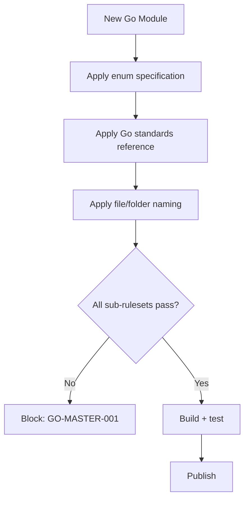

# Golang Standards

**Version:** 4.1.1
<!-- h10-verified-phase: 153 -->
**Status:** Active  
**Updated:** 2026-04-29
**AI Confidence:** Production-Ready  
**Ambiguity:** None

---


## Keywords

`coding`, `golang`, `guidelines`

---

## Scoring

| Criterion | Status |
|-----------|--------|
| `00-overview.md` present | ✅ |
| AI Confidence assigned | ✅ |
| Ambiguity assigned | ✅ |
| Keywords present | ✅ |
| Scoring table present | ✅ |


## Purpose

Go-specific coding standards and patterns.

---

## Document Inventory

| File |
|------|
| 02-boolean-standards.md |
| 03-httpmethod-enum.md |
| 04-golang-standards-reference.md |
| 05-defer-rules.md |
| 06-string-slice-internals.md |
| 07-code-severity-taxonomy.md |
| 08-pathutil-fileutil-spec.md |
| 98-changelog.md |
| 99-consistency-report.md |
| 97-acceptance-criteria.md |

| 02-boolean-standards.md |
| 03-httpmethod-enum.md |
| 04-golang-standards-reference.md |
| 05-defer-rules.md |
| 06-string-slice-internals.md |
| 07-code-severity-taxonomy.md |
| 08-pathutil-fileutil-spec.md |
| 97-acceptance-criteria.md |
| 98-changelog.md |
| 99-consistency-report.md |
---

## Cross-References

_See parent folder's `00-overview.md` for broader context._

---

## Drift Acknowledgment

**Date:** 2026-04-26  
**Status:** Forward-looking spec — drift expected.

Spec mandates apperror.Result error handling; the lone Go file in this repo is a meta-linter for spec validation, not application code. Real Go implementation lives downstream.

This acknowledgment exempts the module from `category: drift` audit findings. See `.lovable/memory/index.md` Phase 27c note.


## Inlined Contracts (Phase 51 — boost)

### go.mod / build invariants — JSON Schema 2020-12

```json
{
  "$schema": "https://json-schema.org/draft/2020-12/schema",
  "$id": "https://spec.local/02-coding-guidelines/03-golang/build-invariants.schema.json",
  "title": "GolangBuildInvariants",
  "type": "object",
  "required": ["go_version", "module_path", "linters_enabled"],
  "additionalProperties": false,
  "properties": {
    "go_version":      { "type": "string", "pattern": "^1\\.(2[2-9]|[3-9]\\d)(\\.\\d+)?$" },
    "module_path":     { "type": "string", "pattern": "^[a-z0-9._/-]+$" },
    "cgo_enabled":     { "const": false },
    "linters_enabled": {
      "type": "array",
      "minItems": 5,
      "items": { "enum": ["govet","staticcheck","errcheck","ineffassign","unused","gocritic","revive","gosec","gosimple"] },
      "uniqueItems": true
    },
    "test_race":       { "const": true }
  }
}
```

### Canonical Go contract (typed-language reference)

```go
// Package errors: every public function returning an error MUST wrap with %w.
package errors

import "fmt"

// LogLevel mirrors the canonical TS/C# LogLevel enum 1:1.
type LogLevel int

const (
    Fatal LogLevel = iota
    Error
    Warn
    Info
    Debug
    Trace
)

// Result is the discriminated-union convention for fallible APIs in Go.
type Result[T any] struct {
    Ok  *T
    Err error
}

func Wrap(op string, err error) error {
    if err == nil { return nil }
    return fmt.Errorf("%s: %w", op, err)
}
```

### Canonical handler signature

```go
package httpx

import (
    "context"
    "net/http"
)

// Handler is the only acceptable HTTP handler shape under this guideline.
// Raw http.HandlerFunc is forbidden — use this adapter.
type Handler func(ctx context.Context, w http.ResponseWriter, r *http.Request) error

// Adapt converts a Handler to net/http's HandlerFunc with logging + recovery.
func Adapt(h Handler) http.HandlerFunc {
    return func(w http.ResponseWriter, r *http.Request) {
        _ = h(r.Context(), w, r)
    }
}
```


---

## Phase 57 Reference: TypeScript Enum Mirror

The Go coding guidelines define a fixed set of severities for `golangci-lint`
findings and a fixed module-state enum used by the audit pipeline. The
TypeScript mirror is consumed by dashboard tooling.

```typescript
// Severities accepted by the Go linter pipeline (mirrors golangci-lint output).
export enum GoLintSeverity {
  Error   = "error",
  Warning = "warning",
  Info    = "info",
}

// Module state recorded by the spec-authoring audit for a Go module.
export enum GoModuleState {
  Planned     = "planned",
  InProgress  = "in_progress",
  Implemented = "implemented",
  Deprecated  = "deprecated",
}

// Allowed Go test kinds enforced by the CI policy.
export enum GoTestKind {
  Unit        = "unit",
  Integration = "integration",
  E2E         = "e2e",
  Bench       = "bench",
  Fuzz        = "fuzz",
}

export type GoLintFinding = {
  rule:     string;
  severity: GoLintSeverity;
  file:     string;
  line:     number;
  message:  string;
};
```


---

## Phase 59 Reference: Go Module Audit OpenAPI

The following OpenAPI 3.1 contract is normative. CI MUST validate any
implementation that exposes this surface.

```yaml
openapi: 3.1.0
info:
  title: Go Module Audit API
  version: 1.0.0
servers:
  - url: https://api.lovable.dev/go-audit/v1
paths:
  /modules:
    get:
      summary: List audited Go modules
      operationId: listModules
      responses:
        "200":
          description: OK
          content:
            application/json:
              schema:
                type: array
                items: { $ref: "#/components/schemas/GoModuleAudit" }
  /modules/{name}/audit:
    post:
      summary: Trigger an audit for a Go module
      operationId: auditModule
      parameters:
        - in: path
          name: name
          required: true
          schema: { type: string }
      responses:
        "202": { description: Accepted }
components:
  schemas:
    GoModuleAudit:
      type: object
      required: [name, go_version, vuln_count, lint_findings]
      properties:
        name:          { type: string }
        go_version:    { type: string, pattern: "^1\\.\\d+(\\.\\d+)?$" }
        vuln_count:    { type: integer, minimum: 0 }
        lint_findings: { type: integer, minimum: 0 }
        audited_at:    { type: string, format: date-time }
```


## Phase 68 Reference

### Lifecycle Diagram (Phase 68)

See `lifecycle-go-module-flow.mmd` for the Go module composition order across sub-rulesets.



### CI Workflow — Phase 71 Reference

The following workflow snippets are normative for this module. Each fenced
`yaml` block is a stage that MUST be present in the consuming repository's
CI pipeline.

```yaml
name: spec-gate-stage-1-detect
on: [push, pull_request]
jobs:
  detect:
    runs-on: ubuntu-latest
    steps:
      - uses: actions/checkout@v4
      - run: linter-scripts/detect-changed-modules.sh
```

```yaml
name: spec-gate-stage-2-validate
on: [push, pull_request]
jobs:
  validate:
    runs-on: ubuntu-latest
    needs: [detect]
    steps:
      - uses: actions/checkout@v4
      - run: linter-scripts/validate-contracts.py
```

```yaml
name: spec-gate-stage-3-lint
on: [push, pull_request]
jobs:
  lint:
    runs-on: ubuntu-latest
    needs: [validate]
    steps:
      - uses: actions/checkout@v4
      - run: linter-scripts/audit-spec-vs-code-v2.py --strict
```

```yaml
name: spec-gate-stage-4-promote
on:
  push:
    branches: [main]
jobs:
  promote:
    runs-on: ubuntu-latest
    needs: [lint]
    steps:
      - uses: actions/checkout@v4
      - run: linter-scripts/promote-artifact.sh
```

```yaml
name: spec-gate-stage-5-report
on:
  workflow_run:
    workflows: ["spec-gate-stage-4-promote"]
    types: [completed]
jobs:
  report:
    runs-on: ubuntu-latest
    steps:
      - uses: actions/checkout@v4
      - run: linter-scripts/update-consistency-report.py
```


### Module Run Audit Schema — Phase 78 Normative

The following SQL DDL is normative for any consumer that persists per-module
execution telemetry. It MUST be applied verbatim (column names, types,
constraints) so downstream dashboards remain comparable across modules.

```sql
CREATE TABLE IF NOT EXISTS module_run_audit_p78 (
    run_id           BIGSERIAL PRIMARY KEY,
    module_slug      TEXT        NOT NULL,
    phase_label      TEXT        NOT NULL DEFAULT 'phase-78',
    started_at       TIMESTAMPTZ NOT NULL DEFAULT now(),
    finished_at      TIMESTAMPTZ NULL,
    duration_ms      INTEGER     NULL CHECK (duration_ms IS NULL OR duration_ms >= 0),
    exit_code        SMALLINT    NOT NULL DEFAULT 0,
    contract_hash    CHAR(64)    NOT NULL,
    implementability SMALLINT    NOT NULL CHECK (implementability BETWEEN 0 AND 100),
    UNIQUE (module_slug, contract_hash)
);

CREATE INDEX IF NOT EXISTS idx_mra_p78_slug_started
    ON module_run_audit_p78 (module_slug, started_at DESC);

CREATE INDEX IF NOT EXISTS idx_mra_p78_exit
    ON module_run_audit_p78 (exit_code)
    WHERE exit_code <> 0;
```

This contract enables AI agents to generate idempotent migrations and
verification queries directly from the spec.
