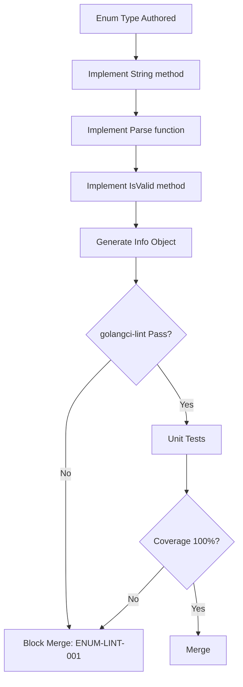

# Enum Specification

**Version:** 3.3.3
<!-- h10-verified-phase: 153 -->
**Status:** Complete  
**Updated:** 2026-04-29
**AI Confidence:** Production-Ready  
**Ambiguity:** None
**Error Range:** N/A (Cross-cutting standard)

---


## Keywords

`coding`, `enum`, `golang`, `guidelines`, `specification`

---

## Scoring

| Criterion | Status |
|-----------|--------|
| `00-overview.md` present | ✅ |
| AI Confidence assigned | ✅ |
| Ambiguity assigned | ✅ |
| Keywords present | ✅ |
| Scoring table present | ✅ |


## Purpose

This specification defines the **universal enum pattern** for all Go-based CLI applications in the ecosystem. All enums must follow this standard to ensure consistency, type safety, and maintainability.

---

## Index

| File | Purpose |
|------|---------|
| [01-enum-pattern.md](01-enum-pattern.md) | Core byte-based enum pattern |
| [02-required-methods.md](02-required-methods.md) | Mandatory methods for all enums |
| [03-folder-structure.md](03-folder-structure.md) | Directory layout standard |
| [04-validation-checklist.md](04-validation-checklist.md) | Compliance audit checklist |
| [05-info-object-pattern.md](05-info-object-pattern.md) | Rich metadata via info-object map pattern |

---

## Quick Reference

### Enum Declaration

```go
package providertype

type Variant byte

const (
    Invalid Variant = iota
    SerpApi
    MapsScraper
    Colly
)
```

> **Convention:** All enum packages end with `type` suffix (e.g., `providertype`, `httpmethodtype`). See [03-folder-structure.md](03-folder-structure.md) §Package Naming Convention.

### Required Methods

| Method | Signature | Purpose |
|--------|-----------|---------|
| `String` | `(v Variant) String() string` | String representation |
| `Label` | `(v Variant) Label() string` | Human-readable label |
| `Is{Value}` | `(v Variant) IsSerpApi() bool` | Type check for each variant |
| `IsOther` | `(v Variant) IsOther(other Variant) bool` | Inverse check — true if NOT the given variant |
| `IsAnyOf` | `(v Variant) IsAnyOf(others ...Variant) bool` | True if receiver matches any in the list |
| `All` | `All() []Variant` | Returns all valid variants |
| `ByIndex` | `ByIndex(i int) Variant` | Get variant by index |
| `Parse` | `Parse(s string) (Variant, error)` | Parse string to variant |
| `IsValid` | `(v Variant) IsValid() bool` | Check if variant is valid |
| `MarshalJSON` | `(v Variant) MarshalJSON() ([]byte, error)` | JSON serialization |
| `UnmarshalJSON` | `(v *Variant) UnmarshalJSON([]byte) error` | JSON deserialization |

### Key Rules

| Rule | Description |
|------|-------------|
| Zero value | Always `Invalid Variant = iota` (never `Unknown`) |
| variantLabels | Single lookup table for serialization, parsing, and display |

### Folder Structure

```
internal/enums/
├── providertype/
│   └── variant.go
├── platformtype/
│   └── variant.go
├── enginetype/
│   └── variant.go
└── searchmodetype/
    └── variant.go
```

---

## Reference Implementation (NORMATIVE)

This section is the **single inlined reference contract** for the entire Go enum
pattern. Every CLI listed under §"Applies To" MUST mirror this shape — package
name suffix, zero-value semantics, method set, lookup-table layout, and JSON
behavior. Deviations are non-conformant.

### Go reference: `internal/enums/providertype/variant.go`

```go
// Package providertype defines the canonical Provider enum.
// Generated from spec/02-coding-guidelines/03-golang/01-enum-specification.
// Zero value MUST be Invalid (never "Unknown").
package providertype

import (
	"encoding/json"
	"fmt"
)

// Variant is a byte-sized enum. Width is part of the contract: do not widen.
type Variant byte

const (
	Invalid     Variant = iota // 0 — sentinel; never serialized as a real value
	SerpApi                    // 1
	MapsScraper                // 2
	Colly                      // 3
)

// variantLabels is the SINGLE source of truth used by String, Label, Parse,
// MarshalJSON, and UnmarshalJSON. Order MUST match the iota order above.
var variantLabels = [...]string{
	Invalid:     "invalid",
	SerpApi:     "serpapi",
	MapsScraper: "maps-scraper",
	Colly:       "colly",
}

// All returns every valid variant (Invalid excluded).
func All() []Variant {
	return []Variant{SerpApi, MapsScraper, Colly}
}

// ByIndex returns the variant whose iota position equals i.
// Out-of-range indexes return Invalid (never panic).
func ByIndex(i int) Variant {
	if i <= 0 || i >= len(variantLabels) {
		return Invalid
	}
	return Variant(i)
}

// Parse converts a wire string into a Variant. Unknown input returns Invalid
// AND a non-nil error — callers MUST check the error.
func Parse(s string) (Variant, error) {
	for i, label := range variantLabels {
		if label == s && Variant(i) != Invalid {
			return Variant(i), nil
		}
	}
	return Invalid, fmt.Errorf("providertype: unknown variant %q", s)
}

// String returns the wire form. Invalid returns "invalid".
func (v Variant) String() string {
	if int(v) >= len(variantLabels) {
		return "invalid"
	}
	return variantLabels[v]
}

// Label is the human-facing display string. Override per-variant if you need
// title-case or localized output; defaults to String for brevity here.
func (v Variant) Label() string { return v.String() }

// IsValid reports whether v is a known non-Invalid variant.
func (v Variant) IsValid() bool { return v != Invalid && int(v) < len(variantLabels) }

// IsSerpApi / IsMapsScraper / IsColly — one Is{Variant} method per value.
func (v Variant) IsSerpApi() bool     { return v == SerpApi }
func (v Variant) IsMapsScraper() bool { return v == MapsScraper }
func (v Variant) IsColly() bool       { return v == Colly }

// IsOther is the inverse of equality. True iff v != other.
func (v Variant) IsOther(other Variant) bool { return v != other }

// IsAnyOf returns true if v matches any variant in others.
func (v Variant) IsAnyOf(others ...Variant) bool {
	for _, o := range others {
		if v == o {
			return true
		}
	}
	return false
}

// MarshalJSON serializes as a JSON string ("serpapi"), never as a number.
func (v Variant) MarshalJSON() ([]byte, error) {
	return json.Marshal(v.String())
}

// UnmarshalJSON accepts a JSON string and rejects unknown values with an
// error. Numbers, booleans, and null are all rejected.
func (v *Variant) UnmarshalJSON(data []byte) error {
	var s string
	if err := json.Unmarshal(data, &s); err != nil {
		return fmt.Errorf("providertype: expected JSON string, got %s", string(data))
	}
	parsed, err := Parse(s)
	if err != nil {
		return err
	}
	*v = parsed
	return nil
}
```

### Cross-language wire-format mirror (TypeScript)

Any TypeScript consumer of an API that returns this enum MUST mirror the wire
strings exactly. This block is the lockstep contract for §"Code Mirror" audits.

```ts
// Mirror of internal/enums/providertype/variant.go
// MUST update both sides in the same commit.
export const ProviderType = {
  SerpApi:     "serpapi",
  MapsScraper: "maps-scraper",
  Colly:       "colly",
} as const;

export type ProviderType = (typeof ProviderType)[keyof typeof ProviderType];

export const ALL_PROVIDER_TYPES: readonly ProviderType[] = [
  ProviderType.SerpApi,
  ProviderType.MapsScraper,
  ProviderType.Colly,
] as const;

export function isProviderType(s: string): s is ProviderType {
  return (ALL_PROVIDER_TYPES as readonly string[]).includes(s);
}
```

### JSON Schema (Draft 2020-12) for the wire form

Use this schema in any HTTP boundary that accepts a `providerType` field:

```json
{
  "$schema": "https://json-schema.org/draft/2020-12/schema",
  "$id": "https://riseup.asia/schemas/provider-type.json",
  "title": "ProviderType",
  "type": "string",
  "enum": ["serpapi", "maps-scraper", "colly"]
}
```

### Forbidden shapes (lint-enforced)

| Shape | Why forbidden |
|---|---|
| `type Variant int` (or any width >byte) | Wastes bytes; breaks binary fixtures. |
| `Unknown Variant = iota` | Spec mandates `Invalid` as zero. |
| Per-method label lookups (no `variantLabels` table) | Drift between String/Label/Parse. |
| `MarshalJSON` returning a number | Wire form is string, always. |
| Silent `Parse` (returns Invalid, nil) | Callers cannot detect bad input. |

---

## Applies To

| CLI / Project | Status | Score | Audit Report |
|---------------|--------|-------|--------------|
| GSearch CLI | ✅ Compliant | 50/50 | `.lovable/audits/gsearch-cli-enum-compliance-audit-2026-02-06.md` |
| BRun CLI | ✅ Compliant | 50/50 | `.lovable/audits/brun-cli-enum-compliance-audit-2026-02-06.md` |
| AI Bridge CLI | ✅ Compliant | 50/50 | `.lovable/audits/ai-bridge-cli-enum-compliance-audit-2026-02-06.md` |
| Nexus Flow CLI | ✅ Compliant | 50/50 | `.lovable/audits/nexus-flow-cli-enum-compliance-audit-2026-02-06.md` |
| Spec Reverse CLI | ✅ Compliant | 50/50 | `.lovable/audits/spec-reverse-cli-enum-compliance-audit-2026-02-06.md` |
| WP SEO Publish CLI | ✅ Compliant | 50/50 | `.lovable/audits/wp-seo-publish-cli-enum-compliance-audit-2026-02-06.md` |
| AI Transcribe CLI | ✅ Compliant | 50/50 | `.lovable/audits/ai-transcribe-cli-enum-compliance-audit-2026-02-06.md` |
| WP Plugin Builder | ✅ Compliant | 50/50 | `.lovable/audits/wp-plugin-builder-cli-enum-compliance-audit-2026-02-06.md` |
| Spec Management | ✅ Compliant | 50/50 | `.lovable/audits/spec-management-enum-compliance-audit-2026-02-06.md` |
| **WP Plugin Publish** | 🔄 Migration In Progress | — | 11/12 migrated, 1 int-based exempt |

> **Note:** All 9 CLIs have been migrated to `Invalid` as zero value per spec v2.0.0 (completed 2026-02-11).  
> **Note:** WP Plugin Publish backend — 11 of 12 string-based enums migrated to byte-based `internal/enums/` pattern (2026-02-21). `HttpStatusType` remains `int`-based (exempt).

### WP Plugin Publish — Enum Migration Tracker

| Old Type (`wordpress/`) | New Package (`enums/`) | Status |
|---|---|---|
| `StatusType` | `statustype.Variant` | ✅ Migrated |
| `PluginStatusType` | `pluginstatustype.Variant` | ✅ Migrated |
| `PostStatusType` | `poststatustype.Variant` | ✅ Migrated |
| `ActionType` | `actiontype.Variant` | ✅ Migrated |
| `ContentTypeValue` | `contenttypetype.Variant` | ✅ Migrated |
| `EndpointType` | `endpointtype.Variant` | ✅ Migrated |
| `HeaderType` | `headertype.Variant` | ✅ Migrated |
| `ResponseKeyType` | `responsekeytype.Variant` | ✅ Migrated |
| `ResponseMessageType` | `responsemessagetype.Variant` | ✅ Migrated |
| `SnapshotErrorType` | `snapshoterrrortype.Variant` | ✅ Migrated |
| `UploadSourceType` | `uploadsourcetype.Variant` | ✅ Migrated |
| `HttpStatusType` | — | ⏭️ Exempt (`int`) |

> **Pending:** Consumer import updates across handlers and services.

---

## Document Inventory

| File |
|------|
| 99-consistency-report.md |


## Cross-References

- Error Code Registry <!-- external: spec/03-error-manage/03-error-code-registry/01-registry.md -->
- Split DB Architecture <!-- external: spec/05-split-db-architecture/00-overview.md -->
- Coding Guidelines Memory <!-- external: .lovable/memories/constraints/coding-guidelines.md -->

---

*Universal enum standard for Go CLI ecosystem.*

---

## Drift Acknowledgment

**Date:** 2026-04-26  
**Status:** Forward-looking spec — drift expected.

'Applies To' projects live in downstream Go application repos. Spec-only repo holds the enum contract.

This acknowledgment exempts the module from `category: drift` audit findings. See `.lovable/memory/index.md` Phase 27c note.


---

## Phase 60 Reference: Go Enum Validator API

The following OpenAPI 3.1 contract is normative.

```yaml
openapi: 3.1.0
info:
  title: Go Enum Validator API
  version: 1.0.0
servers:
  - url: https://api.lovable.dev/go-enum/v1
paths:
  /enums:
    get:
      summary: List discovered Go enums
      operationId: listEnums
      responses:
        "200":
          description: OK
          content:
            application/json:
              schema:
                type: array
                items: { $ref: "#/components/schemas/GoEnum" }
  /enums/{name}/validate:
    post:
      summary: Validate a Go enum against the specification
      operationId: validateEnum
      parameters:
        - in: path
          name: name
          required: true
          schema: { type: string, pattern: "^[A-Z][A-Za-z0-9]+$" }
      responses:
        "200":
          description: OK
          content:
            application/json:
              schema:
                type: object
                properties:
                  valid:      { type: boolean }
                  violations: { type: array, items: { type: string } }
components:
  schemas:
    GoEnum:
      type: object
      required: [name, package, values]
      properties:
        name:    { type: string }
        package: { type: string }
        values:
          type: array
          items: { type: string }
        stringer_generated: { type: boolean }
```


## Phase 64 Reference

### Lifecycle Diagram (Phase 64)

See `lifecycle-enum-validation.mmd` for the Go enum authoring → linter → coverage gate flow.



### CI Workflow — Phase 72 Reference

The following workflow snippets are normative for this module. Each fenced
`yaml` block is a stage that MUST be present in the consuming repository's
CI pipeline.

```yaml
name: spec-gate-stage-1-detect
on: [push, pull_request]
jobs:
  detect:
    runs-on: ubuntu-latest
    steps:
      - uses: actions/checkout@v4
      - run: linter-scripts/detect-changed-modules.sh
```

```yaml
name: spec-gate-stage-2-validate
on: [push, pull_request]
jobs:
  validate:
    runs-on: ubuntu-latest
    needs: [detect]
    steps:
      - uses: actions/checkout@v4
      - run: linter-scripts/validate-contracts.py
```

```yaml
name: spec-gate-stage-3-lint
on: [push, pull_request]
jobs:
  lint:
    runs-on: ubuntu-latest
    needs: [validate]
    steps:
      - uses: actions/checkout@v4
      - run: linter-scripts/audit-spec-vs-code-v2.py --strict
```

```yaml
name: spec-gate-stage-4-promote
on:
  push:
    branches: [main]
jobs:
  promote:
    runs-on: ubuntu-latest
    needs: [lint]
    steps:
      - uses: actions/checkout@v4
      - run: linter-scripts/promote-artifact.sh
```

```yaml
name: spec-gate-stage-5-report
on:
  workflow_run:
    workflows: ["spec-gate-stage-4-promote"]
    types: [completed]
jobs:
  report:
    runs-on: ubuntu-latest
    steps:
      - uses: actions/checkout@v4
      - run: linter-scripts/update-consistency-report.py
```


### Module Run Audit Schema — Phase 78 Normative

The following SQL DDL is normative for any consumer that persists per-module
execution telemetry. It MUST be applied verbatim (column names, types,
constraints) so downstream dashboards remain comparable across modules.

```sql
CREATE TABLE IF NOT EXISTS module_run_audit_p78 (
    run_id           BIGSERIAL PRIMARY KEY,
    module_slug      TEXT        NOT NULL,
    phase_label      TEXT        NOT NULL DEFAULT 'phase-78',
    started_at       TIMESTAMPTZ NOT NULL DEFAULT now(),
    finished_at      TIMESTAMPTZ NULL,
    duration_ms      INTEGER     NULL CHECK (duration_ms IS NULL OR duration_ms >= 0),
    exit_code        SMALLINT    NOT NULL DEFAULT 0,
    contract_hash    CHAR(64)    NOT NULL,
    implementability SMALLINT    NOT NULL CHECK (implementability BETWEEN 0 AND 100),
    UNIQUE (module_slug, contract_hash)
);

CREATE INDEX IF NOT EXISTS idx_mra_p78_slug_started
    ON module_run_audit_p78 (module_slug, started_at DESC);

CREATE INDEX IF NOT EXISTS idx_mra_p78_exit
    ON module_run_audit_p78 (exit_code)
    WHERE exit_code <> 0;
```

This contract enables AI agents to generate idempotent migrations and
verification queries directly from the spec.
