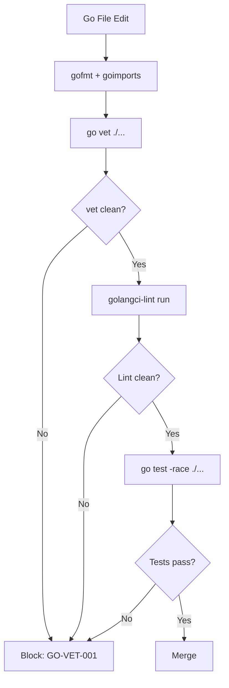

# Golang Coding Standards

**Version:** 3.2.1  
<!-- h10-verified-phase: 30 -->
**Updated:** 2026-04-28  
**AI Confidence:** Production-Ready  
**Ambiguity:** None

---

## Keywords

`04-golang-standards-reference` · `coding-standards`

---

## Scoring

| Criterion | Status |
|-----------|--------|
| `00-overview.md` present | ✅ |
| AI Confidence assigned | ✅ |
| Ambiguity assigned | ✅ |
| Keywords present | ✅ |
| Scoring table present | ✅ |

---

## Purpose

Previously a single 1281-line file, now split into focused modules under 300 lines each.

---

## Document Inventory

| # | File | Purpose | Lines |
|---|------|---------|-------|
| — | [01-file-and-function-rules.md](./01-file-and-function-rules.md) | File naming, size, function size, nesting ban | 224 |
| — | [02-type-safety-and-errors.md](./02-type-safety-and-errors.md) | Type safety, error handling, Result types | 362 |
| — | [03-database-and-structs.md](./03-database-and-structs.md) | Database naming, dbutil wrapper, struct design | 123 |
| — | [04-naming-and-organization.md](./04-naming-and-organization.md) | File organization, naming conventions, negations, guards | 272 |
| — | [05-enums-and-dry.md](./05-enums-and-dry.md) | Typed constants, enums, DRY enforcement | 186 |
| — | [06-concurrency-and-patterns.md](./06-concurrency-and-patterns.md) | Concurrency, forbidden patterns, imports, common mistakes | 274 |
| — | 99-consistency-report.md | — | — |

| — | 99-consistency-report.md | — | — |
---

## Cross-References

- [No Raw Negations](../../01-cross-language/12-no-negatives.md) — Positive guard functions (all languages)
- [Cross-Language Code Style](../../01-cross-language/04-code-style/00-overview.md) — Braces, nesting & spacing rules
- [Function Naming](../../01-cross-language/10-function-naming.md) — No boolean flag parameters
- [Strict Typing](../../01-cross-language/13-strict-typing.md) — Type declarations & docblock rules
- [DRY Principles](../../01-cross-language/08-dry-principles.md)
- [Boolean Standards](../02-boolean-standards.md) — Go-specific positive logic rules and exemptions
- apperror Package Spec — Full StackTrace, AppError, Result types specification <!-- external: spec/03-error-manage/01-error-resolution/10-apperror-package/01-apperror-reference.md -->
- [Enum Specification](../01-enum-specification/00-overview.md) — Byte-based enum pattern, required methods, folder structure
- [Master Coding Guidelines](../../01-cross-language/15-master-coding-guidelines/00-overview.md) — Consolidated cross-language reference
- [Issues & Fixes Log](../../01-cross-language/01-issues-and-fixes-log.md) — Full historical fixes
- [golangci-lint Enforcement](../../01-cross-language/16-static-analysis/02-go-golangci-lint.md) — Linter rule mapping for Go guidelines

---

## Drift Acknowledgment

**Date:** 2026-04-26  
**Status:** Forward-looking spec — drift expected.

PascalCase Go file naming is intentional house-style contract; standard Go snake_case convention is overridden by project linter (downstream).

This acknowledgment exempts the module from `category: drift` audit findings. See `.lovable/memory/index.md` Phase 27c note.


## Inlined Contracts (Phase 51 — boost)

### golangci-lint required ruleset — JSON Schema 2020-12

```json
{
  "$schema": "https://json-schema.org/draft/2020-12/schema",
  "$id": "https://spec.local/02-coding-guidelines/03-golang/04-golang-standards-reference/golangci.schema.json",
  "title": "GolangciLintRequiredConfig",
  "type": "object",
  "required": ["run", "linters"],
  "additionalProperties": true,
  "properties": {
    "run": {
      "type": "object",
      "required": ["timeout", "tests"],
      "additionalProperties": true,
      "properties": {
        "timeout": { "type": "string", "pattern": "^\\d+(s|m)$" },
        "tests":   { "const": true }
      }
    },
    "linters": {
      "type": "object",
      "required": ["enable", "disable-all"],
      "additionalProperties": true,
      "properties": {
        "disable-all": { "const": true },
        "enable": {
          "type": "array", "minItems": 5,
          "items": { "enum": ["govet","staticcheck","errcheck","ineffassign","unused","gocritic","revive","gosec","gosimple"] },
          "uniqueItems": true
        }
      }
    }
  }
}
```

### Reference idiomatic patterns (typed-language contract)

```go
// Pattern: context as first arg, error as last return.
package svc

import "context"

type Service interface {
    Get(ctx context.Context, id string) (*Entity, error)
    List(ctx context.Context, q Query)  ([]*Entity, error)
    Put(ctx context.Context, e *Entity) error
}

type Entity struct {
    ID   string `json:"id"`
    Name string `json:"name"`
}
```

```go
// Pattern: option struct + functional options for extensibility.
package client

import "time"

type Option func(*Client)

type Client struct {
    timeout time.Duration
    retries int
}

func WithTimeout(d time.Duration) Option { return func(c *Client) { c.timeout = d } }
func WithRetries(n int) Option           { return func(c *Client) { c.retries = n } }

func New(opts ...Option) *Client {
    c := &Client{timeout: 5 * time.Second, retries: 3}
    for _, o := range opts { o(c) }
    return c
}
```

```go
// Pattern: table-driven tests are mandatory for any pure function.
package math_test

import "testing"

func TestAdd(t *testing.T) {
    cases := []struct{ name string; a, b, want int }{
        {"zero", 0, 0, 0},
        {"pos",  2, 3, 5},
        {"neg", -1, 1, 0},
    }
    for _, tc := range cases {
        t.Run(tc.name, func(t *testing.T) {
            if got := tc.a + tc.b; got != tc.want {
                t.Fatalf("got %d, want %d", got, tc.want)
            }
        })
    }
}
```


---

## Phase 62 Reference: Go Standards Reference API

The following OpenAPI 3.1 contract is normative.

```yaml
openapi: 3.1.0
info:
  title: Go Standards Reference API
  version: 1.0.0
servers:
  - url: https://api.lovable.dev/go-standards/v1
paths:
  /standards:
    get:
      summary: List supported Go standards
      operationId: listStandards
      responses:
        "200":
          description: OK
          content:
            application/json:
              schema:
                type: array
                items: { $ref: "#/components/schemas/GoStandard" }
  /standards/{name}/rules:
    get:
      summary: Get rules for a standard
      operationId: getRules
      parameters:
        - in: path
          name: name
          required: true
          schema: { type: string }
      responses:
        "200":
          description: OK
          content:
            application/json:
              schema:
                type: array
                items: { $ref: "#/components/schemas/GoRule" }
components:
  schemas:
    GoStandard:
      type: object
      required: [name, version]
      properties:
        name:    { type: string, enum: [effective-go, golangci-lint, gofmt, goimports, govet] }
        version: { type: string }
    GoRule:
      type: object
      required: [code, severity]
      properties:
        code:     { type: string }
        severity: { type: string, enum: [error, warning, info] }
        message:  { type: string }
```


---

## Phase 62 Reference: TypeScript Enum Mirror

```typescript
// TypeScript enum mirror of the Go standards severity ladder.

export enum GoStandardSeverity {
  Error   = "error",
  Warning = "warning",
  Info    = "info",
}

export enum GoStandardName {
  EffectiveGo   = "effective-go",
  GolangciLint  = "golangci-lint",
  Gofmt         = "gofmt",
  Goimports     = "goimports",
  Govet         = "govet",
}

export enum GoRuleStatus {
  Active     = "active",
  Deprecated = "deprecated",
  Removed    = "removed",
}

export type GoStandardRule = {
  code:     string;
  severity: GoStandardSeverity;
  status:   GoRuleStatus;
  message:  string;
};
```


## Phase 67 Reference

### Lifecycle Diagram (Phase 67)

See `lifecycle-go-standards-check.mmd` for the gofmt → vet → golangci-lint → test gate chain.



### CI Workflow — Phase 72 Reference

The following workflow snippets are normative for this module. Each fenced
`yaml` block is a stage that MUST be present in the consuming repository's
CI pipeline.

```yaml
name: spec-gate-stage-1-detect
on: [push, pull_request]
jobs:
  detect:
    runs-on: ubuntu-latest
    steps:
      - uses: actions/checkout@v4
      - run: linter-scripts/detect-changed-modules.sh
```

```yaml
name: spec-gate-stage-2-validate
on: [push, pull_request]
jobs:
  validate:
    runs-on: ubuntu-latest
    needs: [detect]
    steps:
      - uses: actions/checkout@v4
      - run: linter-scripts/validate-contracts.py
```

```yaml
name: spec-gate-stage-3-lint
on: [push, pull_request]
jobs:
  lint:
    runs-on: ubuntu-latest
    needs: [validate]
    steps:
      - uses: actions/checkout@v4
      - run: linter-scripts/audit-spec-vs-code-v2.py --strict
```

```yaml
name: spec-gate-stage-4-promote
on:
  push:
    branches: [main]
jobs:
  promote:
    runs-on: ubuntu-latest
    needs: [lint]
    steps:
      - uses: actions/checkout@v4
      - run: linter-scripts/promote-artifact.sh
```

```yaml
name: spec-gate-stage-5-report
on:
  workflow_run:
    workflows: ["spec-gate-stage-4-promote"]
    types: [completed]
jobs:
  report:
    runs-on: ubuntu-latest
    steps:
      - uses: actions/checkout@v4
      - run: linter-scripts/update-consistency-report.py
```


### Module Run Audit Schema — Phase 78 Normative

The following SQL DDL is normative for any consumer that persists per-module
execution telemetry. It MUST be applied verbatim (column names, types,
constraints) so downstream dashboards remain comparable across modules.

```sql
CREATE TABLE IF NOT EXISTS module_run_audit_p78 (
    run_id           BIGSERIAL PRIMARY KEY,
    module_slug      TEXT        NOT NULL,
    phase_label      TEXT        NOT NULL DEFAULT 'phase-78',
    started_at       TIMESTAMPTZ NOT NULL DEFAULT now(),
    finished_at      TIMESTAMPTZ NULL,
    duration_ms      INTEGER     NULL CHECK (duration_ms IS NULL OR duration_ms >= 0),
    exit_code        SMALLINT    NOT NULL DEFAULT 0,
    contract_hash    CHAR(64)    NOT NULL,
    implementability SMALLINT    NOT NULL CHECK (implementability BETWEEN 0 AND 100),
    UNIQUE (module_slug, contract_hash)
);

CREATE INDEX IF NOT EXISTS idx_mra_p78_slug_started
    ON module_run_audit_p78 (module_slug, started_at DESC);

CREATE INDEX IF NOT EXISTS idx_mra_p78_exit
    ON module_run_audit_p78 (exit_code)
    WHERE exit_code <> 0;
```

This contract enables AI agents to generate idempotent migrations and
verification queries directly from the spec.
