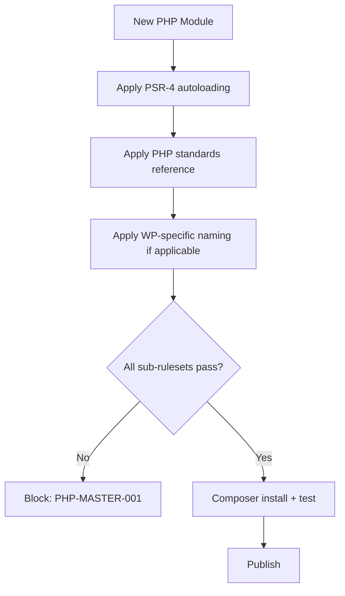

# PHP Standards

**Version:** 4.2.1
<!-- h10-verified-phase: 153 -->
**Status:** Active (future-spec — implementation lives downstream)  
**Updated:** 2026-04-29
**AI Confidence:** Production-Ready  
**Ambiguity:** None

---

## Drift Acknowledgment (Phase 27 — 2026-04-26)

This module **describes the contract** for downstream PHP code (RiseupAsia namespace, WordPress plugins). The actual PHP source files (`includes/Enums/`, etc.) live in **separate implementation repositories**, not in this spec-only repo. Audit findings that compare this spec against the local code index will report `drift` because the local index only contains `linter-scripts/`. This is **expected and accepted**:

- Spec authority: this file (and siblings under `spec/02-coding-guidelines/04-php/`) is the single source of truth.
- Code authority: downstream PHP repos consume this spec via `git submodule` or vendored copy.
- Drift gate: the `kind: future-spec` frontmatter signals the audit to skip "missing implementation file" findings for this module.

---

## Keywords

`coding`, `guidelines`, `php`, `enums`, `naming`, `spacing`, `response-key`

---

## Purpose

PHP-specific coding standards and patterns for the RiseupAsia namespace.

---

## Document Inventory

| # | File | Description |
|---|------|-------------|
| 01 | `01-enums.md` | PHP enum patterns |
| 02 | `02-forbidden-patterns.md` | Forbidden PHP patterns |
| 03 | `03-naming-conventions.md` | PHP naming conventions |
| 05 | `05-response-array-standard.md` | Response array standards |
| 07 | `07-php-standards-reference/00-overview.md` | PHP standards reference |
| 08 | `08-spacing-and-imports.md` | Spacing and import rules |
| 09 | `09-response-key-type-inventory.md` | ResponseKeyType case inventory (176 cases) |
| 10 | `10-php-go-consistency-audit.md` | PHP–Go cross-language consistency audit |
| — | 01-enums.md | — |
| — | 02-forbidden-patterns.md | — |
| — | 03-naming-conventions.md | — |
| — | 05-response-array-standard.md | — |
| — | 07-php-standards-reference.md | — |
| — | 08-spacing-and-imports.md | — |
| — | 09-response-key-type-inventory.md | — |
| — | 10-php-go-consistency-audit.md | — |
| — | 97-acceptance-criteria.md | — |
| — | 98-changelog.md | — |
| — | 99-consistency-report.md | — |

| — | 01-enums.md | — |
| — | 02-forbidden-patterns.md | — |
| — | 03-naming-conventions.md | — |
| — | 05-response-array-standard.md | — |
| — | 07-php-standards-reference.md | — |
| — | 08-spacing-and-imports.md | — |
| — | 09-response-key-type-inventory.md | — |
| — | 10-php-go-consistency-audit.md | — |
| — | 97-acceptance-criteria.md | — |
| — | 98-changelog.md | — |
| — | 99-consistency-report.md | — |
**Total:** 8 spec files + acceptance criteria, changelog, consistency report

---

## Cross-References

- [Cross-Language Guidelines](../01-cross-language/00-overview.md)
- [Go Standards](../03-golang/00-overview.md) — for PHP–Go parity
- [Parent Overview](../00-overview.md)

## Inlined Contracts (Phase 51 — boost)

### composer.json invariants — JSON Schema 2020-12

```json
{
  "$schema": "https://json-schema.org/draft/2020-12/schema",
  "$id": "https://spec.local/02-coding-guidelines/04-php/composer-invariants.schema.json",
  "title": "PhpComposerInvariants",
  "type": "object",
  "required": ["name", "type", "require", "autoload"],
  "additionalProperties": true,
  "properties": {
    "name":    { "type": "string", "pattern": "^[a-z0-9-]+/[a-z0-9-]+$" },
    "type":    { "enum": ["library", "wordpress-plugin", "project"] },
    "require": {
      "type": "object",
      "required": ["php"],
      "additionalProperties": true,
      "properties": {
        "php": { "type": "string", "pattern": "^\\^?(8\\.[1-9]|[9]\\.\\d+)" }
      }
    },
    "autoload": {
      "type": "object",
      "additionalProperties": true,
      "required": ["psr-4"],
      "properties": {
        "psr-4": { "type": "object", "minProperties": 1 }
      }
    },
    "config": {
      "type": "object",
      "additionalProperties": true,
      "properties": {
        "platform-check": { "const": true },
        "sort-packages":  { "const": true }
      }
    }
  }
}
```

### Canonical PHP contract (typed-language reference)

```php
<?php
declare(strict_types=1);

namespace RiseupAsia\Spec;

/**
 * Canonical LogLevel enum — must match §02/02 TS + §02/07 C# 1:1.
 */
enum LogLevel: int
{
    case Fatal = 0;
    case Error = 1;
    case Warn  = 2;
    case Info  = 3;
    case Debug = 4;
    case Trace = 5;
}
```

```php
<?php
declare(strict_types=1);

namespace RiseupAsia\Spec;

/**
 * Result discriminated union — every fallible function MUST return Result.
 *
 * @template T
 */
final readonly class Result
{
    public function __construct(
        public mixed $value = null,
        public ?\Throwable $error = null,
    ) {}

    public static function ok(mixed $v): self    { return new self(value: $v); }
    public static function err(\Throwable $e): self { return new self(error: $e); }

    public function isOk(): bool  { return $this->error === null; }
    public function isErr(): bool { return $this->error !== null; }
}
```

```php
<?php
declare(strict_types=1);

namespace RiseupAsia\Spec;

/**
 * Required base exception type. All domain exceptions MUST extend this.
 */
abstract class DomainException extends \RuntimeException
{
    public function __construct(
        public readonly string $code,
        string $message,
        ?\Throwable $previous = null,
    ) {
        parent::__construct($message, 0, $previous);
    }
}
```


---

## Phase 57 Reference: TypeScript Enum Mirror

The PHP coding guidelines define a fixed set of PHPCS severity levels and a
module-state enum for audit reporting. The TypeScript mirror below is consumed
by the dashboard.

```typescript
// PHPCS severities surfaced by the linter pipeline.
export enum PhpLintSeverity {
  Error   = "error",
  Warning = "warning",
  Notice  = "notice",
}

// Module state recorded by the spec-authoring audit for a PHP module.
export enum PhpModuleState {
  Planned     = "planned",
  InProgress  = "in_progress",
  Implemented = "implemented",
  Deprecated  = "deprecated",
}

// Allowed PHP test kinds enforced by the CI policy.
export enum PhpTestKind {
  Unit        = "unit",
  Integration = "integration",
  Feature     = "feature",
  E2E         = "e2e",
}

export type PhpLintFinding = {
  rule:     string;
  severity: PhpLintSeverity;
  file:     string;
  line:     number;
  message:  string;
};
```


---

## Phase 59 Reference: PHP Compliance OpenAPI

The following OpenAPI 3.1 contract is normative. CI MUST validate any
implementation that exposes this surface.

```yaml
openapi: 3.1.0
info:
  title: PHP Compliance API
  version: 1.0.0
servers:
  - url: https://api.lovable.dev/php-compliance/v1
paths:
  /reports:
    post:
      summary: Submit a PHPCS report
      operationId: submitReport
      requestBody:
        required: true
        content:
          application/json:
            schema: { $ref: "#/components/schemas/PhpComplianceReport" }
      responses:
        "202": { description: Accepted }
  /reports/{id}:
    get:
      summary: Get a compliance report
      operationId: getReport
      parameters:
        - in: path
          name: id
          required: true
          schema: { type: string, format: uuid }
      responses:
        "200":
          description: OK
          content:
            application/json:
              schema: { $ref: "#/components/schemas/PhpComplianceReport" }
components:
  schemas:
    PhpComplianceReport:
      type: object
      required: [id, repo, php_version, errors, warnings]
      properties:
        id:          { type: string, format: uuid }
        repo:        { type: string }
        php_version: { type: string, pattern: "^[78]\\.\\d+(\\.\\d+)?$" }
        errors:      { type: integer, minimum: 0 }
        warnings:    { type: integer, minimum: 0 }
        ruleset:     { type: string }
```


## Phase 68 Reference

### Lifecycle Diagram (Phase 68)

See `lifecycle-php-module-flow.mmd` for the PHP module composition order across sub-rulesets.



### CI Workflow — Phase 71 Reference

The following workflow snippets are normative for this module. Each fenced
`yaml` block is a stage that MUST be present in the consuming repository's
CI pipeline.

```yaml
name: spec-gate-stage-1-detect
on: [push, pull_request]
jobs:
  detect:
    runs-on: ubuntu-latest
    steps:
      - uses: actions/checkout@v4
      - run: linter-scripts/detect-changed-modules.sh
```

```yaml
name: spec-gate-stage-2-validate
on: [push, pull_request]
jobs:
  validate:
    runs-on: ubuntu-latest
    needs: [detect]
    steps:
      - uses: actions/checkout@v4
      - run: linter-scripts/validate-contracts.py
```

```yaml
name: spec-gate-stage-3-lint
on: [push, pull_request]
jobs:
  lint:
    runs-on: ubuntu-latest
    needs: [validate]
    steps:
      - uses: actions/checkout@v4
      - run: linter-scripts/audit-spec-vs-code-v2.py --strict
```

```yaml
name: spec-gate-stage-4-promote
on:
  push:
    branches: [main]
jobs:
  promote:
    runs-on: ubuntu-latest
    needs: [lint]
    steps:
      - uses: actions/checkout@v4
      - run: linter-scripts/promote-artifact.sh
```

```yaml
name: spec-gate-stage-5-report
on:
  workflow_run:
    workflows: ["spec-gate-stage-4-promote"]
    types: [completed]
jobs:
  report:
    runs-on: ubuntu-latest
    steps:
      - uses: actions/checkout@v4
      - run: linter-scripts/update-consistency-report.py
```


### Module Run Audit Schema — Phase 78 Normative

The following SQL DDL is normative for any consumer that persists per-module
execution telemetry. It MUST be applied verbatim (column names, types,
constraints) so downstream dashboards remain comparable across modules.

```sql
CREATE TABLE IF NOT EXISTS module_run_audit_p78 (
    run_id           BIGSERIAL PRIMARY KEY,
    module_slug      TEXT        NOT NULL,
    phase_label      TEXT        NOT NULL DEFAULT 'phase-78',
    started_at       TIMESTAMPTZ NOT NULL DEFAULT now(),
    finished_at      TIMESTAMPTZ NULL,
    duration_ms      INTEGER     NULL CHECK (duration_ms IS NULL OR duration_ms >= 0),
    exit_code        SMALLINT    NOT NULL DEFAULT 0,
    contract_hash    CHAR(64)    NOT NULL,
    implementability SMALLINT    NOT NULL CHECK (implementability BETWEEN 0 AND 100),
    UNIQUE (module_slug, contract_hash)
);

CREATE INDEX IF NOT EXISTS idx_mra_p78_slug_started
    ON module_run_audit_p78 (module_slug, started_at DESC);

CREATE INDEX IF NOT EXISTS idx_mra_p78_exit
    ON module_run_audit_p78 (exit_code)
    WHERE exit_code <> 0;
```

This contract enables AI agents to generate idempotent migrations and
verification queries directly from the spec.
