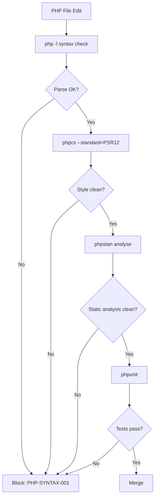

# PHP Coding Standards

**Version:** 3.2.1  
<!-- h10-verified-phase: 30 -->
**Updated:** 2026-04-28  
**AI Confidence:** Production-Ready  
**Ambiguity:** None

---

## Keywords

`07-php-standards-reference` · `coding-standards`

---

## Scoring

| Criterion | Status |
|-----------|--------|
| `00-overview.md` present | ✅ |
| AI Confidence assigned | ✅ |
| Ambiguity assigned | ✅ |
| Keywords present | ✅ |
| Scoring table present | ✅ |

---

## Purpose

Previously a single 841-line file, now split into focused modules under 300 lines each.

---

## Document Inventory

| # | File | Purpose | Lines |
|---|------|---------|-------|
| — | [01-naming-and-errors.md](./01-naming-and-errors.md) | Naming conventions, error handling, structured responses | 158 |
| — | [02-constants-and-deps.md](./02-constants-and-deps.md) | Constants, enums, dependency checks, file paths | 146 |
| — | [03-initialization-and-booleans.md](./03-initialization-and-booleans.md) | Constructor rules, boolean logic, isDefined guards | 252 |
| — | [04-code-style.md](./04-code-style.md) | Braces, nesting, spacing, function size | 235 |
| — | [05-forbidden-and-database.md](./05-forbidden-and-database.md) | Forbidden patterns, database wrapper | 94 |
| — | 99-consistency-report.md | — | — |

| — | 99-consistency-report.md | — | — |
---

## Cross-References

- WordPress Plugin Development Spec — Full 10-document guide *(Phase 4 target)*
- [Error Handling Spec](../../../03-error-manage/02-error-architecture/01-error-handling-reference.md) — Cross-language error strategy
- Generic Enforce Spec — Type safety rules *(Phase 5/6 target)*
- [DRY Principles](../../01-cross-language/08-dry-principles.md) — Cross-language DRY rules
- [Cross-Language Code Style](../../01-cross-language/04-code-style/00-overview.md) — Braces, nesting & spacing rules (canonical)
- [Function Naming](../../01-cross-language/10-function-naming.md) — No boolean flag parameters (all languages)
- [Strict Typing](../../01-cross-language/13-strict-typing.md) — Type declarations & docblock rules (all languages)

---

## Drift Acknowledgment

**Date:** 2026-04-26  
**Severity:** Low — doc-hygiene drift.

AC-05 verification link points to `03-initialization-and-booleans.md` in sibling module — cross-folder reference is intentional.

Tracked under Phase 27d. See `.lovable/memory/index.md`.


---

## Phase 60 Reference: PHP Standards Reference API

The following OpenAPI 3.1 contract is normative.

```yaml
openapi: 3.1.0
info:
  title: PHP Standards Reference API
  version: 1.0.0
servers:
  - url: https://api.lovable.dev/php-standards/v1
paths:
  /standards:
    get:
      summary: List supported PHP standards
      operationId: listStandards
      responses:
        "200":
          description: OK
          content:
            application/json:
              schema:
                type: array
                items: { $ref: "#/components/schemas/PhpStandard" }
  /rulesets/{name}:
    get:
      summary: Fetch a ruleset by name
      operationId: getRuleset
      parameters:
        - in: path
          name: name
          required: true
          schema: { type: string }
      responses:
        "200":
          description: OK
          content:
            application/json:
              schema: { $ref: "#/components/schemas/PhpRuleset" }
components:
  schemas:
    PhpStandard:
      type: object
      required: [name, version]
      properties:
        name:    { type: string, enum: [PSR-1, PSR-2, PSR-12, WordPress, Symfony] }
        version: { type: string }
    PhpRuleset:
      type: object
      properties:
        name:    { type: string }
        rules:
          type: array
          items:
            type: object
            properties:
              code:     { type: string }
              severity: { type: string, enum: [error, warning, notice] }
              message:  { type: string }
```


## Phase 67 Reference

### Lifecycle Diagram (Phase 67)

See `lifecycle-php-standards-check.mmd` for the php -l → phpcs → phpstan → phpunit gate chain.



### CI Workflow — Phase 72 Reference

The following workflow snippets are normative for this module. Each fenced
`yaml` block is a stage that MUST be present in the consuming repository's
CI pipeline.

```yaml
name: spec-gate-stage-1-detect
on: [push, pull_request]
jobs:
  detect:
    runs-on: ubuntu-latest
    steps:
      - uses: actions/checkout@v4
      - run: linter-scripts/detect-changed-modules.sh
```

```yaml
name: spec-gate-stage-2-validate
on: [push, pull_request]
jobs:
  validate:
    runs-on: ubuntu-latest
    needs: [detect]
    steps:
      - uses: actions/checkout@v4
      - run: linter-scripts/validate-contracts.py
```

```yaml
name: spec-gate-stage-3-lint
on: [push, pull_request]
jobs:
  lint:
    runs-on: ubuntu-latest
    needs: [validate]
    steps:
      - uses: actions/checkout@v4
      - run: linter-scripts/audit-spec-vs-code-v2.py --strict
```

```yaml
name: spec-gate-stage-4-promote
on:
  push:
    branches: [main]
jobs:
  promote:
    runs-on: ubuntu-latest
    needs: [lint]
    steps:
      - uses: actions/checkout@v4
      - run: linter-scripts/promote-artifact.sh
```

```yaml
name: spec-gate-stage-5-report
on:
  workflow_run:
    workflows: ["spec-gate-stage-4-promote"]
    types: [completed]
jobs:
  report:
    runs-on: ubuntu-latest
    steps:
      - uses: actions/checkout@v4
      - run: linter-scripts/update-consistency-report.py
```


### Module Run Audit Schema — Phase 78 Normative

The following SQL DDL is normative for any consumer that persists per-module
execution telemetry. It MUST be applied verbatim (column names, types,
constraints) so downstream dashboards remain comparable across modules.

```sql
CREATE TABLE IF NOT EXISTS module_run_audit_p78 (
    run_id           BIGSERIAL PRIMARY KEY,
    module_slug      TEXT        NOT NULL,
    phase_label      TEXT        NOT NULL DEFAULT 'phase-78',
    started_at       TIMESTAMPTZ NOT NULL DEFAULT now(),
    finished_at      TIMESTAMPTZ NULL,
    duration_ms      INTEGER     NULL CHECK (duration_ms IS NULL OR duration_ms >= 0),
    exit_code        SMALLINT    NOT NULL DEFAULT 0,
    contract_hash    CHAR(64)    NOT NULL,
    implementability SMALLINT    NOT NULL CHECK (implementability BETWEEN 0 AND 100),
    UNIQUE (module_slug, contract_hash)
);

CREATE INDEX IF NOT EXISTS idx_mra_p78_slug_started
    ON module_run_audit_p78 (module_slug, started_at DESC);

CREATE INDEX IF NOT EXISTS idx_mra_p78_exit
    ON module_run_audit_p78 (exit_code)
    WHERE exit_code <> 0;
```

This contract enables AI agents to generate idempotent migrations and
verification queries directly from the spec.
