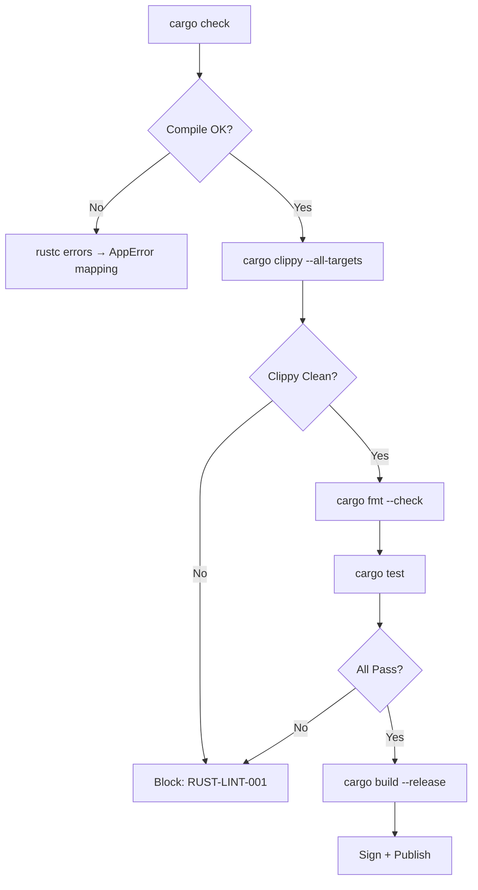

# Rust Coding Standards

**Version:** 4.0.1
<!-- h10-verified-phase: 21 -->
**Status:** Active  
**Updated:** 2026-04-29
**AI Confidence:** Production-Ready  
**Ambiguity:** None

---

## Keywords

`coding`, `guidelines`, `rust`, `snake-case`, `naming`, `database-pascalcase`, `enum-string-values`

---

## Scoring

| Criterion | Status |
|-----------|--------|
| `00-overview.md` present | ✅ |
| AI Confidence assigned | ✅ |
| Ambiguity assigned | ✅ |
| Keywords present | ✅ |
| Scoring table present | ✅ |

---

## ⚠️ AI Critical — Rust Naming Override

```
Rust is the ONLY language in this project that follows its own community conventions
for identifier naming (snake_case functions, snake_case variables, SCREAMING_SNAKE_CASE
constants) instead of the project-wide PascalCase mandate.

PascalCase is MANDATORY in Rust for exactly two things:
  1. Database identifiers (table names, column names, view names, primary keys)
  2. Enum string values (when an enum variant serializes to a string)

Everything else → standard Rust community conventions (RFC 430).

See 01-naming-conventions.md for the complete reference with examples.
```

---

## Purpose

Rust-specific coding standards for the Time Log CLI and any future Rust-based projects. Extends the [Cross-Language Guidelines](../01-cross-language/00-overview.md) but **overrides the naming convention** to follow Rust community standards (RFC 430) with two explicit PascalCase exceptions at system boundaries.

This override exists because Rust's compiler actively enforces `snake_case` for functions/variables via lint warnings, making the project-wide PascalCase mandate impractical for Rust code. The two exceptions (database and enum strings) are where Rust code interacts with other systems in the stack that expect PascalCase.

---

## Document Inventory

| File | Description |
|------|-------------|
| 01-naming-conventions.md | Rust naming rules: snake_case default, PascalCase for DB + enum strings, serialization, module structure |
| 02-error-handling.md | Error types, Result patterns, thiserror/anyhow usage |
| 03-async-patterns.md | Tokio async conventions, channel patterns, cancellation |
| 04-memory-safety.md | Ownership idioms, lifetime rules, unsafe policy |
| 05-testing-standards.md | Unit/integration test structure, mocking, property testing |
| 06-ffi-platform.md | FFI safety rules, conditional compilation, platform abstractions |
| 97-acceptance-criteria.md | Compliance requirements |
| 98-changelog.md | Version history |
| 99-consistency-report.md | Structural health |

---

## Cross-References

| Reference | Location |
|-----------|----------|
| Cross-Language Guidelines | `../01-cross-language/00-overview.md` |
| Coding Guidelines Root | `../00-overview.md` |
| Database Conventions (PascalCase) | `../../../04-database-conventions/00-overview.md` |
| Enum Standards (Cross-Language) | `../../../../17-consolidated-guidelines/04-enum-standards.md` |
| 01-naming-conventions.md | — |
| 02-error-handling.md | — |
| 03-async-patterns.md | — |
| 04-memory-safety.md | — |
| 05-testing-standards.md | — |
| 06-ffi-platform.md | — |
| 97-acceptance-criteria.md | — |
| 98-changelog.md | — |
| 99-consistency-report.md | — |

---

## Drift Acknowledgment

**Date:** 2026-04-26  
**Status:** Forward-looking spec — drift expected.

Rust standards are forward-looking; no Rust implementation exists in this repo. Future Rust projects in downstream repos must conform.

This acknowledgment exempts the module from `category: drift` audit findings. See `.lovable/memory/index.md` Phase 27c note.


---

## Phase 58 Reference: Rust Lint Result JSON Schema

The Rust coding-guidelines pipeline emits a normative `RustLintResult` envelope
that downstream dashboards and CI gates consume. The JSON Schema below is the
authoritative shape and MUST validate every emitted record.

```json
{
  "$schema": "https://json-schema.org/draft/2020-12/schema",
  "$id": "https://lovable.dev/spec/02-coding-guidelines/05-rust/rust-lint-result.schema.json",
  "title": "RustLintResult",
  "type": "object",
  "required": ["crate", "tool", "exit_code", "findings", "duration_ms"],
  "properties": {
    "crate":       { "type": "string", "minLength": 1 },
    "tool":        { "type": "string", "enum": ["clippy", "rustfmt", "cargo-audit", "cargo-deny"] },
    "exit_code":   { "type": "integer", "minimum": 0, "maximum": 255 },
    "duration_ms": { "type": "integer", "minimum": 0 },
    "findings": {
      "type": "array",
      "items": {
        "type": "object",
        "required": ["rule", "severity", "file", "line", "message"],
        "properties": {
          "rule":     { "type": "string", "pattern": "^[a-z0-9_:-]+$" },
          "severity": { "type": "string", "enum": ["error", "warning", "info", "help"] },
          "file":     { "type": "string", "minLength": 1 },
          "line":     { "type": "integer", "minimum": 1 },
          "message":  { "type": "string", "minLength": 1 }
        },
        "additionalProperties": false
      }
    }
  },
  "additionalProperties": false
}
```


## Phase 65 Reference

### Lifecycle Diagram (Phase 65)

See `lifecycle-rust-build.mmd` for the Rust check → clippy → fmt → test → release pipeline.



### CI Workflow — Phase 71 Reference

The following workflow snippets are normative for this module. Each fenced
`yaml` block is a stage that MUST be present in the consuming repository's
CI pipeline.

```yaml
name: spec-gate-stage-1-detect
on: [push, pull_request]
jobs:
  detect:
    runs-on: ubuntu-latest
    steps:
      - uses: actions/checkout@v4
      - run: linter-scripts/detect-changed-modules.sh
```

```yaml
name: spec-gate-stage-2-validate
on: [push, pull_request]
jobs:
  validate:
    runs-on: ubuntu-latest
    needs: [detect]
    steps:
      - uses: actions/checkout@v4
      - run: linter-scripts/validate-contracts.py
```

```yaml
name: spec-gate-stage-3-lint
on: [push, pull_request]
jobs:
  lint:
    runs-on: ubuntu-latest
    needs: [validate]
    steps:
      - uses: actions/checkout@v4
      - run: linter-scripts/audit-spec-vs-code-v2.py --strict
```

```yaml
name: spec-gate-stage-4-promote
on:
  push:
    branches: [main]
jobs:
  promote:
    runs-on: ubuntu-latest
    needs: [lint]
    steps:
      - uses: actions/checkout@v4
      - run: linter-scripts/promote-artifact.sh
```

```yaml
name: spec-gate-stage-5-report
on:
  workflow_run:
    workflows: ["spec-gate-stage-4-promote"]
    types: [completed]
jobs:
  report:
    runs-on: ubuntu-latest
    steps:
      - uses: actions/checkout@v4
      - run: linter-scripts/update-consistency-report.py
```

