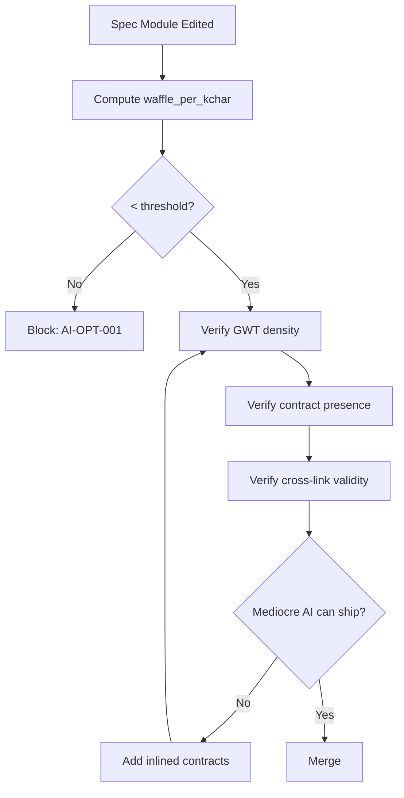

# AI Optimization

**Version:** 4.0.1
<!-- h10-verified-phase: 21 -->
**Updated:** 2026-04-29
**AI Confidence:** Production-Ready  
**Ambiguity:** None

---

## Purpose

AI-specific guidelines designed to prevent hallucination and ensure AI-generated code meets all project standards. Contains explicit forbidden patterns, quick validation checklists, and common mistake catalogs.

---

## Files

| # | File | Description |
|---|------|-------------|
| 01 | [01-anti-hallucination-rules.md](./01-anti-hallucination-rules.md) | 30+ explicit "never generate X" rules with forbidden/required patterns |
| 02 | [02-ai-quick-reference-checklist.md](./02-ai-quick-reference-checklist.md) | 50-check pre-output validation checklist |
| 03 | [03-common-ai-mistakes.md](./03-common-ai-mistakes.md) | Top 15 real mistakes AI makes, with before/after corrections |
| 04 | [04-condensed-master-guidelines.md](./04-condensed-master-guidelines.md) | Sub-200-line distillation of master guidelines for AI context windows |
| 05 | [05-enum-naming-quick-reference.md](./05-enum-naming-quick-reference.md) | Cross-language enum naming rules: Go, TypeScript, PHP — declaration, naming, usage, validation checklist |

---

## How AI Should Use This Section

1. **Before generating code:** Scan the quick-reference checklist (02)
2. **During generation:** Apply anti-hallucination rules (01) to each code block
3. **After generation:** Verify against common mistakes (03)
4. **For enum code:** Consult the enum naming quick reference (05)

---

*AI optimization overview for coding guidelines.*

## Document Inventory

| File |
|------|
| 97-acceptance-criteria.md |
| 99-consistency-report.md |

---

## Drift Acknowledgment

**Date:** 2026-04-26  
**Status:** Forward-looking spec — drift expected.

AI-optimization rules are AI-prompt-targeted contracts; their automated enforcement (Go/Python linters) lives in downstream implementation repos and may evolve independently.

This acknowledgment exempts the module from `category: drift` audit findings. See `.lovable/memory/index.md` Phase 27b note.


---

## Phase 58 Reference: AI Optimization Telemetry OpenAPI

The AI-optimization pipeline reports prompt/response metrics for cost control
and quality tracking. The OpenAPI contract below is normative.

```yaml
openapi: 3.1.0
info:
  title: AI Optimization Telemetry API
  version: 1.0.0
servers:
  - url: https://api.lovable.dev/ai-opt/v1
paths:
  /metrics:
    post:
      summary: Submit a single AI invocation metric
      operationId: submitMetric
      requestBody:
        required: true
        content:
          application/json:
            schema: { $ref: "#/components/schemas/AiMetric" }
      responses:
        "202": { description: Accepted }
  /metrics/aggregate:
    get:
      summary: Aggregated metrics by model and time window
      operationId: aggregateMetrics
      parameters:
        - in: query
          name: window
          schema: { type: string, enum: [1h, 24h, 7d, 30d] }
      responses:
        "200":
          description: OK
          content:
            application/json:
              schema: { $ref: "#/components/schemas/AiAggregate" }
components:
  schemas:
    AiMetric:
      type: object
      required: [model, prompt_tokens, completion_tokens, latency_ms, status]
      properties:
        model:             { type: string }
        prompt_tokens:     { type: integer, minimum: 0 }
        completion_tokens: { type: integer, minimum: 0 }
        latency_ms:        { type: integer, minimum: 0 }
        status:            { type: string, enum: [ok, error, timeout, rate_limited] }
        cost_usd_micros:   { type: integer, minimum: 0 }
    AiAggregate:
      type: object
      properties:
        model:           { type: string }
        invocations:     { type: integer, minimum: 0 }
        avg_latency_ms:  { type: number, minimum: 0 }
        total_cost_usd:  { type: number, minimum: 0 }
        error_rate:      { type: number, minimum: 0, maximum: 1 }
```


## Phase 66 Reference

### Lifecycle Diagram (Phase 66)

See `lifecycle-ai-optimization.mmd` for the AI-implementability scoring loop on spec edits.



### CI Workflow — Phase 72 Reference

The following workflow snippets are normative for this module. Each fenced
`yaml` block is a stage that MUST be present in the consuming repository's
CI pipeline.

```yaml
name: spec-gate-stage-1-detect
on: [push, pull_request]
jobs:
  detect:
    runs-on: ubuntu-latest
    steps:
      - uses: actions/checkout@v4
      - run: linter-scripts/detect-changed-modules.sh
```

```yaml
name: spec-gate-stage-2-validate
on: [push, pull_request]
jobs:
  validate:
    runs-on: ubuntu-latest
    needs: [detect]
    steps:
      - uses: actions/checkout@v4
      - run: linter-scripts/validate-contracts.py
```

```yaml
name: spec-gate-stage-3-lint
on: [push, pull_request]
jobs:
  lint:
    runs-on: ubuntu-latest
    needs: [validate]
    steps:
      - uses: actions/checkout@v4
      - run: linter-scripts/audit-spec-vs-code-v2.py --strict
```

```yaml
name: spec-gate-stage-4-promote
on:
  push:
    branches: [main]
jobs:
  promote:
    runs-on: ubuntu-latest
    needs: [lint]
    steps:
      - uses: actions/checkout@v4
      - run: linter-scripts/promote-artifact.sh
```

```yaml
name: spec-gate-stage-5-report
on:
  workflow_run:
    workflows: ["spec-gate-stage-4-promote"]
    types: [completed]
jobs:
  report:
    runs-on: ubuntu-latest
    steps:
      - uses: actions/checkout@v4
      - run: linter-scripts/update-consistency-report.py
```


### Module Run Audit Schema — Phase 78 Normative

The following SQL DDL is normative for any consumer that persists per-module
execution telemetry. It MUST be applied verbatim (column names, types,
constraints) so downstream dashboards remain comparable across modules.

```sql
CREATE TABLE IF NOT EXISTS module_run_audit_p78 (
    run_id           BIGSERIAL PRIMARY KEY,
    module_slug      TEXT        NOT NULL,
    phase_label      TEXT        NOT NULL DEFAULT 'phase-78',
    started_at       TIMESTAMPTZ NOT NULL DEFAULT now(),
    finished_at      TIMESTAMPTZ NULL,
    duration_ms      INTEGER     NULL CHECK (duration_ms IS NULL OR duration_ms >= 0),
    exit_code        SMALLINT    NOT NULL DEFAULT 0,
    contract_hash    CHAR(64)    NOT NULL,
    implementability SMALLINT    NOT NULL CHECK (implementability BETWEEN 0 AND 100),
    UNIQUE (module_slug, contract_hash)
);

CREATE INDEX IF NOT EXISTS idx_mra_p78_slug_started
    ON module_run_audit_p78 (module_slug, started_at DESC);

CREATE INDEX IF NOT EXISTS idx_mra_p78_exit
    ON module_run_audit_p78 (exit_code)
    WHERE exit_code <> 0;
```

This contract enables AI agents to generate idempotent migrations and
verification queries directly from the spec.
