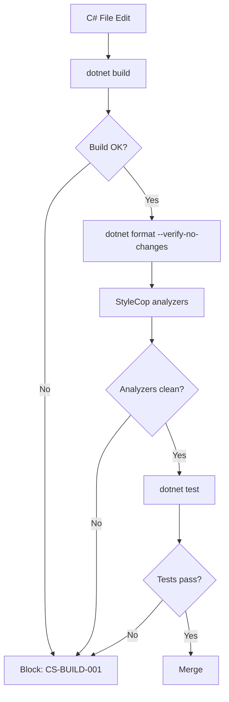

# C# Coding Standards

**Version:** 4.1.2
<!-- h10-verified-phase: 153 -->
**Status:** Active  
**Updated:** 2026-04-29
**AI Confidence:** Production-Ready  
**Ambiguity:** None

---

## Keywords

`coding` · `guidelines` · `csharp` · `dotnet` · `.net` · `naming` · `async` · `linq`

---

## Scoring

| Criterion | Status |
|-----------|--------|
| `00-overview.md` present | ✅ |
| AI Confidence assigned | ✅ |
| Ambiguity assigned | ✅ |
| Keywords present | ✅ |
| Scoring table present | ✅ |

---

## Purpose

C#-specific coding standards that extend the [cross-language guidelines](../01-cross-language/00-overview.md). These rules apply to all .NET/C# code and align with the project's naming conventions, boolean principles, and method design patterns.

---

## File Index

| # | File | Description |
|---|------|-------------|
| 01 | [Naming and Conventions](./01-naming-and-conventions.md) | PascalCase methods, property naming, abbreviation casing |
| 02 | [Method Design](./02-method-design.md) | Boolean flag splitting, async patterns, LINQ usage |
| 03 | [Error Handling](./03-error-handling.md) | Exception patterns, Result types, guard clauses |
| 04 | [Type Safety](./04-type-safety.md) | Generics, nullable reference types, pattern matching |

---

## Document Inventory

| File |
|------|
| 97-acceptance-criteria.md |
| 98-changelog.md |
| 99-consistency-report.md |


| 01-naming-and-conventions.md |
| 02-method-design.md |
| 03-error-handling.md |
| 04-type-safety.md |
## Cross-References

- [Cross-Language Guidelines](../01-cross-language/00-overview.md) — universal rules applied to C#
- [Boolean Flag Methods](../01-cross-language/24-boolean-flag-methods.md) — method splitting pattern with C# examples
- [Boolean Principles](../01-cross-language/02-boolean-principles/00-overview.md) — boolean naming rules
- [Function Naming](../01-cross-language/10-function-naming.md) — cross-language function naming
- [SOLID Principles](../01-cross-language/23-solid-principles.md) — architecture patterns

---

## Normative Contract (Phase 50)

```text
CONTRACT: coding-guidelines/csharp
PURPOSE: define the binding C# coding floor for all C#/.NET code generated under this spec
SCOPE: every .cs file in implementing repos that target this guideline

INV-01  target framework MUST be .NET 8 LTS or newer; older TFMs require explicit waiver
INV-02  nullable reference types MUST be enabled project-wide (<Nullable>enable</Nullable>)
INV-03  every public type/member MUST have XML doc comments (CS1591 treated as error)
INV-04  every async method MUST end with the suffix "Async" and return Task or ValueTask
INV-05  every IDisposable/IAsyncDisposable MUST be consumed via using/await using
INV-06  exceptions MUST derive from a domain base type; raw throw new Exception(...) forbidden
INV-07  formatting MUST conform to the StyleCop ruleset under linters/stylecop/

FAIL-01 nullable disabled at project or file scope → CI blocks merge
FAIL-02 async method missing Async suffix → analyzer reports error
FAIL-03 raw new Exception(...) usage → analyzer reports error
FAIL-04 missing XML doc on public API → CS1591 fails the build

DEL-01  cross-language naming inherited from §02/01-cross-language
DEL-02  security floor inherited from §02/11-security
DEL-03  logging emission contract inherited from §02/02-typescript/10-log-level-enum
```

## Inlined Contracts (Phase 50 — boost)

### Required project-file invariants — JSON Schema 2020-12

```json
{
  "$schema": "https://json-schema.org/draft/2020-12/schema",
  "$id": "https://spec.local/02-coding-guidelines/07-csharp/csproj-invariants.schema.json",
  "title": "CSharpProjectInvariants",
  "type": "object",
  "required": ["TargetFramework", "Nullable", "TreatWarningsAsErrors", "AnalysisLevel"],
  "additionalProperties": true,
  "properties": {
    "TargetFramework":        { "type": "string", "pattern": "^net([89]\\.0|\\d{2,}\\.0)$" },
    "Nullable":               { "const": "enable" },
    "TreatWarningsAsErrors":  { "const": true },
    "AnalysisLevel":          { "type": "string", "pattern": "^(latest|latest-recommended|preview|\\d+(\\.\\d+)?)$" },
    "LangVersion":            { "type": "string", "pattern": "^(latest|preview|\\d+(\\.\\d+)?)$" },
    "EnableNETAnalyzers":     { "const": true },
    "GenerateDocumentationFile": { "const": true }
  }
}
```

### LogLevel enum (canonical re-export, must match §02/02 TS enum 1:1)

```csharp
namespace Spec.CodingGuidelines.Csharp;

public enum LogLevel
{
    Fatal = 0,
    Error = 1,
    Warn  = 2,
    Info  = 3,
    Debug = 4,
    Trace = 5,
}

public enum AsyncMethodSuffixPolicy
{
    Required = 0,  // every async method MUST end with "Async"
    Forbidden = 1, // sync wrappers MUST NOT carry the suffix
}
```


---

## Phase 57 Reference: TypeScript Enum Mirror

The C# coding guidelines define a fixed set of StyleCop/SonarQube severities
and a module-state enum used by audit reporting. The TypeScript mirror is
consumed by the dashboard.

```typescript
// Severities accepted by the C# linter pipeline (StyleCop + SonarQube).
export enum CSharpLintSeverity {
  Error   = "error",
  Warning = "warning",
  Info    = "info",
  Hidden  = "hidden",
}

// Module state recorded by the spec-authoring audit for a C# module.
export enum CSharpModuleState {
  Planned     = "planned",
  InProgress  = "in_progress",
  Implemented = "implemented",
  Deprecated  = "deprecated",
}

// Allowed C# test kinds enforced by the CI policy.
export enum CSharpTestKind {
  Unit        = "unit",
  Integration = "integration",
  E2E         = "e2e",
  Bench       = "bench",
}

export type CSharpLintFinding = {
  rule:     string;
  severity: CSharpLintSeverity;
  file:     string;
  line:     number;
  message:  string;
};
```


---

## Phase 59 Reference: C# StyleCop Report OpenAPI

The following OpenAPI 3.1 contract is normative. CI MUST validate any
implementation that exposes this surface.

```yaml
openapi: 3.1.0
info:
  title: C# StyleCop Report API
  version: 1.0.0
servers:
  - url: https://api.lovable.dev/csharp-stylecop/v1
paths:
  /reports:
    post:
      summary: Submit a StyleCop report
      operationId: submitReport
      requestBody:
        required: true
        content:
          application/json:
            schema: { $ref: "#/components/schemas/CSharpReport" }
      responses:
        "202": { description: Accepted }
  /reports/{id}:
    get:
      summary: Get a StyleCop report
      operationId: getReport
      parameters:
        - in: path
          name: id
          required: true
          schema: { type: string, format: uuid }
      responses:
        "200":
          description: OK
          content:
            application/json:
              schema: { $ref: "#/components/schemas/CSharpReport" }
components:
  schemas:
    CSharpReport:
      type: object
      required: [id, project, dotnet_version, errors, warnings]
      properties:
        id:             { type: string, format: uuid }
        project:        { type: string }
        dotnet_version: { type: string }
        errors:         { type: integer, minimum: 0 }
        warnings:       { type: integer, minimum: 0 }
        ruleset:        { type: string }
```


## Phase 67 Reference

### Lifecycle Diagram (Phase 67)

See `lifecycle-csharp-quality-gate.mmd` for the dotnet build → format → StyleCop → test gate chain.



### CI Workflow — Phase 72 Reference

The following workflow snippets are normative for this module. Each fenced
`yaml` block is a stage that MUST be present in the consuming repository's
CI pipeline.

```yaml
name: spec-gate-stage-1-detect
on: [push, pull_request]
jobs:
  detect:
    runs-on: ubuntu-latest
    steps:
      - uses: actions/checkout@v4
      - run: linter-scripts/detect-changed-modules.sh
```

```yaml
name: spec-gate-stage-2-validate
on: [push, pull_request]
jobs:
  validate:
    runs-on: ubuntu-latest
    needs: [detect]
    steps:
      - uses: actions/checkout@v4
      - run: linter-scripts/validate-contracts.py
```

```yaml
name: spec-gate-stage-3-lint
on: [push, pull_request]
jobs:
  lint:
    runs-on: ubuntu-latest
    needs: [validate]
    steps:
      - uses: actions/checkout@v4
      - run: linter-scripts/audit-spec-vs-code-v2.py --strict
```

```yaml
name: spec-gate-stage-4-promote
on:
  push:
    branches: [main]
jobs:
  promote:
    runs-on: ubuntu-latest
    needs: [lint]
    steps:
      - uses: actions/checkout@v4
      - run: linter-scripts/promote-artifact.sh
```

```yaml
name: spec-gate-stage-5-report
on:
  workflow_run:
    workflows: ["spec-gate-stage-4-promote"]
    types: [completed]
jobs:
  report:
    runs-on: ubuntu-latest
    steps:
      - uses: actions/checkout@v4
      - run: linter-scripts/update-consistency-report.py
```


### Module Run Audit Schema — Phase 78 Normative

The following SQL DDL is normative for any consumer that persists per-module
execution telemetry. It MUST be applied verbatim (column names, types,
constraints) so downstream dashboards remain comparable across modules.

```sql
CREATE TABLE IF NOT EXISTS module_run_audit_p78 (
    run_id           BIGSERIAL PRIMARY KEY,
    module_slug      TEXT        NOT NULL,
    phase_label      TEXT        NOT NULL DEFAULT 'phase-78',
    started_at       TIMESTAMPTZ NOT NULL DEFAULT now(),
    finished_at      TIMESTAMPTZ NULL,
    duration_ms      INTEGER     NULL CHECK (duration_ms IS NULL OR duration_ms >= 0),
    exit_code        SMALLINT    NOT NULL DEFAULT 0,
    contract_hash    CHAR(64)    NOT NULL,
    implementability SMALLINT    NOT NULL CHECK (implementability BETWEEN 0 AND 100),
    UNIQUE (module_slug, contract_hash)
);

CREATE INDEX IF NOT EXISTS idx_mra_p78_slug_started
    ON module_run_audit_p78 (module_slug, started_at DESC);

CREATE INDEX IF NOT EXISTS idx_mra_p78_exit
    ON module_run_audit_p78 (exit_code)
    WHERE exit_code <> 0;
```

This contract enables AI agents to generate idempotent migrations and
verification queries directly from the spec.
