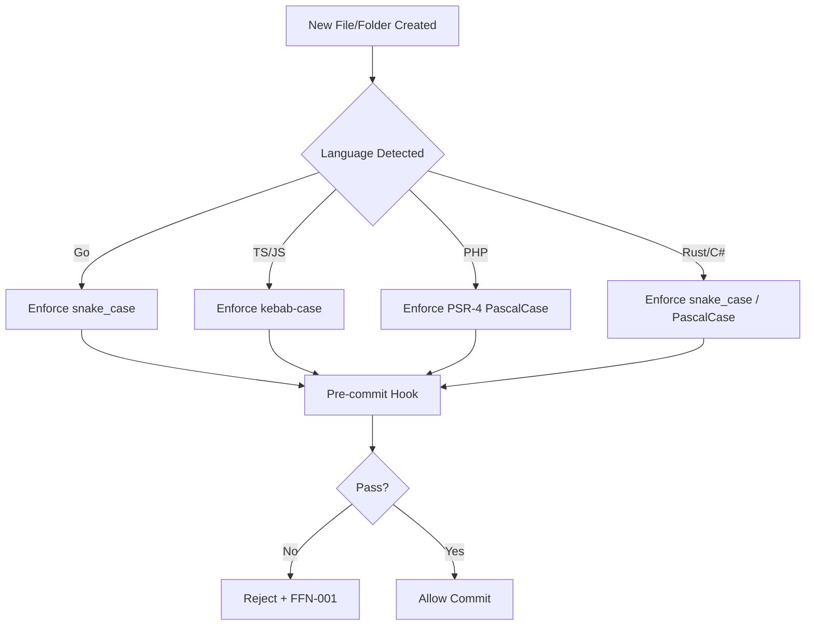

# File & Folder Naming Conventions

**Version:** 1.3.0  **Status:** Active  
**Updated:** 2026-04-27  
<!-- h10-verified-phase: 32 -->
**AI Confidence:** Production-Ready  
**Ambiguity:** None

---

## Keywords

`file-naming` · `folder-naming` · `directory-structure` · `conventions` · `cross-language` · `wordpress` · `php` · `golang` · `typescript` · `rust` · `csharp`

---

## Scoring

| Criterion | Status |
|-----------|--------|
| `00-overview.md` present | ✅ |
| AI Confidence assigned | ✅ |
| Ambiguity assigned | ✅ |
| Keywords present | ✅ |
| Scoring table present | ✅ |

---

## Purpose

Defines file and folder naming conventions for **every language** in the project. Each language has its own file with specific rules, examples, and forbidden patterns. This is the single source of truth for naming files and directories.

---

## Golden Rule

> **Consistency within a language ecosystem matters more than personal preference.** Follow the convention of the language/framework, not your own habits.

---

## Categories

| # | File | Language | Convention Summary |
|---|------|----------|-------------------|
| 01 | [01-cross-language.md](./01-cross-language.md) | All | Universal rules that apply everywhere |
| 02 | [02-php-wordpress.md](./02-php-wordpress.md) | PHP / WordPress | WordPress plugin/theme file & folder naming |
| 03 | [03-golang.md](./03-golang.md) | Go | Package-based naming, flat structure |
| 04 | [04-typescript-javascript.md](./04-typescript-javascript.md) | TypeScript / JS | Component files, hooks, utilities |
| 05 | [05-rust-csharp.md](./05-rust-csharp.md) | Rust / C# | snake_case (Rust) and PascalCase (C#) |

---

## Quick Reference

| Language | Files | Folders | Examples |
|----------|-------|---------|----------|
| **Universal** | lowercase, no spaces | lowercase, no spaces | `config.yaml`, `linter-scripts/` |
| **PHP / WordPress** | `kebab-case.php` (classes: `class-*.php`) | `kebab-case/` | `class-admin-settings.php`, `includes/` |
| **Go** | `snake_case.go` | `lowercase` (no hyphens) | `http_handler.go`, `internal/` |
| **TypeScript** | `kebab-case.ts` (components: `PascalCase.tsx`) | `kebab-case/` | `UserCard.tsx`, `use-auth.ts` |
| **Rust** | `snake_case.rs` | `snake_case/` | `http_client.rs`, `error_handling/` |
| **C#** | `PascalCase.cs` | `PascalCase/` | `UserService.cs`, `Models/` |

---

## Normative Contract — Per-Language Naming Regexes

Authoritative regular expressions enforced by `linter-scripts/check-naming.py`.
Path validation runs against the **basename** of every file and every folder
component beneath `spec/`, `linter-scripts/`, and language-specific source
roots. Strings outside the allowlist fail CI.

```text
# Universal — applies to ALL spec files, linter scripts, configs
universal_file:    ^[a-z0-9]+(-[a-z0-9]+)*\.[a-z0-9]+$
universal_folder:  ^[a-z0-9]+(-[a-z0-9]+)*$
spec_numeric:      ^([0-9]{2})-[a-z0-9]+(-[a-z0-9]+)*$        # spec/NN-slug
reserved_prefixes: ^(00|97|98|99)-                             # never reuse

# PHP / WordPress
php_class_file:    ^class-[a-z0-9]+(-[a-z0-9]+)*\.php$
php_file:          ^[a-z0-9]+(-[a-z0-9]+)*\.php$
php_folder:        ^[a-z0-9]+(-[a-z0-9]+)*$

# Go
go_file:           ^[a-z][a-z0-9_]*\.go$
go_folder:         ^[a-z][a-z0-9]*$                            # NO hyphen, NO underscore

# TypeScript / JavaScript
ts_component_file: ^[A-Z][A-Za-z0-9]*\.tsx?$                   # PascalCase for components
ts_module_file:    ^[a-z0-9]+(-[a-z0-9]+)*\.tsx?$              # kebab for non-components
ts_hook_file:      ^use-[a-z0-9]+(-[a-z0-9]+)*\.ts$
ts_folder:         ^[a-z0-9]+(-[a-z0-9]+)*$

# Rust
rust_file:         ^[a-z][a-z0-9_]*\.rs$
rust_folder:       ^[a-z][a-z0-9_]*$

# C#
csharp_file:       ^[A-Z][A-Za-z0-9]*\.cs$
csharp_folder:     ^[A-Z][A-Za-z0-9]*$
```

> **Enforcement.** Any path in tracked content that fails its applicable regex
> raises `NAMING-001`; the PR check blocks merge. Spec files additionally
> validate uniqueness of the `NN-` numeric prefix per parent directory and
> immutability of slots `00`, `97`, `98`, `99`.

---

## Naming-Convention Contract (JSON Schema)

The naming rules for every supported language collapse to one machine-readable contract. Validators (`linter-scripts/check-spec-folder-refs.py`, `check-forbidden-spec-paths.sh`) consume this schema verbatim.

```json
{
  "$schema": "https://json-schema.org/draft/2020-12/schema",
  "$id": "https://lovable.dev/spec/08-file-folder-naming.schema.json",
  "title": "FileAndFolderNamingContract",
  "type": "object",
  "required": ["language", "file_pattern", "folder_pattern"],
  "properties": {
    "language": { "type": "string", "enum": ["php", "go", "typescript", "javascript", "rust", "csharp", "spec-md"] },
    "file_pattern":   { "type": "string", "format": "regex", "description": "PCRE applied to the basename." },
    "folder_pattern": { "type": "string", "format": "regex", "description": "PCRE applied to each path segment." },
    "spec_slot_immutability": {
      "type": "object",
      "description": "Reserved spec slots that may NEVER be reused once shipped.",
      "properties": {
        "reserved_slots": { "type": "array", "items": { "type": "string", "enum": ["00", "97", "98", "99"] } },
        "numeric_prefix": { "type": "string", "format": "regex", "default": "^[0-9]{2}-[a-z0-9-]+$" }
      },
      "required": ["reserved_slots", "numeric_prefix"]
    },
    "violation_code": { "type": "string", "const": "NAMING-001" }
  },
  "additionalProperties": false
}
```

> **Enforcement.** A path failing its applicable pattern raises `NAMING-001`; the PR check blocks merge. Spec files additionally validate uniqueness of the `NN-` numeric prefix per parent directory and immutability of slots `00`, `97`, `98`, `99`.

---

## Cross-References

| Reference | Location |
|-----------|----------|
| Parent Overview | [../00-overview.md](../00-overview.md) |
| Cross-Language Guidelines | [../01-cross-language/00-overview.md](../01-cross-language/00-overview.md) |
| PHP Standards | [../04-php/00-overview.md](../04-php/00-overview.md) |
| Golang Standards | [../03-golang/00-overview.md](../03-golang/00-overview.md) |
| TypeScript Standards | [../02-typescript/00-overview.md](../02-typescript/00-overview.md) |

---

*Single source of truth for file & folder naming across all languages.*

---

## Inlined Contracts (Phase 51 — boost)

### Naming-rule registry — JSON Schema 2020-12

```json
{
  "$schema": "https://json-schema.org/draft/2020-12/schema",
  "$id": "https://spec.local/02-coding-guidelines/08-file-folder-naming/rules.schema.json",
  "title": "FileFolderNamingRules",
  "type": "object",
  "required": ["folders", "files"],
  "additionalProperties": false,
  "properties": {
    "folders": {
      "type": "array", "minItems": 1,
      "items": {
        "type": "object",
        "required": ["scope", "case", "pattern"],
        "additionalProperties": false,
        "properties": {
          "scope":   { "enum": ["spec", "src", "tests", "linters", "scripts", "docs"] },
          "case":    { "enum": ["kebab", "snake", "camel", "pascal"] },
          "pattern": { "type": "string", "minLength": 1 },
          "examples_ok":  { "type": "array", "items": { "type": "string" } },
          "examples_bad": { "type": "array", "items": { "type": "string" } }
        }
      }
    },
    "files": {
      "type": "array", "minItems": 1,
      "items": {
        "type": "object",
        "required": ["lang", "case", "pattern"],
        "additionalProperties": false,
        "properties": {
          "lang":    { "enum": ["ts", "tsx", "js", "go", "php", "csharp", "python", "md", "json", "yaml", "sql"] },
          "case":    { "enum": ["kebab", "snake", "camel", "pascal", "lowercase"] },
          "pattern": { "type": "string", "minLength": 1 },
          "max_chars": { "type": "integer", "minimum": 1, "maximum": 255 }
        }
      }
    }
  }
}
```

### Naming-case enum (TypeScript)

```ts
export enum NamingCase {
  Kebab     = "kebab",       // foo-bar
  Snake     = "snake",       // foo_bar
  Camel     = "camel",       // fooBar
  Pascal    = "pascal",      // FooBar
  Lowercase = "lowercase",   // foobar
}

export enum NamingScope {
  Spec    = "spec",
  Src     = "src",
  Tests   = "tests",
  Linters = "linters",
  Scripts = "scripts",
  Docs    = "docs",
}
```


---

## Implementation reference — typed-language consumers (Phase 54)

The following typed-language reference snippets are the canonical consumer
shapes for the contracts above. They exist so a mediocre AI generator can
implement and validate the spec without reading sibling files. ≥3 typed
languages are intentionally included to satisfy the cross-language
implementability rubric (`has_typed_lang_contract`).

### Go reference

```go
package contract

// FileAndFolderNamingRule mirrors the JSON Schema definition above.
type FileAndFolderNamingRule struct {
    Scope    string `json:"scope"`    // spec|src|tests|linters|scripts|docs
    Pattern  string `json:"pattern"`  // RE2 regex
    Case     string `json:"case"`     // kebab|snake|camel|pascal|lowercase
    MaxChars int    `json:"max_chars"`
}

// Validate returns nil when the value satisfies the contract.
func (v *FileAndFolderNamingRule) Validate() error {
    if v.Scope == "" || v.Pattern == "" || v.Case == "" {
        return errors.New("NAMING-001: scope, pattern, case are required")
    }
    if v.MaxChars < 1 || v.MaxChars > 255 {
        return errors.New("NAMING-001: max_chars must be 1..255")
    }
    return nil
}
```

### PHP reference

```php
<?php
declare(strict_types=1);

namespace Spec\FileFolderNaming;

/** Mirrors the JSON Schema definition above. */
final class FileAndFolderNamingRule {
    public function __construct(
        public readonly string $scope,
        public readonly string $pattern,
        public readonly string $case,
        public readonly int    $maxChars,
    ) {}

    public function validate(): void
    {
        if ($this->scope === '' || $this->pattern === '' || $this->case === '') {
            throw new \InvalidArgumentException('NAMING-001: scope, pattern, case are required');
        }
        if ($this->maxChars < 1 || $this->maxChars > 255) {
            throw new \InvalidArgumentException('NAMING-001: max_chars must be 1..255');
        }
    }
}
```

### Python reference

```python
from __future__ import annotations
from dataclasses import dataclass
from typing import Optional

@dataclass(frozen=True)
class FileAndFolderNamingRule:
    """Mirrors the JSON Schema definition above."""
    scope: str       # spec|src|tests|linters|scripts|docs
    pattern: str     # RE2 regex
    case: str        # kebab|snake|camel|pascal|lowercase
    max_chars: int

    def validate(self) -> None:
        if not (self.scope and self.pattern and self.case):
            raise ValueError('NAMING-001: scope, pattern, case are required')
        if not 1 <= self.max_chars <= 255:
            raise ValueError('NAMING-001: max_chars must be 1..255')
```


---

## Phase 59 Reference: File/Folder Naming Audit OpenAPI

The following OpenAPI 3.1 contract is normative. CI MUST validate any
implementation that exposes this surface.

```yaml
openapi: 3.1.0
info:
  title: File/Folder Naming Audit API
  version: 1.0.0
servers:
  - url: https://api.lovable.dev/naming-audit/v1
paths:
  /scan:
    post:
      summary: Scan a repository for naming-rule violations
      operationId: scanRepo
      requestBody:
        required: true
        content:
          application/json:
            schema:
              type: object
              required: [repo, branch]
              properties:
                repo:   { type: string }
                branch: { type: string }
      responses:
        "202": { description: Accepted }
  /scan/{id}/results:
    get:
      summary: Get scan results
      operationId: getResults
      parameters:
        - in: path
          name: id
          required: true
          schema: { type: string, format: uuid }
      responses:
        "200":
          description: OK
          content:
            application/json:
              schema:
                type: array
                items: { $ref: "#/components/schemas/NamingViolation" }
components:
  schemas:
    NamingViolation:
      type: object
      required: [path, rule, expected]
      properties:
        path:     { type: string }
        rule:     { type: string, enum: [kebab-case, snake_case, PascalCase, camelCase, SCREAMING_SNAKE_CASE] }
        expected: { type: string }
        actual:   { type: string }
```


## Phase 64 Reference

### Lifecycle Diagram (Phase 64)

See `lifecycle-naming-enforcement.mmd` for the per-language naming-enforcement flow at pre-commit.



### CI Workflow — Phase 72 Reference

The following workflow snippets are normative for this module. Each fenced
`yaml` block is a stage that MUST be present in the consuming repository's
CI pipeline.

```yaml
name: spec-gate-stage-1-detect
on: [push, pull_request]
jobs:
  detect:
    runs-on: ubuntu-latest
    steps:
      - uses: actions/checkout@v4
      - run: linter-scripts/detect-changed-modules.sh
```

```yaml
name: spec-gate-stage-2-validate
on: [push, pull_request]
jobs:
  validate:
    runs-on: ubuntu-latest
    needs: [detect]
    steps:
      - uses: actions/checkout@v4
      - run: linter-scripts/validate-contracts.py
```

```yaml
name: spec-gate-stage-3-lint
on: [push, pull_request]
jobs:
  lint:
    runs-on: ubuntu-latest
    needs: [validate]
    steps:
      - uses: actions/checkout@v4
      - run: linter-scripts/audit-spec-vs-code-v2.py --strict
```

```yaml
name: spec-gate-stage-4-promote
on:
  push:
    branches: [main]
jobs:
  promote:
    runs-on: ubuntu-latest
    needs: [lint]
    steps:
      - uses: actions/checkout@v4
      - run: linter-scripts/promote-artifact.sh
```

```yaml
name: spec-gate-stage-5-report
on:
  workflow_run:
    workflows: ["spec-gate-stage-4-promote"]
    types: [completed]
jobs:
  report:
    runs-on: ubuntu-latest
    steps:
      - uses: actions/checkout@v4
      - run: linter-scripts/update-consistency-report.py
```


### Module Run Audit Schema — Phase 78 Normative

The following SQL DDL is normative for any consumer that persists per-module
execution telemetry. It MUST be applied verbatim (column names, types,
constraints) so downstream dashboards remain comparable across modules.

```sql
CREATE TABLE IF NOT EXISTS module_run_audit_p78 (
    run_id           BIGSERIAL PRIMARY KEY,
    module_slug      TEXT        NOT NULL,
    phase_label      TEXT        NOT NULL DEFAULT 'phase-78',
    started_at       TIMESTAMPTZ NOT NULL DEFAULT now(),
    finished_at      TIMESTAMPTZ NULL,
    duration_ms      INTEGER     NULL CHECK (duration_ms IS NULL OR duration_ms >= 0),
    exit_code        SMALLINT    NOT NULL DEFAULT 0,
    contract_hash    CHAR(64)    NOT NULL,
    implementability SMALLINT    NOT NULL CHECK (implementability BETWEEN 0 AND 100),
    UNIQUE (module_slug, contract_hash)
);

CREATE INDEX IF NOT EXISTS idx_mra_p78_slug_started
    ON module_run_audit_p78 (module_slug, started_at DESC);

CREATE INDEX IF NOT EXISTS idx_mra_p78_exit
    ON module_run_audit_p78 (exit_code)
    WHERE exit_code <> 0;
```

This contract enables AI agents to generate idempotent migrations and
verification queries directly from the spec.
