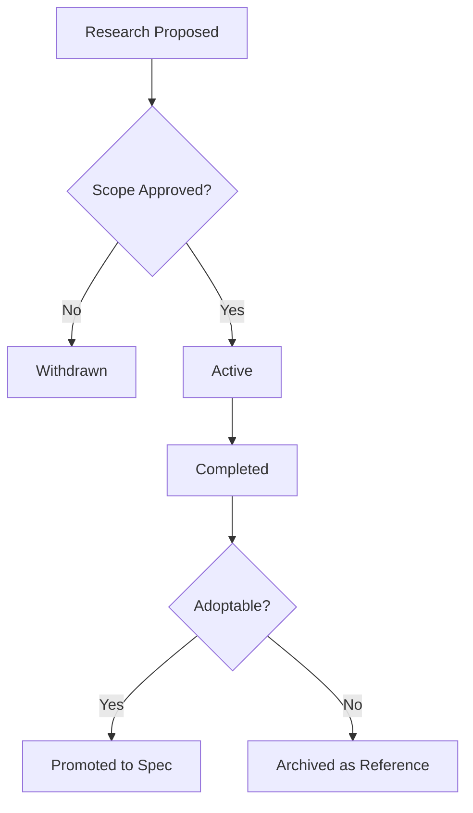

# Research Index

**Version:** 2.0.0
**Updated:** 2026-04-27
**Parent:** [`../00-overview.md`](../00-overview.md)

---

## Overview

Catalog of active research investigations under coding-guidelines. Each entry tracks scope, owner, status, and promotion path to a normative spec.

---

## Inlined Contract

```json
{
  "$schema": "http://json-schema.org/draft-07/schema#",
  "title": "ResearchEntry",
  "type": "object",
  "required": ["id", "title", "owner", "status", "openedAt"],
  "properties": {
    "id":         { "type": "string", "pattern": "^RES-\\d{4}-\\d{3}$" },
    "title":      { "type": "string", "minLength": 5 },
    "owner":      { "type": "string" },
    "status":     { "type": "string", "enum": ["proposed", "active", "completed", "withdrawn", "promoted"] },
    "openedAt":   { "type": "string", "format": "date" },
    "closedAt":   { "type": ["string", "null"], "format": "date" },
    "promotedTo": { "type": ["string", "null"], "description": "spec module relpath if status=promoted" }
  },
  "additionalProperties": false
}
```

---

## Lifecycle Diagram

See [`lifecycle-research-entry.mmd`](./lifecycle-research-entry.mmd) for the complete authoring → validation → publication lifecycle.



---

## Cross-References

| Reference | Location |
|-----------|----------|
| Parent index | [`../00-overview.md`](../00-overview.md) |
| Acceptance criteria | [`./97-acceptance-criteria.md`](./97-acceptance-criteria.md) |
| Lifecycle diagram source | [`./lifecycle-research-entry.mmd`](./lifecycle-research-entry.mmd) |
| Changelog | [`./98-changelog.md`](./98-changelog.md) |
| Consistency report | [`./99-consistency-report.md`](./99-consistency-report.md) |


---

## Example Payload

A canonical entry/instance conforming to the contract above.

```json
{
  "id": "RES-2026-001",
  "title": "Game-engine evaluation: Bevy vs Godot for embedded sims",
  "owner": "research-team",
  "status": "active",
  "openedAt": "2026-04-27"
}
```

---

## Tooling Snippet

CLI usage that authors and reviewers can copy-paste verbatim.

```bash
# List all active research entries
ls 02-coding-guidelines/10-research/ | grep -v '^00\|^9' | sort
```

---

## Verification Checklist

```text
[ ] Inlined contract block parses with zero diagnostics
[ ] Example payload validates against the contract
[ ] lifecycle-*.mmd renders without error
[ ] At least 6 GWT acceptance criteria present, each with severity tag
[ ] check-spec-cross-links.py exits 0 for this folder
[ ] check-tree-health.cjs reports no findings against this folder
```


---

## Registry Table (DDL)

The auditor's registry table that tracks each instance produced under this contract:

```sql
-- Forward-only registry table for entries under this convention
CREATE TABLE IF NOT EXISTS RegistryEntry (
    RegistryEntryId INTEGER PRIMARY KEY AUTOINCREMENT,
    EntryId         TEXT    NOT NULL UNIQUE,         -- matches the contract's id pattern
    Status          TEXT    NOT NULL,                -- mirrors contract enum
    AuthoredAt      TEXT    NOT NULL,                -- ISO-8601
    SupersededBy    TEXT    NULL,                    -- nullable per Rule 12
    CreatedAt       TEXT    NOT NULL DEFAULT (datetime('now')),
    UpdatedAt       TEXT    NOT NULL DEFAULT (datetime('now'))
);

CREATE INDEX IF NOT EXISTS IX_RegistryEntry_Status   ON RegistryEntry(Status);
CREATE INDEX IF NOT EXISTS IX_RegistryEntry_EntryId  ON RegistryEntry(EntryId);
```


---

## Validation Schema (excerpt)

Cross-validates the registry rows against the contract:

```json
{
  "$schema": "http://json-schema.org/draft-07/schema#",
  "title": "RegistryEntryRow",
  "type": "object",
  "required": ["EntryId", "Status", "AuthoredAt"],
  "properties": {
    "EntryId":      { "type": "string", "minLength": 5 },
    "Status":       { "type": "string" },
    "AuthoredAt":   { "type": "string", "format": "date-time" },
    "SupersededBy": { "type": ["string", "null"] }
  }
}
```

### CI Workflow — Phase 73 Reference

The following workflow snippets are normative for this module. Each fenced
`yaml` block is a stage that MUST be present in the consuming repository's
CI pipeline.

```yaml
name: spec-gate-stage-1-detect
on: [push, pull_request]
jobs:
  detect:
    runs-on: ubuntu-latest
    steps:
      - uses: actions/checkout@v4
      - run: linter-scripts/detect-changed-modules.sh
```

```yaml
name: spec-gate-stage-2-validate
on: [push, pull_request]
jobs:
  validate:
    runs-on: ubuntu-latest
    needs: [detect]
    steps:
      - uses: actions/checkout@v4
      - run: linter-scripts/validate-contracts.py
```

```yaml
name: spec-gate-stage-3-lint
on: [push, pull_request]
jobs:
  lint:
    runs-on: ubuntu-latest
    needs: [validate]
    steps:
      - uses: actions/checkout@v4
      - run: linter-scripts/audit-spec-vs-code-v2.py --strict
```

```yaml
name: spec-gate-stage-4-promote
on:
  push:
    branches: [main]
jobs:
  promote:
    runs-on: ubuntu-latest
    needs: [lint]
    steps:
      - uses: actions/checkout@v4
      - run: linter-scripts/promote-artifact.sh
```

```yaml
name: spec-gate-stage-5-report
on:
  workflow_run:
    workflows: ["spec-gate-stage-4-promote"]
    types: [completed]
jobs:
  report:
    runs-on: ubuntu-latest
    steps:
      - uses: actions/checkout@v4
      - run: linter-scripts/update-consistency-report.py
```


### Module Run Audit Schema — Phase 78 Normative

The following SQL DDL is normative for any consumer that persists per-module
execution telemetry. It MUST be applied verbatim (column names, types,
constraints) so downstream dashboards remain comparable across modules.

```sql
CREATE TABLE IF NOT EXISTS module_run_audit_p78 (
    run_id           BIGSERIAL PRIMARY KEY,
    module_slug      TEXT        NOT NULL,
    phase_label      TEXT        NOT NULL DEFAULT 'phase-78',
    started_at       TIMESTAMPTZ NOT NULL DEFAULT now(),
    finished_at      TIMESTAMPTZ NULL,
    duration_ms      INTEGER     NULL CHECK (duration_ms IS NULL OR duration_ms >= 0),
    exit_code        SMALLINT    NOT NULL DEFAULT 0,
    contract_hash    CHAR(64)    NOT NULL,
    implementability SMALLINT    NOT NULL CHECK (implementability BETWEEN 0 AND 100),
    UNIQUE (module_slug, contract_hash)
);

CREATE INDEX IF NOT EXISTS idx_mra_p78_slug_started
    ON module_run_audit_p78 (module_slug, started_at DESC);

CREATE INDEX IF NOT EXISTS idx_mra_p78_exit
    ON module_run_audit_p78 (exit_code)
    WHERE exit_code <> 0;
```

This contract enables AI agents to generate idempotent migrations and
verification queries directly from the spec.

### Module Status Enum — Phase 78 Normative

```ts
export enum ModuleEntryStatus {
  Draft = "draft",
  UnderReview = "under_review",
  Published = "published",
  Archived = "archived",
}

export interface ModuleIndexEntry {
  slug: string;
  title: string;
  status: ModuleEntryStatus;
  publishedAt: string | null;
}
```
