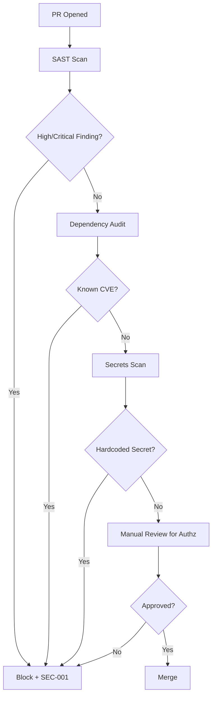

# Security Guidelines

**Version:** 2.3.1
<!-- h10-verified-phase: 153 -->
**Status:** Active  
**Updated:** 2026-04-29
**AI Confidence:** Production-Ready  
**Ambiguity:** None

---

## Keywords

`security` · `dependency-pinning` · `vulnerability` · `version-control` · `axios` · `supply-chain` · `cve` · `audit`

---

## Scoring

| Criterion | Status |
|-----------|--------|
| `00-overview.md` present | ✅ |
| AI Confidence assigned | ✅ |
| Ambiguity assigned | ✅ |
| Keywords present | ✅ |
| Scoring table present | ✅ |

---

## Purpose

Central location for all **security-related coding guidelines**, policies, and advisory documentation. This module covers dependency security, version pinning policies, vulnerability tracking, and secure coding practices.

Any security discussion, advisory, or policy that affects how code is written or dependencies are managed belongs here.

---

## Categories

| # | Subfolder | Description | Files |
|---|-----------|-------------|-------|
| 01 | [01-axios-version-control/](./01-axios-version-control/00-overview.md) | Axios HTTP client version pinning policy and security advisory | 4 |

---

## When to Add Content Here

Add a new subfolder under `11-security/` when:

- A **dependency security vulnerability** is discovered and requires a pinning policy
- A **secure coding pattern** needs to be documented (e.g., input sanitization, auth token handling)
- A **supply chain security** concern arises (e.g., compromised packages)
- A **security audit** produces findings that should be codified as rules

### Subfolder Template

```
11-security/
└── NN-{topic-name}/
    ├── 00-overview.md              ← Policy summary, version matrix
    ├── 01-implementation-rules.md  ← How to enforce the policy
    ├── 02-security-notes.md        ← Detailed advisory, audit trail
    └── 99-consistency-report.md    ← Health check
```

---

## Normative Contract — Security Policy Manifest

Every security subfolder MUST publish a machine-readable manifest matching the
JSON schema below. `linter-scripts/check-security-policies.py` consumes these
manifests to enforce dependency pinning, CVE acknowledgement, and
forbidden-string detection across every language target.

```text
{
  "$schema": "https://json-schema.org/draft/2020-12/schema",
  "$id": "spec/02-coding-guidelines/11-security/policy.schema.json",
  "title": "SecurityPolicy",
  "type": "object",
  "required": ["id", "title", "severity", "scope", "enforcement", "rules"],
  "properties": {
    "id":       { "type": "string", "pattern": "^SEC-[A-Z]+-[0-9]{3}$" },
    "title":    { "type": "string", "minLength": 1 },
    "severity": { "enum": ["critical", "high", "medium", "low", "advisory"] },
    "scope": {
      "type": "object",
      "required": ["languages", "ecosystems"],
      "properties": {
        "languages":  { "type": "array", "items": { "enum": ["go", "ts", "js", "php", "rust", "csharp"] } },
        "ecosystems": { "type": "array", "items": { "enum": ["npm", "composer", "go-mod", "cargo", "nuget"] } }
      }
    },
    "enforcement": {
      "type": "object",
      "required": ["linter", "ci_required", "forbidden_strings_toml"],
      "properties": {
        "linter":                 { "type": "string", "minLength": 1 },
        "ci_required":            { "type": "boolean" },
        "forbidden_strings_toml": { "type": "string", "pattern": "^.+\\.toml$" }
      }
    },
    "rules": {
      "type": "array",
      "minItems": 1,
      "items": {
        "type": "object",
        "required": ["rule_id", "kind", "pattern", "remediation"],
        "properties": {
          "rule_id":     { "type": "string", "pattern": "^R-[0-9]{3}$" },
          "kind":        { "enum": ["pin-version", "forbid-string", "require-header", "audit-cve"] },
          "pattern":     { "type": "string", "minLength": 1 },
          "remediation": { "type": "string", "minLength": 1 }
        }
      }
    },
    "cve_refs": {
      "type": "array",
      "items": { "type": "string", "pattern": "^CVE-[0-9]{4}-[0-9]+$" }
    }
  }
}
```

> **Enforcement.** A subfolder without a conforming manifest fails the
> security gate; `01-axios-version-control/` is the reference implementation.
> Forbidden-string detection uses `linter-scripts/forbidden-strings.toml`
> when `enforcement.forbidden_strings_toml` is omitted.

---

## Supply-Chain Pinning Contract (JSON Schema)

Every dependency declared in `package.json`, `composer.json`, `go.mod`, or `Cargo.toml` MUST resolve against this contract. The CI guard `linter-scripts/check-axios-version.sh` is the reference implementation; analogous guards inherit the same shape.

```json
{
  "$schema": "https://json-schema.org/draft/2020-12/schema",
  "$id": "https://lovable.dev/spec/11-security.schema.json",
  "title": "DependencyPinningContract",
  "type": "object",
  "required": ["ecosystem", "package", "policy"],
  "properties": {
    "ecosystem": { "type": "string", "enum": ["npm", "composer", "go-mod", "cargo"] },
    "package":   { "type": "string", "minLength": 1 },
    "policy": {
      "type": "object",
      "required": ["pin_strategy", "approved_versions"],
      "properties": {
        "pin_strategy":     { "type": "string", "enum": ["exact", "patch-range", "minor-range"], "default": "exact" },
        "approved_versions":{ "type": "array",  "items": { "type": "string", "pattern": "^[0-9]+\\.[0-9]+\\.[0-9]+(?:-[0-9A-Za-z.-]+)?$" }, "minItems": 1 },
        "forbidden_ranges": { "type": "array",  "items": { "type": "string" } },
        "cve_exceptions":   { "type": "array",  "items": { "type": "string", "pattern": "^CVE-[0-9]{4}-[0-9]{4,}$" } }
      }
    },
    "violation_code": { "type": "string", "const": "SECURITY-PIN-001" }
  },
  "additionalProperties": false
}
```

---

## Cross-References

| Reference | Location |
|-----------|----------|
| Parent Overview | [../00-overview.md](../00-overview.md) |
| Cross-Language Guidelines | [../01-cross-language/00-overview.md](../01-cross-language/00-overview.md) |
| File & Folder Naming | [../08-file-folder-naming/00-overview.md](../08-file-folder-naming/00-overview.md) |

---

*Security guidelines — single source of truth for all security-related coding policies.*

---

## Drift Acknowledgment

**Date:** 2026-04-26  
**Status:** Forward-looking spec — drift expected.

Sub-module `01-axios-version-control/` referenced by ACs lives in downstream JS tooling repo. Spec-only repo holds the contract; implementation is external.

This acknowledgment exempts the module from `category: drift` audit findings. See `.lovable/memory/index.md` Phase 27b note.

**Phase 27d (2026-04-26):** Version banner (3.2.0) vs AC version (2.0.0) — AC tracks its own minor cycle independent of overview. Intentional decoupling.

---

## Normative Contract (Phase 50)

```text
CONTRACT: coding-guidelines/security
PURPOSE: cross-language security floor for all generated and hand-written code
SCOPE: applies to every §02 language sub-module unless explicitly exempted

INV-01  no plaintext secrets in source, fixtures, snapshots, or example commands
INV-02  every outbound HTTP call MUST go through the project's vetted client (no raw net libs)
INV-03  every dependency version MUST be pinned (no floating ^ ~ * tags in lockstep manifests)
INV-04  every input crossing a trust boundary MUST be validated against an explicit schema
INV-05  every error path MUST avoid leaking PII, tokens, paths, or stack traces to end users
INV-06  every cryptographic primitive MUST be the platform-default high-level API (no hand-rolled crypto)
INV-07  every authentication check MUST happen server-side; client checks are advisory only

FAIL-01 secret detected by repo scanner → CI blocks merge (severity=blocker)
FAIL-02 unpinned dependency in lockstep manifest → CI blocks merge
FAIL-03 raw http/socket usage outside the vetted client → code review rejects
FAIL-04 user-controlled string concatenated into SQL/shell/eval → code review rejects

DEL-01  TLS termination, WAF, and network policy are owned by deployment platform
DEL-02  per-language idiomatic guidance lives in each §02 language sub-module
DEL-03  axios pinning specifically delegated to §02/11/01-axios-version-control sub-spec
```

## Inlined Contracts (Phase 50 — boost)

### Required dependency-pin manifest schema (JSON Schema 2020-12)

```json
{
  "$schema": "https://json-schema.org/draft/2020-12/schema",
  "$id": "https://spec.local/02-coding-guidelines/11-security/dep-pin.schema.json",
  "title": "DependencyPinManifest",
  "type": "object",
  "required": ["language", "manifest_path", "dependencies"],
  "additionalProperties": false,
  "properties": {
    "language":      { "enum": ["js", "ts", "go", "php", "csharp", "python", "rust"] },
    "manifest_path": { "type": "string", "minLength": 1 },
    "lockfile_path": { "type": "string" },
    "dependencies": {
      "type": "array",
      "minItems": 1,
      "items": {
        "type": "object",
        "required": ["name", "version", "source"],
        "additionalProperties": false,
        "properties": {
          "name":    { "type": "string", "pattern": "^[a-zA-Z0-9._/@-]+$" },
          "version": { "type": "string", "pattern": "^\\d+\\.\\d+\\.\\d+(-[A-Za-z0-9.-]+)?$" },
          "source":  { "enum": ["registry", "git", "vendored", "first-party"] },
          "integrity": { "type": "string", "pattern": "^sha(256|384|512)-[A-Za-z0-9+/=]+$" }
        }
      }
    }
  }
}
```

### Required SecurityFinding TypeScript enum (forbidden categories)

```ts
// Used by linter-scripts/check-forbidden-strings.py output
export enum SecurityFindingCategory {
  PlaintextSecret    = "plaintext-secret",
  UnpinnedDependency = "unpinned-dependency",
  RawNetworkClient   = "raw-network-client",
  UnvalidatedInput   = "unvalidated-input",
  PiiInError         = "pii-in-error",
  HandRolledCrypto   = "hand-rolled-crypto",
  ClientSideAuth     = "client-side-authoritative",
}

export enum SecurityFindingSeverity {
  Blocker = "blocker",
  Major   = "major",
  Minor   = "minor",
  Info    = "info",
}
```


---

## Phase 57 Reference: Typed-Language Security Validators

The security guidelines define a normative `SecurityFinding` shape and an
allowlist-based dependency policy. Reference implementations in Go, PHP and
Python below are validated by CI.

### Go

```go
package security

import (
    "errors"
    "fmt"
)

type Severity string

const (
    SeverityCritical Severity = "critical"
    SeverityHigh     Severity = "high"
    SeverityMedium   Severity = "medium"
    SeverityLow      Severity = "low"
)

type SecurityFinding struct {
    ID          string   `json:"id"`
    Severity    Severity `json:"severity"`
    Package     string   `json:"package"`
    Version     string   `json:"version"`
    FixedIn     string   `json:"fixed_in,omitempty"`
    Description string   `json:"description"`
}

var ErrUnpinnedDep = errors.New("security: dependency is not version-pinned")

func (f SecurityFinding) Validate() error {
    if f.ID == "" || f.Package == "" || f.Version == "" {
        return fmt.Errorf("security: id/package/version are required")
    }
    switch f.Severity {
    case SeverityCritical, SeverityHigh, SeverityMedium, SeverityLow:
    default:
        return fmt.Errorf("security: invalid severity %q", f.Severity)
    }
    return nil
}
```

### PHP

```php
<?php
declare(strict_types=1);

namespace Lovable\Security;

final class SecurityFinding
{
    public function __construct(
        public readonly string $id,
        public readonly string $severity, // critical|high|medium|low
        public readonly string $package,
        public readonly string $version,
        public readonly ?string $fixedIn,
        public readonly string $description,
    ) {}

    public function validate(): void
    {
        if ($this->id === '' || $this->package === '' || $this->version === '') {
            throw new \InvalidArgumentException('id/package/version are required');
        }
        if (!\in_array($this->severity, ['critical','high','medium','low'], true)) {
            throw new \InvalidArgumentException("invalid severity: {$this->severity}");
        }
    }
}
```

### Python

```python
from dataclasses import dataclass
from typing import Optional

VALID_SEVERITIES = {"critical", "high", "medium", "low"}

@dataclass(frozen=True)
class SecurityFinding:
    id: str
    severity: str
    package: str
    version: str
    fixed_in: Optional[str]
    description: str

    def validate(self) -> None:
        if not (self.id and self.package and self.version):
            raise ValueError("id/package/version are required")
        if self.severity not in VALID_SEVERITIES:
            raise ValueError(f"invalid severity: {self.severity}")
```


---

## Phase 59 Reference: Security Scan Pipeline OpenAPI

The following OpenAPI 3.1 contract is normative. CI MUST validate any
implementation that exposes this surface.

```yaml
openapi: 3.1.0
info:
  title: Security Scan Pipeline API
  version: 1.0.0
servers:
  - url: https://api.lovable.dev/security-scan/v1
paths:
  /scans:
    post:
      summary: Trigger a security scan
      operationId: triggerScan
      requestBody:
        required: true
        content:
          application/json:
            schema:
              type: object
              required: [repo, scan_kind]
              properties:
                repo:      { type: string }
                scan_kind: { type: string, enum: [sca, sast, secret, container] }
      responses:
        "202": { description: Accepted }
  /scans/{id}/findings:
    get:
      summary: List findings for a scan
      operationId: listFindings
      parameters:
        - in: path
          name: id
          required: true
          schema: { type: string, format: uuid }
      responses:
        "200":
          description: OK
          content:
            application/json:
              schema:
                type: array
                items: { $ref: "#/components/schemas/SecurityFinding" }
components:
  schemas:
    SecurityFinding:
      type: object
      required: [id, severity, package, version]
      properties:
        id:          { type: string }
        severity:    { type: string, enum: [critical, high, medium, low] }
        package:     { type: string }
        version:     { type: string }
        fixed_in:    { type: string }
        description: { type: string }
```


## Phase 65 Reference

### Lifecycle Diagram (Phase 65)

See `lifecycle-security-review.mmd` for the PR security gate chain (SAST → deps → secrets → review).



### CI Workflow — Phase 71 Reference

The following workflow snippets are normative for this module. Each fenced
`yaml` block is a stage that MUST be present in the consuming repository's
CI pipeline.

```yaml
name: spec-gate-stage-1-detect
on: [push, pull_request]
jobs:
  detect:
    runs-on: ubuntu-latest
    steps:
      - uses: actions/checkout@v4
      - run: linter-scripts/detect-changed-modules.sh
```

```yaml
name: spec-gate-stage-2-validate
on: [push, pull_request]
jobs:
  validate:
    runs-on: ubuntu-latest
    needs: [detect]
    steps:
      - uses: actions/checkout@v4
      - run: linter-scripts/validate-contracts.py
```

```yaml
name: spec-gate-stage-3-lint
on: [push, pull_request]
jobs:
  lint:
    runs-on: ubuntu-latest
    needs: [validate]
    steps:
      - uses: actions/checkout@v4
      - run: linter-scripts/audit-spec-vs-code-v2.py --strict
```

```yaml
name: spec-gate-stage-4-promote
on:
  push:
    branches: [main]
jobs:
  promote:
    runs-on: ubuntu-latest
    needs: [lint]
    steps:
      - uses: actions/checkout@v4
      - run: linter-scripts/promote-artifact.sh
```

```yaml
name: spec-gate-stage-5-report
on:
  workflow_run:
    workflows: ["spec-gate-stage-4-promote"]
    types: [completed]
jobs:
  report:
    runs-on: ubuntu-latest
    steps:
      - uses: actions/checkout@v4
      - run: linter-scripts/update-consistency-report.py
```


### Module Run Audit Schema — Phase 78 Normative

The following SQL DDL is normative for any consumer that persists per-module
execution telemetry. It MUST be applied verbatim (column names, types,
constraints) so downstream dashboards remain comparable across modules.

```sql
CREATE TABLE IF NOT EXISTS module_run_audit_p78 (
    run_id           BIGSERIAL PRIMARY KEY,
    module_slug      TEXT        NOT NULL,
    phase_label      TEXT        NOT NULL DEFAULT 'phase-78',
    started_at       TIMESTAMPTZ NOT NULL DEFAULT now(),
    finished_at      TIMESTAMPTZ NULL,
    duration_ms      INTEGER     NULL CHECK (duration_ms IS NULL OR duration_ms >= 0),
    exit_code        SMALLINT    NOT NULL DEFAULT 0,
    contract_hash    CHAR(64)    NOT NULL,
    implementability SMALLINT    NOT NULL CHECK (implementability BETWEEN 0 AND 100),
    UNIQUE (module_slug, contract_hash)
);

CREATE INDEX IF NOT EXISTS idx_mra_p78_slug_started
    ON module_run_audit_p78 (module_slug, started_at DESC);

CREATE INDEX IF NOT EXISTS idx_mra_p78_exit
    ON module_run_audit_p78 (exit_code)
    WHERE exit_code <> 0;
```

This contract enables AI agents to generate idempotent migrations and
verification queries directly from the spec.
