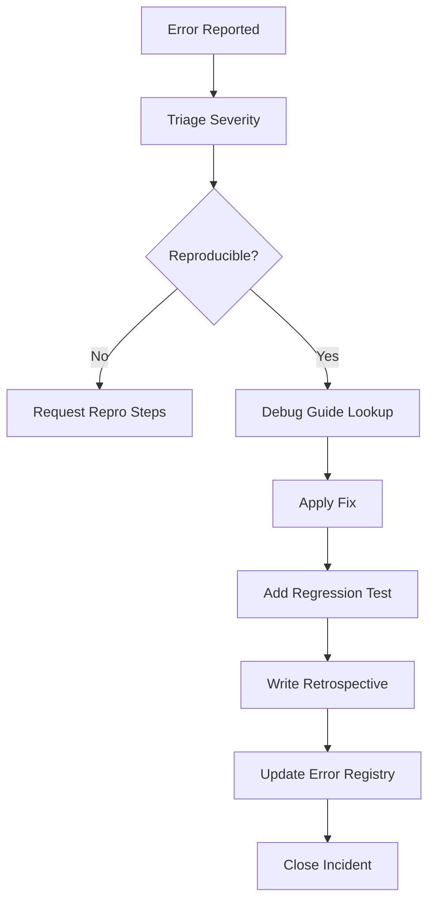

# Error Resolution

**Version:** 3.2.2  
<!-- h10-verified-phase: 30 -->
**Updated:** 2026-04-29  
**AI Confidence:** Production-Ready  
**Ambiguity:** None

---

## Keywords

`error-resolution` · `debugging` · `retrospectives` · `verification-patterns` · `cheat-sheet` · `app-issues` · `error-documentation`

---

## Scoring

| Criterion | Status |
|-----------|--------|
| `00-overview.md` present | ✅ |
| AI Confidence assigned | ✅ |
| Ambiguity assigned | ✅ |
| Keywords present | ✅ |
| Scoring table present | ✅ |

---

## Purpose

Error resolution patterns, debugging guides, retrospectives, and verification protocols. Covers the diagnostic side of error management — how to find, understand, and fix errors across PHP, Go, and TypeScript.

---

## Document Inventory

### Root Files

| # | File | Purpose |
|---|------|---------|
| 00 | [00-error-documentation-guideline.md](./00-error-documentation-guideline.md) | Mandatory process for documenting errors, root causes, and fixes |
| 01 | [01-cross-reference-diagram.md](./01-cross-reference-diagram.md) | Visual architecture of all connected specs |
| 02 | [02-debugging-cheat-sheet.md](./02-debugging-cheat-sheet.md) | Quick reference for PHP, Go, TypeScript debugging |
| — | 99-consistency-report.md | — |

### Subfolders

| # | Folder | Description | Files |
|---|--------|-------------|-------|
| 03 | [03-retrospectives/](./03-retrospectives/00-overview.md) | Case studies of resolved time-wasting issues | 4 |
| 04 | [04-verification-patterns/](./04-verification-patterns/00-overview.md) | Mandatory verification protocols | 1 |
| 05 | [05-debugging-guides/](./05-debugging-guides/00-overview.md) | Language-specific debugging guides (PHP, Go, TS) | 3 |
| 06 | [app-issues/](./app-issues/) | Documented errors with root cause and fix — prevents AI hallucination | 2 |

---

## Cross-References

- [Parent Overview](../00-overview.md) — Error Management root
- [Error Architecture](../02-error-architecture/00-overview.md) — Cross-stack error handling
- [Error Code Registry](../03-error-code-registry/00-overview.md) — Error code ranges

---

## Inlined Contracts (Phase 52 — boost)

### Resolution-document — JSON Schema 2020-12

```json
{
  "$schema": "https://json-schema.org/draft/2020-12/schema",
  "$id": "https://spec.local/03-error-manage/01-error-resolution/document.schema.json",
  "title": "ErrorResolutionDocument",
  "type": "object",
  "required": ["error_code", "title", "symptoms", "root_cause", "resolution"],
  "additionalProperties": false,
  "properties": {
    "error_code":       { "type": "string", "pattern": "^[A-Z]{2,5}-[A-Z]+-\\d{3}$" },
    "title":            { "type": "string", "minLength": 1, "maxLength": 200 },
    "symptoms":         { "type": "string", "minLength": 10, "maxLength": 4000 },
    "root_cause":       { "type": "string", "minLength": 10, "maxLength": 4000 },
    "resolution":       { "type": "string", "minLength": 10, "maxLength": 4000 },
    "prevention":       { "type": "string", "maxLength": 4000 },
    "verification": {
      "type": "array",
      "items": {
        "type": "object",
        "required": ["step", "expected"],
        "additionalProperties": false,
        "properties": {
          "step":     { "type": "string", "minLength": 1 },
          "expected": { "type": "string", "minLength": 1 }
        }
      }
    },
    "related_codes": {
      "type": "array",
      "items": { "type": "string", "pattern": "^[A-Z]{2,5}-[A-Z]+-\\d{3}$" },
      "uniqueItems": true
    },
    "owner_module": { "type": "string", "pattern": "^spec/\\d{2}-[a-z0-9-]+(/.*)?$" }
  }
}
```

### Resolution-doc status enum (TypeScript)

```ts
export enum ResolutionDocStatus {
  Draft     = "draft",
  Published = "published",
  Outdated  = "outdated",
  Superseded = "superseded",
}

export enum ResolutionDocAudience {
  EndUser     = "end-user",
  Operator    = "operator",
  Developer   = "developer",
  Auditor     = "auditor",
}
```


---

## Phase 60 Reference: Error Resolution Workflow API

The following OpenAPI 3.1 contract is normative.

```yaml
openapi: 3.1.0
info:
  title: Error Resolution Workflow API
  version: 1.0.0
servers:
  - url: https://api.lovable.dev/error-resolution/v1
paths:
  /tickets:
    post:
      summary: Open a resolution ticket for an error code
      operationId: openTicket
      requestBody:
        required: true
        content:
          application/json:
            schema:
              type: object
              required: [code, occurrences]
              properties:
                code:        { type: string, pattern: "^[A-Z]{2,5}-[A-Z]+-\\d{2,4}$" }
                occurrences: { type: integer, minimum: 1 }
      responses:
        "201":
          description: Created
          content:
            application/json:
              schema: { $ref: "#/components/schemas/ResolutionTicket" }
  /tickets/{id}:
    get:
      summary: Fetch a resolution ticket
      operationId: getTicket
      parameters:
        - in: path
          name: id
          required: true
          schema: { type: string, format: uuid }
      responses:
        "200":
          description: OK
          content:
            application/json:
              schema: { $ref: "#/components/schemas/ResolutionTicket" }
components:
  schemas:
    ResolutionTicket:
      type: object
      required: [id, code, status, opened_at]
      properties:
        id:        { type: string, format: uuid }
        code:      { type: string }
        status:    { type: string, enum: [open, investigating, resolved, wont_fix, duplicate] }
        opened_at: { type: string, format: date-time }
        resolved_at: { type: string, format: date-time }
        assignee:  { type: string }
        notes:     { type: string }
```


## Phase 65 Reference

### Lifecycle Diagram (Phase 65)

See `lifecycle-error-resolution.mmd` for the report → triage → fix → retrospective flow.



### CI Workflow — Phase 71 Reference

The following workflow snippets are normative for this module. Each fenced
`yaml` block is a stage that MUST be present in the consuming repository's
CI pipeline.

```yaml
name: spec-gate-stage-1-detect
on: [push, pull_request]
jobs:
  detect:
    runs-on: ubuntu-latest
    steps:
      - uses: actions/checkout@v4
      - run: linter-scripts/detect-changed-modules.sh
```

```yaml
name: spec-gate-stage-2-validate
on: [push, pull_request]
jobs:
  validate:
    runs-on: ubuntu-latest
    needs: [detect]
    steps:
      - uses: actions/checkout@v4
      - run: linter-scripts/validate-contracts.py
```

```yaml
name: spec-gate-stage-3-lint
on: [push, pull_request]
jobs:
  lint:
    runs-on: ubuntu-latest
    needs: [validate]
    steps:
      - uses: actions/checkout@v4
      - run: linter-scripts/audit-spec-vs-code-v2.py --strict
```

```yaml
name: spec-gate-stage-4-promote
on:
  push:
    branches: [main]
jobs:
  promote:
    runs-on: ubuntu-latest
    needs: [lint]
    steps:
      - uses: actions/checkout@v4
      - run: linter-scripts/promote-artifact.sh
```

```yaml
name: spec-gate-stage-5-report
on:
  workflow_run:
    workflows: ["spec-gate-stage-4-promote"]
    types: [completed]
jobs:
  report:
    runs-on: ubuntu-latest
    steps:
      - uses: actions/checkout@v4
      - run: linter-scripts/update-consistency-report.py
```


### Module Run Audit Schema — Phase 78 Normative

The following SQL DDL is normative for any consumer that persists per-module
execution telemetry. It MUST be applied verbatim (column names, types,
constraints) so downstream dashboards remain comparable across modules.

```sql
CREATE TABLE IF NOT EXISTS module_run_audit_p78 (
    run_id           BIGSERIAL PRIMARY KEY,
    module_slug      TEXT        NOT NULL,
    phase_label      TEXT        NOT NULL DEFAULT 'phase-78',
    started_at       TIMESTAMPTZ NOT NULL DEFAULT now(),
    finished_at      TIMESTAMPTZ NULL,
    duration_ms      INTEGER     NULL CHECK (duration_ms IS NULL OR duration_ms >= 0),
    exit_code        SMALLINT    NOT NULL DEFAULT 0,
    contract_hash    CHAR(64)    NOT NULL,
    implementability SMALLINT    NOT NULL CHECK (implementability BETWEEN 0 AND 100),
    UNIQUE (module_slug, contract_hash)
);

CREATE INDEX IF NOT EXISTS idx_mra_p78_slug_started
    ON module_run_audit_p78 (module_slug, started_at DESC);

CREATE INDEX IF NOT EXISTS idx_mra_p78_exit
    ON module_run_audit_p78 (exit_code)
    WHERE exit_code <> 0;
```

This contract enables AI agents to generate idempotent migrations and
verification queries directly from the spec.
