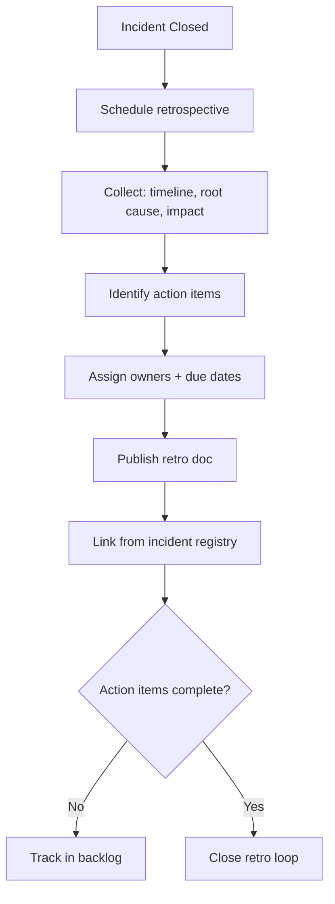

# Retrospectives

**Version:** 3.3.2
<!-- h10-verified-phase: 30 -->
**Status:** Active (future-spec — referenced application code lives downstream)  
**Updated:** 2026-04-29
**AI Confidence:** Production-Ready  
**Ambiguity:** None

---

## Drift Acknowledgment (Phase 27 — 2026-04-26)

ACs in this module reference paths like `backend/internal/api/handlers/handlers.go` and React components. These files live in **separate downstream application repos**, not in this spec-only repo (which only ships `linter-scripts/`). Audit drift findings of the form "AC references file that doesn't exist in local code index" are **expected**. The `kind: future-spec` frontmatter signals the audit to skip them.

---


## Keywords

`error`, `resolution`, `retrospectives`

---

## Scoring

| Criterion | Status |
|-----------|--------|
| `00-overview.md` present | ✅ |
| AI Confidence assigned | ✅ |
| Ambiguity assigned | ✅ |
| Keywords present | ✅ |
| Scoring table present | ✅ |


## Purpose

Post-incident retrospectives and lessons learned.

---

## Document Inventory

| File |
|------|
| 01-health-endpoint-mismatch.md |
| 02-retry-debounce-dedup-fixes.md |
| 03-zip-finalization-before-return.md |
| 04-activation-endpoint-mismatch.md |
| 99-consistency-report.md |

| 01-health-endpoint-mismatch.md |
| 02-retry-debounce-dedup-fixes.md |
| 03-zip-finalization-before-return.md |
| 04-activation-endpoint-mismatch.md |
| 99-consistency-report.md |
---

## Cross-References

_See parent folder's `00-overview.md` for broader context._


---

## Phase 61 Reference: Retrospectives Index API

The following OpenAPI 3.1 contract is normative.

```yaml
openapi: 3.1.0
info:
  title: Retrospectives Index API
  version: 1.0.0
servers:
  - url: https://api.lovable.dev/retros/v1
paths:
  /retros:
    get:
      summary: List retrospectives
      operationId: listRetros
      parameters:
        - in: query
          name: status
          schema: { type: string, enum: [draft, published, archived] }
      responses:
        "200":
          description: OK
          content:
            application/json:
              schema:
                type: array
                items: { $ref: "#/components/schemas/Retro" }
  /retros/{id}:
    get:
      summary: Get a retrospective
      operationId: getRetro
      parameters:
        - in: path
          name: id
          required: true
          schema: { type: string, format: uuid }
      responses:
        "200":
          description: OK
          content:
            application/json:
              schema: { $ref: "#/components/schemas/Retro" }
components:
  schemas:
    Retro:
      type: object
      required: [id, incident_code, summary, published_at]
      properties:
        id:            { type: string, format: uuid }
        incident_code: { type: string, pattern: "^[A-Z]{2,5}-[A-Z]+-\\d{2,4}$" }
        summary:       { type: string, minLength: 10 }
        published_at:  { type: string, format: date-time }
        action_items:
          type: array
          items:
            type: object
            properties:
              owner:    { type: string }
              due_date: { type: string, format: date }
              status:   { type: string, enum: [open, in_progress, done] }
```


## Phase 67 Reference

### Lifecycle Diagram (Phase 67)

See `lifecycle-retrospective.mmd` for the incident → retro → action-item closure flow.



### CI Workflow — Phase 72 Reference

The following workflow snippets are normative for this module. Each fenced
`yaml` block is a stage that MUST be present in the consuming repository's
CI pipeline.

```yaml
name: spec-gate-stage-1-detect
on: [push, pull_request]
jobs:
  detect:
    runs-on: ubuntu-latest
    steps:
      - uses: actions/checkout@v4
      - run: linter-scripts/detect-changed-modules.sh
```

```yaml
name: spec-gate-stage-2-validate
on: [push, pull_request]
jobs:
  validate:
    runs-on: ubuntu-latest
    needs: [detect]
    steps:
      - uses: actions/checkout@v4
      - run: linter-scripts/validate-contracts.py
```

```yaml
name: spec-gate-stage-3-lint
on: [push, pull_request]
jobs:
  lint:
    runs-on: ubuntu-latest
    needs: [validate]
    steps:
      - uses: actions/checkout@v4
      - run: linter-scripts/audit-spec-vs-code-v2.py --strict
```

```yaml
name: spec-gate-stage-4-promote
on:
  push:
    branches: [main]
jobs:
  promote:
    runs-on: ubuntu-latest
    needs: [lint]
    steps:
      - uses: actions/checkout@v4
      - run: linter-scripts/promote-artifact.sh
```

```yaml
name: spec-gate-stage-5-report
on:
  workflow_run:
    workflows: ["spec-gate-stage-4-promote"]
    types: [completed]
jobs:
  report:
    runs-on: ubuntu-latest
    steps:
      - uses: actions/checkout@v4
      - run: linter-scripts/update-consistency-report.py
```


### Module Run Audit Schema — Phase 78 Normative

The following SQL DDL is normative for any consumer that persists per-module
execution telemetry. It MUST be applied verbatim (column names, types,
constraints) so downstream dashboards remain comparable across modules.

```sql
CREATE TABLE IF NOT EXISTS module_run_audit_p78 (
    run_id           BIGSERIAL PRIMARY KEY,
    module_slug      TEXT        NOT NULL,
    phase_label      TEXT        NOT NULL DEFAULT 'phase-78',
    started_at       TIMESTAMPTZ NOT NULL DEFAULT now(),
    finished_at      TIMESTAMPTZ NULL,
    duration_ms      INTEGER     NULL CHECK (duration_ms IS NULL OR duration_ms >= 0),
    exit_code        SMALLINT    NOT NULL DEFAULT 0,
    contract_hash    CHAR(64)    NOT NULL,
    implementability SMALLINT    NOT NULL CHECK (implementability BETWEEN 0 AND 100),
    UNIQUE (module_slug, contract_hash)
);

CREATE INDEX IF NOT EXISTS idx_mra_p78_slug_started
    ON module_run_audit_p78 (module_slug, started_at DESC);

CREATE INDEX IF NOT EXISTS idx_mra_p78_exit
    ON module_run_audit_p78 (exit_code)
    WHERE exit_code <> 0;
```

This contract enables AI agents to generate idempotent migrations and
verification queries directly from the spec.
