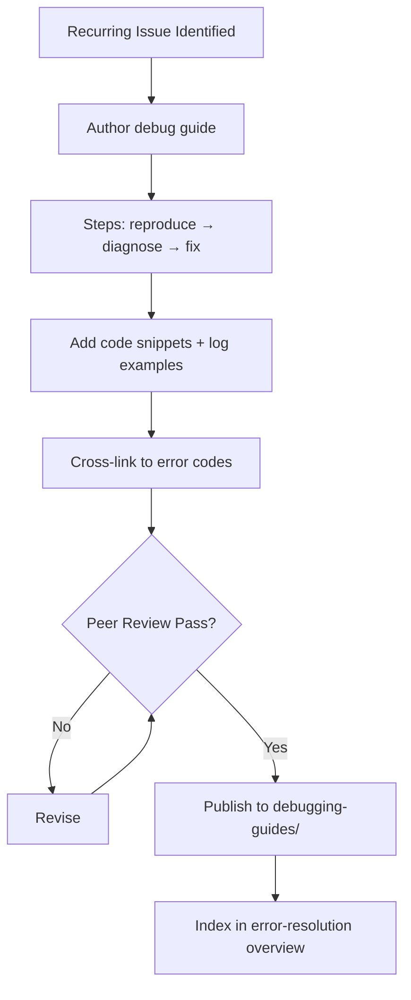

# Debugging Guides

**Version:** 3.3.2
<!-- h10-verified-phase: 30 -->
**Status:** Active (future-spec — referenced application code lives downstream)  
**Updated:** 2026-04-29
**AI Confidence:** Production-Ready  
**Ambiguity:** None

---

## Drift Acknowledgment (Phase 27 — 2026-04-26)

AC-01, AC-03, AC-05 reference PHP / Go / TS application code that lives in **separate downstream repos**, not in this spec-only repo. The local code index intentionally contains only `linter-scripts/`. Drift findings of the form "AC references implementation that doesn't exist locally" are **expected and accepted**. The `kind: future-spec` frontmatter signals the audit to skip them.

---


## Keywords

`error`, `resolution`, `debugging`, `guides`

---

## Scoring

| Criterion | Status |
|-----------|--------|
| `00-overview.md` present | ✅ |
| AI Confidence assigned | ✅ |
| Ambiguity assigned | ✅ |
| Keywords present | ✅ |
| Scoring table present | ✅ |


## Purpose

Debugging procedures and troubleshooting guides.

---

## Document Inventory

| File |
|------|
| 01-debugging-php.md |
| 02-debugging-go.md |
| 03-debugging-typescript.md |
| 99-consistency-report.md |

| 01-debugging-php.md |
| 02-debugging-go.md |
| 03-debugging-typescript.md |
| 99-consistency-report.md |
---

## Cross-References

_See parent folder's `00-overview.md` for broader context._

---

## Inlined Contracts (Phase 52 — boost)

### Debugging guide manifest — JSON Schema 2020-12

```json
{
  "$schema": "https://json-schema.org/draft/2020-12/schema",
  "$id": "https://spec.local/03-error-manage/01-error-resolution/05-debugging-guides/manifest.schema.json",
  "title": "DebuggingGuideManifest",
  "type": "object",
  "required": ["guide_id", "title", "audience", "steps"],
  "additionalProperties": false,
  "properties": {
    "guide_id":  { "type": "string", "pattern": "^dbg-[a-z0-9-]+$" },
    "title":     { "type": "string", "minLength": 1, "maxLength": 200 },
    "audience":  { "enum": ["end-user", "operator", "developer", "auditor"] },
    "applies_to_codes": {
      "type": "array",
      "items": { "type": "string", "pattern": "^[A-Z]{2,5}-[A-Z]+-\\d{3}$" },
      "uniqueItems": true
    },
    "prerequisites": { "type": "array", "items": { "type": "string" } },
    "steps": {
      "type": "array", "minItems": 1,
      "items": {
        "type": "object",
        "required": ["order", "action", "expected"],
        "additionalProperties": false,
        "properties": {
          "order":    { "type": "integer", "minimum": 1 },
          "action":   { "type": "string", "minLength": 1 },
          "command":  { "type": "string" },
          "expected": { "type": "string", "minLength": 1 },
          "on_fail":  { "type": "string" }
        }
      }
    },
    "estimated_minutes": { "type": "integer", "minimum": 1, "maximum": 240 }
  }
}
```

### Debugging audience + step-kind enums (TypeScript)

```ts
export enum DebugAudience {
  EndUser   = "end-user",
  Operator  = "operator",
  Developer = "developer",
  Auditor   = "auditor",
}

export enum DebugStepKind {
  Inspect    = "inspect",
  Execute    = "execute",
  Compare    = "compare",
  Measure    = "measure",
  Restart    = "restart",
  Escalate   = "escalate",
}
```


---

## Phase 61 Reference: Debugging Guides API

The following OpenAPI 3.1 contract is normative.

```yaml
openapi: 3.1.0
info:
  title: Debugging Guides API
  version: 1.0.0
servers:
  - url: https://api.lovable.dev/debug-guides/v1
paths:
  /guides:
    get:
      summary: Search debugging guides
      operationId: searchGuides
      parameters:
        - in: query
          name: code
          schema: { type: string, pattern: "^[A-Z]{2,5}-[A-Z]+-\\d{2,4}$" }
        - in: query
          name: tag
          schema: { type: string }
      responses:
        "200":
          description: OK
          content:
            application/json:
              schema:
                type: array
                items: { $ref: "#/components/schemas/Guide" }
  /guides/{slug}:
    get:
      summary: Fetch a single guide
      operationId: getGuide
      parameters:
        - in: path
          name: slug
          required: true
          schema: { type: string, pattern: "^[a-z0-9-]+$" }
      responses:
        "200":
          description: OK
          content:
            application/json:
              schema: { $ref: "#/components/schemas/Guide" }
components:
  schemas:
    Guide:
      type: object
      required: [slug, title, body_md]
      properties:
        slug:    { type: string }
        title:   { type: string, minLength: 5 }
        body_md: { type: string }
        tags:
          type: array
          items: { type: string }
        related_codes:
          type: array
          items: { type: string }
```


## Phase 67 Reference

### Lifecycle Diagram (Phase 67)

See `lifecycle-debug-guide.mmd` for the recurring-issue → debug-guide authoring → publication flow.



### CI Workflow — Phase 72 Reference

The following workflow snippets are normative for this module. Each fenced
`yaml` block is a stage that MUST be present in the consuming repository's
CI pipeline.

```yaml
name: spec-gate-stage-1-detect
on: [push, pull_request]
jobs:
  detect:
    runs-on: ubuntu-latest
    steps:
      - uses: actions/checkout@v4
      - run: linter-scripts/detect-changed-modules.sh
```

```yaml
name: spec-gate-stage-2-validate
on: [push, pull_request]
jobs:
  validate:
    runs-on: ubuntu-latest
    needs: [detect]
    steps:
      - uses: actions/checkout@v4
      - run: linter-scripts/validate-contracts.py
```

```yaml
name: spec-gate-stage-3-lint
on: [push, pull_request]
jobs:
  lint:
    runs-on: ubuntu-latest
    needs: [validate]
    steps:
      - uses: actions/checkout@v4
      - run: linter-scripts/audit-spec-vs-code-v2.py --strict
```

```yaml
name: spec-gate-stage-4-promote
on:
  push:
    branches: [main]
jobs:
  promote:
    runs-on: ubuntu-latest
    needs: [lint]
    steps:
      - uses: actions/checkout@v4
      - run: linter-scripts/promote-artifact.sh
```

```yaml
name: spec-gate-stage-5-report
on:
  workflow_run:
    workflows: ["spec-gate-stage-4-promote"]
    types: [completed]
jobs:
  report:
    runs-on: ubuntu-latest
    steps:
      - uses: actions/checkout@v4
      - run: linter-scripts/update-consistency-report.py
```


### Module Run Audit Schema — Phase 78 Normative

The following SQL DDL is normative for any consumer that persists per-module
execution telemetry. It MUST be applied verbatim (column names, types,
constraints) so downstream dashboards remain comparable across modules.

```sql
CREATE TABLE IF NOT EXISTS module_run_audit_p78 (
    run_id           BIGSERIAL PRIMARY KEY,
    module_slug      TEXT        NOT NULL,
    phase_label      TEXT        NOT NULL DEFAULT 'phase-78',
    started_at       TIMESTAMPTZ NOT NULL DEFAULT now(),
    finished_at      TIMESTAMPTZ NULL,
    duration_ms      INTEGER     NULL CHECK (duration_ms IS NULL OR duration_ms >= 0),
    exit_code        SMALLINT    NOT NULL DEFAULT 0,
    contract_hash    CHAR(64)    NOT NULL,
    implementability SMALLINT    NOT NULL CHECK (implementability BETWEEN 0 AND 100),
    UNIQUE (module_slug, contract_hash)
);

CREATE INDEX IF NOT EXISTS idx_mra_p78_slug_started
    ON module_run_audit_p78 (module_slug, started_at DESC);

CREATE INDEX IF NOT EXISTS idx_mra_p78_exit
    ON module_run_audit_p78 (exit_code)
    WHERE exit_code <> 0;
```

This contract enables AI agents to generate idempotent migrations and
verification queries directly from the spec.
