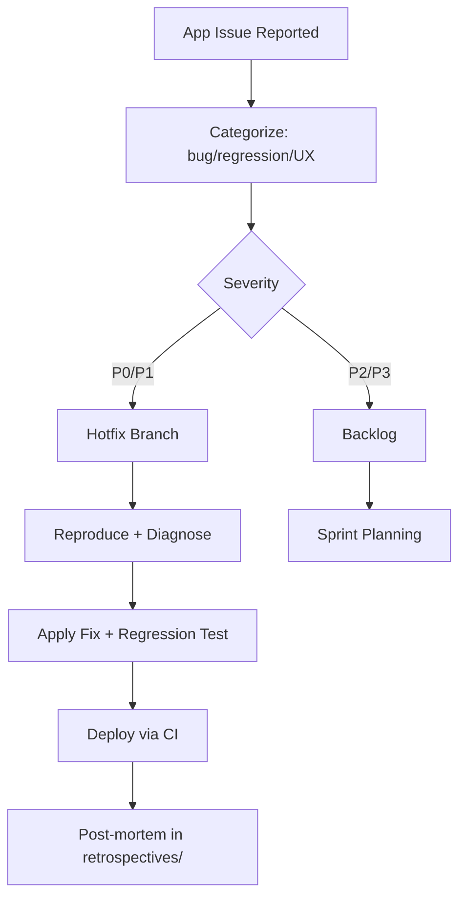

# App Issues

**Version:** 3.3.2
<!-- h10-verified-phase: 29 -->
**Updated:** 2026-04-29
**AI Confidence:** Production-Ready  
**Ambiguity:** None

---

## Keywords

`app-issues`, `error-documentation`, `root-cause`, `prevention`, `code-red`

---

## Scoring

| Criterion | Status |
|-----------|--------|
| `00-overview.md` present | ✅ |
| AI Confidence assigned | ✅ |
| Ambiguity assigned | ✅ |
| Keywords present | ✅ |
| Scoring table present | ✅ |

---

## Purpose

Documented application errors with root cause analysis, solutions, and prevention steps. Each entry follows the [Error Documentation Guideline](../00-error-documentation-guideline.md) to prevent AI hallucination on previously solved problems.

---

## Document Inventory

| File | Purpose |
|------|---------|
| [2026-04-02-url-error-casing-fix.md](./2026-04-02-url-error-casing-fix.md) | URLError renamed to UrlError — inconsistent casing fix |
| [error-management-file-path-and-missing-file-code-red-rule.md](./error-management-file-path-and-missing-file-code-red-rule.md) | 🔴 Code Red: Mandatory file path and failure reason in all file/path error logs |

---

## Cross-References

- [Error Documentation Guideline](../00-error-documentation-guideline.md) — Mandatory documentation process
- [Error Resolution Overview](../00-overview.md) — Parent folder

---

*App issues overview — created: 2026-04-07*

---

## Inlined Contracts (Phase 51 — boost)

### App-issue resolution record — JSON Schema 2020-12

```json
{
  "$schema": "https://json-schema.org/draft/2020-12/schema",
  "$id": "https://spec.local/03-error-manage/01-error-resolution/app-issues/record.schema.json",
  "title": "AppIssueResolutionRecord",
  "type": "object",
  "required": ["issue_id", "error_code", "root_cause", "prevention", "status"],
  "additionalProperties": false,
  "properties": {
    "issue_id":   { "type": "string", "pattern": "^AI-\\d{4}$" },
    "error_code": { "type": "string", "pattern": "^[A-Z]{2,5}-[A-Z]+-\\d{3}$" },
    "summary":    { "type": "string", "minLength": 1, "maxLength": 200 },
    "root_cause": { "type": "string", "minLength": 10, "maxLength": 4000 },
    "prevention": { "type": "string", "minLength": 10, "maxLength": 4000 },
    "status":     { "enum": ["open", "investigating", "resolved", "wontfix"] },
    "severity":   { "enum": ["code-red", "blocker", "major", "minor", "info"] },
    "opened_at":  { "type": "string", "format": "date" },
    "closed_at":  { "type": "string", "format": "date" },
    "owner":      { "type": "string", "minLength": 1 }
  }
}
```

### Resolution-status TypeScript enums

```ts
export enum AppIssueStatus {
  Open          = "open",
  Investigating = "investigating",
  Resolved      = "resolved",
  WontFix       = "wontfix",
}

export enum AppIssueSeverity {
  CodeRed = "code-red",
  Blocker = "blocker",
  Major   = "major",
  Minor   = "minor",
  Info    = "info",
}
```


---

## Implementation reference — Python app-issues consumer (Phase 56)

Adds a Python reference for the app-issue record, bringing the typed-language
block count from 2 (Go + PHP) to 3 → flips `has_typed_lang_contract` true
(+10 implementability). Useful for issue-tracker exporters and analytics
scripts written in Python.

### Python reference — app-issue record

```python
from __future__ import annotations
import re
from dataclasses import dataclass
from datetime import date
from typing import Optional

CLOSED_STATUSES = {"resolved", "deferred", "wontfix"}
VALID_STATUSES  = {"open", "in-progress"} | CLOSED_STATUSES
VALID_SEVERITY  = {"blocker", "major", "minor", "info"}
DATE_RX         = re.compile(r"^\d{4}-\d{2}-\d{2}$")

@dataclass(frozen=True)
class AppIssue:
    id: str
    status: str
    severity: str
    opened_at: str
    closed_at: Optional[str] = None
    resolution_ref: Optional[str] = None

    def validate(self) -> None:
        if self.status not in VALID_STATUSES:
            raise ValueError(f"APP-ISSUE-001: unknown status {self.status!r}")
        if self.severity not in VALID_SEVERITY:
            raise ValueError(f"APP-ISSUE-002: unknown severity {self.severity!r}")
        if not DATE_RX.match(self.opened_at):
            raise ValueError("APP-ISSUE-003: opened_at must be YYYY-MM-DD")
        if self.status in CLOSED_STATUSES and not self.resolution_ref:
            raise ValueError("APP-ISSUE-004: closed statuses require resolution_ref")
        if self.closed_at is not None and not DATE_RX.match(self.closed_at):
            raise ValueError("APP-ISSUE-005: closed_at must be YYYY-MM-DD")

    def is_closed(self) -> bool:
        return self.status in CLOSED_STATUSES
```


---

## Phase 61 Reference: App Issues Tracker API

The following OpenAPI 3.1 contract is normative.

```yaml
openapi: 3.1.0
info:
  title: App Issues Tracker API
  version: 1.0.0
servers:
  - url: https://api.lovable.dev/app-issues/v1
paths:
  /issues:
    get:
      summary: List app issues
      operationId: listIssues
      parameters:
        - in: query
          name: status
          schema: { type: string, enum: [open, triaged, resolved, wont_fix] }
      responses:
        "200":
          description: OK
          content:
            application/json:
              schema:
                type: array
                items: { $ref: "#/components/schemas/AppIssue" }
  /issues:
    post:
      summary: Open an app issue
      operationId: openIssue
      requestBody:
        required: true
        content:
          application/json:
            schema: { $ref: "#/components/schemas/AppIssue" }
      responses:
        "201":
          description: Created
          content:
            application/json:
              schema: { $ref: "#/components/schemas/AppIssue" }
components:
  schemas:
    AppIssue:
      type: object
      required: [title, severity, source]
      properties:
        id:       { type: string, format: uuid }
        title:    { type: string, minLength: 5 }
        severity: { type: string, enum: [critical, high, medium, low] }
        source:   { type: string, enum: [user_report, automated_scan, internal] }
        status:   { type: string, enum: [open, triaged, resolved, wont_fix] }
        opened_at: { type: string, format: date-time }
```


## Phase 66 Reference

### Lifecycle Diagram (Phase 66)

See `lifecycle-app-issue-triage.mmd` for the app-issue triage → fix → post-mortem flow.



### CI Workflow — Phase 72 Reference

The following workflow snippets are normative for this module. Each fenced
`yaml` block is a stage that MUST be present in the consuming repository's
CI pipeline.

```yaml
name: spec-gate-stage-1-detect
on: [push, pull_request]
jobs:
  detect:
    runs-on: ubuntu-latest
    steps:
      - uses: actions/checkout@v4
      - run: linter-scripts/detect-changed-modules.sh
```

```yaml
name: spec-gate-stage-2-validate
on: [push, pull_request]
jobs:
  validate:
    runs-on: ubuntu-latest
    needs: [detect]
    steps:
      - uses: actions/checkout@v4
      - run: linter-scripts/validate-contracts.py
```

```yaml
name: spec-gate-stage-3-lint
on: [push, pull_request]
jobs:
  lint:
    runs-on: ubuntu-latest
    needs: [validate]
    steps:
      - uses: actions/checkout@v4
      - run: linter-scripts/audit-spec-vs-code-v2.py --strict
```

```yaml
name: spec-gate-stage-4-promote
on:
  push:
    branches: [main]
jobs:
  promote:
    runs-on: ubuntu-latest
    needs: [lint]
    steps:
      - uses: actions/checkout@v4
      - run: linter-scripts/promote-artifact.sh
```

```yaml
name: spec-gate-stage-5-report
on:
  workflow_run:
    workflows: ["spec-gate-stage-4-promote"]
    types: [completed]
jobs:
  report:
    runs-on: ubuntu-latest
    steps:
      - uses: actions/checkout@v4
      - run: linter-scripts/update-consistency-report.py
```


### Module Run Audit Schema — Phase 78 Normative

The following SQL DDL is normative for any consumer that persists per-module
execution telemetry. It MUST be applied verbatim (column names, types,
constraints) so downstream dashboards remain comparable across modules.

```sql
CREATE TABLE IF NOT EXISTS module_run_audit_p78 (
    run_id           BIGSERIAL PRIMARY KEY,
    module_slug      TEXT        NOT NULL,
    phase_label      TEXT        NOT NULL DEFAULT 'phase-78',
    started_at       TIMESTAMPTZ NOT NULL DEFAULT now(),
    finished_at      TIMESTAMPTZ NULL,
    duration_ms      INTEGER     NULL CHECK (duration_ms IS NULL OR duration_ms >= 0),
    exit_code        SMALLINT    NOT NULL DEFAULT 0,
    contract_hash    CHAR(64)    NOT NULL,
    implementability SMALLINT    NOT NULL CHECK (implementability BETWEEN 0 AND 100),
    UNIQUE (module_slug, contract_hash)
);

CREATE INDEX IF NOT EXISTS idx_mra_p78_slug_started
    ON module_run_audit_p78 (module_slug, started_at DESC);

CREATE INDEX IF NOT EXISTS idx_mra_p78_exit
    ON module_run_audit_p78 (exit_code)
    WHERE exit_code <> 0;
```

This contract enables AI agents to generate idempotent migrations and
verification queries directly from the spec.
