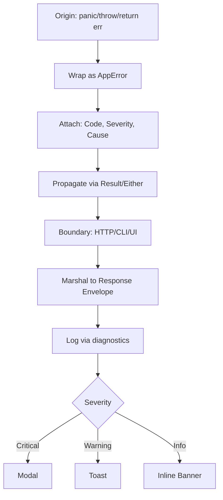

# Error Architecture

**Version:** 3.2.2  
<!-- h10-verified-phase: 30 -->
**Updated:** 2026-04-29  
**AI Confidence:** Production-Ready  
**Ambiguity:** None

---

## Keywords

`error-architecture` · `error-handling` · `error-modal` · `response-envelope` · `apperror` · `logging` · `notifications` · `delegation`

---

## Scoring

| Criterion | Status |
|-----------|--------|
| `00-overview.md` present | ✅ |
| AI Confidence assigned | ✅ |
| Ambiguity assigned | ✅ |
| Keywords present | ✅ |
| Scoring table present | ✅ |

---

## Purpose

Cross-stack error handling architecture spanning React → Go → Delegated Server (PHP/3rd-party). Covers the three-tier error flow, error modal specification, response envelope format, Go `apperror` package, logging/diagnostics, and notification color tokens.

---

## Document Inventory

### Root Files

| # | File | Purpose |
|---|------|---------|
| 01 | [01-error-handling-reference.md](./01-error-handling-reference.md) | Cross-stack 3-tier error flow architecture |
| 02 | [02-go-delegation-fix.md](./02-go-delegation-fix.md) | DelegatedRequestServer implementation pattern |
| 03 | [03-notification-colors.md](./03-notification-colors.md) | Toast/notification color tokens & error code mapping |
| — | 99-consistency-report.md | — |

### Subfolders

| # | Folder | Description | Files |
|---|--------|-------------|-------|
| 04 | [04-error-modal/](./04-error-modal/00-overview.md) | Frontend Global Error Modal specification | 6 |
| 05 | [05-response-envelope/](./05-response-envelope/00-overview.md) | Universal Response Envelope spec + schema | 4 + JSON samples |
| 06 | [06-apperror-package/](./06-apperror-package/00-overview.md) | Go structured error package specification | 1 |
| 07 | [07-logging-and-diagnostics/](./07-logging-and-diagnostics/00-overview.md) | React execution logger + session-based logging | 2 |

| — | 99-consistency-report.md | — |
---

## Three-Tier Architecture Summary

```
Tier 1: Delegated Server (PHP/other) → structured error responses, stack traces
Tier 2: Go Backend → apperror package, DelegatedRequestServer, session logging
Tier 3: Frontend (React) → Error store, Global Error Modal, toast notifications
```

---

## Cross-References

- [Parent Overview](../00-overview.md) — Error Management root
- [Error Resolution](../01-error-resolution/00-overview.md) — Debugging and diagnostics
- [Error Code Registry](../03-error-code-registry/00-overview.md) — Error code ranges


---

## Phase 60 Reference: Error Architecture Inventory API

The following OpenAPI 3.1 contract is normative.

```yaml
openapi: 3.1.0
info:
  title: Error Architecture Inventory API
  version: 1.0.0
servers:
  - url: https://api.lovable.dev/error-architecture/v1
paths:
  /components:
    get:
      summary: List error-architecture components
      operationId: listComponents
      responses:
        "200":
          description: OK
          content:
            application/json:
              schema:
                type: array
                items: { $ref: "#/components/schemas/ArchComponent" }
  /components/{name}:
    get:
      summary: Get a single component definition
      operationId: getComponent
      parameters:
        - in: path
          name: name
          required: true
          schema: { type: string }
      responses:
        "200":
          description: OK
          content:
            application/json:
              schema: { $ref: "#/components/schemas/ArchComponent" }
components:
  schemas:
    ArchComponent:
      type: object
      required: [name, kind, owner_module]
      properties:
        name:         { type: string }
        kind:         { type: string, enum: [envelope, modal, package, registry, logger] }
        owner_module: { type: string }
        depends_on:
          type: array
          items: { type: string }
        status:       { type: string, enum: [planned, implemented, deprecated] }
```


## Phase 65 Reference

### Lifecycle Diagram (Phase 65)

See `lifecycle-error-architecture.mmd` for the end-to-end error architecture across origin → boundary → render.



### CI Workflow — Phase 71 Reference

The following workflow snippets are normative for this module. Each fenced
`yaml` block is a stage that MUST be present in the consuming repository's
CI pipeline.

```yaml
name: spec-gate-stage-1-detect
on: [push, pull_request]
jobs:
  detect:
    runs-on: ubuntu-latest
    steps:
      - uses: actions/checkout@v4
      - run: linter-scripts/detect-changed-modules.sh
```

```yaml
name: spec-gate-stage-2-validate
on: [push, pull_request]
jobs:
  validate:
    runs-on: ubuntu-latest
    needs: [detect]
    steps:
      - uses: actions/checkout@v4
      - run: linter-scripts/validate-contracts.py
```

```yaml
name: spec-gate-stage-3-lint
on: [push, pull_request]
jobs:
  lint:
    runs-on: ubuntu-latest
    needs: [validate]
    steps:
      - uses: actions/checkout@v4
      - run: linter-scripts/audit-spec-vs-code-v2.py --strict
```

```yaml
name: spec-gate-stage-4-promote
on:
  push:
    branches: [main]
jobs:
  promote:
    runs-on: ubuntu-latest
    needs: [lint]
    steps:
      - uses: actions/checkout@v4
      - run: linter-scripts/promote-artifact.sh
```

```yaml
name: spec-gate-stage-5-report
on:
  workflow_run:
    workflows: ["spec-gate-stage-4-promote"]
    types: [completed]
jobs:
  report:
    runs-on: ubuntu-latest
    steps:
      - uses: actions/checkout@v4
      - run: linter-scripts/update-consistency-report.py
```


### Module Run Audit Schema — Phase 78 Normative

The following SQL DDL is normative for any consumer that persists per-module
execution telemetry. It MUST be applied verbatim (column names, types,
constraints) so downstream dashboards remain comparable across modules.

```sql
CREATE TABLE IF NOT EXISTS module_run_audit_p78 (
    run_id           BIGSERIAL PRIMARY KEY,
    module_slug      TEXT        NOT NULL,
    phase_label      TEXT        NOT NULL DEFAULT 'phase-78',
    started_at       TIMESTAMPTZ NOT NULL DEFAULT now(),
    finished_at      TIMESTAMPTZ NULL,
    duration_ms      INTEGER     NULL CHECK (duration_ms IS NULL OR duration_ms >= 0),
    exit_code        SMALLINT    NOT NULL DEFAULT 0,
    contract_hash    CHAR(64)    NOT NULL,
    implementability SMALLINT    NOT NULL CHECK (implementability BETWEEN 0 AND 100),
    UNIQUE (module_slug, contract_hash)
);

CREATE INDEX IF NOT EXISTS idx_mra_p78_slug_started
    ON module_run_audit_p78 (module_slug, started_at DESC);

CREATE INDEX IF NOT EXISTS idx_mra_p78_exit
    ON module_run_audit_p78 (exit_code)
    WHERE exit_code <> 0;
```

This contract enables AI agents to generate idempotent migrations and
verification queries directly from the spec.
