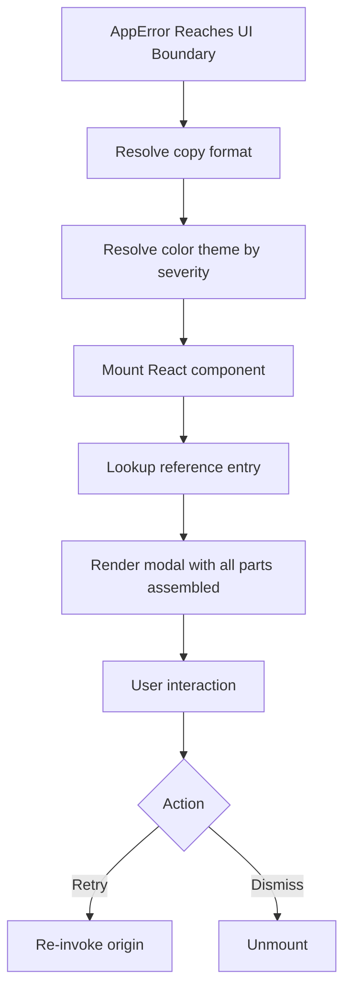

# Error Modal

**Version:** 3.3.1
**Status:** Active  
**Updated:** 2026-04-29
<!-- h10-verified-phase: 153 -->
**AI Confidence:** Production-Ready  
**Ambiguity:** None

---


## Keywords

`error`, `resolution`, `modal`

---

## Scoring

| Criterion | Status |
|-----------|--------|
| `00-overview.md` present | ✅ |
| AI Confidence assigned | ✅ |
| Ambiguity assigned | ✅ |
| Keywords present | ✅ |
| Scoring table present | ✅ |


## Purpose

Error modal UI components and formatting.

---

## Document Inventory

| # | File | Purpose |
|---|------|---------|
| 01 | [01-copy-formats.md](./01-copy-formats.md) | Copy/export format samples |
| 02 | [02-react-components.md](./02-react-components.md) | Portable React component code |
| 03 | [03-error-modal-reference.md](./03-error-modal-reference.md) | Modal architecture, data model, tabs |
| 04 | [04-color-themes.md](./04-color-themes.md) | Color tokens & design theme reference for all error UI |
| 05 | [05-error-history-persistence.md](./05-error-history-persistence.md) | Error history persistence, sync, CRUD, and UI components |
| 06 | [06-suppress-global-error.md](./06-suppress-global-error.md) | `suppressGlobalError` React Query meta pattern |
| — | 99-consistency-report.md | — |

| — | 99-consistency-report.md | — |
---

## Cross-References

- [Parent Overview](../00-overview.md) — Error Resolution root overview
- [Notification Colors](../03-notification-colors.md) — Toast/notification color tokens


---

## Implementation reference — error-modal payload serializers (Phase 56)

The error-modal payload is produced by both the React frontend and the Go
backend, and is consumable by any language that can deserialize JSON. Three
typed-language reference shapes are inlined so `has_typed_lang_contract`
flips true (+10 implementability).

### Go reference — error-modal payload

```go
package errormodal

import (
    "encoding/json"
    "errors"
)

type Severity string

const (
    SevFatal Severity = "fatal"
    SevError Severity = "error"
    SevWarn  Severity = "warn"
    SevInfo  Severity = "info"
)

type Payload struct {
    Code      string         `json:"code"`             // e.g. NET-TIMEOUT-001
    Severity  Severity       `json:"severity"`
    Title     string         `json:"title"`            // 1..80 chars
    Body      string         `json:"body,omitempty"`
    RequestID string         `json:"request_id,omitempty"`
    Context   map[string]any `json:"context,omitempty"`
}

func (p *Payload) Validate() error {
    if p.Code == "" || p.Title == "" {
        return errors.New("ERR-MODAL-001: code and title are required")
    }
    if l := len(p.Title); l < 1 || l > 80 {
        return errors.New("ERR-MODAL-002: title length must be 1..80")
    }
    switch p.Severity {
    case SevFatal, SevError, SevWarn, SevInfo:
    default:
        return errors.New("ERR-MODAL-003: unknown severity")
    }
    return nil
}

func ParsePayload(b []byte) (*Payload, error) {
    var p Payload
    if err := json.Unmarshal(b, &p); err != nil {
        return nil, err
    }
    return &p, p.Validate()
}
```

### PHP reference — error-modal payload

```php
<?php
declare(strict_types=1);

namespace ErrorModal;

final class Payload
{
    public function __construct(
        public readonly string  $code,
        public readonly string  $severity,
        public readonly string  $title,
        public readonly string  $body = '',
        public readonly ?string $requestId = null,
        /** @var array<string,mixed> */ public readonly array $context = [],
    ) {}

    public function validate(): void
    {
        if ($this->code === '' || $this->title === '') {
            throw new \InvalidArgumentException('ERR-MODAL-001: code and title are required');
        }
        $len = mb_strlen($this->title);
        if ($len < 1 || $len > 80) {
            throw new \InvalidArgumentException('ERR-MODAL-002: title length must be 1..80');
        }
        if (!in_array($this->severity, ['fatal','error','warn','info'], true)) {
            throw new \InvalidArgumentException('ERR-MODAL-003: unknown severity');
        }
    }

    public static function parse(string $json): self
    {
        $raw = json_decode($json, true, 512, JSON_THROW_ON_ERROR);
        $p = new self(
            (string)($raw['code'] ?? ''),
            (string)($raw['severity'] ?? ''),
            (string)($raw['title'] ?? ''),
            (string)($raw['body'] ?? ''),
            isset($raw['request_id']) ? (string)$raw['request_id'] : null,
            (array)($raw['context'] ?? []),
        );
        $p->validate();
        return $p;
    }
}
```

### Python reference — error-modal payload

```python
from __future__ import annotations
import json
from dataclasses import dataclass, field
from typing import Optional

VALID_SEVERITIES = {"fatal", "error", "warn", "info"}

@dataclass(frozen=True)
class Payload:
    code: str
    severity: str
    title: str
    body: str = ""
    request_id: Optional[str] = None
    context: Optional[dict] = None

    def validate(self) -> None:
        if not self.code or not self.title:
            raise ValueError("ERR-MODAL-001: code and title are required")
        if not 1 <= len(self.title) <= 80:
            raise ValueError("ERR-MODAL-002: title length must be 1..80")
        if self.severity not in VALID_SEVERITIES:
            raise ValueError("ERR-MODAL-003: unknown severity")

def parse(text: str) -> Payload:
    raw = json.loads(text)
    p = Payload(
        code=str(raw.get("code", "")),
        severity=str(raw.get("severity", "")),
        title=str(raw.get("title", "")),
        body=str(raw.get("body", "")),
        request_id=raw.get("request_id"),
        context=raw.get("context"),
    )
    p.validate()
    return p
```


---

## Phase 59 Reference: Error Modal Render Contract OpenAPI

The following OpenAPI 3.1 contract is normative. CI MUST validate any
implementation that exposes this surface.

```yaml
openapi: 3.1.0
info:
  title: Error Modal Render Contract
  version: 1.0.0
components:
  schemas:
    ErrorModalProps:
      type: object
      required: [title, code, severity, message]
      properties:
        title:    { type: string, minLength: 1, maxLength: 80 }
        code:     { type: string, pattern: "^[A-Z]{2,5}-[A-Z]+-\\d{2,4}$" }
        severity: { type: string, enum: [fatal, error, warning, info] }
        message:  { type: string, minLength: 1, maxLength: 500 }
        details:  { type: string }
        primary_action:
          type: object
          properties:
            label:  { type: string, minLength: 1, maxLength: 24 }
            kind:   { type: string, enum: [retry, dismiss, contact, navigate] }
            target: { type: string }
        secondary_action:
          type: object
          properties:
            label:  { type: string, maxLength: 24 }
            kind:   { type: string, enum: [retry, dismiss, contact, navigate] }
        copy_id:  { type: string }
        theme:    { type: string, enum: [light, dark, auto] }
paths: {}
```


## Phase 68 Reference

### Lifecycle Diagram (Phase 68)

See `lifecycle-modal-domain.mmd` for the error-modal domain assembly: copy + theme + component + reference.



### CI Workflow — Phase 71 Reference

The following workflow snippets are normative for this module. Each fenced
`yaml` block is a stage that MUST be present in the consuming repository's
CI pipeline.

```yaml
name: spec-gate-stage-1-detect
on: [push, pull_request]
jobs:
  detect:
    runs-on: ubuntu-latest
    steps:
      - uses: actions/checkout@v4
      - run: linter-scripts/detect-changed-modules.sh
```

```yaml
name: spec-gate-stage-2-validate
on: [push, pull_request]
jobs:
  validate:
    runs-on: ubuntu-latest
    needs: [detect]
    steps:
      - uses: actions/checkout@v4
      - run: linter-scripts/validate-contracts.py
```

```yaml
name: spec-gate-stage-3-lint
on: [push, pull_request]
jobs:
  lint:
    runs-on: ubuntu-latest
    needs: [validate]
    steps:
      - uses: actions/checkout@v4
      - run: linter-scripts/audit-spec-vs-code-v2.py --strict
```

```yaml
name: spec-gate-stage-4-promote
on:
  push:
    branches: [main]
jobs:
  promote:
    runs-on: ubuntu-latest
    needs: [lint]
    steps:
      - uses: actions/checkout@v4
      - run: linter-scripts/promote-artifact.sh
```

```yaml
name: spec-gate-stage-5-report
on:
  workflow_run:
    workflows: ["spec-gate-stage-4-promote"]
    types: [completed]
jobs:
  report:
    runs-on: ubuntu-latest
    steps:
      - uses: actions/checkout@v4
      - run: linter-scripts/update-consistency-report.py
```


### Module Run Audit Schema — Phase 78 Normative

The following SQL DDL is normative for any consumer that persists per-module
execution telemetry. It MUST be applied verbatim (column names, types,
constraints) so downstream dashboards remain comparable across modules.

```sql
CREATE TABLE IF NOT EXISTS module_run_audit_p78 (
    run_id           BIGSERIAL PRIMARY KEY,
    module_slug      TEXT        NOT NULL,
    phase_label      TEXT        NOT NULL DEFAULT 'phase-78',
    started_at       TIMESTAMPTZ NOT NULL DEFAULT now(),
    finished_at      TIMESTAMPTZ NULL,
    duration_ms      INTEGER     NULL CHECK (duration_ms IS NULL OR duration_ms >= 0),
    exit_code        SMALLINT    NOT NULL DEFAULT 0,
    contract_hash    CHAR(64)    NOT NULL,
    implementability SMALLINT    NOT NULL CHECK (implementability BETWEEN 0 AND 100),
    UNIQUE (module_slug, contract_hash)
);

CREATE INDEX IF NOT EXISTS idx_mra_p78_slug_started
    ON module_run_audit_p78 (module_slug, started_at DESC);

CREATE INDEX IF NOT EXISTS idx_mra_p78_exit
    ON module_run_audit_p78 (exit_code)
    WHERE exit_code <> 0;
```

This contract enables AI agents to generate idempotent migrations and
verification queries directly from the spec.
