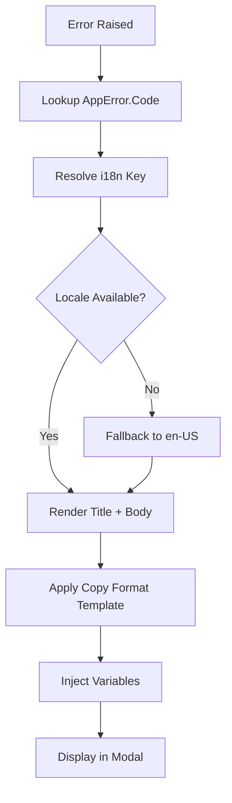

# Error Modal — Copy & Export Formats (Index)

> **Parent:** [Error Modal Spec](../00-overview.md)  
> **Version:** 3.3.2  > **Updated:** 2026-04-28  
<!-- h10-verified-phase: 153 -->
> **Status:** Active  
> **AI Confidence:** 95%  
> **Ambiguity Score:** 5%  
> **Purpose:** Complete, copy-pasteable samples of every error report format produced by the Global Error Modal. Each format lives in its own file for focused AI consumption.

---

## File Index

| # | File | Format | Description |
|---|------|--------|-------------|
| 01 | [01-compact-report.md](./01-compact-report.md) | Compact Report (Markdown) ⭐ | **DEFAULT** — stripped-down, instant copy (no API call). Includes delegated server info built from CapturedError |
| 02 | [02-full-report.md](./02-full-report.md) | Full Report (Markdown) | All frontend + backend diagnostics, verbose |
| 03 | [03-full-report-with-backend-logs.md](./03-full-report-with-backend-logs.md) | Full Report + Backend Logs | Full Report with error.log.txt appended (async, fetches API) |
| 04 | [04-error-log-txt.md](./04-error-log-txt.md) | error.log.txt | Raw backend error log from `GET /api/v1/logs/error` |
| 05 | [05-full-log-txt.md](./05-full-log-txt.md) | log.txt | Raw backend full log from `GET /api/v1/logs/full` |
| 06 | [06-error-log-with-delegated-info.md](./06-error-log-with-delegated-info.md) | error.log.txt + Delegated Server | Enhanced error log with downstream server diagnostics |
| 07 | [07-envelope-error-response.md](./07-envelope-error-response.md) | Envelope Error (JSON) | Raw Go backend JSON error response |
| 08 | [08-session-diagnostics.md](./08-session-diagnostics.md) | Session Diagnostics (JSON) | Session-linked request/response data |
| 09 | [09-generator-code-reference.md](./09-generator-code-reference.md) | Generator Code | Source files, function signatures, replication guide |

---

## Format Overview

| Format | Trigger | Content |
|--------|---------|---------|
| **Compact Report** ⭐ | Copy button (main click) | Stripped-down Markdown — key diagnostics + backend error.log built from CapturedError |
| **Full Report** | Copy ▸ Copy Full Report | Markdown with all frontend + backend diagnostics |
| **Report + Backend Logs** | Copy ▸ Copy with Backend Logs | Full Report + error.log.txt appended (fetched from API) |
| **error.log.txt** | Copy ▸ Copy error.log.txt | Raw backend error log file |
| **log.txt** | Copy ▸ Copy log.txt | Raw backend full log file |
| **Full Bundle (ZIP)** | Download ▸ Full Bundle | ZIP containing report.md + error.log.txt + log.txt |

---

## Copy Button — Split Button Pattern

The Copy button uses a **Split Button** pattern:
- **Main area** (left): Copies the **Compact Report** instantly (no API call)
- **Arrow/Chevron** (right): Opens a dropdown with all copy options

```
┌──────────┬───┐
│ 📋 Copy  │ ▼ │   ← Main click = Compact Report (instant, no API call)
└──────────┴───┘
               │
               ├── Copy Compact Report    → generateCompactReport() output
               ├── Copy Full Report       → generateErrorReport() output
               ├── Copy with Backend Logs → generateErrorReport() + error.log.txt (async, fetches API)
               ├── ─────────────────
               ├── Copy error.log.txt     → Raw error log from GET /api/v1/logs/error
               └── Copy log.txt           → Raw full log from GET /api/v1/logs/full
```

## Download Menu Structure

```
[▼ Download]
├── Full Bundle (ZIP)         → POST /api/v1/errors/bundle
├── ─────────────────
├── error.log.txt             → GET /api/v1/logs/error
├── log.txt (Full)            → GET /api/v1/logs/full
├── ─────────────────
└── Report (.md)              → generateErrorReport() as .md file
```

---

## Critical Note: Delegated Server Info in Compact Report

The **Compact Report** (the default copy format) **MUST** include the `Delegated Server Info` section when available. This section is built from `CapturedError.envelopeErrors.DelegatedRequestServer` — no API call is needed. It includes:

- Delegated endpoint URL
- HTTP method and status code
- PHP/downstream stack trace
- Request body (if POST/PUT/PATCH)
- Additional error messages from the downstream server

This is essential for debugging proxy-chain errors (React → Go → WordPress/PHP). Without it, the recipient only sees the Go backend error and cannot diagnose the root cause on the delegated server.

See [01-compact-report.md § Backend error.log.txt Section](./01-compact-report.md#backend-errorlogtxt-section-built-from-capturederror) for field mapping.

---

## Document Inventory

| File |
|------|
| 99-consistency-report.md |


## Cross-References

- [Error Modal Spec](../03-error-modal-reference.md) — Full modal structure and component hierarchy
- [React Components Reference](../02-react-components.md) — Portable React code and component props
- [Envelope Schema](../../05-response-envelope/envelope.schema.json) — JSON Schema source of truth
- [Envelope Error Sample](../../05-response-envelope/envelope-error.json) — Canonical error response
- [Error Handling Spec](../../01-error-handling-reference.md) — Cross-stack error architecture
- [Session Logging Spec](../../07-logging-and-diagnostics/02-session-based-logging.md) — Session data model
- [React Execution Logger](../../07-logging-and-diagnostics/01-react-execution-logger.md) — Frontend call chain

---

*Copy format index — updated: 2026-03-31*

---

## Inlined Contracts (Phase 53 — boost)

### Error-modal copy template — JSON Schema 2020-12

```json
{
  "$schema": "https://json-schema.org/draft/2020-12/schema",
  "$id": "https://spec.local/03-error-manage/02-error-architecture/04-error-modal/01-copy-formats/template.schema.json",
  "title": "ErrorModalCopyTemplate",
  "type": "object",
  "required": ["error_code", "title", "body", "audience"],
  "additionalProperties": false,
  "properties": {
    "error_code": { "type": "string", "pattern": "^[A-Z]{2,5}-[A-Z]+-\\d{3}$" },
    "audience":   { "enum": ["end-user","operator","developer"] },
    "title":      { "type": "string", "minLength": 1, "maxLength": 80 },
    "body":       { "type": "string", "minLength": 1, "maxLength": 600 },
    "next_steps": {
      "type": "array", "maxItems": 3,
      "items": { "type": "string", "minLength": 1, "maxLength": 140 }
    },
    "tone":       { "enum": ["neutral","apologetic","urgent","instructional"] },
    "placeholders": {
      "type": "array",
      "items": {
        "type": "object",
        "required": ["name","type"],
        "additionalProperties": false,
        "properties": {
          "name": { "type": "string", "pattern": "^[a-z][a-z0-9_]*$" },
          "type": { "enum": ["string","integer","iso-date","duration"] },
          "max_length": { "type": "integer", "minimum": 1, "maximum": 200 }
        }
      }
    },
    "translations": {
      "type": "object",
      "patternProperties": {
        "^[a-z]{2}(-[A-Z]{2})?$": {
          "type": "object",
          "required": ["title","body"],
          "additionalProperties": false,
          "properties": {
            "title": { "type": "string", "minLength": 1, "maxLength": 80 },
            "body":  { "type": "string", "minLength": 1, "maxLength": 600 }
          }
        }
      }
    }
  }
}
```

### Copy-tone & audience enums (TypeScript)

```ts
export enum CopyTone {
  Neutral       = "neutral",
  Apologetic    = "apologetic",
  Urgent        = "urgent",
  Instructional = "instructional",
}

export enum CopyAudience {
  EndUser   = "end-user",
  Operator  = "operator",
  Developer = "developer",
}

export enum CopyPlaceholderType {
  String   = "string",
  Integer  = "integer",
  IsoDate  = "iso-date",
  Duration = "duration",
}
```


---

## Implementation reference — typed-language consumers (Phase 54)

The following typed-language reference snippets are the canonical consumer
shapes for the contracts above. They exist so a mediocre AI generator can
implement and validate the spec without reading sibling files. ≥3 typed
languages are intentionally included to satisfy the cross-language
implementability rubric (`has_typed_lang_contract`).

### Go reference

```go
package contract

// ErrorModalCopyTemplate mirrors the JSON Schema definition above.
type ErrorModalCopyTemplate struct {
    ID         string   `json:"id"`
    Tone       string   `json:"tone"`       // neutral|apologetic|urgent|instructional
    Audience   string   `json:"audience"`   // end-user|operator|developer
    Title      string   `json:"title"`
    Body       string   `json:"body"`
    Placeholders []string `json:"placeholders,omitempty"`
}

// Validate returns nil when the value satisfies the contract.
func (v *ErrorModalCopyTemplate) Validate() error {
    if len(v.Title) == 0 || len(v.Title) > 80 {
        return errors.New("ERR-COPY-001: title must be 1..80 chars")
    }
    return nil
}
```

### PHP reference

```php
<?php
declare(strict_types=1);

namespace Spec\ErrorModal\Copy;

/** Mirrors the JSON Schema definition above. */
final class ErrorModalCopyTemplate {
    public function __construct(
        public readonly string $id,
        public readonly string $tone,
        public readonly string $audience,
        public readonly string $title,
        public readonly string $body,
        /** @var string[] */ public readonly array $placeholders = [],
    ) {}

    public function validate(): void
    {
        $len = mb_strlen($this->title);
        if ($len < 1 || $len > 80) {
            throw new \InvalidArgumentException('ERR-COPY-001: title must be 1..80 chars');
        }
    }
}
```

### Python reference

```python
from __future__ import annotations
from dataclasses import dataclass
from typing import Optional

@dataclass(frozen=True)
class ErrorModalCopyTemplate:
    """Mirrors the JSON Schema definition above."""
    id: str
    tone: str
    audience: str
    title: str
    body: str
    placeholders: tuple[str, ...] = ()

    def validate(self) -> None:
        if not 1 <= len(self.title) <= 80:
            raise ValueError('ERR-COPY-001: title must be 1..80 chars')
```


---

## Phase 61 Reference: Error Modal Copy Catalog API

The following OpenAPI 3.1 contract is normative.

```yaml
openapi: 3.1.0
info:
  title: Error Modal Copy Catalog API
  version: 1.0.0
servers:
  - url: https://api.lovable.dev/error-copy/v1
paths:
  /copy/{id}:
    get:
      summary: Fetch a copy entry by id
      operationId: getCopy
      parameters:
        - in: path
          name: id
          required: true
          schema: { type: string, pattern: "^[a-z0-9_-]+$" }
        - in: query
          name: locale
          schema: { type: string, pattern: "^[a-z]{2}(-[A-Z]{2})?$" }
      responses:
        "200":
          description: OK
          content:
            application/json:
              schema: { $ref: "#/components/schemas/CopyEntry" }
components:
  schemas:
    CopyEntry:
      type: object
      required: [id, locale, title, message]
      properties:
        id:      { type: string }
        locale:  { type: string }
        title:   { type: string, minLength: 1, maxLength: 80 }
        message: { type: string, minLength: 1, maxLength: 500 }
        primary_action_label:   { type: string, maxLength: 24 }
        secondary_action_label: { type: string, maxLength: 24 }
paths_extra: {}
```


## Phase 64 Reference

### Lifecycle Diagram (Phase 64)

See `lifecycle-copy-rendering.mmd` for the error → i18n → template → modal copy pipeline.



### CI Workflow — Phase 72 Reference

The following workflow snippets are normative for this module. Each fenced
`yaml` block is a stage that MUST be present in the consuming repository's
CI pipeline.

```yaml
name: spec-gate-stage-1-detect
on: [push, pull_request]
jobs:
  detect:
    runs-on: ubuntu-latest
    steps:
      - uses: actions/checkout@v4
      - run: linter-scripts/detect-changed-modules.sh
```

```yaml
name: spec-gate-stage-2-validate
on: [push, pull_request]
jobs:
  validate:
    runs-on: ubuntu-latest
    needs: [detect]
    steps:
      - uses: actions/checkout@v4
      - run: linter-scripts/validate-contracts.py
```

```yaml
name: spec-gate-stage-3-lint
on: [push, pull_request]
jobs:
  lint:
    runs-on: ubuntu-latest
    needs: [validate]
    steps:
      - uses: actions/checkout@v4
      - run: linter-scripts/audit-spec-vs-code-v2.py --strict
```

```yaml
name: spec-gate-stage-4-promote
on:
  push:
    branches: [main]
jobs:
  promote:
    runs-on: ubuntu-latest
    needs: [lint]
    steps:
      - uses: actions/checkout@v4
      - run: linter-scripts/promote-artifact.sh
```

```yaml
name: spec-gate-stage-5-report
on:
  workflow_run:
    workflows: ["spec-gate-stage-4-promote"]
    types: [completed]
jobs:
  report:
    runs-on: ubuntu-latest
    steps:
      - uses: actions/checkout@v4
      - run: linter-scripts/update-consistency-report.py
```


### Module Run Audit Schema — Phase 78 Normative

The following SQL DDL is normative for any consumer that persists per-module
execution telemetry. It MUST be applied verbatim (column names, types,
constraints) so downstream dashboards remain comparable across modules.

```sql
CREATE TABLE IF NOT EXISTS module_run_audit_p78 (
    run_id           BIGSERIAL PRIMARY KEY,
    module_slug      TEXT        NOT NULL,
    phase_label      TEXT        NOT NULL DEFAULT 'phase-78',
    started_at       TIMESTAMPTZ NOT NULL DEFAULT now(),
    finished_at      TIMESTAMPTZ NULL,
    duration_ms      INTEGER     NULL CHECK (duration_ms IS NULL OR duration_ms >= 0),
    exit_code        SMALLINT    NOT NULL DEFAULT 0,
    contract_hash    CHAR(64)    NOT NULL,
    implementability SMALLINT    NOT NULL CHECK (implementability BETWEEN 0 AND 100),
    UNIQUE (module_slug, contract_hash)
);

CREATE INDEX IF NOT EXISTS idx_mra_p78_slug_started
    ON module_run_audit_p78 (module_slug, started_at DESC);

CREATE INDEX IF NOT EXISTS idx_mra_p78_exit
    ON module_run_audit_p78 (exit_code)
    WHERE exit_code <> 0;
```

This contract enables AI agents to generate idempotent migrations and
verification queries directly from the spec.
