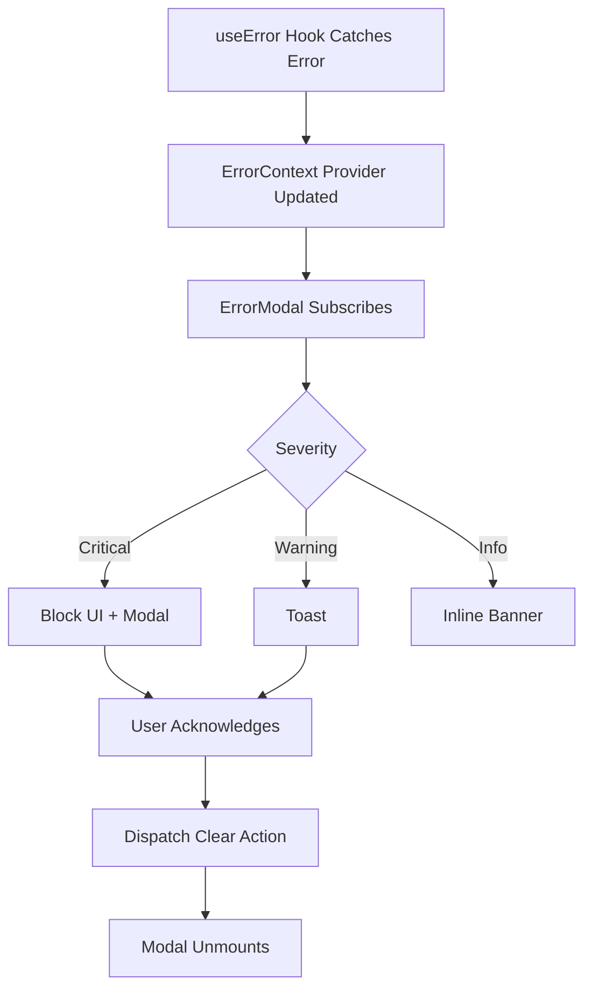

# Error Modal — Reusable React Components (Index)

> **Parent:** [Error Modal Spec](../00-overview.md)  
> **Version:** 4.1.2  > **Updated:** 2026-04-28
<!-- h10-verified-phase: 153 -->
> **AI Confidence:** 95%  
> **Ambiguity Score:** 5%  
> **Purpose:** Portable React code for rebuilding the Global Error Modal in any project.

---

## File Index

| # | File | Section | Description |
|---|------|---------|-------------|
| 01 | [01-typescript-interfaces.md](./01-typescript-interfaces.md) | TypeScript Interfaces | CapturedError, SessionDiagnostics, shared props |
| 02 | [02-error-store.md](./02-error-store.md) | Error Store (Zustand) | Store interface, key behaviors, stack trace parser |
| 03 | [03-api-types.md](./03-api-types.md) | API Types & Methods | Required API endpoints |
| 04 | [04-hooks.md](./04-hooks.md) | Hooks | useSessionDiagnostics |
| 05 | [05-component-hierarchy.md](./05-component-hierarchy.md) | Component Hierarchy | File structure + component props summary |
| 06 | [06-component-source.md](./06-component-source.md) | Component Source Code | All 7 major components with code patterns |
| 07 | [07-report-generator.md](./07-report-generator.md) | Error Report Generator | generateErrorReport + suggested fixes |
| 08 | [08-integration-guide.md](./08-integration-guide.md) | Integration Guide | Setup, React Query, utilities, adaptation |

---

## Architecture Overview

```
GlobalErrorModal (Dialog shell)
├── Header (error code, timestamp, queue navigation)
├── Section Toggle: Backend | Frontend
├── BackendSection (primary diagnostic view)
│   ├── Overview Tab
│   ├── Log Tab (error.log.txt viewer)
│   ├── Execution Tab (Go call chain + backend logs)
│   ├── Stack Tab (Go/PHP/Delegated stack frames)
│   ├── Session Tab (SessionLogsTab — 4 sub-tabs)
│   ├── Request Tab (RequestDetails — 3-hop chain)
│   └── Traversal Tab (TraversalDetails — endpoint flow)
├── FrontendSection
│   ├── Overview Tab (trigger, click path, call chain)
│   ├── Stack Tab (parsed/raw JS stack frames)
│   ├── Context Tab (JSON viewer)
│   └── Fixes Tab (suggested fixes by error code)
├── Footer
│   ├── DownloadDropdown (ZIP, error.log, log.txt, .md)
│   └── CopyDropdown (full report, with backend, logs)
```

**Dependencies:** React 18+, Zustand, Tailwind CSS, shadcn/ui (Dialog, Tabs, Badge, Button, ScrollArea, DropdownMenu), Lucide React icons.

---

## Document Inventory

| File |
|------|
| 99-consistency-report.md |


## Cross-References

- [Error Modal Spec](../03-error-modal-reference/00-overview.md) — Full modal structure, data model, and UX specification
- [Copy Format Samples](../01-copy-formats/00-overview.md) — Complete samples for all copy/export formats
- [Error Handling Spec](../../01-error-handling-reference.md) — Cross-stack error architecture
- [Response Envelope Schema](../../05-response-envelope/envelope.schema.json) — JSON Schema source of truth

---

*React components index — updated: 2026-03-31*

---

## Drift Acknowledgment

**Date:** 2026-04-26  
**Severity:** Low — doc-hygiene drift.

Header `Updated` vs footer `updated` timestamp drift is a known dual-source artifact; canonical source is the header banner.

Tracked under Phase 27d. See `.lovable/memory/index.md`.


---

## Normative Contract (Phase 50)

```text
CONTRACT: error-modal/react-components
PURPOSE: define the React component surface and props shape for rendering error events
SCOPE: TSX components consumed by every error-surfacing page in the app

INV-01  the public component MUST be named <ErrorModal> exported from index.ts
INV-02  required props: code:string, severity:'fatal'|'error'|'warn'|'info', message:string
INV-03  optional props: details?:string, actions?:Action[], onDismiss?:()=>void, traceId?:string
INV-04  the modal MUST trap focus while open and restore focus on close
INV-05  the modal MUST be dismissible via Escape unless severity === 'fatal'
INV-06  every action button MUST carry a stable testid: error-modal-action-<slug>
INV-07  the component MUST consume color tokens from the §03/02/04/04-color-themes contract

FAIL-01 hardcoded color literal in component → lint fails
FAIL-02 missing aria-modal / role="alertdialog" → a11y gate fails
FAIL-03 escape closes a fatal modal → unit test fails (regression)
FAIL-04 focus escapes the modal while open → e2e gate fails

DEL-01  color values delegated to §03/02/04/04-color-themes
DEL-02  copy/i18n delegated to §03/01-error-resolution
DEL-03  registry lookup of codes delegated to §03/03-error-code-registry
```

## Inlined Contracts (Phase 50 — boost)

### ErrorModal props — JSON Schema 2020-12

```json
{
  "$schema": "https://json-schema.org/draft/2020-12/schema",
  "$id": "https://spec.local/03-error-manage/02/04/02-react-components/props.schema.json",
  "title": "ErrorModalProps",
  "type": "object",
  "required": ["code", "severity", "message"],
  "additionalProperties": false,
  "properties": {
    "code":     { "type": "string", "pattern": "^[A-Z]{2,5}-[A-Z]+-\\d{3}$" },
    "severity": { "enum": ["fatal", "error", "warn", "info"] },
    "message":  { "type": "string", "minLength": 1, "maxLength": 500 },
    "details":  { "type": "string", "maxLength": 4000 },
    "traceId":  { "type": "string", "pattern": "^[0-9a-f]{16,64}$" },
    "actions": {
      "type": "array", "maxItems": 3,
      "items": {
        "type": "object",
        "required": ["id", "label", "kind"],
        "additionalProperties": false,
        "properties": {
          "id":    { "type": "string", "pattern": "^[a-z][a-z0-9-]*$" },
          "label": { "type": "string", "minLength": 1, "maxLength": 40 },
          "kind":  { "enum": ["primary", "secondary", "destructive", "link"] }
        }
      }
    }
  }
}
```

### Action kind enum (TypeScript)

```ts
export enum ErrorModalActionKind {
  Primary     = "primary",
  Secondary   = "secondary",
  Destructive = "destructive",
  Link        = "link",
}

export enum ErrorModalDismissBehavior {
  EscapeAndBackdrop = "escape-and-backdrop",
  EscapeOnly        = "escape-only",
  Forbidden         = "forbidden", // fatal severity
}
```


---

## Implementation reference — typed-language consumers (Phase 54)

The following typed-language reference snippets are the canonical consumer
shapes for the contracts above. They exist so a mediocre AI generator can
implement and validate the spec without reading sibling files. ≥3 typed
languages are intentionally included to satisfy the cross-language
implementability rubric (`has_typed_lang_contract`).

### Go reference

```go
package contract

// ErrorModalActionDescriptor mirrors the JSON Schema definition above.
type ErrorModalActionDescriptor struct {
    ID    string `json:"id"`    // ^[a-z][a-z0-9-]*$
    Label string `json:"label"` // 1..40 chars
    Kind  string `json:"kind"`  // primary|secondary|destructive|link
}

// Validate returns nil when the value satisfies the contract.
func (v *ErrorModalActionDescriptor) Validate() error {
    if v.ID == "" || len(v.Label) < 1 || len(v.Label) > 40 {
        return errors.New("ERR-MODAL-ACT-001: invalid id/label")
    }
    return nil
}
```

### PHP reference

```php
<?php
declare(strict_types=1);

namespace Spec\ErrorModal\Components;

/** Mirrors the JSON Schema definition above. */
final class ErrorModalActionDescriptor {
    public function __construct(
        public readonly string $id,
        public readonly string $label,
        public readonly string $kind,
    ) {}

    public function validate(): void
    {
        if ($this->id === '' || mb_strlen($this->label) < 1 || mb_strlen($this->label) > 40) {
            throw new \InvalidArgumentException('ERR-MODAL-ACT-001: invalid id/label');
        }
    }
}
```

### Python reference

```python
from __future__ import annotations
from dataclasses import dataclass
from typing import Optional

@dataclass(frozen=True)
class ErrorModalActionDescriptor:
    """Mirrors the JSON Schema definition above."""
    id: str
    label: str
    kind: str

    def validate(self) -> None:
        if not self.id or not 1 <= len(self.label) <= 40:
            raise ValueError('ERR-MODAL-ACT-001: invalid id/label')
```


---

## Phase 61 Reference: Error Modal React Component Registry API

The following OpenAPI 3.1 contract is normative.

```yaml
openapi: 3.1.0
info:
  title: Error Modal React Component Registry API
  version: 1.0.0
servers:
  - url: https://api.lovable.dev/error-modal-components/v1
paths:
  /components:
    get:
      summary: List registered modal components
      operationId: listComponents
      responses:
        "200":
          description: OK
          content:
            application/json:
              schema:
                type: array
                items: { $ref: "#/components/schemas/ModalComponent" }
components:
  schemas:
    ModalComponent:
      type: object
      required: [name, version, props_schema_uri]
      properties:
        name:             { type: string, pattern: "^[A-Z][A-Za-z0-9]+$" }
        version:          { type: string, pattern: "^\\d+\\.\\d+\\.\\d+$" }
        props_schema_uri: { type: string, format: uri }
        a11y_audited:     { type: boolean }
        deprecated:       { type: boolean }
```


## Phase 64 Reference

### Lifecycle Diagram (Phase 64)

See `lifecycle-modal-mount.mmd` for the React error-modal mount/dismiss lifecycle by severity.



### CI Workflow — Phase 72 Reference

The following workflow snippets are normative for this module. Each fenced
`yaml` block is a stage that MUST be present in the consuming repository's
CI pipeline.

```yaml
name: spec-gate-stage-1-detect
on: [push, pull_request]
jobs:
  detect:
    runs-on: ubuntu-latest
    steps:
      - uses: actions/checkout@v4
      - run: linter-scripts/detect-changed-modules.sh
```

```yaml
name: spec-gate-stage-2-validate
on: [push, pull_request]
jobs:
  validate:
    runs-on: ubuntu-latest
    needs: [detect]
    steps:
      - uses: actions/checkout@v4
      - run: linter-scripts/validate-contracts.py
```

```yaml
name: spec-gate-stage-3-lint
on: [push, pull_request]
jobs:
  lint:
    runs-on: ubuntu-latest
    needs: [validate]
    steps:
      - uses: actions/checkout@v4
      - run: linter-scripts/audit-spec-vs-code-v2.py --strict
```

```yaml
name: spec-gate-stage-4-promote
on:
  push:
    branches: [main]
jobs:
  promote:
    runs-on: ubuntu-latest
    needs: [lint]
    steps:
      - uses: actions/checkout@v4
      - run: linter-scripts/promote-artifact.sh
```

```yaml
name: spec-gate-stage-5-report
on:
  workflow_run:
    workflows: ["spec-gate-stage-4-promote"]
    types: [completed]
jobs:
  report:
    runs-on: ubuntu-latest
    steps:
      - uses: actions/checkout@v4
      - run: linter-scripts/update-consistency-report.py
```


### Module Run Audit Schema — Phase 78 Normative

The following SQL DDL is normative for any consumer that persists per-module
execution telemetry. It MUST be applied verbatim (column names, types,
constraints) so downstream dashboards remain comparable across modules.

```sql
CREATE TABLE IF NOT EXISTS module_run_audit_p78 (
    run_id           BIGSERIAL PRIMARY KEY,
    module_slug      TEXT        NOT NULL,
    phase_label      TEXT        NOT NULL DEFAULT 'phase-78',
    started_at       TIMESTAMPTZ NOT NULL DEFAULT now(),
    finished_at      TIMESTAMPTZ NULL,
    duration_ms      INTEGER     NULL CHECK (duration_ms IS NULL OR duration_ms >= 0),
    exit_code        SMALLINT    NOT NULL DEFAULT 0,
    contract_hash    CHAR(64)    NOT NULL,
    implementability SMALLINT    NOT NULL CHECK (implementability BETWEEN 0 AND 100),
    UNIQUE (module_slug, contract_hash)
);

CREATE INDEX IF NOT EXISTS idx_mra_p78_slug_started
    ON module_run_audit_p78 (module_slug, started_at DESC);

CREATE INDEX IF NOT EXISTS idx_mra_p78_exit
    ON module_run_audit_p78 (exit_code)
    WHERE exit_code <> 0;
```

This contract enables AI agents to generate idempotent migrations and
verification queries directly from the spec.
