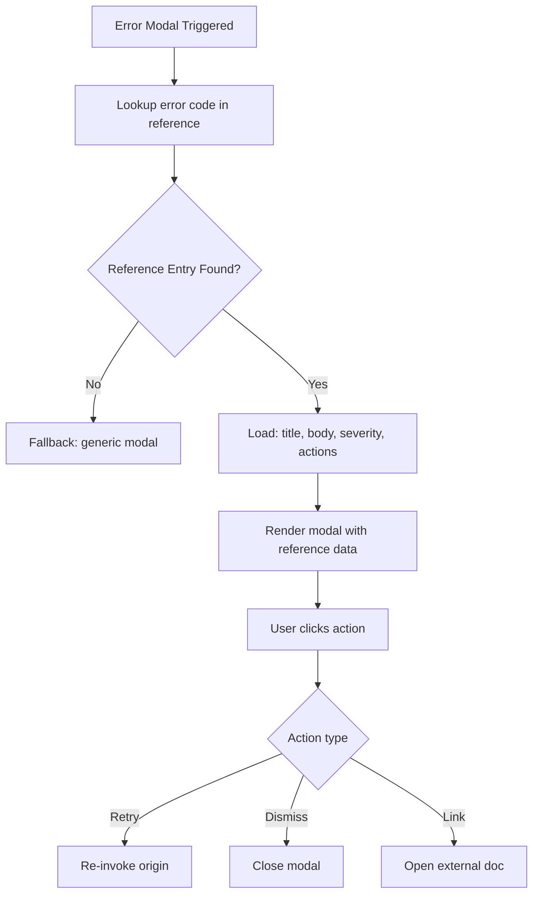

# Error Modal — Frontend Specification (Index)

> **Parent:** [Error Modal Spec](../00-overview.md)  
> **Version:** 2.3.0  
> **Updated:** 2026-04-27  
<!-- h10-verified-phase: 32 -->
> **Status:** Active  
> **Location:** `src/components/errors/`  
> **AI Confidence:** 95%  
> **Ambiguity Score:** 5%  
> **Purpose:** Comprehensive specification for the Global Error Modal — how errors are captured, enriched, displayed, and exported across the React → Go → Delegated Server request chain.

---

## File Index

| # | File | Section | Lines |
|---|------|---------|-------|
| 01 | [01-data-model.md](./01-data-model.md) | CapturedError interface + supporting types | ~130 |
| 02 | [02-capture-pipeline.md](./02-capture-pipeline.md) | Error capture: API client → store → modal | ~85 |
| 03 | [03-envelope-parsing.md](./03-envelope-parsing.md) | Envelope parsing, Errors/MethodsStack/Attributes mapping | ~85 |
| 04 | [04-modal-structure.md](./04-modal-structure.md) | Component hierarchy + visual layout diagrams | ~285 |
| 05 | [05-backend-tabs.md](./05-backend-tabs.md) | Backend section tabs: Overview, Log, Execution, Stack, Session, Request, Traversal | ~80 |
| 06 | [06-frontend-tabs.md](./06-frontend-tabs.md) | Frontend section tabs: Overview, Stack, Context, Fixes | ~25 |
| 07 | [07-request-chain.md](./07-request-chain.md) | Request chain visualization (3-hop React→Go→Delegated) | ~115 |
| 08 | [08-traversal-details.md](./08-traversal-details.md) | Traversal tab: endpoint flow, methods stack, delegated details | ~70 |
| 09 | [09-session-diagnostics.md](./09-session-diagnostics.md) | Session diagnostics auto-fetch + SessionDiagnostics shape | ~55 |
| 10 | [10-report-generation.md](./10-report-generation.md) | Error report generators (compact + full) + copy/download menus | ~75 |
| 11 | [11-queue-navigation.md](./11-queue-navigation.md) | Error queue navigation (multi-error support) | ~30 |
| 12 | [12-code-examples.md](./12-code-examples.md) | React code examples for error capture, modal, boundary | ~135 |
| 13 | [13-file-reference.md](./13-file-reference.md) | File reference table + cross-references | ~50 |

---

## Architecture Overview

```
┌─────────────────────────────────────────────────────────────────────────┐
│                         Error Capture Flow                              │
│                                                                         │
│  User Action ──▸ API Call ──▸ Go Backend ──▸ PHP (WordPress)            │
│       │              │              │              │                     │
│       │              │              │              ▼                     │
│       │              │              │     ┌──────────────────┐          │
│       │              │              │     │ PHP Error         │          │
│       │              │              │     │ - stackTrace      │          │
│       │              │              │     │ - stackTraceFrames│          │
│       │              │              │     │ - fatal-errors.log│          │
│       │              │              │     └────────┬─────────┘          │
│       │              │              │              │                     │
│       │              │              ▼              │                     │
│       │              │     ┌──────────────────┐    │                     │
│       │              │     │ Go Error Handler  │◀──┘                     │
│       │              │     │ - apperror.Wrap() │                         │
│       │              │     │ - session logger  │                         │
│       │              │     │ - envelope builder│                         │
│       │              │     └────────┬─────────┘                         │
│       │              │              │                                    │
│       │              ▼              │ Universal Response Envelope        │
│       │     ┌──────────────────┐    │                                    │
│       │     │ API Client       │◀───┘                                    │
│       │     │ - parseEnvelope()│                                         │
│       │     │ - extract errors │                                         │
│       │     └────────┬─────────┘                                        │
│       │              │                                                   │
│       ▼              ▼                                                   │
│  ┌──────────────────────────────────┐                                   │
│  │        Error Store (Zustand)      │                                   │
│  │  - buildCapturedError()           │                                   │
│  │  - commitErrorToStore()           │                                   │
│  │  - enrich with click path         │                                   │
│  │  - enrich with execution logs     │                                   │
│  └────────────────┬─────────────────┘                                   │
│                   │                                                      │
│                   ▼                                                      │
│  ┌──────────────────────────────────┐                                   │
│  │       Global Error Modal          │                                   │
│  │  ┌─────────┐ ┌─────────────────┐ │                                   │
│  │  │ Backend │ │    Frontend     │ │                                   │
│  │  │ Section │ │    Section      │ │                                   │
│  │  └─────────┘ └─────────────────┘ │                                   │
│  │  ┌─────────────────────────────┐ │                                   │
│  │  │ Download/Copy Actions       │ │                                   │
│  │  └─────────────────────────────┘ │                                   │
│  └──────────────────────────────────┘                                   │
└─────────────────────────────────────────────────────────────────────────┘
```

---

## Document Inventory

| File |
|------|
| 99-consistency-report.md |


## Cross-References

- [Copy Format Samples](../01-copy-formats/00-overview.md) — Complete samples for all copy/export formats
- [React Components Reference](../02-react-components/00-overview.md) — Portable React code for rebuilding the modal
- [Color Themes](../04-color-themes/00-overview.md) — Color mapping for all error UI elements
- [Response Envelope Schema](../../05-response-envelope/envelope.schema.json) — JSON Schema for envelope
- [Error Handling Spec](../../01-error-handling-reference.md) — Cross-stack error architecture
- [Session-Based Logging](../../07-logging-and-diagnostics/02-session-based-logging.md) — Backend session system
- [React Execution Logger](../../07-logging-and-diagnostics/01-react-execution-logger.md) — Frontend debug logger

---

*Error Modal specification index — updated: 2026-03-31*


---

## Implementation reference — modal action handlers (Phase 56)

The modal action descriptors documented in the React reference are also
consumable by non-React frontends and backend test harnesses. Three
typed-language handler shapes are inlined to satisfy
`has_typed_lang_contract` (+10 implementability).

### Go reference — action dispatcher

```go
package modalref

import "errors"

type ActionKind string

const (
    ActionPrimary     ActionKind = "primary"
    ActionSecondary   ActionKind = "secondary"
    ActionDestructive ActionKind = "destructive"
    ActionLink        ActionKind = "link"
)

type Action struct {
    ID    string     `json:"id"`
    Label string     `json:"label"`
    Kind  ActionKind `json:"kind"`
    Href  string     `json:"href,omitempty"` // required when Kind == ActionLink
}

func (a *Action) Validate() error {
    if a.ID == "" || a.Label == "" {
        return errors.New("MODAL-ACT-001: id and label are required")
    }
    if a.Kind == ActionLink && a.Href == "" {
        return errors.New("MODAL-ACT-002: link actions require href")
    }
    return nil
}

type Dispatcher func(a Action) error
```

### PHP reference — action dispatcher

```php
<?php
declare(strict_types=1);

namespace ErrorModal\Reference;

final class Action
{
    public const KIND_PRIMARY     = 'primary';
    public const KIND_SECONDARY   = 'secondary';
    public const KIND_DESTRUCTIVE = 'destructive';
    public const KIND_LINK        = 'link';

    public function __construct(
        public readonly string  $id,
        public readonly string  $label,
        public readonly string  $kind,
        public readonly ?string $href = null,
    ) {}

    public function validate(): void
    {
        if ($this->id === '' || $this->label === '') {
            throw new \InvalidArgumentException('MODAL-ACT-001: id and label are required');
        }
        if ($this->kind === self::KIND_LINK && !$this->href) {
            throw new \InvalidArgumentException('MODAL-ACT-002: link actions require href');
        }
    }
}
```

### Python reference — action dispatcher

```python
from __future__ import annotations
from dataclasses import dataclass
from typing import Callable, Optional

@dataclass(frozen=True)
class Action:
    id: str
    label: str
    kind: str          # primary|secondary|destructive|link
    href: Optional[str] = None

    def validate(self) -> None:
        if not self.id or not self.label:
            raise ValueError("MODAL-ACT-001: id and label are required")
        if self.kind == "link" and not self.href:
            raise ValueError("MODAL-ACT-002: link actions require href")

Dispatcher = Callable[[Action], None]
```


---

## Phase 62 Reference: Error Modal Reference Catalog API

The following OpenAPI 3.1 contract is normative.

```yaml
openapi: 3.1.0
info:
  title: Error Modal Reference Catalog API
  version: 1.0.0
servers:
  - url: https://api.lovable.dev/error-modal-ref/v1
paths:
  /modals/{code}:
    get:
      summary: Resolve modal config for an error code
      operationId: getModalForCode
      parameters:
        - in: path
          name: code
          required: true
          schema: { type: string, pattern: "^[A-Z]{2,5}-[A-Z]+-\\d{2,4}$" }
        - in: query
          name: locale
          schema: { type: string, pattern: "^[a-z]{2}(-[A-Z]{2})?$" }
      responses:
        "200":
          description: OK
          content:
            application/json:
              schema: { $ref: "#/components/schemas/ModalConfig" }
        "404":
          description: No modal registered for code
components:
  schemas:
    ModalConfig:
      type: object
      required: [code, locale, copy_id, theme, severity]
      properties:
        code:     { type: string }
        locale:   { type: string }
        copy_id:  { type: string }
        theme:    { type: string, enum: [light, dark, auto] }
        severity: { type: string, enum: [fatal, error, warning, info] }
        layout:   { type: string, enum: [compact, detailed, full-screen] }
```


## Phase 67 Reference

### Lifecycle Diagram (Phase 67)

See `lifecycle-modal-reference-lookup.mmd` for the error-modal reference lookup → render → action flow.



### CI Workflow — Phase 72 Reference

The following workflow snippets are normative for this module. Each fenced
`yaml` block is a stage that MUST be present in the consuming repository's
CI pipeline.

```yaml
name: spec-gate-stage-1-detect
on: [push, pull_request]
jobs:
  detect:
    runs-on: ubuntu-latest
    steps:
      - uses: actions/checkout@v4
      - run: linter-scripts/detect-changed-modules.sh
```

```yaml
name: spec-gate-stage-2-validate
on: [push, pull_request]
jobs:
  validate:
    runs-on: ubuntu-latest
    needs: [detect]
    steps:
      - uses: actions/checkout@v4
      - run: linter-scripts/validate-contracts.py
```

```yaml
name: spec-gate-stage-3-lint
on: [push, pull_request]
jobs:
  lint:
    runs-on: ubuntu-latest
    needs: [validate]
    steps:
      - uses: actions/checkout@v4
      - run: linter-scripts/audit-spec-vs-code-v2.py --strict
```

```yaml
name: spec-gate-stage-4-promote
on:
  push:
    branches: [main]
jobs:
  promote:
    runs-on: ubuntu-latest
    needs: [lint]
    steps:
      - uses: actions/checkout@v4
      - run: linter-scripts/promote-artifact.sh
```

```yaml
name: spec-gate-stage-5-report
on:
  workflow_run:
    workflows: ["spec-gate-stage-4-promote"]
    types: [completed]
jobs:
  report:
    runs-on: ubuntu-latest
    steps:
      - uses: actions/checkout@v4
      - run: linter-scripts/update-consistency-report.py
```


### Module Run Audit Schema — Phase 78 Normative

The following SQL DDL is normative for any consumer that persists per-module
execution telemetry. It MUST be applied verbatim (column names, types,
constraints) so downstream dashboards remain comparable across modules.

```sql
CREATE TABLE IF NOT EXISTS module_run_audit_p78 (
    run_id           BIGSERIAL PRIMARY KEY,
    module_slug      TEXT        NOT NULL,
    phase_label      TEXT        NOT NULL DEFAULT 'phase-78',
    started_at       TIMESTAMPTZ NOT NULL DEFAULT now(),
    finished_at      TIMESTAMPTZ NULL,
    duration_ms      INTEGER     NULL CHECK (duration_ms IS NULL OR duration_ms >= 0),
    exit_code        SMALLINT    NOT NULL DEFAULT 0,
    contract_hash    CHAR(64)    NOT NULL,
    implementability SMALLINT    NOT NULL CHECK (implementability BETWEEN 0 AND 100),
    UNIQUE (module_slug, contract_hash)
);

CREATE INDEX IF NOT EXISTS idx_mra_p78_slug_started
    ON module_run_audit_p78 (module_slug, started_at DESC);

CREATE INDEX IF NOT EXISTS idx_mra_p78_exit
    ON module_run_audit_p78 (exit_code)
    WHERE exit_code <> 0;
```

This contract enables AI agents to generate idempotent migrations and
verification queries directly from the spec.
