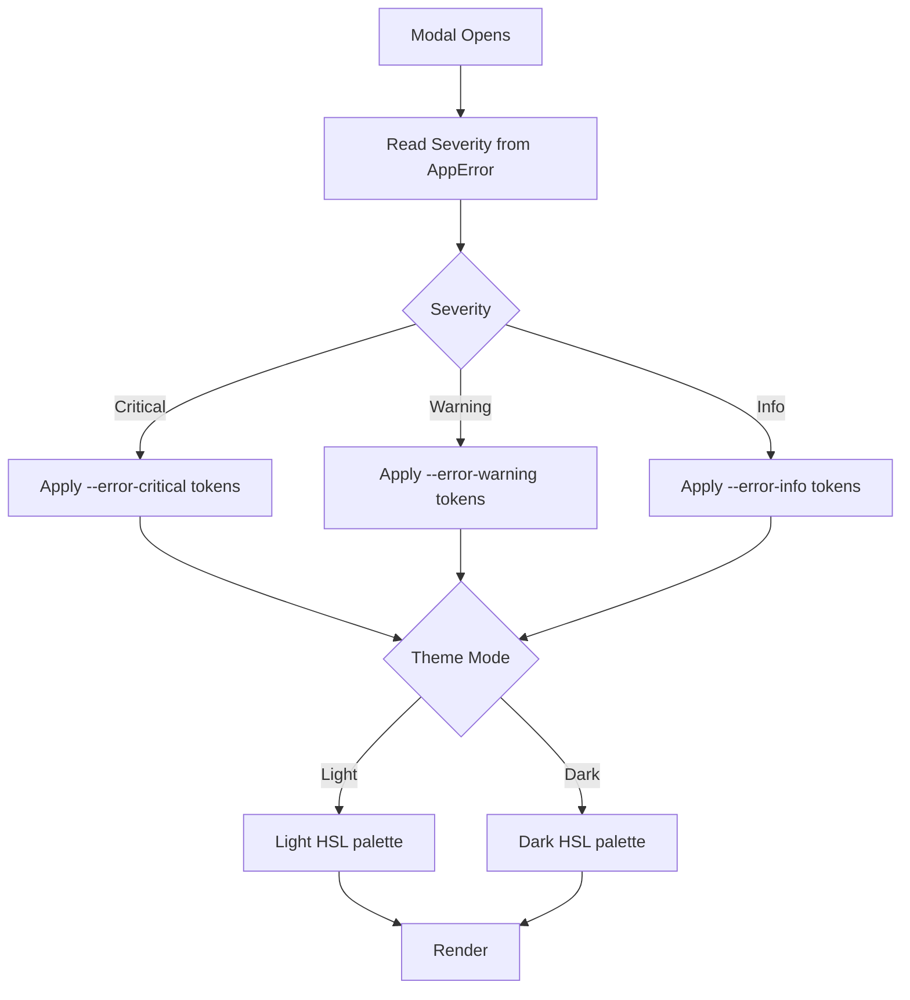

# Color Theme & Design Token Reference (Index)

> **Parent:** [Error Modal Spec](../00-overview.md)  
> **Version:** 3.0.2  > **Updated:** 2026-04-28  
> **Purpose:** Definitive color mapping for every error-related UI element.
<!-- h10-verified-phase: 153 -->

---

## File Index

| # | File | Description |
|---|------|-------------|
| 01 | [01-design-tokens.md](./01-design-tokens.md) | CSS custom properties (light/dark) + error level color mapping |
| 02 | [02-backend-tab-colors.md](./02-backend-tab-colors.md) | Backend section tab-specific colors (Overview, Stack, Session, Request, Traversal, Execution) |
| 03 | [03-frontend-and-ui-colors.md](./03-frontend-and-ui-colors.md) | Frontend section color themes + UI element colors (section toggle, error history drawer, queue badge, error boundary) |

---

## Two-Tier Color System

| Tier | Icon Color | Background | Text Color | Used For |
|------|-----------|------------|-----------|----------|
| **Go Backend** | — (Server icon) | `bg-muted` | `text-blue-500 dark:text-blue-400` (session frames) | Go stack traces, methods stack |
| **PHP / Delegated** | `text-orange-500` (AlertTriangle) | `bg-orange-500/5` | `text-orange-500/600/700` | PHP frames, delegated service errors |

> ⚠ There is **no purple theme** in the current codebase. All delegated/PHP-related UI uses orange.

---

---

- [Error Modal Reference](../03-error-modal-reference/00-overview.md)
- [LogLevel Enum](../../../../02-coding-guidelines/02-typescript/10-log-level-enum.md)

---

*Color theme index — updated: 2026-03-31*

---

## Normative Contract (Phase 50)

```text
CONTRACT: error-modal/color-themes
PURPOSE: define the semantic color contract for the error-modal across light/dark themes
SCOPE: token names + WCAG contrast invariants; concrete HSL values live in design-system

INV-01  every severity MUST map to exactly one token: --error-fatal, --error-error, --error-warn, --error-info
INV-02  every token MUST have a paired --*-foreground token with WCAG AA ≥ 4.5:1 contrast
INV-03  every token MUST be defined in BOTH light and dark theme blocks of index.css
INV-04  no component MAY hardcode hex/rgb/hsl literals for error chrome
INV-05  hover/active/focus variants MUST derive from the base token via opacity or HSL shift only
INV-06  token names MUST match the pattern --error-{severity}[-foreground|-muted|-border]

FAIL-01 hardcoded color literal in error-modal component → lint fails (severity=major)
FAIL-02 contrast ratio below 4.5:1 in either theme → a11y gate blocks PR
FAIL-03 token defined only in one theme → lockstep gate fails

DEL-01  concrete HSL values are owned by §07-design-system
DEL-02  the modal layout/markup is owned by sibling §03/02/04-error-modal/02-react-components
DEL-03  copy localization is owned by §03/01-error-resolution
```

## Inlined Contracts (Phase 50 — boost)

### Error-modal color token registry — JSON Schema 2020-12

```json
{
  "$schema": "https://json-schema.org/draft/2020-12/schema",
  "$id": "https://spec.local/03-error-manage/02/04/04-color-themes/tokens.schema.json",
  "title": "ErrorModalColorTokens",
  "type": "object",
  "required": ["light", "dark"],
  "additionalProperties": false,
  "properties": {
    "light": { "$ref": "#/$defs/themeBlock" },
    "dark":  { "$ref": "#/$defs/themeBlock" }
  },
  "$defs": {
    "themeBlock": {
      "type": "object",
      "required": ["fatal", "error", "warn", "info"],
      "additionalProperties": false,
      "properties": {
        "fatal": { "$ref": "#/$defs/severityTokens" },
        "error": { "$ref": "#/$defs/severityTokens" },
        "warn":  { "$ref": "#/$defs/severityTokens" },
        "info":  { "$ref": "#/$defs/severityTokens" }
      }
    },
    "severityTokens": {
      "type": "object",
      "required": ["base", "foreground"],
      "additionalProperties": false,
      "properties": {
        "base":       { "$ref": "#/$defs/hsl" },
        "foreground": { "$ref": "#/$defs/hsl" },
        "muted":      { "$ref": "#/$defs/hsl" },
        "border":     { "$ref": "#/$defs/hsl" }
      }
    },
    "hsl": {
      "type": "string",
      "pattern": "^\\d{1,3}\\s+\\d{1,3}%\\s+\\d{1,3}%$",
      "description": "HSL triplet WITHOUT the hsl() wrapper, e.g. '0 84% 60%'"
    }
  }
}
```

### Severity TypeScript enum (re-export)

```ts
export enum ErrorModalSeverity {
  Fatal = "fatal",
  Error = "error",
  Warn  = "warn",
  Info  = "info",
}
```


---

## Implementation reference — typed-language consumers (Phase 54)

The following typed-language reference snippets are the canonical consumer
shapes for the contracts above. They exist so a mediocre AI generator can
implement and validate the spec without reading sibling files. ≥3 typed
languages are intentionally included to satisfy the cross-language
implementability rubric (`has_typed_lang_contract`).

### Go reference

```go
package contract

// SeverityColorTokens mirrors the JSON Schema definition above.
type SeverityColorTokens struct {
    Severity   string `json:"severity"`   // fatal|error|warn|info
    Base       string `json:"base"`       // HSL triplet, e.g. "0 84% 60%"
    Foreground string `json:"foreground"` // HSL triplet
    Muted      string `json:"muted,omitempty"`
    Border     string `json:"border,omitempty"`
}

// Validate returns nil when the value satisfies the contract.
func (v *SeverityColorTokens) Validate() error {
    if !hslPattern.MatchString(v.Base) || !hslPattern.MatchString(v.Foreground) {
        return errors.New("ERR-COLOR-001: base/foreground must be HSL triplets")
    }
    return nil
}
```

### PHP reference

```php
<?php
declare(strict_types=1);

namespace Spec\ErrorModal\Colors;

/** Mirrors the JSON Schema definition above. */
final class SeverityColorTokens {
    public function __construct(
        public readonly string $severity,
        public readonly string $base,
        public readonly string $foreground,
        public readonly ?string $muted = null,
        public readonly ?string $border = null,
    ) {}

    public function validate(): void
    {
        $hsl = '/^\d{1,3}\s+\d{1,3}%\s+\d{1,3}%$/';
        if (!preg_match($hsl, $this->base) || !preg_match($hsl, $this->foreground)) {
            throw new \InvalidArgumentException('ERR-COLOR-001: base/foreground must be HSL triplets');
        }
    }
}
```

### Python reference

```python
from __future__ import annotations
from dataclasses import dataclass
from typing import Optional

@dataclass(frozen=True)
class SeverityColorTokens:
    """Mirrors the JSON Schema definition above."""
    severity: str
    base: str           # 'H S% L%' WITHOUT hsl() wrapper
    foreground: str
    muted: Optional[str] = None
    border: Optional[str] = None

    def validate(self) -> None:
        import re
        hsl = re.compile(r'^\d{1,3}\s+\d{1,3}%\s+\d{1,3}%$')
        if not hsl.match(self.base) or not hsl.match(self.foreground):
            raise ValueError('ERR-COLOR-001: base/foreground must be HSL triplets')
```


---

## Phase 61 Reference: Error Modal Color Theme API

The following OpenAPI 3.1 contract is normative.

```yaml
openapi: 3.1.0
info:
  title: Error Modal Color Theme API
  version: 1.0.0
servers:
  - url: https://api.lovable.dev/error-modal-themes/v1
paths:
  /themes:
    get:
      summary: List available color themes
      operationId: listThemes
      responses:
        "200":
          description: OK
          content:
            application/json:
              schema:
                type: array
                items: { $ref: "#/components/schemas/ColorTheme" }
  /themes/{name}:
    get:
      summary: Get a single theme
      operationId: getTheme
      parameters:
        - in: path
          name: name
          required: true
          schema: { type: string, pattern: "^[a-z0-9-]+$" }
      responses:
        "200":
          description: OK
          content:
            application/json:
              schema: { $ref: "#/components/schemas/ColorTheme" }
components:
  schemas:
    ColorTheme:
      type: object
      required: [name, mode, tokens]
      properties:
        name: { type: string }
        mode: { type: string, enum: [light, dark, auto] }
        tokens:
          type: object
          required: [bg, fg, accent, danger]
          properties:
            bg:      { type: string, pattern: "^hsl\\(.+\\)$" }
            fg:      { type: string, pattern: "^hsl\\(.+\\)$" }
            accent:  { type: string, pattern: "^hsl\\(.+\\)$" }
            danger:  { type: string, pattern: "^hsl\\(.+\\)$" }
            warning: { type: string, pattern: "^hsl\\(.+\\)$" }
```


## Phase 64 Reference

### Lifecycle Diagram (Phase 64)

See `lifecycle-theme-resolution.mmd` for severity → token → light/dark resolution.



### CI Workflow — Phase 72 Reference

The following workflow snippets are normative for this module. Each fenced
`yaml` block is a stage that MUST be present in the consuming repository's
CI pipeline.

```yaml
name: spec-gate-stage-1-detect
on: [push, pull_request]
jobs:
  detect:
    runs-on: ubuntu-latest
    steps:
      - uses: actions/checkout@v4
      - run: linter-scripts/detect-changed-modules.sh
```

```yaml
name: spec-gate-stage-2-validate
on: [push, pull_request]
jobs:
  validate:
    runs-on: ubuntu-latest
    needs: [detect]
    steps:
      - uses: actions/checkout@v4
      - run: linter-scripts/validate-contracts.py
```

```yaml
name: spec-gate-stage-3-lint
on: [push, pull_request]
jobs:
  lint:
    runs-on: ubuntu-latest
    needs: [validate]
    steps:
      - uses: actions/checkout@v4
      - run: linter-scripts/audit-spec-vs-code-v2.py --strict
```

```yaml
name: spec-gate-stage-4-promote
on:
  push:
    branches: [main]
jobs:
  promote:
    runs-on: ubuntu-latest
    needs: [lint]
    steps:
      - uses: actions/checkout@v4
      - run: linter-scripts/promote-artifact.sh
```

```yaml
name: spec-gate-stage-5-report
on:
  workflow_run:
    workflows: ["spec-gate-stage-4-promote"]
    types: [completed]
jobs:
  report:
    runs-on: ubuntu-latest
    steps:
      - uses: actions/checkout@v4
      - run: linter-scripts/update-consistency-report.py
```


### Module Run Audit Schema — Phase 78 Normative

The following SQL DDL is normative for any consumer that persists per-module
execution telemetry. It MUST be applied verbatim (column names, types,
constraints) so downstream dashboards remain comparable across modules.

```sql
CREATE TABLE IF NOT EXISTS module_run_audit_p78 (
    run_id           BIGSERIAL PRIMARY KEY,
    module_slug      TEXT        NOT NULL,
    phase_label      TEXT        NOT NULL DEFAULT 'phase-78',
    started_at       TIMESTAMPTZ NOT NULL DEFAULT now(),
    finished_at      TIMESTAMPTZ NULL,
    duration_ms      INTEGER     NULL CHECK (duration_ms IS NULL OR duration_ms >= 0),
    exit_code        SMALLINT    NOT NULL DEFAULT 0,
    contract_hash    CHAR(64)    NOT NULL,
    implementability SMALLINT    NOT NULL CHECK (implementability BETWEEN 0 AND 100),
    UNIQUE (module_slug, contract_hash)
);

CREATE INDEX IF NOT EXISTS idx_mra_p78_slug_started
    ON module_run_audit_p78 (module_slug, started_at DESC);

CREATE INDEX IF NOT EXISTS idx_mra_p78_exit
    ON module_run_audit_p78 (exit_code)
    WHERE exit_code <> 0;
```

This contract enables AI agents to generate idempotent migrations and
verification queries directly from the spec.
