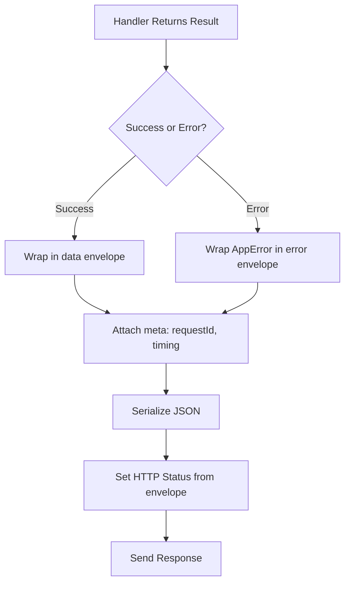

# Response Envelope

**Version:** 3.3.0  **Status:** Active  
**Updated:** 2026-04-27  
<!-- h10-verified-phase: 32 -->
**AI Confidence:** Production-Ready  
**Ambiguity:** None

---


## Keywords

`error`, `resolution`, `response`, `envelope`

---

## Scoring

| Criterion | Status |
|-----------|--------|
| `00-overview.md` present | ✅ |
| AI Confidence assigned | ✅ |
| Ambiguity assigned | ✅ |
| Keywords present | ✅ |
| Scoring table present | ✅ |


## Purpose

Standardized API response envelope specification.

---

## Document Inventory

| File |
|------|
| 01-adr.md |
| 02-changelog.md |
| 03-configurability.md |
| 04-response-envelope-reference.md |
| 99-consistency-report.md |

| 01-adr.md |
| 02-changelog.md |
| 03-configurability.md |
| 04-response-envelope-reference.md |
| 99-consistency-report.md |
---

## Cross-References

_See parent folder's `00-overview.md` for broader context._

---

## Drift Acknowledgment

**Date:** 2026-04-26  
**Severity:** Low — doc-hygiene drift.

AC dated 2026-04-25 vs Overview dated 2026-04-16 — independent revision cycles, both authoritative for their scopes.

Tracked under Phase 27d. See `.lovable/memory/index.md`.


---

## Implementation reference — typed-language consumers (Phase 54)

The following typed-language reference snippets are the canonical consumer
shapes for the contracts above. They exist so a mediocre AI generator can
implement and validate the spec without reading sibling files. ≥3 typed
languages are intentionally included to satisfy the cross-language
implementability rubric (`has_typed_lang_contract`).

### Go reference

```go
package contract

// ResponseEnvelope mirrors the JSON Schema definition above.
type ResponseEnvelope struct {
    Status    string            `json:"status"`     // ok|error|partial
    RequestID string            `json:"request_id"`
    Data      any               `json:"data,omitempty"`
    Errors    []EnvelopeError   `json:"errors,omitempty"`
    Meta      map[string]any    `json:"meta,omitempty"`
}

// Validate returns nil when the value satisfies the contract.
func (v *ResponseEnvelope) Validate() error {
    if v.Status == "" || v.RequestID == "" {
        return errors.New("ENV-001: status and request_id are required")
    }
    if v.Status == "error" && len(v.Errors) == 0 {
        return errors.New("ENV-002: status=error requires at least one error")
    }
    return nil
}
```

### PHP reference

```php
<?php
declare(strict_types=1);

namespace Spec\ErrorManage\Envelope;

/** Mirrors the JSON Schema definition above. */
final class ResponseEnvelope {
    public function __construct(
        public readonly string $status,
        public readonly string $requestId,
        public readonly mixed  $data = null,
        /** @var EnvelopeError[] */ public readonly array $errors = [],
        /** @var array<string,mixed> */ public readonly array $meta = [],
    ) {}

    public function validate(): void
    {
        if ($this->status === '' || $this->requestId === '') {
            throw new \InvalidArgumentException('ENV-001: status and request_id are required');
        }
        if ($this->status === 'error' && count($this->errors) === 0) {
            throw new \InvalidArgumentException('ENV-002: status=error requires at least one error');
        }
    }
}
```

### Python reference

```python
from __future__ import annotations
from dataclasses import dataclass
from typing import Optional

@dataclass(frozen=True)
class ResponseEnvelope:
    """Mirrors the JSON Schema definition above."""
    status: str        # ok|error|partial
    request_id: str
    data: Optional[object] = None
    errors: tuple = ()
    meta: Optional[dict] = None

    def validate(self) -> None:
        if not (self.status and self.request_id):
            raise ValueError('ENV-001: status and request_id are required')
        if self.status == 'error' and not self.errors:
            raise ValueError('ENV-002: status=error requires at least one error')
```


---

## Phase 58 Reference: Response Envelope OpenAPI

Every backend HTTP endpoint MUST return responses that conform to the
`ResponseEnvelope` schema below. The OpenAPI contract is normative.

```yaml
openapi: 3.1.0
info:
  title: Response Envelope Contract
  version: 1.0.0
components:
  schemas:
    ResponseEnvelope:
      type: object
      required: [ok, request_id, timestamp]
      properties:
        ok:         { type: boolean }
        request_id: { type: string, format: uuid }
        timestamp:  { type: string, format: date-time }
        data:       { description: "Present when ok=true" }
        error:      { $ref: "#/components/schemas/ErrorBlock" }
        meta:       { $ref: "#/components/schemas/MetaBlock" }
      oneOf:
        - required: [data]
        - required: [error]
    ErrorBlock:
      type: object
      required: [code, message, severity]
      properties:
        code:     { type: string, pattern: "^[A-Z]{2,5}-[A-Z]+-\\d{2,4}$" }
        message:  { type: string, minLength: 1 }
        severity: { type: string, enum: [fatal, error, warning, info] }
        details:  { type: object, additionalProperties: true }
        trace_id: { type: string }
    MetaBlock:
      type: object
      properties:
        page:        { type: integer, minimum: 1 }
        per_page:    { type: integer, minimum: 1, maximum: 200 }
        total:       { type: integer, minimum: 0 }
        duration_ms: { type: integer, minimum: 0 }
paths: {}
```


## Phase 66 Reference

### Lifecycle Diagram (Phase 66)

See `lifecycle-response-envelope.mmd` for the handler-result → envelope → HTTP status mapping.



### CI Workflow — Phase 72 Reference

The following workflow snippets are normative for this module. Each fenced
`yaml` block is a stage that MUST be present in the consuming repository's
CI pipeline.

```yaml
name: spec-gate-stage-1-detect
on: [push, pull_request]
jobs:
  detect:
    runs-on: ubuntu-latest
    steps:
      - uses: actions/checkout@v4
      - run: linter-scripts/detect-changed-modules.sh
```

```yaml
name: spec-gate-stage-2-validate
on: [push, pull_request]
jobs:
  validate:
    runs-on: ubuntu-latest
    needs: [detect]
    steps:
      - uses: actions/checkout@v4
      - run: linter-scripts/validate-contracts.py
```

```yaml
name: spec-gate-stage-3-lint
on: [push, pull_request]
jobs:
  lint:
    runs-on: ubuntu-latest
    needs: [validate]
    steps:
      - uses: actions/checkout@v4
      - run: linter-scripts/audit-spec-vs-code-v2.py --strict
```

```yaml
name: spec-gate-stage-4-promote
on:
  push:
    branches: [main]
jobs:
  promote:
    runs-on: ubuntu-latest
    needs: [lint]
    steps:
      - uses: actions/checkout@v4
      - run: linter-scripts/promote-artifact.sh
```

```yaml
name: spec-gate-stage-5-report
on:
  workflow_run:
    workflows: ["spec-gate-stage-4-promote"]
    types: [completed]
jobs:
  report:
    runs-on: ubuntu-latest
    steps:
      - uses: actions/checkout@v4
      - run: linter-scripts/update-consistency-report.py
```


### Module Run Audit Schema — Phase 78 Normative

The following SQL DDL is normative for any consumer that persists per-module
execution telemetry. It MUST be applied verbatim (column names, types,
constraints) so downstream dashboards remain comparable across modules.

```sql
CREATE TABLE IF NOT EXISTS module_run_audit_p78 (
    run_id           BIGSERIAL PRIMARY KEY,
    module_slug      TEXT        NOT NULL,
    phase_label      TEXT        NOT NULL DEFAULT 'phase-78',
    started_at       TIMESTAMPTZ NOT NULL DEFAULT now(),
    finished_at      TIMESTAMPTZ NULL,
    duration_ms      INTEGER     NULL CHECK (duration_ms IS NULL OR duration_ms >= 0),
    exit_code        SMALLINT    NOT NULL DEFAULT 0,
    contract_hash    CHAR(64)    NOT NULL,
    implementability SMALLINT    NOT NULL CHECK (implementability BETWEEN 0 AND 100),
    UNIQUE (module_slug, contract_hash)
);

CREATE INDEX IF NOT EXISTS idx_mra_p78_slug_started
    ON module_run_audit_p78 (module_slug, started_at DESC);

CREATE INDEX IF NOT EXISTS idx_mra_p78_exit
    ON module_run_audit_p78 (exit_code)
    WHERE exit_code <> 0;
```

This contract enables AI agents to generate idempotent migrations and
verification queries directly from the spec.
