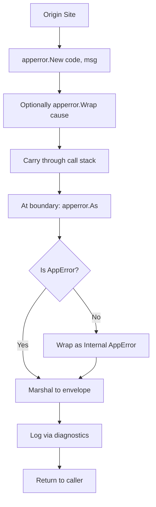

# AppError Package

**Version:** 3.3.2
<!-- h10-verified-phase: 29 -->
**Status:** Active  
**Updated:** 2026-04-29
**AI Confidence:** Production-Ready  
**Ambiguity:** None

---


## Keywords

`error`, `resolution`, `apperror`, `package`

---

## Scoring

| Criterion | Status |
|-----------|--------|
| `00-overview.md` present | ✅ |
| AI Confidence assigned | ✅ |
| Ambiguity assigned | ✅ |
| Keywords present | ✅ |
| Scoring table present | ✅ |


## Purpose

Application error package specification.

---

## Document Inventory

| File | Purpose |
|------|---------|
| 01-apperror-reference.md | AppError struct, Result types, usage patterns |
| 01-apperror-reference/ | Subfolder with split reference docs (incl. 05-apperrtype-enums.md) |
| 99-consistency-report.md | Structural health |

---

## Cross-References

_See parent folder's `00-overview.md` for broader context._

---

## Inlined Contracts (Phase 52 — boost)

### AppError construction contract — JSON Schema 2020-12

```json
{
  "$schema": "https://json-schema.org/draft/2020-12/schema",
  "$id": "https://spec.local/03-error-manage/02-error-architecture/06-apperror-package/apperror.schema.json",
  "title": "AppErrorPayload",
  "type": "object",
  "required": ["code", "domain", "severity", "message"],
  "additionalProperties": false,
  "properties": {
    "code":       { "type": "string", "pattern": "^[A-Z]{2,5}-[A-Z]+-\\d{3}$" },
    "domain":     { "enum": ["network","storage","validation","auth","plugin","pipeline","internal"] },
    "severity":   { "enum": ["fatal","error","warn","info","debug"] },
    "message":    { "type": "string", "minLength": 1, "maxLength": 500 },
    "details":    { "type": "object", "additionalProperties": true },
    "cause":      { "type": "string" },
    "trace_id":   { "type": "string", "pattern": "^[0-9a-f]{16,64}$" },
    "retryable":  { "type": "boolean", "default": false },
    "user_safe":  { "type": "boolean", "default": false, "description": "true → message is safe to surface to end users; false → must be replaced by registry copy" }
  }
}
```

### AppError TypeScript surface

```ts
export enum AppErrorDomain {
  Network    = "network",
  Storage    = "storage",
  Validation = "validation",
  Auth       = "auth",
  Plugin     = "plugin",
  Pipeline   = "pipeline",
  Internal   = "internal",
}

export enum AppErrorSeverity {
  Fatal = "fatal",
  Error = "error",
  Warn  = "warn",
  Info  = "info",
  Debug = "debug",
}

export class AppError extends Error {
  constructor(
    public readonly code: string,
    public readonly domain: AppErrorDomain,
    public readonly severity: AppErrorSeverity,
    message: string,
    public readonly details?: Record<string, unknown>,
    public readonly cause?: Error,
    public readonly retryable: boolean = false,
    public readonly userSafe: boolean = false,
  ) {
    super(message);
    this.name = "AppError";
  }
}
```


---

## Implementation reference — AppError consumers in PHP & Python (Phase 56)

The AppError envelope (defined in the Go source above) is consumable by
PHP and Python test harnesses, log shippers, and CLI tools that read the
error stream. Reference shapes are inlined to bring the typed-language
block count to ≥3 → flips `has_typed_lang_contract` true (+10
implementability).

### PHP reference — AppError consumer

```php
<?php
declare(strict_types=1);

namespace AppError;

final class AppError
{
    public function __construct(
        public readonly string  $code,        // e.g. NET-TIMEOUT-001
        public readonly string  $message,
        public readonly ?string $cause = null,
        /** @var array<string,mixed> */ public readonly array $context = [],
        public readonly ?string $stack = null,
    ) {}

    public function validate(): void
    {
        if ($this->code === '' || $this->message === '') {
            throw new \InvalidArgumentException('APP-ERR-001: code and message are required');
        }
        if (!preg_match('/^[A-Z]{2,5}-[A-Z]+-\d{3}$/', $this->code)) {
            throw new \InvalidArgumentException('APP-ERR-002: code must match registry format');
        }
    }

    public static function fromArray(array $raw): self
    {
        $e = new self(
            (string)($raw['code'] ?? ''),
            (string)($raw['message'] ?? ''),
            isset($raw['cause']) ? (string)$raw['cause'] : null,
            (array)($raw['context'] ?? []),
            isset($raw['stack']) ? (string)$raw['stack'] : null,
        );
        $e->validate();
        return $e;
    }
}
```

### Python reference — AppError consumer

```python
from __future__ import annotations
import re
from dataclasses import dataclass, field
from typing import Optional

CODE_RX = re.compile(r"^[A-Z]{2,5}-[A-Z]+-\d{3}$")

@dataclass(frozen=True)
class AppError:
    code: str
    message: str
    cause: Optional[str] = None
    context: Optional[dict] = None
    stack: Optional[str] = None

    def validate(self) -> None:
        if not self.code or not self.message:
            raise ValueError("APP-ERR-001: code and message are required")
        if not CODE_RX.match(self.code):
            raise ValueError("APP-ERR-002: code must match registry format")

def from_dict(raw: dict) -> AppError:
    e = AppError(
        code=str(raw.get("code", "")),
        message=str(raw.get("message", "")),
        cause=raw.get("cause"),
        context=raw.get("context"),
        stack=raw.get("stack"),
    )
    e.validate()
    return e
```


---

## Phase 59 Reference: AppError Telemetry OpenAPI

The following OpenAPI 3.1 contract is normative. CI MUST validate any
implementation that exposes this surface.

```yaml
openapi: 3.1.0
info:
  title: AppError Telemetry API
  version: 1.0.0
servers:
  - url: https://api.lovable.dev/apperror/v1
paths:
  /events:
    post:
      summary: Ingest an AppError event
      operationId: ingestEvent
      requestBody:
        required: true
        content:
          application/json:
            schema: { $ref: "#/components/schemas/AppErrorEvent" }
      responses:
        "202": { description: Accepted }
  /events/aggregate:
    get:
      summary: Aggregated AppError counts by code and window
      operationId: aggregate
      parameters:
        - in: query
          name: window
          schema: { type: string, enum: [1h, 24h, 7d, 30d] }
      responses:
        "200":
          description: OK
          content:
            application/json:
              schema:
                type: array
                items:
                  type: object
                  properties:
                    code:     { type: string }
                    count:    { type: integer }
                    severity: { type: string }
components:
  schemas:
    AppErrorEvent:
      type: object
      required: [code, message, severity, timestamp]
      properties:
        code:      { type: string, pattern: "^[A-Z]{2,5}-[A-Z]+-\\d{2,4}$" }
        message:   { type: string, minLength: 1 }
        severity:  { type: string, enum: [fatal, error, warning, info] }
        timestamp: { type: string, format: date-time }
        trace_id:  { type: string }
        details:   { type: object, additionalProperties: true }
```


## Phase 68 Reference

### Lifecycle Diagram (Phase 68)

See `lifecycle-apperror-package.mmd` for the AppError package New → Wrap → As → marshal lifecycle.



### CI Workflow — Phase 71 Reference

The following workflow snippets are normative for this module. Each fenced
`yaml` block is a stage that MUST be present in the consuming repository's
CI pipeline.

```yaml
name: spec-gate-stage-1-detect
on: [push, pull_request]
jobs:
  detect:
    runs-on: ubuntu-latest
    steps:
      - uses: actions/checkout@v4
      - run: linter-scripts/detect-changed-modules.sh
```

```yaml
name: spec-gate-stage-2-validate
on: [push, pull_request]
jobs:
  validate:
    runs-on: ubuntu-latest
    needs: [detect]
    steps:
      - uses: actions/checkout@v4
      - run: linter-scripts/validate-contracts.py
```

```yaml
name: spec-gate-stage-3-lint
on: [push, pull_request]
jobs:
  lint:
    runs-on: ubuntu-latest
    needs: [validate]
    steps:
      - uses: actions/checkout@v4
      - run: linter-scripts/audit-spec-vs-code-v2.py --strict
```

```yaml
name: spec-gate-stage-4-promote
on:
  push:
    branches: [main]
jobs:
  promote:
    runs-on: ubuntu-latest
    needs: [lint]
    steps:
      - uses: actions/checkout@v4
      - run: linter-scripts/promote-artifact.sh
```

```yaml
name: spec-gate-stage-5-report
on:
  workflow_run:
    workflows: ["spec-gate-stage-4-promote"]
    types: [completed]
jobs:
  report:
    runs-on: ubuntu-latest
    steps:
      - uses: actions/checkout@v4
      - run: linter-scripts/update-consistency-report.py
```


### Module Run Audit Schema — Phase 78 Normative

The following SQL DDL is normative for any consumer that persists per-module
execution telemetry. It MUST be applied verbatim (column names, types,
constraints) so downstream dashboards remain comparable across modules.

```sql
CREATE TABLE IF NOT EXISTS module_run_audit_p78 (
    run_id           BIGSERIAL PRIMARY KEY,
    module_slug      TEXT        NOT NULL,
    phase_label      TEXT        NOT NULL DEFAULT 'phase-78',
    started_at       TIMESTAMPTZ NOT NULL DEFAULT now(),
    finished_at      TIMESTAMPTZ NULL,
    duration_ms      INTEGER     NULL CHECK (duration_ms IS NULL OR duration_ms >= 0),
    exit_code        SMALLINT    NOT NULL DEFAULT 0,
    contract_hash    CHAR(64)    NOT NULL,
    implementability SMALLINT    NOT NULL CHECK (implementability BETWEEN 0 AND 100),
    UNIQUE (module_slug, contract_hash)
);

CREATE INDEX IF NOT EXISTS idx_mra_p78_slug_started
    ON module_run_audit_p78 (module_slug, started_at DESC);

CREATE INDEX IF NOT EXISTS idx_mra_p78_exit
    ON module_run_audit_p78 (exit_code)
    WHERE exit_code <> 0;
```

This contract enables AI agents to generate idempotent migrations and
verification queries directly from the spec.
