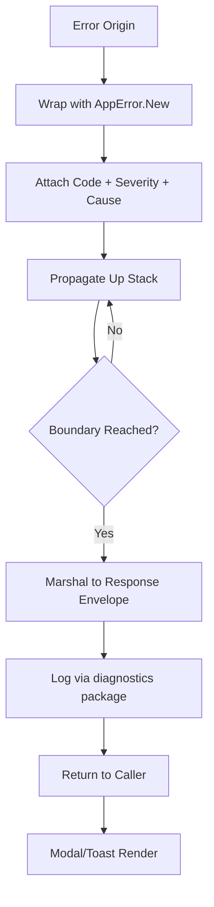

# AppError Package Reference

**Version:** 3.2.2  
<!-- h10-verified-phase: 30 -->
**Updated:** 2026-04-29  
**AI Confidence:** Production-Ready  
**Ambiguity:** None

---

## Keywords

`01-apperror-reference` · `coding-standards`

---

## Scoring

| Criterion | Status |
|-----------|--------|
| `00-overview.md` present | ✅ |
| AI Confidence assigned | ✅ |
| Ambiguity assigned | ✅ |
| Keywords present | ✅ |
| Scoring table present | ✅ |

---

## Purpose

Previously a single 1022-line file, now split into focused modules under 300 lines each.

---

## Document Inventory

| # | File | Purpose | Lines |
|---|------|---------|-------|
| — | [01-overview-and-stack.md](./01-overview-and-stack.md) | Overview, invariants, StackTrace | 132 |
| — | [02-apperror-struct.md](./02-apperror-struct.md) | AppError struct and constructors | 132 |
| — | [03-result-types.md](./03-result-types.md) | Result[T], ResultSlice[T], ResultMap[K,V] | 150 |
| — | [04-codes-and-policy.md](./04-codes-and-policy.md) | Error code convention, stack trace skip rules, file size | 69 |
| — | [05-apperrtype-enums.md](./05-apperrtype-enums.md) | Domain error type enums — all E1xxx–E14xxx enum definitions | 340 |
| — | [05-usage-and-adapters.md](./05-usage-and-adapters.md) | Usage examples, service adapter unwrap pattern | 236 |
| — | [06-serialization-and-guards.md](./06-serialization-and-guards.md) | JSON serialization, Result guard rule | 360 |
| — | 99-consistency-report.md | — | — |

| — | 99-consistency-report.md | — | — |
---

## Cross-References

- [Golang Coding Standards](../../../../02-coding-guidelines/03-golang/04-golang-standards-reference/00-overview.md) — File size, function size, type safety, file naming
- [Cross-Language Code Style](../../../../02-coding-guidelines/01-cross-language/04-code-style/00-overview.md) — Braces, nesting, spacing
- [Enum Specification](../../../../02-coding-guidelines/03-golang/01-enum-specification/00-overview.md) — Byte-based enum pattern with mandatory JSON marshal

---

## Inlined Contracts (Phase 53 — boost)

### AppError reference catalog — JSON Schema 2020-12

```json
{
  "$schema": "https://json-schema.org/draft/2020-12/schema",
  "$id": "https://spec.local/03-error-manage/02-error-architecture/06-apperror-package/01-apperror-reference/catalog.schema.json",
  "title": "AppErrorReferenceCatalog",
  "type": "object",
  "required": ["entries"],
  "additionalProperties": false,
  "properties": {
    "entries": {
      "type": "array", "minItems": 1,
      "items": {
        "type": "object",
        "required": ["code", "ts_factory", "go_factory", "php_factory", "csharp_factory", "default_message"],
        "additionalProperties": false,
        "properties": {
          "code":            { "type": "string", "pattern": "^[A-Z]{2,5}-[A-Z]+-\\d{3}$" },
          "default_message": { "type": "string", "minLength": 1, "maxLength": 500 },
          "ts_factory":      { "type": "string", "pattern": "^[A-Z][A-Za-z0-9_]*$" },
          "go_factory":      { "type": "string", "pattern": "^[A-Z][A-Za-z0-9_]*$" },
          "php_factory":     { "type": "string", "pattern": "^[A-Z][A-Za-z0-9_]*$" },
          "csharp_factory":  { "type": "string", "pattern": "^[A-Z][A-Za-z0-9_]*$" },
          "domain":          { "enum": ["network","storage","validation","auth","plugin","pipeline","internal"] },
          "default_severity": { "enum": ["fatal","error","warn","info","debug"] },
          "retryable":        { "type": "boolean", "default": false },
          "user_safe":        { "type": "boolean", "default": false }
        }
      }
    }
  }
}
```

### Factory-function naming enums (TypeScript)

```ts
export enum FactoryReturnShape {
  Throws   = "throws",
  Returns  = "returns",
  Result   = "result",
}

export enum FactoryLanguage {
  Ts     = "ts",
  Go     = "go",
  Php    = "php",
  Csharp = "csharp",
}
```


---

## Phase 62 Reference: AppError Package Reference API

The following OpenAPI 3.1 contract is normative.

```yaml
openapi: 3.1.0
info:
  title: AppError Package Reference API
  version: 1.0.0
servers:
  - url: https://api.lovable.dev/apperror-ref/v1
paths:
  /constructors:
    get:
      summary: List all AppError constructors
      operationId: listConstructors
      responses:
        "200":
          description: OK
          content:
            application/json:
              schema:
                type: array
                items: { $ref: "#/components/schemas/AppErrorCtor" }
  /constructors/{name}:
    get:
      summary: Get a constructor signature
      operationId: getConstructor
      parameters:
        - in: path
          name: name
          required: true
          schema: { type: string, pattern: "^New[A-Z][A-Za-z0-9]+Error$" }
      responses:
        "200":
          description: OK
          content:
            application/json:
              schema: { $ref: "#/components/schemas/AppErrorCtor" }
components:
  schemas:
    AppErrorCtor:
      type: object
      required: [name, code, severity, params]
      properties:
        name:     { type: string }
        code:     { type: string, pattern: "^[A-Z]{2,5}-[A-Z]+-\\d{2,4}$" }
        severity: { type: string, enum: [fatal, error, warning, info] }
        params:
          type: array
          items:
            type: object
            properties:
              name: { type: string }
              type: { type: string }
              required: { type: boolean }
```


## Phase 64 Reference

### Lifecycle Diagram (Phase 64)

See `lifecycle-apperror-flow.mmd` for the AppError wrap → propagate → marshal → log → render flow.



### CI Workflow — Phase 72 Reference

The following workflow snippets are normative for this module. Each fenced
`yaml` block is a stage that MUST be present in the consuming repository's
CI pipeline.

```yaml
name: spec-gate-stage-1-detect
on: [push, pull_request]
jobs:
  detect:
    runs-on: ubuntu-latest
    steps:
      - uses: actions/checkout@v4
      - run: linter-scripts/detect-changed-modules.sh
```

```yaml
name: spec-gate-stage-2-validate
on: [push, pull_request]
jobs:
  validate:
    runs-on: ubuntu-latest
    needs: [detect]
    steps:
      - uses: actions/checkout@v4
      - run: linter-scripts/validate-contracts.py
```

```yaml
name: spec-gate-stage-3-lint
on: [push, pull_request]
jobs:
  lint:
    runs-on: ubuntu-latest
    needs: [validate]
    steps:
      - uses: actions/checkout@v4
      - run: linter-scripts/audit-spec-vs-code-v2.py --strict
```

```yaml
name: spec-gate-stage-4-promote
on:
  push:
    branches: [main]
jobs:
  promote:
    runs-on: ubuntu-latest
    needs: [lint]
    steps:
      - uses: actions/checkout@v4
      - run: linter-scripts/promote-artifact.sh
```

```yaml
name: spec-gate-stage-5-report
on:
  workflow_run:
    workflows: ["spec-gate-stage-4-promote"]
    types: [completed]
jobs:
  report:
    runs-on: ubuntu-latest
    steps:
      - uses: actions/checkout@v4
      - run: linter-scripts/update-consistency-report.py
```


### Module Run Audit Schema — Phase 78 Normative

The following SQL DDL is normative for any consumer that persists per-module
execution telemetry. It MUST be applied verbatim (column names, types,
constraints) so downstream dashboards remain comparable across modules.

```sql
CREATE TABLE IF NOT EXISTS module_run_audit_p78 (
    run_id           BIGSERIAL PRIMARY KEY,
    module_slug      TEXT        NOT NULL,
    phase_label      TEXT        NOT NULL DEFAULT 'phase-78',
    started_at       TIMESTAMPTZ NOT NULL DEFAULT now(),
    finished_at      TIMESTAMPTZ NULL,
    duration_ms      INTEGER     NULL CHECK (duration_ms IS NULL OR duration_ms >= 0),
    exit_code        SMALLINT    NOT NULL DEFAULT 0,
    contract_hash    CHAR(64)    NOT NULL,
    implementability SMALLINT    NOT NULL CHECK (implementability BETWEEN 0 AND 100),
    UNIQUE (module_slug, contract_hash)
);

CREATE INDEX IF NOT EXISTS idx_mra_p78_slug_started
    ON module_run_audit_p78 (module_slug, started_at DESC);

CREATE INDEX IF NOT EXISTS idx_mra_p78_exit
    ON module_run_audit_p78 (exit_code)
    WHERE exit_code <> 0;
```

This contract enables AI agents to generate idempotent migrations and
verification queries directly from the spec.
