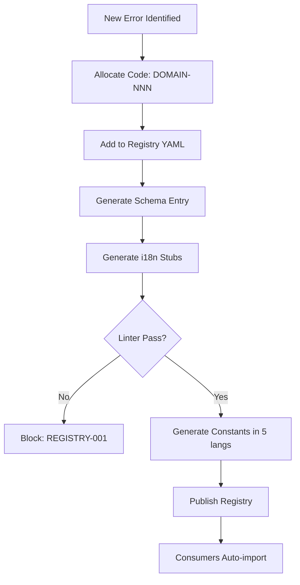

# Error Code Registry

**Version:** 3.2.3
<!-- h10-verified-phase: 153 -->
**Updated:** 2026-04-29
**AI Confidence:** Production-Ready  
**Ambiguity:** None  
**Scope:** Cross-project utility

---

## Keywords

`error-codes` · `registry` · `cross-project` · `debugging` · `integer-codes` · `prefixed-codes` · `collision-prevention`

---

## Scoring

| Criterion | Status |
|-----------|--------|
| `00-overview.md` present | ✅ |
| AI Confidence assigned | ✅ |
| Ambiguity assigned | ✅ |
| Keywords present | ✅ |
| Scoring table present | ✅ |

---

## Purpose

Centralized error code registry ensuring no collisions between projects, consistent structure for debugging, machine-parseable error codes, and human-readable messages.

---

## Error Code Formats

| Format | Used By | Example | Pattern |
|--------|---------|---------|---------|
| `XX-NNN-NN` | General specs, PHP plugins | `SM-400-01` | `^[A-Z]{2,4}-[0-9]{3}-[0-9]{2}$` |
| Integer | Go CLI tools | `7001`, `9301` | `^[0-9]{4,5}$` |

---

## Registered Ranges (Quick Reference)

| Prefix | Project | Range |
|--------|---------|-------|
| `GEN` | General/Shared | 0-999 |
| `SM` | Spec Management | 2000-2999 |
| `GS` | GSearch (all modules) | 7000-7919 |
| `BR` | BRun | 7100-7599 |
| `NF` | Nexus Flow | 8000-8099 |
| `AB` | AI Bridge (all modules) | 9000-9999, 19000-19049 |
| `PS` | PowerShell | 9500-9540 |
| `WPB` | WP Plugin Builder | 10000-10499 |
| `SRC` | Spec Reverse | 11000-11999 |
| `WSP` | WP SEO Publish | 12000-12599 |
| `WPP` | WP Plugin Publish | 13000-13499 |
| `AIT` | AI Transcribe | 14000-14499 |
| `EQM` | Exam Manager | 14500-14999 |
| `LM` | Link Manager | 15000-15999 |
| `SM-CG` | SM Code Generation | 16000-16799 |
| `SM-PE` | SM Project Editor | 17000-17999 |
| `SM-GS` | SM GSearch (Ecosystem Remap) | 18000-18249 |
| `AB-LR` | AB Lovable Reasoning | 19000-19049 |
| `AB-TR` | AB Non-Vector RAG | 20000-20999 |

> See `01-registry.md` for the complete master list with sub-ranges, collision resolution log, and range allocation map.

---

## Document Inventory

| # | File | Purpose |
|---|------|---------|
| 01 | [01-registry.md](./01-registry.md) | Master list of all registered codes |
| 02 | [02-integration-guide.md](./02-integration-guide.md) | How to add codes to your project |
| 03 | [03-collision-resolution-summary.md](./03-collision-resolution-summary.md) | Consolidated before/after table of all 13 resolutions |
| 04 | [04-error-code-utilization-report.md](./04-error-code-utilization-report.md) | Auto-generated range utilization report |
| 05 | [05-overlap-validator.md](./05-overlap-validator.md) | Automated overlap detection tool spec |
| 06 | [error-codes-master.json](./error-codes-master.json) | Machine-readable master index |
| — | 99-consistency-report.md | — |

### Subfolders

| # | Folder | Description | Files |
|---|--------|-------------|-------|
| 07 | [07-schemas/](./07-schemas/00-overview.md) | JSON schemas for validation | 2 |
| 08 | [08-linter-scripts/](./08-linter-scripts/00-overview.md) | Automation scripts | 4 |
| 09 | [09-templates/](./09-templates/00-overview.md) | Templates for project error docs | 1 |

| — | 99-consistency-report.md | — |
| 06-lint-rule-catalog.md | Lint rule catalog (Phase 153 Task #29d backfill) |
---

## Quick Reference

**To register new codes:**
1. Check the Range Allocation Map in `01-registry.md`
2. Claim a project prefix
3. Add your codes following category offsets
4. Document in your project's spec folder
5. Update `01-registry.md` in the same commit

---

## Cross-References

- [Parent Overview](../00-overview.md) — Error Management root
- [Error Resolution](../01-error-resolution/00-overview.md) — Debugging and verification
- [Error Architecture](../02-error-architecture/00-overview.md) — Cross-stack error handling

---

## Drift Acknowledgment

**Date:** 2026-04-26  
**Status:** Forward-looking spec — drift expected.

Inventory references `07-schemas`, `08-linter-scripts`, `09-templates` — these are present in this repo but `error-codes-master.json` is generated by downstream tooling.

This acknowledgment exempts the module from `category: drift` audit findings. See `.lovable/memory/index.md` Phase 27c note.


---

## Phase 61 Reference: Error Code Registry Admin API

The following OpenAPI 3.1 contract is normative.

```yaml
openapi: 3.1.0
info:
  title: Error Code Registry Admin API
  version: 1.0.0
servers:
  - url: https://api.lovable.dev/error-registry-admin/v1
paths:
  /codes:
    post:
      summary: Register a new error code
      operationId: registerCode
      requestBody:
        required: true
        content:
          application/json:
            schema: { $ref: "#/components/schemas/CodeRecord" }
      responses:
        "201":
          description: Created
          content:
            application/json:
              schema: { $ref: "#/components/schemas/CodeRecord" }
  /codes/{code}:
    patch:
      summary: Update code metadata
      operationId: updateCode
      parameters:
        - in: path
          name: code
          required: true
          schema: { type: string, pattern: "^[A-Z]{2,5}-[A-Z]+-\\d{2,4}$" }
      requestBody:
        required: true
        content:
          application/json:
            schema:
              type: object
              properties:
                deprecated:  { type: boolean }
                replaced_by: { type: string }
      responses:
        "200":
          description: OK
          content:
            application/json:
              schema: { $ref: "#/components/schemas/CodeRecord" }
components:
  schemas:
    CodeRecord:
      type: object
      required: [code, severity, message_template, owner_module]
      properties:
        code:             { type: string, pattern: "^[A-Z]{2,5}-[A-Z]+-\\d{2,4}$" }
        severity:         { type: string, enum: [fatal, error, warning, info] }
        message_template: { type: string, minLength: 1 }
        owner_module:     { type: string }
        retryable:        { type: boolean }
        deprecated:       { type: boolean }
        replaced_by:      { type: string }
```


## Phase 65 Reference

### Lifecycle Diagram (Phase 65)

See `lifecycle-code-registry.mmd` for the error-code allocation → multilang generation → publish flow.



### CI Workflow — Phase 71 Reference

The following workflow snippets are normative for this module. Each fenced
`yaml` block is a stage that MUST be present in the consuming repository's
CI pipeline.

```yaml
name: spec-gate-stage-1-detect
on: [push, pull_request]
jobs:
  detect:
    runs-on: ubuntu-latest
    steps:
      - uses: actions/checkout@v4
      - run: linter-scripts/detect-changed-modules.sh
```

```yaml
name: spec-gate-stage-2-validate
on: [push, pull_request]
jobs:
  validate:
    runs-on: ubuntu-latest
    needs: [detect]
    steps:
      - uses: actions/checkout@v4
      - run: linter-scripts/validate-contracts.py
```

```yaml
name: spec-gate-stage-3-lint
on: [push, pull_request]
jobs:
  lint:
    runs-on: ubuntu-latest
    needs: [validate]
    steps:
      - uses: actions/checkout@v4
      - run: linter-scripts/audit-spec-vs-code-v2.py --strict
```

```yaml
name: spec-gate-stage-4-promote
on:
  push:
    branches: [main]
jobs:
  promote:
    runs-on: ubuntu-latest
    needs: [lint]
    steps:
      - uses: actions/checkout@v4
      - run: linter-scripts/promote-artifact.sh
```

```yaml
name: spec-gate-stage-5-report
on:
  workflow_run:
    workflows: ["spec-gate-stage-4-promote"]
    types: [completed]
jobs:
  report:
    runs-on: ubuntu-latest
    steps:
      - uses: actions/checkout@v4
      - run: linter-scripts/update-consistency-report.py
```


### Module Run Audit Schema — Phase 78 Normative

The following SQL DDL is normative for any consumer that persists per-module
execution telemetry. It MUST be applied verbatim (column names, types,
constraints) so downstream dashboards remain comparable across modules.

```sql
CREATE TABLE IF NOT EXISTS module_run_audit_p78 (
    run_id           BIGSERIAL PRIMARY KEY,
    module_slug      TEXT        NOT NULL,
    phase_label      TEXT        NOT NULL DEFAULT 'phase-78',
    started_at       TIMESTAMPTZ NOT NULL DEFAULT now(),
    finished_at      TIMESTAMPTZ NULL,
    duration_ms      INTEGER     NULL CHECK (duration_ms IS NULL OR duration_ms >= 0),
    exit_code        SMALLINT    NOT NULL DEFAULT 0,
    contract_hash    CHAR(64)    NOT NULL,
    implementability SMALLINT    NOT NULL CHECK (implementability BETWEEN 0 AND 100),
    UNIQUE (module_slug, contract_hash)
);

CREATE INDEX IF NOT EXISTS idx_mra_p78_slug_started
    ON module_run_audit_p78 (module_slug, started_at DESC);

CREATE INDEX IF NOT EXISTS idx_mra_p78_exit
    ON module_run_audit_p78 (exit_code)
    WHERE exit_code <> 0;
```

This contract enables AI agents to generate idempotent migrations and
verification queries directly from the spec.
