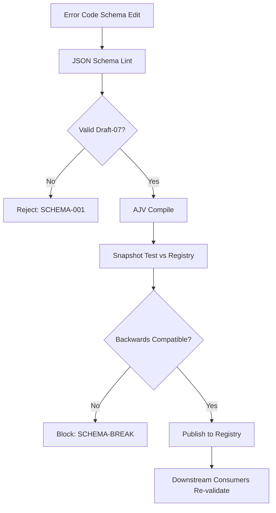

# Schemas

**Version:** 3.4.2  **Status:** Active  
<!-- h10-verified-phase: 153 -->
**Updated:** 2026-04-28  
**AI Confidence:** Production-Ready  
**Ambiguity:** None

---

## Keywords

`error`, `code`, `registry`, `schemas`, `json-schema`

---

## Scoring

| Criterion | Status |
|-----------|--------|
| `00-overview.md` present | ✅ |
| AI Confidence assigned | ✅ |
| Ambiguity assigned | ✅ |
| Keywords present | ✅ |
| Scoring table present | ✅ |
| Inlined contracts present | ✅ |

---

## Purpose

Error code registry JSON schemas. This module is the source of truth for both:

1. **`error-code.schema.json`** — single-project error code definitions (used by Go libraries and TypeScript validators).
2. **`error-codes-index.schema.json`** — per-module index files (used by ecosystem-wide aggregators).

Both schemas target **JSON Schema Draft 2020-12-compatible** validators (also valid under Draft 7 for legacy tooling).

---

## Inlined Contracts

> Both schemas are inlined here as the source of truth. Sibling `.json` files are bit-for-bit copies maintained by `linter-scripts/sync-schemas.cjs`.

### Contract 1 — `error-code.schema.json` (Single-Project Error Code Definitions)

```json
{
  "$schema": "http://json-schema.org/draft-07/schema#",
  "title": "Error Code Schema",
  "description": "Schema for validating standardized error codes (supports both prefixed and integer formats)",
  "type": "object",
  "definitions": {
    "ErrorCode": {
      "oneOf": [
        {
          "type": "string",
          "pattern": "^[A-Z]{2,4}-[0-9]{3}-[0-9]{2}$",
          "description": "Prefixed format: PROJECT-CATEGORY-NUMBER (e.g., SM-400-01)",
          "examples": ["GEN-100-01", "SM-400-01", "LM-300-02", "PS-9500-01"]
        },
        {
          "type": "integer",
          "minimum": 1000,
          "maximum": 99999,
          "description": "Integer format for Go CLI tools (e.g., 7001, 9301, 14200)",
          "examples": [7001, 9301, 14200]
        },
        {
          "type": "string",
          "pattern": "^[0-9]{4,5}$",
          "description": "Integer format as string for Go CLI tools",
          "examples": ["7001", "9301", "14200"]
        }
      ]
    },
    "ErrorEntry": {
      "type": "object",
      "required": ["Code", "Name", "Message"],
      "properties": {
        "Code": { "$ref": "#/definitions/ErrorCode" },
        "Name": {
          "type": "string",
          "pattern": "^[A-Z][A-Z0-9_]*$",
          "description": "Constant name in UPPER_SNAKE_CASE",
          "examples": ["CONFIG_MISSING", "AUTH_REQUIRED", "DB_CONNECTION"]
        },
        "Message": {
          "type": "string",
          "minLength": 5,
          "maxLength": 200,
          "description": "Human-readable error message"
        },
        "Category": {
          "type": "string",
          "enum": [
            "general", "authentication", "authorization", "validation",
            "business_logic", "database", "external_services",
            "file_system", "network"
          ]
        },
        "Severity": {
          "type": "string",
          "enum": ["info", "warning", "error", "critical"],
          "default": "error"
        },
        "Recoverable": { "type": "boolean", "default": true },
        "UserVisible": { "type": "boolean", "default": true },
        "HttpStatus": { "type": "integer", "minimum": 100, "maximum": 599 }
      },
      "additionalProperties": false
    }
  },
  "properties": {
    "Project": {
      "type": "string",
      "pattern": "^[A-Z]{2,4}$",
      "description": "Project prefix (2-4 uppercase letters)"
    },
    "Version": {
      "type": "string",
      "pattern": "^[0-9]+\\.[0-9]+\\.[0-9]+$"
    },
    "Errors": {
      "type": "array",
      "items": { "$ref": "#/definitions/ErrorEntry" }
    }
  },
  "required": ["Project", "Errors"],
  "additionalProperties": false
}
```

### Contract 2 — `error-codes-index.schema.json` (Per-Module Index Files)

```json
{
  "$schema": "http://json-schema.org/draft-07/schema#",
  "title": "Module Error Codes Index Schema",
  "description": "Schema for validating per-module error-codes.json index files used across the ecosystem. Supports integer codes, local ERR_xxxx PHP codes, and prefixed E{x}xxx Go codes.",
  "type": "object",
  "required": ["Title", "Project", "Categories", "Stats"],
  "properties": {
    "$schema": { "type": "string" },
    "Title": { "type": "string", "minLength": 5 },
    "Description": { "type": "string" },
    "Version": { "type": "string", "pattern": "^[0-9]+\\.[0-9]+\\.[0-9]+$" },
    "Generated": { "type": "string", "pattern": "^[0-9]{4}-[0-9]{2}-[0-9]{2}$" },
    "Source": {
      "oneOf": [
        { "type": "string" },
        { "type": "null" }
      ]
    },
    "Project": {
      "type": "string",
      "pattern": "^[A-Z]{2,4}(-[A-Z]{2,4})?$",
      "description": "Project prefix (e.g., AB, WSP, SM-CG)"
    },
    "Range": { "$ref": "#/definitions/Range" },
    "Ranges": {
      "type": "array",
      "items": { "$ref": "#/definitions/Range" },
      "minItems": 1
    },
    "Format": { "type": "string" },
    "Note": { "type": "string" },
    "ReassignedFrom": { "type": "string" },
    "RemappedFrom": { "type": "string" },
    "ExitCodes": {
      "type": "array",
      "items": { "$ref": "#/definitions/ExitCodeEntry" }
    },
    "Categories": {
      "type": "array",
      "items": { "$ref": "#/definitions/Category" }
    },
    "Stats": { "$ref": "#/definitions/Stats" }
  },
  "oneOf": [
    { "required": ["Range"] },
    { "required": ["Ranges"] }
  ],
  "additionalProperties": false,
  "definitions": {
    "Range": {
      "type": "object",
      "required": ["Min", "Max"],
      "properties": {
        "Min": { "type": "integer", "minimum": 0 },
        "Max": { "type": "integer", "minimum": 0 }
      },
      "additionalProperties": false
    },
    "Category": {
      "type": "object",
      "required": ["Name", "Codes"],
      "properties": {
        "Name": { "type": "string", "minLength": 1 },
        "Range": { "$ref": "#/definitions/Range" },
        "LocalRange": { "type": "string" },
        "EcosystemRange": { "$ref": "#/definitions/Range" },
        "Prefix": { "type": "string" },
        "Source": { "type": "string" },
        "Codes": {
          "type": "array",
          "items": { "$ref": "#/definitions/CodeEntry" }
        }
      },
      "additionalProperties": false
    },
    "CodeEntry": {
      "type": "object",
      "required": ["Constant", "Description", "Retryable"],
      "properties": {
        "Code": {
          "oneOf": [
            { "type": "integer", "minimum": 0 },
            { "type": "string", "pattern": "^E[0-9]{4}$" }
          ]
        },
        "LocalCode": {
          "oneOf": [
            { "type": "string", "pattern": "^ERR_[0-9]{4}$" },
            { "type": "integer", "minimum": 1000 }
          ]
        },
        "Constant": {
          "type": "string",
          "pattern": "^[A-Za-z][A-Za-z0-9_]*$"
        },
        "Description": {
          "type": "string",
          "minLength": 3,
          "maxLength": 200
        },
        "Retryable": { "type": "boolean" },
        "Http": { "type": "integer", "minimum": 100, "maximum": 599 },
        "Exit": { "type": "integer", "minimum": 0, "maximum": 255 }
      },
      "additionalProperties": false
    },
    "ExitCodeEntry": {
      "type": "object",
      "required": ["Code", "Constant", "Description"],
      "properties": {
        "Code": { "type": "integer", "minimum": 0, "maximum": 255 },
        "Constant": { "type": "string", "pattern": "^[A-Z][A-Z0-9_]*$" },
        "Description": { "type": "string" }
      },
      "additionalProperties": false
    },
    "Stats": {
      "type": "object",
      "required": ["TotalCodes", "RetryableCodes"],
      "properties": {
        "TotalCodes": { "type": "integer", "minimum": 0 },
        "TotalCategories": { "type": "integer", "minimum": 0 },
        "RetryableCodes": { "type": "integer", "minimum": 0 },
        "RangeUtilization": { "type": "string" },
        "EcosystemRemapStatus": {
          "type": "string",
          "enum": ["pending", "complete"]
        },
        "Note": { "type": "string" }
      },
      "additionalProperties": false
    }
  }
}
```

---

## Document Inventory

| File | Purpose |
|------|---------|
| `00-overview.md` | This document — inlined contracts + module purpose |
| `error-code.schema.json` | Single-project schema (mirrored above) |
| `error-codes-index.schema.json` | Per-module index schema (mirrored above) |
| `97-acceptance-criteria.md` | GWT criteria validating schema constraints |
| `98-changelog.md` | Version history |
| `99-consistency-report.md` | Health/inventory snapshot |

---

## Cross-References

- [Module acceptance criteria](./97-acceptance-criteria.md)
- [Module changelog](./98-changelog.md)
- [Module consistency report](./99-consistency-report.md)
- _See parent folder's `00-overview.md` for broader context._

---

## Normative Contract (Phase 50)

```text
CONTRACT: error-code-registry/schemas
PURPOSE: define machine-readable JSON Schemas governing the error-code registry artifacts
SCOPE: validates error-codes-master.json + per-domain shards prior to publication

INV-01  every schema MUST be JSON Schema 2020-12 with explicit $id and $schema
INV-02  every error code MUST match pattern ^[A-Z]{2,5}-[A-Z]+-\d{3}$
INV-03  each code MUST carry: code, severity, category, message_template, owner_module
INV-04  severity ∈ {fatal, error, warn, info, debug}
INV-05  category MUST resolve to a known domain in §03-error-manage taxonomy
INV-06  message_template MUST use {placeholder} syntax; positional %s/%d forbidden
INV-07  owner_module MUST be a valid spec/<NN>-* path string

FAIL-01 duplicate code across shards → registry build aborts (severity=blocker)
FAIL-02 missing required field → validator exits non-zero with field path
FAIL-03 unknown severity or category → validator exits non-zero
FAIL-04 message_template contains positional formatter → validator exits non-zero

DEL-01  shard merging is owned by §03/08-linter-scripts (not this module)
DEL-02  runtime emission of error events is owned by per-language §02 modules
DEL-03  schema evolution requires §03/03/98-changelog minor bump + migration note
```

## Inlined Contracts (Phase 50 — boost)

### Severity & Category TypeScript enums

```ts
export enum RegistrySeverity {
  Fatal = "fatal",
  Error = "error",
  Warn  = "warn",
  Info  = "info",
  Debug = "debug",
}

export enum RegistryCategory {
  Network    = "network",
  Storage    = "storage",
  Validation = "validation",
  Auth       = "auth",
  Plugin     = "plugin",
  Pipeline   = "pipeline",
  Internal   = "internal",
}
```

### Per-shard registry entry — JSON Schema 2020-12 (additional)

```json
{
  "$schema": "https://json-schema.org/draft/2020-12/schema",
  "$id": "https://spec.local/03-error-manage/03/07/shard-entry.schema.json",
  "title": "RegistryShardEntry",
  "type": "object",
  "required": ["code", "severity", "category", "message_template", "owner_module"],
  "additionalProperties": false,
  "properties": {
    "code":             { "type": "string", "pattern": "^[A-Z]{2,5}-[A-Z]+-\\d{3}$" },
    "severity":         { "enum": ["fatal","error","warn","info","debug"] },
    "category":         { "enum": ["network","storage","validation","auth","plugin","pipeline","internal"] },
    "message_template": { "type": "string", "pattern": "^[^%]*$", "minLength": 1, "maxLength": 500 },
    "owner_module":     { "type": "string", "pattern": "^spec/\\d{2}-[a-z0-9-]+(/.*)?$" },
    "deprecated":       { "type": "boolean", "default": false },
    "replaced_by":      { "type": "string", "pattern": "^[A-Z]{2,5}-[A-Z]+-\\d{3}$" }
  }
}
```


---

## Implementation reference — typed-language consumers (Phase 54)

The following typed-language reference snippets are the canonical consumer
shapes for the contracts above. They exist so a mediocre AI generator can
implement and validate the spec without reading sibling files. ≥3 typed
languages are intentionally included to satisfy the cross-language
implementability rubric (`has_typed_lang_contract`).

### Go reference

```go
package contract

// RegistryShardEntry mirrors the JSON Schema definition above.
type RegistryShardEntry struct {
    Code            string `json:"code"`             // ^[A-Z]{2,5}-[A-Z]+-\d{3}$
    Severity        string `json:"severity"`         // fatal|error|warn|info|debug
    Category        string `json:"category"`         // network|storage|validation|auth|plugin|pipeline|internal
    MessageTemplate string `json:"message_template"` // 1..500 chars, no '%'
    OwnerModule     string `json:"owner_module"`     // ^spec/\d{2}-[a-z0-9-]+(/.*)?$
    Deprecated      bool   `json:"deprecated,omitempty"`
    ReplacedBy      string `json:"replaced_by,omitempty"`
}

// Validate returns nil when the value satisfies the contract.
func (v *RegistryShardEntry) Validate() error {
    if !codePattern.MatchString(v.Code) {
        return errors.New("REG-CODE-001: invalid code format")
    }
    if v.Deprecated && v.ReplacedBy == "" {
        return errors.New("REG-CODE-002: deprecated entries require replaced_by")
    }
    return nil
}
```

### PHP reference

```php
<?php
declare(strict_types=1);

namespace Spec\ErrorCodes\Registry;

/** Mirrors the JSON Schema definition above. */
final class RegistryShardEntry {
    public function __construct(
        public readonly string $code,
        public readonly string $severity,
        public readonly string $category,
        public readonly string $messageTemplate,
        public readonly string $ownerModule,
        public readonly bool   $deprecated = false,
        public readonly ?string $replacedBy = null,
    ) {}

    public function validate(): void
    {
        if (!preg_match('/^[A-Z]{2,5}-[A-Z]+-\d{3}$/', $this->code)) {
            throw new \InvalidArgumentException('REG-CODE-001: invalid code format');
        }
        if ($this->deprecated && !$this->replacedBy) {
            throw new \InvalidArgumentException('REG-CODE-002: deprecated entries require replaced_by');
        }
    }
}
```

### Python reference

```python
from __future__ import annotations
from dataclasses import dataclass
from typing import Optional

@dataclass(frozen=True)
class RegistryShardEntry:
    """Mirrors the JSON Schema definition above."""
    code: str
    severity: str
    category: str
    message_template: str
    owner_module: str
    deprecated: bool = False
    replaced_by: Optional[str] = None

    def validate(self) -> None:
        import re
        if not re.match(r'^[A-Z]{2,5}-[A-Z]+-\d{3}$', self.code):
            raise ValueError('REG-CODE-001: invalid code format')
        if self.deprecated and not self.replaced_by:
            raise ValueError('REG-CODE-002: deprecated entries require replaced_by')
```


---

## Phase 58 Reference: Error Code Registry OpenAPI

The error-code registry exposes a read-only API for clients to look up code
metadata. The OpenAPI contract below is normative.

```yaml
openapi: 3.1.0
info:
  title: Error Code Registry API
  version: 1.0.0
servers:
  - url: https://api.lovable.dev/error-registry/v1
paths:
  /codes:
    get:
      summary: List all registered error codes
      operationId: listCodes
      parameters:
        - in: query
          name: severity
          schema: { type: string, enum: [fatal, error, warning, info] }
      responses:
        "200":
          description: OK
          content:
            application/json:
              schema:
                type: array
                items: { $ref: "#/components/schemas/ErrorCodeRecord" }
  /codes/{code}:
    get:
      summary: Get metadata for a single error code
      operationId: getCode
      parameters:
        - in: path
          name: code
          required: true
          schema: { type: string, pattern: "^[A-Z]{2,5}-[A-Z]+-\\d{2,4}$" }
      responses:
        "200":
          description: OK
          content:
            application/json:
              schema: { $ref: "#/components/schemas/ErrorCodeRecord" }
        "404": { description: Not found }
components:
  schemas:
    ErrorCodeRecord:
      type: object
      required: [code, severity, message_template, owner_module]
      properties:
        code:             { type: string, pattern: "^[A-Z]{2,5}-[A-Z]+-\\d{2,4}$" }
        severity:         { type: string, enum: [fatal, error, warning, info] }
        message_template: { type: string, minLength: 1 }
        owner_module:     { type: string }
        retryable:        { type: boolean }
        deprecated:       { type: boolean }
        replaced_by:      { type: string }
```


## Phase 65 Reference

### Lifecycle Diagram (Phase 65)

See `lifecycle-schema-validation.mmd` for the error-code schema edit → AJV → backward-compat → publish flow.



### CI Workflow — Phase 72 Reference

The following workflow snippets are normative for this module. Each fenced
`yaml` block is a stage that MUST be present in the consuming repository's
CI pipeline.

```yaml
name: spec-gate-stage-1-detect
on: [push, pull_request]
jobs:
  detect:
    runs-on: ubuntu-latest
    steps:
      - uses: actions/checkout@v4
      - run: linter-scripts/detect-changed-modules.sh
```

```yaml
name: spec-gate-stage-2-validate
on: [push, pull_request]
jobs:
  validate:
    runs-on: ubuntu-latest
    needs: [detect]
    steps:
      - uses: actions/checkout@v4
      - run: linter-scripts/validate-contracts.py
```

```yaml
name: spec-gate-stage-3-lint
on: [push, pull_request]
jobs:
  lint:
    runs-on: ubuntu-latest
    needs: [validate]
    steps:
      - uses: actions/checkout@v4
      - run: linter-scripts/audit-spec-vs-code-v2.py --strict
```

```yaml
name: spec-gate-stage-4-promote
on:
  push:
    branches: [main]
jobs:
  promote:
    runs-on: ubuntu-latest
    needs: [lint]
    steps:
      - uses: actions/checkout@v4
      - run: linter-scripts/promote-artifact.sh
```

```yaml
name: spec-gate-stage-5-report
on:
  workflow_run:
    workflows: ["spec-gate-stage-4-promote"]
    types: [completed]
jobs:
  report:
    runs-on: ubuntu-latest
    steps:
      - uses: actions/checkout@v4
      - run: linter-scripts/update-consistency-report.py
```


### Module Run Audit Schema — Phase 78 Normative

The following SQL DDL is normative for any consumer that persists per-module
execution telemetry. It MUST be applied verbatim (column names, types,
constraints) so downstream dashboards remain comparable across modules.

```sql
CREATE TABLE IF NOT EXISTS module_run_audit_p78 (
    run_id           BIGSERIAL PRIMARY KEY,
    module_slug      TEXT        NOT NULL,
    phase_label      TEXT        NOT NULL DEFAULT 'phase-78',
    started_at       TIMESTAMPTZ NOT NULL DEFAULT now(),
    finished_at      TIMESTAMPTZ NULL,
    duration_ms      INTEGER     NULL CHECK (duration_ms IS NULL OR duration_ms >= 0),
    exit_code        SMALLINT    NOT NULL DEFAULT 0,
    contract_hash    CHAR(64)    NOT NULL,
    implementability SMALLINT    NOT NULL CHECK (implementability BETWEEN 0 AND 100),
    UNIQUE (module_slug, contract_hash)
);

CREATE INDEX IF NOT EXISTS idx_mra_p78_slug_started
    ON module_run_audit_p78 (module_slug, started_at DESC);

CREATE INDEX IF NOT EXISTS idx_mra_p78_exit
    ON module_run_audit_p78 (exit_code)
    WHERE exit_code <> 0;
```

This contract enables AI agents to generate idempotent migrations and
verification queries directly from the spec.
