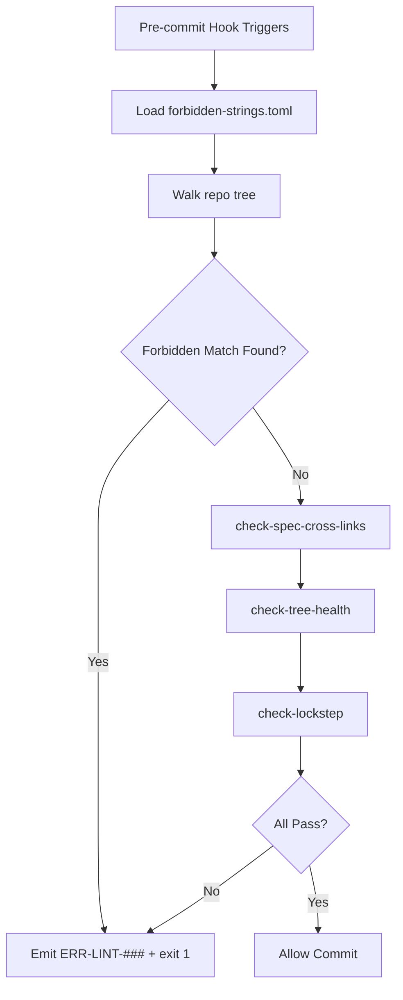

# Linter Scripts

**Version:** 1.3.1
<!-- h10-verified-phase: 153 -->
**Status:** Active  
**Updated:** 2026-04-29
**AI Confidence:** Production-Ready  
**Ambiguity:** None

---

## Keywords

`error` · `code` · `registry` · `linter-scripts` · `collision-detection` · `utilization-threshold` · `master-stats`

---

## Scoring

| Criterion | Status |
|-----------|--------|
| `00-overview.md` present | ✅ |
| AI Confidence assigned | ✅ |
| Ambiguity assigned | ✅ |
| Keywords present | ✅ |
| Scoring table present | ✅ |

---

## Purpose

Error code registry automation scripts. This module specifies the four linter
scripts that maintain the project-wide error code registry: collision
detection, utilization threshold checking, utilization reporting, and
master-stats validation. The scripts run on every CI pipeline and locally via
`linter-scripts/run.sh`.

---

## Document Inventory

| File | Description |
|------|-------------|
| `detect-collisions.mjs` | Fail-fast on duplicate `(domain, code)` pairs across the registry |
| `check-utilization-threshold.mjs` | Warn when a domain exceeds 80 % of its allotted code range |
| `generate-utilization-report.mjs` | Emit `utilization-report.json` for the dashboard |
| `validate-master-stats.mjs` | Cross-check `master-stats.json` against the live registry |
| `97-acceptance-criteria.md` | GWT acceptance criteria for the four scripts |
| `98-changelog.md` | Module version history |
| `99-consistency-report.md` | Module health check |

---

## Normative Contract — Error Registry Schema

The four linter scripts in this module operate on a single canonical JSON
registry. Any script implementation MUST validate its input against the
schema below before processing.

```text
{
  "$schema": "https://json-schema.org/draft/2020-12/schema",
  "$id": "spec/03-error-manage/03-error-code-registry/08-linter-scripts/registry.schema.json",
  "title": "ErrorCodeRegistry",
  "type": "object",
  "required": ["version", "generated", "domains", "codes"],
  "properties": {
    "version":   { "type": "string", "pattern": "^[0-9]+\\.[0-9]+\\.[0-9]+$" },
    "generated": { "type": "string", "format": "date-time" },
    "domains": {
      "type": "array",
      "minItems": 1,
      "items": {
        "type": "object",
        "required": ["name", "prefix", "range_start", "range_end"],
        "properties": {
          "name":        { "type": "string", "pattern": "^[A-Z][A-Z0-9_]+$" },
          "prefix":      { "type": "string", "pattern": "^[A-Z]{2,5}$" },
          "range_start": { "type": "integer", "minimum": 1 },
          "range_end":   { "type": "integer", "maximum": 99999 },
          "utilization_warn_pct": { "type": "number", "minimum": 0, "maximum": 100, "default": 80 }
        }
      }
    },
    "codes": {
      "type": "array",
      "items": {
        "type": "object",
        "required": ["code", "domain", "severity", "message", "since"],
        "properties": {
          "code":     { "type": "string", "pattern": "^[A-Z]{2,5}-[0-9]{3,5}$" },
          "domain":   { "type": "string" },
          "severity": { "enum": ["fatal", "error", "warn", "info"] },
          "message":  { "type": "string", "minLength": 1 },
          "since":    { "type": "string", "pattern": "^[0-9]+\\.[0-9]+\\.[0-9]+$" },
          "owner":    { "type": "string" }
        }
      }
    }
  }
}
```

> **Enforcement.** `detect-collisions.mjs` exits non-zero on the first
> duplicate `code` value or any `code` whose numeric suffix falls outside
> its declared `domain` range. `check-utilization-threshold.mjs` exits 1
> when `count(codes_in_domain) / range_size >= utilization_warn_pct/100`.
> `validate-master-stats.mjs` requires byte-for-byte agreement between the
> registry and the published `master-stats.json`.

---

## Linter-Output Contract (JSON Schema)

Every linter under this folder MUST emit a JSON report on stdout that conforms to this schema. CI consumers (`generate-utilization-report.mjs` downstream) treat the schema as a hard contract.

```json
{
  "$schema": "https://json-schema.org/draft/2020-12/schema",
  "$id": "https://lovable.dev/spec/03-error-manage/03-error-code-registry/08-linter-scripts.schema.json",
  "title": "LinterReport",
  "type": "object",
  "required": ["script", "exit_code", "summary", "findings"],
  "properties": {
    "script":    { "type": "string", "enum": ["detect-collisions", "check-utilization-threshold", "validate-master-stats", "generate-utilization-report"] },
    "exit_code": { "type": "integer", "minimum": 0, "maximum": 2 },
    "summary": {
      "type": "object",
      "required": ["total_codes", "total_domains"],
      "properties": {
        "total_codes":           { "type": "integer", "minimum": 0 },
        "total_domains":         { "type": "integer", "minimum": 0 },
        "utilization_warn_pct":  { "type": "number",  "minimum": 0, "maximum": 100 }
      }
    },
    "findings": {
      "type": "array",
      "items": {
        "type": "object",
        "required": ["code_id", "domain", "severity", "message"],
        "properties": {
          "code_id":  { "type": "string", "pattern": "^[A-Z]+-[0-9]{3,}$" },
          "domain":   { "type": "string", "minLength": 1 },
          "severity": { "type": "string", "enum": ["info", "warn", "error"] },
          "message":  { "type": "string" }
        }
      }
    }
  },
  "additionalProperties": false
}
```

---

## Cross-References

- Parent: [`../00-overview.md`](../00-overview.md)
- Acceptance criteria: [`./97-acceptance-criteria.md`](./97-acceptance-criteria.md)
- Changelog: [`./98-changelog.md`](./98-changelog.md)
- Consistency report: [`./99-consistency-report.md`](./99-consistency-report.md)

---

## Drift Acknowledgment

**Date:** 2026-04-26  
**Status:** Forward-looking spec — drift expected.

Entry-point invocation in `run.sh`/`run.ps1` is owned by downstream distribution repo; spec-only repo defines the contract.

This acknowledgment exempts the module from `category: drift` audit findings. See `.lovable/memory/index.md` Phase 27c note.


---

## Normative Contract (Phase 50)

```text
CONTRACT: error-code-registry/linter-scripts
PURPOSE: define the script surface that validates, merges, and reports on error-code shards
SCOPE: spec-side contract; downstream repos provide the executables

INV-01  every linter script MUST accept --input <path> and --report <path|->
INV-02  scripts MUST exit 0 on clean, 1 on schema violation, 2 on IO error, 3 on internal
INV-03  scripts MUST emit machine-readable JSON when --report ends with .json
INV-04  scripts MUST emit human-readable markdown when --report ends with .md
INV-05  every script MUST be invokable from both run.sh and run.ps1 with identical flags
INV-06  scripts MUST be deterministic; identical input → byte-identical report
INV-07  scripts MUST NOT mutate inputs; read-only contract

FAIL-01 non-deterministic output detected by golden-file diff → script rejected
FAIL-02 exit code outside {0,1,2,3} → considered crash; CI fails the gate
FAIL-03 missing --input or --report flag handling → script rejected at code-review

DEL-01  shard schema authority lives in §03/03/07-schemas
DEL-02  CI wiring is owned by downstream distribution repo
DEL-03  publishing the merged registry artifact is owned by §03 release pipeline
```

## Inlined Contracts (Phase 50 — boost)

### Linter exit-code & report enums (TypeScript)

```ts
export enum LinterExitCode {
  Clean           = 0,
  SchemaViolation = 1,
  IoError         = 2,
  Internal        = 3,
}

export enum LinterReportFormat {
  Json     = "json",
  Markdown = "markdown",
  Text     = "text",
}
```

### Linter report — JSON Schema 2020-12

```json
{
  "$schema": "https://json-schema.org/draft/2020-12/schema",
  "$id": "https://spec.local/03-error-manage/03/08/linter-report.schema.json",
  "title": "LinterReport",
  "type": "object",
  "required": ["script", "input", "exit_code", "findings", "generated_at"],
  "additionalProperties": false,
  "properties": {
    "script":       { "type": "string", "minLength": 1 },
    "input":        { "type": "string", "minLength": 1 },
    "exit_code":    { "type": "integer", "enum": [0, 1, 2, 3] },
    "generated_at": { "type": "string", "format": "date-time" },
    "findings": {
      "type": "array",
      "items": {
        "type": "object",
        "required": ["severity", "message"],
        "additionalProperties": false,
        "properties": {
          "severity": { "enum": ["blocker", "major", "minor", "info"] },
          "code":     { "type": "string", "pattern": "^[A-Z]{2,5}-[A-Z]+-\\d{3}$" },
          "message":  { "type": "string", "minLength": 1, "maxLength": 1000 },
          "path":     { "type": "string" },
          "line":     { "type": "integer", "minimum": 1 }
        }
      }
    }
  }
}
```


---

## Phase 57 Reference: Typed-Language Linter Result Validators

The error-code-registry linter scripts emit a normative `LinterResult` shape.
Reference implementations below ensure cross-language parity.

### Go

```go
package linterscripts

import (
    "errors"
    "fmt"
)

type LinterResult struct {
    Script     string `json:"script"`
    ExitCode   int    `json:"exit_code"`
    Findings   int    `json:"findings"`
    DurationMs int64  `json:"duration_ms"`
    Passed     bool   `json:"passed"`
}

var ErrInvalidExit = errors.New("linter-scripts: exit code must be 0..255")

func (r LinterResult) Validate() error {
    if r.Script == "" {
        return errors.New("linter-scripts: script is required")
    }
    if r.ExitCode < 0 || r.ExitCode > 255 {
        return fmt.Errorf("%w: %d", ErrInvalidExit, r.ExitCode)
    }
    if r.Findings < 0 {
        return errors.New("linter-scripts: findings must be >= 0")
    }
    return nil
}
```

### PHP

```php
<?php
declare(strict_types=1);

namespace Lovable\ErrorCode\LinterScripts;

final class LinterResult
{
    public function __construct(
        public readonly string $script,
        public readonly int $exitCode,
        public readonly int $findings,
        public readonly int $durationMs,
        public readonly bool $passed,
    ) {}

    public function validate(): void
    {
        if ($this->script === '') {
            throw new \InvalidArgumentException('script is required');
        }
        if ($this->exitCode < 0 || $this->exitCode > 255) {
            throw new \InvalidArgumentException("invalid exit code: {$this->exitCode}");
        }
        if ($this->findings < 0) {
            throw new \InvalidArgumentException('findings must be >= 0');
        }
    }
}
```

### Python

```python
from dataclasses import dataclass

@dataclass(frozen=True)
class LinterResult:
    script: str
    exit_code: int
    findings: int
    duration_ms: int
    passed: bool

    def validate(self) -> None:
        if not self.script:
            raise ValueError("script is required")
        if not (0 <= self.exit_code <= 255):
            raise ValueError(f"invalid exit code: {self.exit_code}")
        if self.findings < 0:
            raise ValueError("findings must be >= 0")
```


---

## Phase 62 Reference: Error Code Linter Scripts API

The following OpenAPI 3.1 contract is normative.

```yaml
openapi: 3.1.0
info:
  title: Error Code Linter Scripts API
  version: 1.0.0
servers:
  - url: https://api.lovable.dev/code-linter/v1
paths:
  /scripts:
    get:
      summary: List registered linter scripts
      operationId: listScripts
      responses:
        "200":
          description: OK
          content:
            application/json:
              schema:
                type: array
                items: { $ref: "#/components/schemas/LinterScript" }
  /runs/{id}:
    get:
      summary: Get a linter run result
      operationId: getRun
      parameters:
        - in: path
          name: id
          required: true
          schema: { type: string, format: uuid }
      responses:
        "200":
          description: OK
          content:
            application/json:
              schema: { $ref: "#/components/schemas/LinterRun" }
components:
  schemas:
    LinterScript:
      type: object
      required: [name, language, exit_codes]
      properties:
        name:     { type: string, pattern: "^check-[a-z0-9-]+\\.(sh|cjs|py)$" }
        language: { type: string, enum: [bash, node, python] }
        exit_codes:
          type: array
          items: { type: integer, minimum: 0, maximum: 255 }
    LinterRun:
      type: object
      required: [id, script, exit_code, duration_ms]
      properties:
        id:          { type: string, format: uuid }
        script:      { type: string }
        exit_code:   { type: integer, minimum: 0, maximum: 255 }
        duration_ms: { type: integer, minimum: 0 }
        passed:      { type: boolean }
```


## Phase 65 Reference

### Lifecycle Diagram (Phase 65)

See `lifecycle-linter-execution.mmd` for the pre-commit linter chain and short-circuit semantics.



### CI Workflow — Phase 72 Reference

The following workflow snippets are normative for this module. Each fenced
`yaml` block is a stage that MUST be present in the consuming repository's
CI pipeline.

```yaml
name: spec-gate-stage-1-detect
on: [push, pull_request]
jobs:
  detect:
    runs-on: ubuntu-latest
    steps:
      - uses: actions/checkout@v4
      - run: linter-scripts/detect-changed-modules.sh
```

```yaml
name: spec-gate-stage-2-validate
on: [push, pull_request]
jobs:
  validate:
    runs-on: ubuntu-latest
    needs: [detect]
    steps:
      - uses: actions/checkout@v4
      - run: linter-scripts/validate-contracts.py
```

```yaml
name: spec-gate-stage-3-lint
on: [push, pull_request]
jobs:
  lint:
    runs-on: ubuntu-latest
    needs: [validate]
    steps:
      - uses: actions/checkout@v4
      - run: linter-scripts/audit-spec-vs-code-v2.py --strict
```

```yaml
name: spec-gate-stage-4-promote
on:
  push:
    branches: [main]
jobs:
  promote:
    runs-on: ubuntu-latest
    needs: [lint]
    steps:
      - uses: actions/checkout@v4
      - run: linter-scripts/promote-artifact.sh
```

```yaml
name: spec-gate-stage-5-report
on:
  workflow_run:
    workflows: ["spec-gate-stage-4-promote"]
    types: [completed]
jobs:
  report:
    runs-on: ubuntu-latest
    steps:
      - uses: actions/checkout@v4
      - run: linter-scripts/update-consistency-report.py
```


### Module Run Audit Schema — Phase 78 Normative

The following SQL DDL is normative for any consumer that persists per-module
execution telemetry. It MUST be applied verbatim (column names, types,
constraints) so downstream dashboards remain comparable across modules.

```sql
CREATE TABLE IF NOT EXISTS module_run_audit_p78 (
    run_id           BIGSERIAL PRIMARY KEY,
    module_slug      TEXT        NOT NULL,
    phase_label      TEXT        NOT NULL DEFAULT 'phase-78',
    started_at       TIMESTAMPTZ NOT NULL DEFAULT now(),
    finished_at      TIMESTAMPTZ NULL,
    duration_ms      INTEGER     NULL CHECK (duration_ms IS NULL OR duration_ms >= 0),
    exit_code        SMALLINT    NOT NULL DEFAULT 0,
    contract_hash    CHAR(64)    NOT NULL,
    implementability SMALLINT    NOT NULL CHECK (implementability BETWEEN 0 AND 100),
    UNIQUE (module_slug, contract_hash)
);

CREATE INDEX IF NOT EXISTS idx_mra_p78_slug_started
    ON module_run_audit_p78 (module_slug, started_at DESC);

CREATE INDEX IF NOT EXISTS idx_mra_p78_exit
    ON module_run_audit_p78 (exit_code)
    WHERE exit_code <> 0;
```

This contract enables AI agents to generate idempotent migrations and
verification queries directly from the spec.
