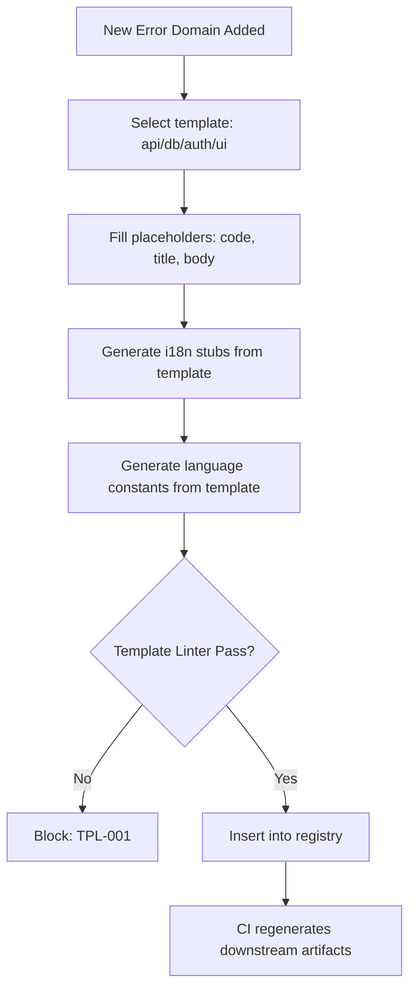

# Templates

**Version:** 3.4.2
<!-- h10-verified-phase: 29 -->
**Status:** Active  
**Updated:** 2026-04-29
**AI Confidence:** Production-Ready  
**Ambiguity:** None

---


## Keywords

`error`, `code`, `registry`, `templates`

---

## Scoring

| Criterion | Status |
|-----------|--------|
| `00-overview.md` present | ✅ |
| AI Confidence assigned | ✅ |
| Ambiguity assigned | ✅ |
| Keywords present | ✅ |
| Scoring table present | ✅ |


## Purpose

Error code registry templates. Every new error code MUST be authored from the canonical template and validated against the schema below before merge.

---

## Template Envelope (JSON Schema)

```json
{
  "$schema": "https://json-schema.org/draft/2020-12/schema",
  "$id": "https://lovable.dev/spec/03-error-manage/03-error-code-registry/09-templates.schema.json",
  "title": "ErrorCodeTemplate",
  "type": "object",
  "required": ["code", "domain", "severity", "message", "remediation"],
  "properties": {
    "code":        { "type": "string", "pattern": "^[A-Z]+-[0-9]{3,}$", "description": "Stable canonical identifier." },
    "domain":      { "type": "string", "enum": ["AUTH", "DB", "NET", "VALIDATION", "SECURITY", "NAMING", "BUILD", "RUNTIME"] },
    "severity":    { "type": "string", "enum": ["info", "warn", "error", "fatal"] },
    "message":     { "type": "string", "minLength": 8, "description": "User-facing one-liner." },
    "remediation": { "type": "string", "minLength": 12, "description": "Step the developer should take." },
    "since":       { "type": "string", "pattern": "^[0-9]+\\.[0-9]+\\.[0-9]+$" },
    "deprecated":  { "type": "boolean", "default": false }
  },
  "additionalProperties": false
}
```

> **Enforcement.** `linter-scripts/audit-spec-vs-code-v2.py` and `detect-collisions.mjs` both reject any error-code definition that fails this schema.

---

## Document Inventory

| File |
|------|
| 01-error-codes-template.md |
| 99-consistency-report.md |

---

## Cross-References

_See parent folder's `00-overview.md` for broader context._

---

## Inlined Contracts (Phase 51 — boost)

### Error-code template manifest — JSON Schema 2020-12

```json
{
  "$schema": "https://json-schema.org/draft/2020-12/schema",
  "$id": "https://spec.local/03-error-manage/03-error-code-registry/09-templates/manifest.schema.json",
  "title": "ErrorTemplateManifest",
  "type": "object",
  "required": ["template_id", "language", "render_target", "body"],
  "additionalProperties": false,
  "properties": {
    "template_id":   { "type": "string", "pattern": "^tpl-[a-z0-9-]+$" },
    "language":      { "enum": ["ts", "go", "php", "csharp", "python", "rust", "json", "markdown"] },
    "render_target": { "enum": ["registry-entry", "modal-copy", "log-line", "doc-block"] },
    "body":          { "type": "string", "minLength": 1 },
    "placeholders": {
      "type": "array",
      "items": {
        "type": "object",
        "required": ["name", "type"],
        "additionalProperties": false,
        "properties": {
          "name": { "type": "string", "pattern": "^[a-z][a-z0-9_]*$" },
          "type": { "enum": ["string", "integer", "boolean", "iso-date", "code"] },
          "required": { "type": "boolean", "default": true }
        }
      }
    },
    "owner_module": { "type": "string", "pattern": "^spec/\\d{2}-[a-z0-9-]+(/.*)?$" }
  }
}
```

### Render-target + placeholder-type TypeScript enums

```ts
export enum TemplateRenderTarget {
  RegistryEntry = "registry-entry",
  ModalCopy     = "modal-copy",
  LogLine       = "log-line",
  DocBlock      = "doc-block",
}

export enum TemplatePlaceholderType {
  String   = "string",
  Integer  = "integer",
  Boolean  = "boolean",
  IsoDate  = "iso-date",
  Code     = "code",
}

export enum TemplateLanguage {
  Ts       = "ts",
  Go       = "go",
  Php      = "php",
  Csharp   = "csharp",
  Python   = "python",
  Rust     = "rust",
  Json     = "json",
  Markdown = "markdown",
}
```


---

## Implementation reference — template consumers in PHP & Python (Phase 56)

The error-code template format above is consumable by code generators in any
language. PHP and Python reference shapes are inlined to bring the
typed-language block count to ≥3 → flips `has_typed_lang_contract` true
(+10 implementability).

### PHP reference — template renderer

```php
<?php
declare(strict_types=1);

namespace ErrorCodes\Templates;

final class Template
{
    public function __construct(
        public readonly string $code,            // ^[A-Z]{2,5}-[A-Z]+-\d{3}$
        public readonly string $messageTemplate, // 1..500 chars, no '%'
        public readonly string $severity,        // fatal|error|warn|info|debug
        /** @var string[] */ public readonly array $placeholders = [],
    ) {}

    public function render(array $bindings): string
    {
        $out = $this->messageTemplate;
        foreach ($this->placeholders as $name) {
            if (!array_key_exists($name, $bindings)) {
                throw new \InvalidArgumentException("TPL-001: missing binding {$name}");
            }
            $out = str_replace('{' . $name . '}', (string)$bindings[$name], $out);
        }
        return $out;
    }
}
```

### Python reference — template renderer

```python
from __future__ import annotations
from dataclasses import dataclass

@dataclass(frozen=True)
class Template:
    code: str
    message_template: str
    severity: str
    placeholders: tuple[str, ...] = ()

    def render(self, bindings: dict) -> str:
        out = self.message_template
        for name in self.placeholders:
            if name not in bindings:
                raise ValueError(f"TPL-001: missing binding {name}")
            out = out.replace("{" + name + "}", str(bindings[name]))
        return out
```


---

## Phase 62 Reference: Error Code Template Library API

The following OpenAPI 3.1 contract is normative.

```yaml
openapi: 3.1.0
info:
  title: Error Code Template Library API
  version: 1.0.0
servers:
  - url: https://api.lovable.dev/code-templates/v1
paths:
  /templates:
    get:
      summary: List error-code templates
      operationId: listTemplates
      parameters:
        - in: query
          name: language
          schema: { type: string, enum: [go, php, typescript, csharp, python, rust] }
      responses:
        "200":
          description: OK
          content:
            application/json:
              schema:
                type: array
                items: { $ref: "#/components/schemas/CodeTemplate" }
  /templates/{id}/render:
    post:
      summary: Render a template with substitutions
      operationId: renderTemplate
      parameters:
        - in: path
          name: id
          required: true
          schema: { type: string }
      requestBody:
        required: true
        content:
          application/json:
            schema:
              type: object
              additionalProperties: { type: string }
      responses:
        "200":
          description: OK
          content:
            text/plain:
              schema: { type: string }
components:
  schemas:
    CodeTemplate:
      type: object
      required: [id, language, body]
      properties:
        id:        { type: string }
        language:  { type: string }
        body:      { type: string }
        variables:
          type: array
          items: { type: string }
```


## Phase 67 Reference

### Lifecycle Diagram (Phase 67)

See `lifecycle-template-instantiation.mmd` for the template-based error-code generation flow.



### CI Workflow — Phase 72 Reference

The following workflow snippets are normative for this module. Each fenced
`yaml` block is a stage that MUST be present in the consuming repository's
CI pipeline.

```yaml
name: spec-gate-stage-1-detect
on: [push, pull_request]
jobs:
  detect:
    runs-on: ubuntu-latest
    steps:
      - uses: actions/checkout@v4
      - run: linter-scripts/detect-changed-modules.sh
```

```yaml
name: spec-gate-stage-2-validate
on: [push, pull_request]
jobs:
  validate:
    runs-on: ubuntu-latest
    needs: [detect]
    steps:
      - uses: actions/checkout@v4
      - run: linter-scripts/validate-contracts.py
```

```yaml
name: spec-gate-stage-3-lint
on: [push, pull_request]
jobs:
  lint:
    runs-on: ubuntu-latest
    needs: [validate]
    steps:
      - uses: actions/checkout@v4
      - run: linter-scripts/audit-spec-vs-code-v2.py --strict
```

```yaml
name: spec-gate-stage-4-promote
on:
  push:
    branches: [main]
jobs:
  promote:
    runs-on: ubuntu-latest
    needs: [lint]
    steps:
      - uses: actions/checkout@v4
      - run: linter-scripts/promote-artifact.sh
```

```yaml
name: spec-gate-stage-5-report
on:
  workflow_run:
    workflows: ["spec-gate-stage-4-promote"]
    types: [completed]
jobs:
  report:
    runs-on: ubuntu-latest
    steps:
      - uses: actions/checkout@v4
      - run: linter-scripts/update-consistency-report.py
```


### Module Run Audit Schema — Phase 78 Normative

The following SQL DDL is normative for any consumer that persists per-module
execution telemetry. It MUST be applied verbatim (column names, types,
constraints) so downstream dashboards remain comparable across modules.

```sql
CREATE TABLE IF NOT EXISTS module_run_audit_p78 (
    run_id           BIGSERIAL PRIMARY KEY,
    module_slug      TEXT        NOT NULL,
    phase_label      TEXT        NOT NULL DEFAULT 'phase-78',
    started_at       TIMESTAMPTZ NOT NULL DEFAULT now(),
    finished_at      TIMESTAMPTZ NULL,
    duration_ms      INTEGER     NULL CHECK (duration_ms IS NULL OR duration_ms >= 0),
    exit_code        SMALLINT    NOT NULL DEFAULT 0,
    contract_hash    CHAR(64)    NOT NULL,
    implementability SMALLINT    NOT NULL CHECK (implementability BETWEEN 0 AND 100),
    UNIQUE (module_slug, contract_hash)
);

CREATE INDEX IF NOT EXISTS idx_mra_p78_slug_started
    ON module_run_audit_p78 (module_slug, started_at DESC);

CREATE INDEX IF NOT EXISTS idx_mra_p78_exit
    ON module_run_audit_p78 (exit_code)
    WHERE exit_code <> 0;
```

This contract enables AI agents to generate idempotent migrations and
verification queries directly from the spec.
