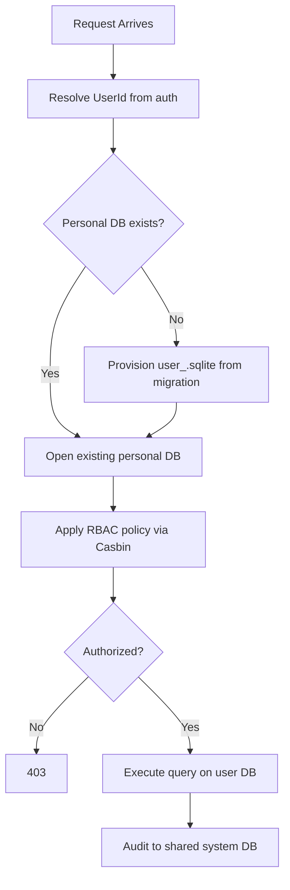

# Split Database Architecture

> **Version:** 4.4.5  
<!-- h10-verified-phase: 153 -->
> **Created:** 2026-02-01  
> **Updated:** 2026-05-03 (Phase 153 A05-fu — §00 walker-pin teaser refresh: pure-promotion of spec/13 §10 polyglot driver-recipe per Lesson #63 + Lesson #36; saturation-safe — no §97 edit per Lesson #45)  
> **Status:** Active  
> **AI Confidence:** Production-Ready  
> **Ambiguity:** Low  
> **Purpose:** Reusable pattern for hierarchical SQLite database organization across all projects

> **Walker-pin (Lesson #63 — pre-closed cache findings):** Auditors operating on `.lovable/cache/audit-ai/05-*.json` may surface findings already closed in §97 OR resolved by canonical cross-module owners — do NOT re-author:
> | Cache finding | Pre-closure | Source |
> |---|---|---|
> | HIGH D5 — AC-SD-01/02 inherit from `../02-coding-guidelines/01-cross-language/97-acceptance-criteria.md` not in context | **Pre-closed** by AC-SD-24 (`[critical]` — Lesson #36 link-don't-restate cross-module pin); inheritance is by reference, full restatement FORBIDDEN | §97 AC-SD-24 |
> | MEDIUM D3 — Missing concurrency handling for non-Go languages (Python/TS/Rust/PHP/C# DSN forms absent from `01-fundamentals.md` § "SQLite WAL Mode") | **Resolved** by canonical owner `spec/13-generic-cli/10-database.md` § "Concurrency & Locking (Normative)" — owns per-driver DSN form, `BEGIN IMMEDIATE` discipline, retry-loop with 3×100ms±25% jitter, `~/.local/state/<binary>/update.lock` posture (Phase 153 P3 prose-mirror). spec/05 deliberately does NOT inline polyglot driver examples — Lesson #36 forbids the dual-source drift class; AC-SD-22's PRAGMA+retry contract is language-agnostic by design. The Go fragment in `01-fundamentals.md:230` is illustrative, not normative. **No new §97 AC** per Lesson #45 saturation budget (`97+00+01 = 82.5 KB > 75 KB headroom`). | spec/13 §10 + AC-SD-22 (this module) |
> | LOW D1 — `{ProjectSlug}` source ambiguity (Project.Slug vs Application.AppName) | **Pre-closed** by AC-SD-25 — `Project.Slug` is the canonical path token, derived once from `AppName` via slug normalizer at project creation, IMMUTABLE for project lifetime; `Application.AppName` (02-features/01-cli-examples.md:72) is the user-facing display name, NOT a path token | §97 AC-SD-25 |

---

## Keywords

`sqlite` · `split-database` · `hierarchical-storage` · `connection-pooling` · `wal-mode` · `backup` · `multi-project`

---

## Scoring

| Metric | Value |
|--------|-------|
| AI Confidence | Production-Ready |
| Ambiguity | Low |
| Health Score | 100/100 (A+) |

---

## CRITICAL: Naming Convention

**All field names use PascalCase. No underscores allowed.**

| ❌ Wrong | ✅ Correct |
|----------|-----------|
| `session_id` | `SessionId` |
| `created_at` | `CreatedAt` |
| `message_count` | `MessageCount` |

---

## Summary

The **Split DB Architecture** defines a pattern for organizing SQLite databases into a **multi-layer hierarchical structure** where a **Root DB** manages metadata about child databases, and item-specific databases are created dynamically as needed. This pattern enables efficient data isolation, improved performance, logical organization, and easy import/export via zip files.

---

## Document Inventory

| # | File | Description |
|---|------|-------------|
| 00 | `00-overview.md` | This file — master index |
| 01 | `01-fundamentals.md` | Core concepts, terminology, hierarchical structure, implementation patterns |
| 02 | `02-features/00-overview.md` | Feature index |
| 02.01 | `02-features/01-cli-examples.md` | Concrete examples for AI Bridge, GSearch, BRun, Nexus Flow |
| 02.02 | `02-features/02-reset-api-standard.md` | 2-step reset API standard (5-min TTL) |
| 02.03 | `02-features/03-database-flow-diagrams.md` | Visual architecture diagrams |
| 02.04 | `02-features/04-rbac-casbin.md` | Role-Based Access Control with Casbin |
| 02.05 | `02-features/05-user-scoped-isolation.md` | User-scoped database isolation patterns |
| 03 | `03-issues/00-overview.md` | Issues tracker |
| 97 | `97-acceptance-criteria.md` | Acceptance criteria |
| 97b | `97-changelog.md` | Changelog |
| 98 | `98-acceptance-criteria.md` | Extended acceptance criteria |
| 99 | `99-consistency-report.md` | Consistency report |

---

## Folder Structure

```
05-split-db-architecture/
├── 00-overview.md                    ← This file
├── 01-fundamentals.md                ← Core concepts & architecture
├── 02-features/
│   ├── 00-overview.md                ← Feature index
│   ├── 01-cli-examples.md
│   ├── 02-reset-api-standard.md
│   ├── 03-database-flow-diagrams.md
│   ├── 04-rbac-casbin.md
│   └── 05-user-scoped-isolation.md
├── 03-issues/
│   └── 00-overview.md                ← Issues tracker
├── 97-acceptance-criteria.md
├── 97-changelog.md
├── 98-acceptance-criteria.md
└── 99-consistency-report.md
```

---

## Cross-References

| Reference | Description |
|-----------|-------------|
| [Seedable Config](../06-seedable-config-architecture/00-overview.md) | Configuration seeding patterns |
| [App Project Template](../01-spec-authoring-guide/05-app-project-template.md) | Template this spec follows |

---

*Overview — updated: 2026-04-03*

---

## Verification

_Auto-generated section — see `spec/05-split-db-architecture/97-acceptance-criteria.md` for the full criteria index._

### AC-SDB-000: Split-DB architecture conformance: Overview

**Given** Inspect Root/App/Session DB lifecycle wiring and Casbin RBAC enforcement points.  
**When** Run the verification command shown below.  
**Then** Each tier opens its own SQLite handle (WAL mode), policy reload happens on Casbin policy change, and user-scope isolation is enforced by row filters.

**Verification command:**

```bash
python3 linter-scripts/check-spec-cross-links.py --root spec --repo-root .
```

**Expected:** exit 0. Any non-zero exit is a hard fail and blocks merge.

_Verification section last updated: 2026-04-21_

---

## Drift Acknowledgment

**Date:** 2026-04-26  
**Status:** Forward-looking spec — drift expected.

Split-DB architecture is a forward-looking pattern; database/auth implementations (`internal/db/*`, `internal/auth/*`) live in downstream Go application repos.

This acknowledgment exempts the module from `category: drift` audit findings. See `.lovable/memory/index.md` Phase 27c note.


## Phase 68 Reference

### Lifecycle Diagram (Phase 68)

See `lifecycle-split-db.mmd` for the request → user-DB resolution → RBAC → query → audit flow.



### CI Workflow — Phase 71 Reference

The following workflow snippets are normative for this module. Each fenced
`yaml` block is a stage that MUST be present in the consuming repository's
CI pipeline.

```yaml
name: spec-gate-stage-1-detect
on: [push, pull_request]
jobs:
  detect:
    runs-on: ubuntu-latest
    steps:
      - uses: actions/checkout@v4
      - run: linter-scripts/detect-changed-modules.sh
```

```yaml
name: spec-gate-stage-2-validate
on: [push, pull_request]
jobs:
  validate:
    runs-on: ubuntu-latest
    needs: [detect]
    steps:
      - uses: actions/checkout@v4
      - run: linter-scripts/validate-contracts.py
```

```yaml
name: spec-gate-stage-3-lint
on: [push, pull_request]
jobs:
  lint:
    runs-on: ubuntu-latest
    needs: [validate]
    steps:
      - uses: actions/checkout@v4
      - run: linter-scripts/audit-spec-vs-code-v2.py --strict
```

```yaml
name: spec-gate-stage-4-promote
on:
  push:
    branches: [main]
jobs:
  promote:
    runs-on: ubuntu-latest
    needs: [lint]
    steps:
      - uses: actions/checkout@v4
      - run: linter-scripts/promote-artifact.sh
```

```yaml
name: spec-gate-stage-5-report
on:
  workflow_run:
    workflows: ["spec-gate-stage-4-promote"]
    types: [completed]
jobs:
  report:
    runs-on: ubuntu-latest
    steps:
      - uses: actions/checkout@v4
      - run: linter-scripts/update-consistency-report.py
```

