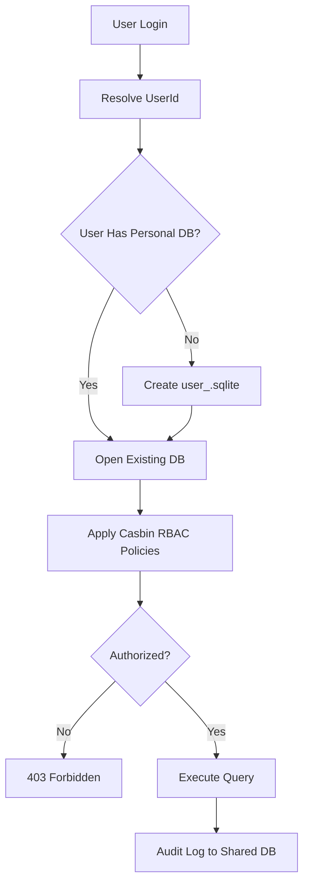

# Split DB Architecture — Features Index

**Updated:** 2026-04-16

---

## Feature Inventory

| # | File | Description | Status |
|---|------|-------------|--------|
| 01 | [01-cli-examples.md](./01-cli-examples.md) | CLI database structure examples (AI Bridge, GSearch, BRun, Nexus Flow) | ✅ Active |
| 02 | [02-reset-api-standard.md](./02-reset-api-standard.md) | 2-step reset API standard with 5-min TTL | ✅ Active |
| 03 | [03-database-flow-diagrams.md](./03-database-flow-diagrams.md) | Visual architecture diagrams for all CLIs | ✅ Active |
| 04 | [04-rbac-casbin.md](./04-rbac-casbin.md) | Role-Based Access Control with Casbin | ✅ Active |
| 05 | [05-user-scoped-isolation.md](./05-user-scoped-isolation.md) | User-scoped database isolation patterns | ✅ Active |

---

*Features index — updated: 2026-04-03*


## Phase 64 Reference

### Lifecycle Diagram (Phase 64)

See `lifecycle-user-scoped-db.mmd` for the per-user split-DB lifecycle: login → resolve → provision → RBAC gate → query → audit.



### CI Workflow — Phase 71 Reference

The following workflow snippets are normative for this module. Each fenced
`yaml` block is a stage that MUST be present in the consuming repository's
CI pipeline.

```yaml
name: spec-gate-stage-1-detect
on: [push, pull_request]
jobs:
  detect:
    runs-on: ubuntu-latest
    steps:
      - uses: actions/checkout@v4
      - run: linter-scripts/detect-changed-modules.sh
```

```yaml
name: spec-gate-stage-2-validate
on: [push, pull_request]
jobs:
  validate:
    runs-on: ubuntu-latest
    needs: [detect]
    steps:
      - uses: actions/checkout@v4
      - run: linter-scripts/validate-contracts.py
```

```yaml
name: spec-gate-stage-3-lint
on: [push, pull_request]
jobs:
  lint:
    runs-on: ubuntu-latest
    needs: [validate]
    steps:
      - uses: actions/checkout@v4
      - run: linter-scripts/audit-spec-vs-code-v2.py --strict
```

```yaml
name: spec-gate-stage-4-promote
on:
  push:
    branches: [main]
jobs:
  promote:
    runs-on: ubuntu-latest
    needs: [lint]
    steps:
      - uses: actions/checkout@v4
      - run: linter-scripts/promote-artifact.sh
```

```yaml
name: spec-gate-stage-5-report
on:
  workflow_run:
    workflows: ["spec-gate-stage-4-promote"]
    types: [completed]
jobs:
  report:
    runs-on: ubuntu-latest
    steps:
      - uses: actions/checkout@v4
      - run: linter-scripts/update-consistency-report.py
```

