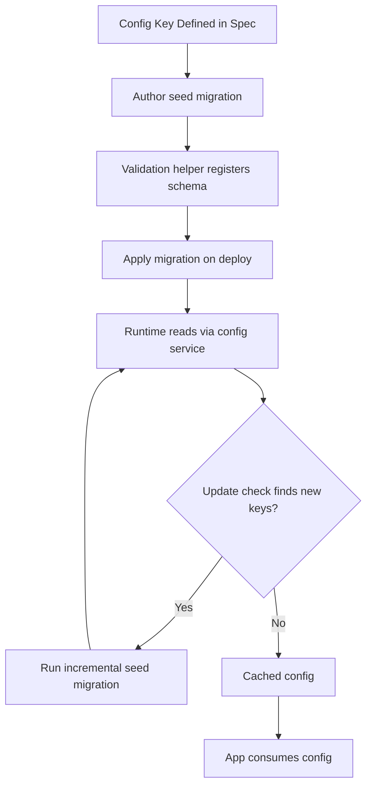

# Seedable Config Architecture + Changelog Versioning (also known as CW Config)

> **Version:** 4.4.0  
<!-- h10-verified-phase: 153 -->
> **Created:** 2026-02-01  
> **Updated:** 2026-04-30  
> **Status:** Active  
> **AI Confidence:** Production-Ready  
> **Ambiguity:** Low  
> **Purpose:** Reusable pattern for version-controlled configuration with automatic changelog updates and initial seeding

---

## 🔒 Canonical Naming Convention

All JSON keys in seedable configs use **PascalCase** (`Version`, `Categories`, `Settings`). This applies uniformly to `00-overview.md`, `01-fundamentals.md`, every example payload, and every JSON Schema fragment in this module. **Do not introduce camelCase variants.** This pin exists because Phase 153 Task A1 audit-v2 misread an SVG-style ASCII diagram in `01-fundamentals.md` as a camelCase contract; both files are and must remain PascalCase.

---

## Keywords

`configuration` · `seeding` · `changelog` · `versioning` · `sqlite` · `json-schema` · `semver` · `merge-strategy`

---

## Scoring

| Metric | Value |
|--------|-------|
| AI Confidence | Production-Ready |
| Ambiguity | Low |
| Health Score | 100/100 (A+) |

---

## Summary

The **Seedable Config Architecture + Changelog Versioning** (commonly referred to as **CW Config**) defines a pattern for managing application configuration where:

1. **First-run seeding** populates SQLite DB from `config.seed.json`
2. **Every config change updates the version**
3. **Every version change logs to CHANGELOG.md**
4. **Subsequent runs respect version** to avoid duplicate seeds

This ensures configuration is always traceable, auditable, and version-aware.

---

## Document Inventory

| # | File | Description |
|---|------|-------------|
| 00 | `00-overview.md` | This file — master index |
| 01 | `01-fundamentals.md` | Core concepts, configuration files, version flow, merge strategies |
| 02 | `02-features/00-overview.md` | Feature index |
| 02.01 | `02-features/01-rag-chunk-settings.md` | RAG chunk size and overlap configuration |
| 02.02 | `02-features/02-rag-validation-helpers.md` | Go validation patterns for RAG config |
| 02.03 | `02-features/03-rag-validation-tests.md` | Unit test specifications for validators |
| 02.04 | `02-features/04-rag-test-coverage-matrix.md` | Test coverage matrix for RAG validation |
| 02.05 | `02-features/05-validation-data-seeding.md` | CW Config → Root DB seeding pattern |
| 02.06 | `02-features/06-update-check-keys.md` | `Update.*` and `Storage.Backend` keys for update-check subsystem |
| 03 | `03-issues/00-overview.md` | Issues tracker |
| 97 | `97-acceptance-criteria.md` | Acceptance criteria |
| 97b | `97-changelog.md` | Changelog |
| 98 | `98-acceptance-criteria.md` | Extended acceptance criteria |
| 99 | `99-consistency-report.md` | Consistency report |

---

## Folder Structure

```
06-seedable-config-architecture/
├── 00-overview.md                    ← This file
├── 01-fundamentals.md                ← Core concepts & architecture
├── 02-features/
│   ├── 00-overview.md                ← Feature index
│   ├── 01-rag-chunk-settings.md
│   ├── 02-rag-validation-helpers.md
│   ├── 03-rag-validation-tests.md
│   ├── 04-rag-test-coverage-matrix.md
│   └── 05-validation-data-seeding.md
├── 03-issues/
│   └── 00-overview.md                ← Issues tracker
├── 97-acceptance-criteria.md
├── 97-changelog.md
├── 98-acceptance-criteria.md
└── 99-consistency-report.md
```

---

## Canonical Contracts (Phase 20 normative)

> **Status:** Normative. Any seed file or migration that violates these
> two contracts is a hard build failure. The Go reference reader and
> the AI consumers (RAG retrieval, audit, change-detection) MUST validate
> against the schema below before applying a merge.

### 1. JSON Schema 2020-12 — `config.seed.json`

```json
{
  "$schema": "https://json-schema.org/draft/2020-12/schema",
  "$id": "https://specs.local/06-seedable-config-architecture/config.seed.schema.json",
  "title": "SeedableConfig",
  "type": "object",
  "additionalProperties": false,
  "required": ["Version", "Categories"],
  "properties": {
    "Version": {
      "type": "string",
      "pattern": "^\\d+\\.\\d+\\.\\d+(?:-[0-9A-Za-z.-]+)?$",
      "description": "Strict SemVer 2.0.0. Drives merge-vs-skip on subsequent boots."
    },
    "Description": { "type": "string" },
    "Categories": {
      "type": "object",
      "minProperties": 1,
      "patternProperties": {
        "^[A-Z][A-Za-z0-9]*$": { "$ref": "#/$defs/Category" }
      },
      "additionalProperties": false
    }
  },
  "$defs": {
    "Category": {
      "type": "object",
      "additionalProperties": false,
      "required": ["Version", "Settings"],
      "properties": {
        "Version":     { "$ref": "#/properties/Version" },
        "Description": { "type": "string" },
        "Settings": {
          "type": "object",
          "minProperties": 1,
          "patternProperties": {
            "^[A-Z][A-Za-z0-9]*$": { "$ref": "#/$defs/Setting" }
          },
          "additionalProperties": false
        }
      }
    },
    "Setting": {
      "type": "object",
      "additionalProperties": false,
      "required": ["Type", "Default"],
      "properties": {
        "Type": {
          "type": "string",
          "enum": ["boolean", "number", "string", "select", "multiselect"],
          "description": "Closed UI-aware enum per AC-SC-14. `boolean`/`number`/`string` are scalar Types; `select` requires `Validation.Enum` (single-value pick); `multiselect` requires `Validation.Enum` (multi-value pick). NOTE: legacy storage-type values {int, float, bool, json} are FORBIDDEN — use `number` (covers int+float), `boolean`, or `string` (with `Validation.Pattern` for JSON-shaped strings)."
        },
        "Default":        { "$ref": "#/$defs/Scalar" },
        "Description":    { "type": "string" },
        "AddedInVersion": { "$ref": "#/properties/Version" },
        "Deprecated":     { "type": "boolean", "default": false },
        "Validation": {
          "type": "object",
          "additionalProperties": false,
          "properties": {
            "Min":     { "type": "number" },
            "Max":     { "type": "number" },
            "Pattern": { "type": "string", "format": "regex" },
            "Enum":    { "type": "array", "items": { "$ref": "#/$defs/Scalar" }, "minItems": 1, "uniqueItems": true }
          }
        }
      }
    },
    "Scalar": {
      "oneOf": [
        { "type": "string" },
        { "type": "number" },
        { "type": "boolean" },
        { "type": "null" },
        { "type": "object" },
        { "type": "array" }
      ]
    }
  }
}
```

### 2. Reference Instance — minimal valid `config.seed.json`

```json
{
  "Version": "1.2.0",
  "Description": "RAG + Update-check defaults for Riseup Asia stack.",
  "Categories": {
    "Rag": {
      "Version": "1.1.0",
      "Description": "Retrieval-augmented generation chunk strategy.",
      "Settings": {
        "ChunkSizeTokens":   { "Type": "number", "Default": 512,  "AddedInVersion": "1.0.0", "Validation": { "Min": 64, "Max": 4096 } },
        "ChunkOverlapTokens":{ "Type": "number", "Default": 64,   "AddedInVersion": "1.0.0", "Validation": { "Min": 0,  "Max": 1024 } },
        "EmbeddingModel":    { "Type": "string", "Default": "text-embedding-3-small", "AddedInVersion": "1.1.0" }
      }
    },
    "Update": {
      "Version": "1.0.0",
      "Settings": {
        "CheckIntervalHours":          { "Type": "number",  "Default": 12, "Validation": { "Min": 1, "Max": 168 } },
        "BackgroundUpdateCheckEnabled":{ "Type": "boolean", "Default": true }
      }
    },
    "Storage": {
      "Version": "1.0.0",
      "Settings": {
        "Backend": { "Type": "select", "Default": "sqlite", "Validation": { "Enum": ["sqlite", "json"] } }
      }
    }
  }
}
```

### 3. Forbidden Shapes (lint-enforced)

| ❌ Forbidden | ✅ Required |
|--------------|------------|
| `version`, `categories` (camelCase / lowercase) | `Version`, `Categories` (PascalCase) |
| `"Version": "1.2"`     | `"Version": "1.2.0"` (full SemVer) |
| Untyped `Default` without `Type` | Always declare `Type` ∈ {boolean, number, string, select, multiselect} (per AC-SC-14; legacy {string,int,float,bool,json} FORBIDDEN) |
| Top-level scalar setting (`"Foo": 1`) | Setting nested under a Category |
| Unknown top-level key (e.g. `"Settings": {…}` at root) | Only `Version` / `Description` / `Categories` allowed |
| Two seed files in same project | Single `config.seed.json` per bounded context |

### Acceptance — Schema Conformance

**Given** a contributor edits `config.seed.json` or commits a new one,  
**When** CI runs `python3 linter-scripts/validate-config-seed.py`,  
**Then** the file MUST validate against the JSON Schema above (exit 0),
the top-level `Version` MUST be ≥ the previous committed `Version`
(SemVer-compare), and every `Setting` whose `AddedInVersion` exceeds the
prior commit's top-level `Version` MUST appear in the changelog row for
the new version.

---

## Cross-References

| Reference | Description |
|-----------|-------------|
| [Split DB Architecture](../05-split-db-architecture/00-overview.md) | Database organization patterns |
| [App Project Template](../01-spec-authoring-guide/05-app-project-template.md) | Template this spec follows |

---

*Overview — updated: 2026-04-03*

---

## Verification

_Auto-generated section — see `spec/06-seedable-config-architecture/97-acceptance-criteria.md` for the full criteria index._

### AC-CFG-000: Seedable-config conformance: Overview

**Given** Diff the running config tree against `config.seed.json` after a SemVer-aware GORM merge.  
**When** Run the verification command shown below.  
**Then** Merged keys preserve user overrides; new seed keys are added; removed seed keys are pruned; merge is idempotent on a second pass.

**Verification command:**

```bash
python3 linter-scripts/check-spec-cross-links.py --root spec --repo-root .
```

**Expected:** exit 0. Any non-zero exit is a hard fail and blocks merge.

_Verification section last updated: 2026-04-21_


## Phase 68 Reference

### Lifecycle Diagram (Phase 68)

See `lifecycle-seedable-config.mmd` for the config-key spec → seed migration → runtime → update flow.



### CI Workflow — Phase 71 Reference

The following workflow snippets are normative for this module. Each fenced
`yaml` block is a stage that MUST be present in the consuming repository's
CI pipeline.

```yaml
name: spec-gate-stage-1-detect
on: [push, pull_request]
jobs:
  detect:
    runs-on: ubuntu-latest
    steps:
      - uses: actions/checkout@v4
      - run: linter-scripts/detect-changed-modules.sh
```

```yaml
name: spec-gate-stage-2-validate
on: [push, pull_request]
jobs:
  validate:
    runs-on: ubuntu-latest
    needs: [detect]
    steps:
      - uses: actions/checkout@v4
      - run: linter-scripts/validate-contracts.py
```

```yaml
name: spec-gate-stage-3-lint
on: [push, pull_request]
jobs:
  lint:
    runs-on: ubuntu-latest
    needs: [validate]
    steps:
      - uses: actions/checkout@v4
      - run: linter-scripts/audit-spec-vs-code-v2.py --strict
```

```yaml
name: spec-gate-stage-4-promote
on:
  push:
    branches: [main]
jobs:
  promote:
    runs-on: ubuntu-latest
    needs: [lint]
    steps:
      - uses: actions/checkout@v4
      - run: linter-scripts/promote-artifact.sh
```

```yaml
name: spec-gate-stage-5-report
on:
  workflow_run:
    workflows: ["spec-gate-stage-4-promote"]
    types: [completed]
jobs:
  report:
    runs-on: ubuntu-latest
    steps:
      - uses: actions/checkout@v4
      - run: linter-scripts/update-consistency-report.py
```

