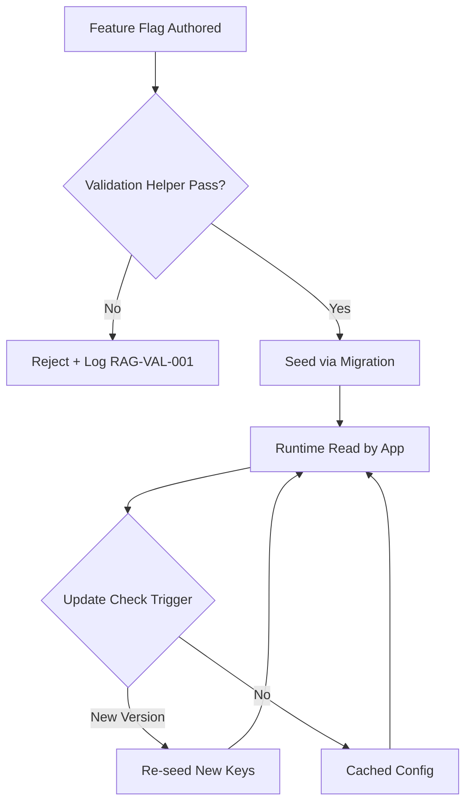

# Seedable Config Architecture — Features Index

**Updated:** 2026-04-20

---

## Feature Inventory

| # | File | Description | Status |
|---|------|-------------|--------|
| 01 | [01-rag-chunk-settings.md](./01-rag-chunk-settings.md) | RAG chunk size and overlap configuration | ✅ Active |
| 02 | [02-rag-validation-helpers.md](./02-rag-validation-helpers.md) | Go validation patterns for RAG config | ✅ Active |
| 03 | [03-rag-validation-tests.md](./03-rag-validation-tests.md) | Unit test specifications for validators | ✅ Active |
| 04 | [04-rag-test-coverage-matrix.md](./04-rag-test-coverage-matrix.md) | Test coverage matrix for RAG validation | ✅ Active |
| 05 | [05-validation-data-seeding.md](./05-validation-data-seeding.md) | CW Config → Root DB seeding pattern | ✅ Active |
| 06 | [06-update-check-keys.md](./06-update-check-keys.md) | `Update.*` and `Storage.Backend` keys for update-check subsystem | ✅ Active |

---

*Features index — updated: 2026-04-20*

---

## Drift Acknowledgment

**Date:** 2026-04-26  
**Severity:** Low — doc-hygiene drift.

Overview `Updated` (2026-04-20) vs AC date (2026-04-25) — AC was bumped independently for clarification edits.

Tracked under Phase 27d. See `.lovable/memory/index.md`.


## Phase 64 Reference

### Lifecycle Diagram (Phase 64)

See `lifecycle-feature-rollout.mmd` for the seedable-feature lifecycle: authored → validated → seeded → consumed → re-seeded on update.



### CI Workflow — Phase 71 Reference

The following workflow snippets are normative for this module. Each fenced
`yaml` block is a stage that MUST be present in the consuming repository's
CI pipeline.

```yaml
name: spec-gate-stage-1-detect
on: [push, pull_request]
jobs:
  detect:
    runs-on: ubuntu-latest
    steps:
      - uses: actions/checkout@v4
      - run: linter-scripts/detect-changed-modules.sh
```

```yaml
name: spec-gate-stage-2-validate
on: [push, pull_request]
jobs:
  validate:
    runs-on: ubuntu-latest
    needs: [detect]
    steps:
      - uses: actions/checkout@v4
      - run: linter-scripts/validate-contracts.py
```

```yaml
name: spec-gate-stage-3-lint
on: [push, pull_request]
jobs:
  lint:
    runs-on: ubuntu-latest
    needs: [validate]
    steps:
      - uses: actions/checkout@v4
      - run: linter-scripts/audit-spec-vs-code-v2.py --strict
```

```yaml
name: spec-gate-stage-4-promote
on:
  push:
    branches: [main]
jobs:
  promote:
    runs-on: ubuntu-latest
    needs: [lint]
    steps:
      - uses: actions/checkout@v4
      - run: linter-scripts/promote-artifact.sh
```

```yaml
name: spec-gate-stage-5-report
on:
  workflow_run:
    workflows: ["spec-gate-stage-4-promote"]
    types: [completed]
jobs:
  report:
    runs-on: ubuntu-latest
    steps:
      - uses: actions/checkout@v4
      - run: linter-scripts/update-consistency-report.py
```

