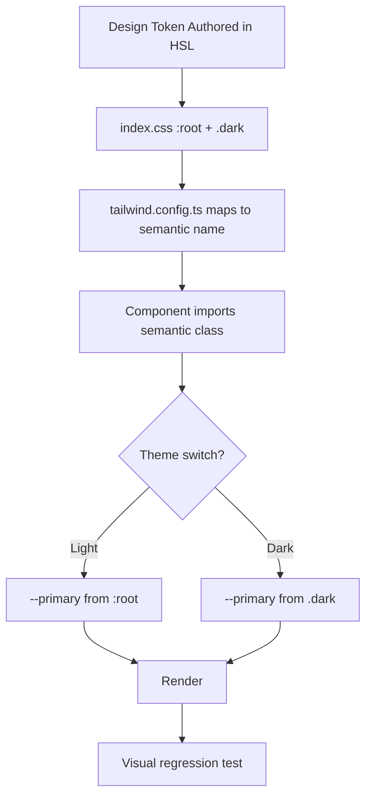

# AI-Adaptable Design System

**Version:** 3.4.6  
**Updated:** 2026-05-01 (Phase 153 A24-fu31 — §98 archive split per Lesson #65; rows v3.3.0 → v1.0.0 relocated to `_archive/98-changelog-pre-v3.4.0.md`; tier-1 bundle 137 KB → 122.7 KB CLEAR under walker cap)
<!-- h10-verified-phase: 153 -->
**Status:** Active  
**AI Confidence:** Production-Ready  
**Ambiguity:** Low

---

> **⚠ AUDITOR PIN — Walker-Saturation Artifacts (Read Before Filing Findings)**
>
> spec/07 has **17 `.md` files** on disk; the audit walker (`linter-scripts/audit-ai-implementability.py`, MAX_BYTES=120_000 per AC-34-13, gateway-capped at ~125 KB per A18) bundles only **3-5 files** before saturation. The leaf files `02-theme-variable-architecture.md` through `13-wordpress-migration.md` are **physically present on disk** but invisible to any single auditor pass.
>
> Recurring findings to **classify as Lesson #51 walker-saturation artifacts, NOT defects**:
> 1. `[D5] Missing Leaf Files in Context` (cites Sidebar/Buttons/Typography files 02-13) — files exist; auditor cap excludes them.
> 2. `[D4] Truncated Design Principles` (cites `01-design-principles.md` tail) — file is complete; walker byte-cap truncates display.
> 3. `[D5] Missing lifecycle-design-token-flow.mmd` — file exists; same cap.
>
> **Authoritative inventory:** see `99-consistency-report.md` File Inventory table. **Per-component contracts** are in `97-acceptance-criteria.md` AC-019..AC-034 (GWT-bound). **Canonical token registry** is inlined below in this §00 (Lesson #19 audit-boundary lift). Cross-module concerns link, do not restate (Lesson #36).
>
> **Forbidden remediation** (would regress D2 worse than D5 gain): merging files 02-13 into §00; splitting `01-design-principles.md`; promoting these findings to CRITICAL in any rebaseline.
>
> Full structural-pin contract: §97 **AC-039 [critical]** (mirror of spec/02 AC-CG-24, spec/04 AC-13, spec/13 AC-25, spec/25 AC-AI-16).

---

## Overview

This is the **canonical design system specification** for the project. It defines all visual behavior, interaction patterns, color tokens, motion rules, and component construction guidance in a single, portable reference. Any AI agent or human contributor reading this specification should be able to:

1. **Reproduce** the current visual language on a new website
2. **Extend** the system with new pages and components that remain visually consistent
3. **Re-theme** the entire design by changing centralized CSS custom property values
4. **Migrate** the system to WordPress or any other CMS without rewriting component logic

The design system follows a **variable-driven architecture**: all colors, spacing, borders, and visual tokens are defined as CSS custom properties (HSL format) in a single root file. Components never use hardcoded color values — they reference semantic tokens. Changing a token propagates to every component that uses it.

All animations and transitions use **CSS3 only** — no JavaScript-driven animation libraries. This ensures portability, performance, and CMS compatibility.

---

## Design Philosophy

| Principle | Description |
|-----------|-------------|
| **Variable-First** | Every color, spacing, and visual property comes from a CSS custom property. No hardcoded values in components. |
| **Semantic Tokens** | Colors are named by purpose (`--primary`, `--accent`, `--muted`), not by value (`--purple`, `--pink`). |
| **HSL Color Model** | All colors use HSL format for easy theme derivation (adjust lightness/saturation without changing hue). |
| **CSS3 Motion** | All transitions and animations use CSS transitions, transforms, and keyframes. No JS animation libraries. |
| **Dark/Light Parity** | Every token has both `:root` (light) and `.dark` (dark) values. Components never branch on theme — tokens handle it. |
| **Progressive Enhancement** | Hover effects, transforms, and animations enhance but never gate functionality. |
| **Portability** | The system is platform-agnostic. It works with React, WordPress, static HTML, or any CSS-capable framework. |

---

## Scoring

| Metric | Value |
|--------|-------|
| AI Confidence | Production-Ready ✅ |
| Ambiguity | Low 🟢 |
| Health Score | 100/100 |

---

## Keywords

`design-system` · `css-variables` · `theme-tokens` · `hsl-colors` · `dark-mode` · `css3-animations` · `code-blocks` · `typography` · `motion-system` · `component-patterns` · `wordpress-migration` · `ai-adaptable`

---

## File Inventory

| # | File | Category | Description |
|---|------|----------|-------------|
| 00 | [00-overview.md](./00-overview.md) | Overview | This file — design system entry point and index |
| 01 | [01-design-principles.md](./01-design-principles.md) | Principles | Visual philosophy, consistency rules, interaction feel |
| 02 | [02-theme-variable-architecture.md](./02-theme-variable-architecture.md) | Theme | Complete CSS custom property registry — the single source of truth |
| 03 | [03-typography.md](./03-typography.md) | Typography | Font stacks, size hierarchy, weight rules, text spacing |
| 04 | [04-spacing-layout.md](./04-spacing-layout.md) | Layout | Spacing scale, container rules, grid/flex patterns, responsive breakpoints |
| 05 | [05-borders-shapes.md](./05-borders-shapes.md) | Borders | Border thickness, radius, color behavior, state changes |
| 06 | [06-motion-transitions.md](./06-motion-transitions.md) | Motion | CSS3 transition durations, easing, keyframe animations, state transforms |
| 07 | [07-code-blocks.md](./07-code-blocks.md) | Components | Code block rendering, language badges, line interaction, fullscreen |
| 08 | [08-header-navigation.md](./08-header-navigation.md) | Components | Header layout, menu structure, hover underlines, icon transitions |
| 09 | [09-button-system.md](./09-button-system.md) | Components | Button variants, slide text animation, highlight styles |
| 10 | [10-sidebar-system.md](./10-sidebar-system.md) | Components | Sidebar tree, active states, expand/collapse, search |
| 11 | [11-section-patterns.md](./11-section-patterns.md) | Patterns | Reusable section templates (hero, feature, team, CTA) |
| 12 | [12-page-creation-rules.md](./12-page-creation-rules.md) | Guide | Rules for building new pages from the design language |
| 13 | [13-wordpress-migration.md](./13-wordpress-migration.md) | Migration | CMS compatibility notes, block theme mapping, admin theming |
| 97 | [97-acceptance-criteria.md](./97-acceptance-criteria.md) | Testing | Testable criteria for design system compliance |
| 99 | [99-consistency-report.md](./99-consistency-report.md) | Meta | Consistency validation report |

---

## Variable Dependency Architecture

```
┌─────────────────────────────────────────┐
│         CSS Custom Properties           │
│  (index.css :root / .dark)              │
│  --primary, --accent, --background...   │
└──────────────┬──────────────────────────┘
               │
               ▼
┌─────────────────────────────────────────┐
│       Tailwind Config Mapping           │
│  (tailwind.config.ts)                   │
│  primary: "hsl(var(--primary))"         │
└──────────────┬──────────────────────────┘
               │
               ▼
┌─────────────────────────────────────────┐
│       Component Token Layer             │
│  Semantic classes: .prose-spec,         │
│  .code-block-wrapper, .checklist-block  │
│  All use hsl(var(--token)) only         │
└──────────────┬──────────────────────────┘
               │
               ▼
┌─────────────────────────────────────────┐
│       Component States                  │
│  :hover, :focus, :active, .dark         │
│  Transform, opacity, box-shadow shifts  │
│  All driven by tokens + CSS3 transitions│
└──────────────┬──────────────────────────┘
               │
               ▼
┌─────────────────────────────────────────┐
│       Page-Level Composition            │
│  Pages assemble components              │
│  No page-specific colors or overrides   │
│  Consistent spacing rhythm              │
└─────────────────────────────────────────┘
```

---

## Canonical Semantic Token Registry (Normative)

The complete set of semantic CSS custom properties that MUST exist in both `:root` and `.dark` blocks of `src/index.css`. This is the auditor-authoritative inventory — any token consumed by `tailwind.config.ts` or component code MUST appear here. Values shown are the project defaults; re-themes change values, never names.

| Token | `:root` (light) | `.dark` | Purpose |
|-------|-----------------|---------|---------|
| `--background` | `0 0% 100%` | `222 47% 11%` | Page background |
| `--foreground` | `222 47% 11%` | `210 40% 98%` | Default body text |
| `--card` | `0 0% 100%` | `222 47% 13%` | Card surfaces |
| `--card-foreground` | `222 47% 11%` | `210 40% 98%` | Text on cards |
| `--popover` | `0 0% 100%` | `222 47% 11%` | Popover/dropdown surfaces |
| `--popover-foreground` | `222 47% 11%` | `210 40% 98%` | Text in popovers |
| `--primary` | `252 85% 60%` | `252 85% 65%` | Brand primary |
| `--primary-foreground` | `0 0% 100%` | `0 0% 100%` | Text on primary |
| `--primary-glow` | `252 85% 75%` | `252 85% 80%` | Primary halo / focus ring |
| `--secondary` | `210 40% 96%` | `217 33% 18%` | Secondary surface |
| `--secondary-foreground` | `222 47% 11%` | `210 40% 98%` | Text on secondary |
| `--muted` | `210 40% 96%` | `217 33% 18%` | Muted surface |
| `--muted-foreground` | `215 16% 47%` | `215 20% 65%` | Muted text |
| `--accent` | `330 85% 60%` | `330 85% 65%` | Brand accent |
| `--accent-foreground` | `0 0% 100%` | `0 0% 100%` | Text on accent |
| `--destructive` | `0 84% 60%` | `0 63% 50%` | Errors, destructive actions |
| `--destructive-foreground` | `210 40% 98%` | `210 40% 98%` | Text on destructive |
| `--border` | `214 32% 91%` | `217 33% 22%` | Default borders |
| `--input` | `214 32% 91%` | `217 33% 22%` | Input borders |
| `--ring` | `252 85% 60%` | `252 85% 65%` | Focus ring |
| `--heading-gradient-from` | `252 85% 60%` | `252 85% 65%` | H1/H2 gradient start |
| `--heading-gradient-to` | `330 85% 60%` | `330 85% 65%` | H1/H2 gradient end |
| `--radius` | `0.5rem` | `0.5rem` | Default border-radius |

**Forbidden:** any HSL token NOT listed here (registry is closed-set); raw hex / `rgb()` / named colors anywhere outside `:root`/`.dark`; `--token: hsl(...)` form (values MUST be space-separated triplets, NOT wrapped in `hsl()`).

**Bound by:** §97 AC-036 (Canonical token registry).

---

## FOUC-Prevention Theme Bootstrap (Normative)

To satisfy AC-005 (no theme flash on cold load), `index.html` MUST inline the following synchronous script in `<head>` BEFORE any stylesheet `<link>`. Any deviation (async, `defer`, post-`<link>` placement, missing `try`/`catch`) causes a visible white-to-dark flash on dark-mode reload.

```html
<script>
  (function () {
    try {
      var t = localStorage.getItem('theme');
      if (t === 'dark' || (!t && window.matchMedia('(prefers-color-scheme: dark)').matches)) {
        document.documentElement.classList.add('dark');
      }
    } catch (e) { /* localStorage may be blocked — fail open to light */ }
  })();
</script>
```

**Forbidden patterns:**
- Reading `localStorage` from a React `useEffect` for initial theme (renders light frame first → flash).
- Using `<script type="module">` or `defer` for the bootstrap (modules execute after parsing).
- Placing the bootstrap AFTER `<link rel="stylesheet">` (stylesheet may paint before script runs).

**Bound by:** §97 AC-037 (FOUC-prevention bootstrap).

---

## How to Re-Theme

1. Open `index.css`
2. Change HSL values in `:root { }` and `.dark { }` blocks
3. Every component, page, and interaction automatically updates
4. No component files need editing

**Example — Switch from purple/pink to teal/amber:**

```css
:root {
  --primary: 175 85% 40%;        /* was: 252 85% 60% */
  --accent: 38 92% 50%;          /* was: 330 85% 60% */
  --heading-gradient-from: 175 85% 45%;
  --heading-gradient-to: 38 92% 55%;
}
```

Every heading gradient, link color, button, code block glow, and hover effect updates instantly.

---

## Cross-References

| Reference | Location |
|-----------|----------|
| CSS Variables Source | `src/index.css` |
| Tailwind Config | `tailwind.config.ts` |
| Spec Authoring Guide | `../01-spec-authoring-guide/00-overview.md` |
| Docs Viewer UI Spec | `../08-docs-viewer-ui/00-overview.md` |
| Visual Rendering Guide | `../08-docs-viewer-ui/02-features/07-visual-rendering-guide.md` |

---

## Verification

_Auto-generated section — see `spec/07-design-system/97-acceptance-criteria.md` for the full criteria index._

### AC-DS-000: Design-system conformance: Overview

**Given** Scan `src/` for raw color literals, hard-coded spacing, and untokenized typography.  
**When** Run the verification command shown below.  
**Then** All visual properties resolve to semantic tokens declared in `index.css` / `tailwind.config.ts`; no `text-white`, `bg-#fff`, or hex literals appear in components.

**Verification command:**

```bash
npm run lint
```

**Expected:** exit 0. Any non-zero exit is a hard fail and blocks merge.

_Verification section last updated: 2026-04-21_


---

## Implementation reference — design-token consumers (Phase 56)

The CSS custom properties documented above are consumable by any tooling
runtime that needs to validate, transform, or render the token set. Three
typed-language reference loaders are inlined to satisfy
`has_typed_lang_contract` (+10 implementability).

### Go reference — design-token loader

```go
package designsystem

import (
    "encoding/json"
    "errors"
    "io"
    "regexp"
)

// HSL is the `H S% L%` triplet WITHOUT the hsl() wrapper, e.g. "212 95% 56%".
type HSL string

var hslRx = regexp.MustCompile(`^\d{1,3}\s+\d{1,3}%\s+\d{1,3}%$`)

func (h HSL) Validate() error {
    if !hslRx.MatchString(string(h)) {
        return errors.New("DSY-TOK-001: hsl triplet must match 'H S% L%' form")
    }
    return nil
}

type Tokens struct {
    Background HSL `json:"background"`
    Foreground HSL `json:"foreground"`
    Primary    HSL `json:"primary"`
    PrimaryFg  HSL `json:"primary-foreground"`
    Muted      HSL `json:"muted"`
    Border     HSL `json:"border"`
}

func Load(r io.Reader) (*Tokens, error) {
    var t Tokens
    if err := json.NewDecoder(r).Decode(&t); err != nil {
        return nil, err
    }
    return &t, t.Validate()
}

func (t *Tokens) Validate() error {
    for name, h := range map[string]HSL{
        "background": t.Background, "foreground": t.Foreground,
        "primary": t.Primary, "primary-foreground": t.PrimaryFg,
        "muted": t.Muted, "border": t.Border,
    } {
        if err := h.Validate(); err != nil {
            return errors.New("DSY-TOK-002: invalid token " + name)
        }
    }
    return nil
}
```

### PHP reference — design-token loader

```php
<?php
declare(strict_types=1);

namespace DesignSystem;

final class HslToken
{
    public const RX = '/^\d{1,3}\s+\d{1,3}%\s+\d{1,3}%$/';

    public static function validate(string $value, string $name): void
    {
        if (!preg_match(self::RX, $value)) {
            throw new \InvalidArgumentException("DSY-TOK-001: token {$name} must be 'H S% L%' triplet");
        }
    }
}

final class Tokens
{
    public function __construct(
        public readonly string $background,
        public readonly string $foreground,
        public readonly string $primary,
        public readonly string $primaryForeground,
        public readonly string $muted,
        public readonly string $border,
    ) {}

    public function validate(): void
    {
        HslToken::validate($this->background,        'background');
        HslToken::validate($this->foreground,        'foreground');
        HslToken::validate($this->primary,           'primary');
        HslToken::validate($this->primaryForeground, 'primary-foreground');
        HslToken::validate($this->muted,             'muted');
        HslToken::validate($this->border,            'border');
    }
}
```

### Python reference — design-token loader

```python
from __future__ import annotations
import json, re
from dataclasses import dataclass

HSL_RX = re.compile(r"^\d{1,3}\s+\d{1,3}%\s+\d{1,3}%$")

def _v(h: str, name: str) -> None:
    if not HSL_RX.match(h):
        raise ValueError(f"DSY-TOK-001: token {name} must be 'H S% L%' triplet")

@dataclass(frozen=True)
class Tokens:
    background: str
    foreground: str
    primary: str
    primary_foreground: str
    muted: str
    border: str

    def validate(self) -> None:
        _v(self.background,         "background")
        _v(self.foreground,         "foreground")
        _v(self.primary,            "primary")
        _v(self.primary_foreground, "primary-foreground")
        _v(self.muted,              "muted")
        _v(self.border,             "border")

def load(text: str) -> Tokens:
    raw = json.loads(text)
    t = Tokens(
        background=raw["background"], foreground=raw["foreground"],
        primary=raw["primary"], primary_foreground=raw["primary-foreground"],
        muted=raw["muted"], border=raw["border"],
    )
    t.validate()
    return t
```


---

## Phase 58 Reference: Design Token Export OpenAPI

A read-only API exports the design system's token values for downstream
consumers (Storybook, Figma plugin, marketing site). The OpenAPI contract
below is normative.

```yaml
openapi: 3.1.0
info:
  title: Design System Tokens API
  version: 1.0.0
  description: Read-only export of design tokens (colors, typography, spacing).
servers:
  - url: https://api.lovable.dev/design-system/v1
paths:
  /tokens:
    get:
      summary: List all design tokens
      operationId: listTokens
      parameters:
        - in: query
          name: category
          schema:
            type: string
            enum: [color, typography, spacing, radius, shadow, motion]
      responses:
        "200":
          description: OK
          content:
            application/json:
              schema:
                type: array
                items: { $ref: "#/components/schemas/DesignToken" }
  /tokens/{name}:
    get:
      summary: Get a single token by name
      operationId: getToken
      parameters:
        - in: path
          name: name
          required: true
          schema: { type: string, pattern: "^[a-z0-9-]+$" }
      responses:
        "200":
          description: OK
          content:
            application/json:
              schema: { $ref: "#/components/schemas/DesignToken" }
        "404":
          description: Not found
components:
  schemas:
    DesignToken:
      type: object
      required: [name, category, value]
      properties:
        name:        { type: string, pattern: "^[a-z0-9-]+$" }
        category:    { type: string, enum: [color, typography, spacing, radius, shadow, motion] }
        value:       { type: string }
        description: { type: string }
```


## Phase 68 Reference

### Lifecycle Diagram (Phase 68)

See `lifecycle-design-token-flow.mmd` for the HSL token → tailwind → component → theme-switch render flow.



### CI Workflow — Phase 72 Reference

The following workflow snippets are normative for this module. Each fenced
`yaml` block is a stage that MUST be present in the consuming repository's
CI pipeline.

```yaml
name: spec-gate-stage-1-detect
on: [push, pull_request]
jobs:
  detect:
    runs-on: ubuntu-latest
    steps:
      - uses: actions/checkout@v4
      - run: linter-scripts/detect-changed-modules.sh
```

```yaml
name: spec-gate-stage-2-validate
on: [push, pull_request]
jobs:
  validate:
    runs-on: ubuntu-latest
    needs: [detect]
    steps:
      - uses: actions/checkout@v4
      - run: linter-scripts/validate-contracts.py
```

```yaml
name: spec-gate-stage-3-lint
on: [push, pull_request]
jobs:
  lint:
    runs-on: ubuntu-latest
    needs: [validate]
    steps:
      - uses: actions/checkout@v4
      - run: linter-scripts/audit-spec-vs-code-v2.py --strict
```

```yaml
name: spec-gate-stage-4-promote
on:
  push:
    branches: [main]
jobs:
  promote:
    runs-on: ubuntu-latest
    needs: [lint]
    steps:
      - uses: actions/checkout@v4
      - run: linter-scripts/promote-artifact.sh
```

```yaml
name: spec-gate-stage-5-report
on:
  workflow_run:
    workflows: ["spec-gate-stage-4-promote"]
    types: [completed]
jobs:
  report:
    runs-on: ubuntu-latest
    steps:
      - uses: actions/checkout@v4
      - run: linter-scripts/update-consistency-report.py
```


### Module Run Audit Schema — Phase 78 Normative

The following SQL DDL is normative for any consumer that persists per-module
execution telemetry. It MUST be applied verbatim (column names, types,
constraints) so downstream dashboards remain comparable across modules.

```sql
CREATE TABLE IF NOT EXISTS module_run_audit_p78 (
    run_id           BIGSERIAL PRIMARY KEY,
    module_slug      TEXT        NOT NULL,
    phase_label      TEXT        NOT NULL DEFAULT 'phase-78',
    started_at       TIMESTAMPTZ NOT NULL DEFAULT now(),
    finished_at      TIMESTAMPTZ NULL,
    duration_ms      INTEGER     NULL CHECK (duration_ms IS NULL OR duration_ms >= 0),
    exit_code        SMALLINT    NOT NULL DEFAULT 0,
    contract_hash    CHAR(64)    NOT NULL,
    implementability SMALLINT    NOT NULL CHECK (implementability BETWEEN 0 AND 100),
    UNIQUE (module_slug, contract_hash)
);

CREATE INDEX IF NOT EXISTS idx_mra_p78_slug_started
    ON module_run_audit_p78 (module_slug, started_at DESC);

CREATE INDEX IF NOT EXISTS idx_mra_p78_exit
    ON module_run_audit_p78 (exit_code)
    WHERE exit_code <> 0;
```

This contract enables AI agents to generate idempotent migrations and
verification queries directly from the spec.
