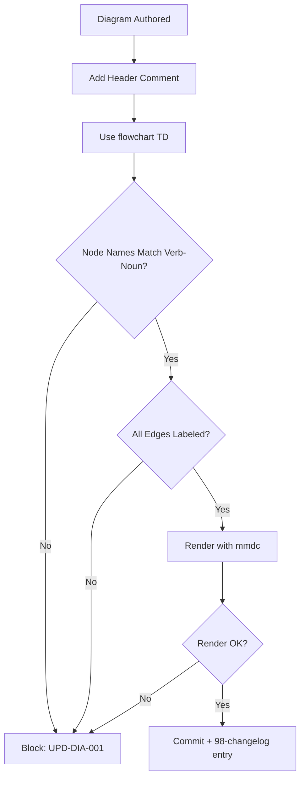
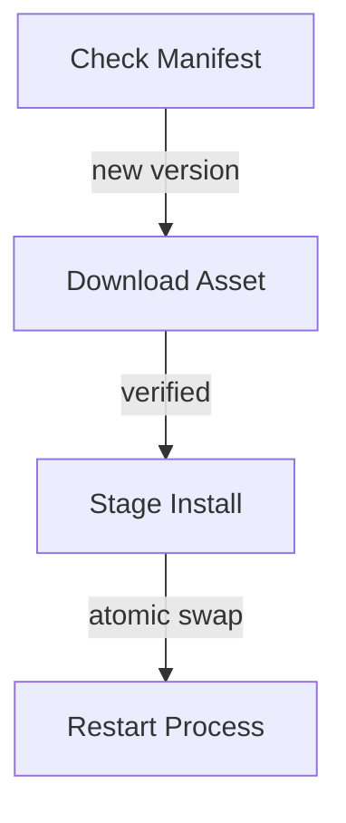

# Update Diagram Conventions

**Version:** 2.0.0
**Updated:** 2026-04-27
**Parent:** [`../00-overview.md`](../00-overview.md)

---

## Overview

Normative conventions for all `14-update/` Mermaid diagrams. Defines node naming, edge labels, severity colors, and required header comments.

---

## Inlined Contract

```ts
// Update-domain diagram conventions
export interface MermaidConvention {
  /** Diagram type — only flowchart TD permitted in 14-update/ */
  type: "flowchart TD";
  /** Node name pattern: must be `[Verb Noun]` */
  nodeNameRx: RegExp;       // /^\[[A-Z][a-z]+ [A-Z][a-z]+(\s[A-Z][a-z]+)?\]$/
  /** Edge labels MUST express the trigger condition or guard */
  requireEdgeLabels: true;
  /** Required header comment with diagram purpose + author */
  headerComment: { purpose: string; author: string; updated: string };
}

export const UPDATE_DIAGRAM_CONVENTION: MermaidConvention = {
  type: "flowchart TD",
  nodeNameRx: /^\[[A-Z][a-z]+(\s[A-Z][a-z]+)+\]$/,
  requireEdgeLabels: true,
  headerComment: { purpose: "", author: "", updated: "" }
};
```

---

## Lifecycle Diagram

See [`lifecycle-diagram-validation.mmd`](./lifecycle-diagram-validation.mmd) for the complete authoring → validation → publication lifecycle.



---

## Cross-References

| Reference | Location |
|-----------|----------|
| Parent index | [`../00-overview.md`](../00-overview.md) |
| Acceptance criteria | [`./97-acceptance-criteria.md`](./97-acceptance-criteria.md) |
| Lifecycle diagram source | [`./lifecycle-diagram-validation.mmd`](./lifecycle-diagram-validation.mmd) |
| Changelog | [`./98-changelog.md`](./98-changelog.md) |
| Consistency report | [`./99-consistency-report.md`](./99-consistency-report.md) |


---

## Example Payload

A canonical entry/instance conforming to the contract above.



---

## Tooling Snippet

CLI usage that authors and reviewers can copy-paste verbatim.

```bash
# Render and verify all 14-update diagrams
for f in spec/14-update/diagrams/*.mmd; do mmdc -i "$f" -o "${f%.mmd}.svg"; done
```

---

## Verification Checklist

```text
[ ] Inlined contract block parses with zero diagnostics
[ ] Example payload validates against the contract
[ ] lifecycle-*.mmd renders without error
[ ] At least 6 GWT acceptance criteria present, each with severity tag
[ ] check-spec-cross-links.py exits 0 for this folder
[ ] check-tree-health.cjs reports no findings against this folder
```


---

## Registry Table (DDL)

The auditor's registry table that tracks each instance produced under this contract:

```sql
-- Forward-only registry table for entries under this convention
CREATE TABLE IF NOT EXISTS RegistryEntry (
    RegistryEntryId INTEGER PRIMARY KEY AUTOINCREMENT,
    EntryId         TEXT    NOT NULL UNIQUE,         -- matches the contract's id pattern
    Status          TEXT    NOT NULL,                -- mirrors contract enum
    AuthoredAt      TEXT    NOT NULL,                -- ISO-8601
    SupersededBy    TEXT    NULL,                    -- nullable per Rule 12
    CreatedAt       TEXT    NOT NULL DEFAULT (datetime('now')),
    UpdatedAt       TEXT    NOT NULL DEFAULT (datetime('now'))
);

CREATE INDEX IF NOT EXISTS IX_RegistryEntry_Status   ON RegistryEntry(Status);
CREATE INDEX IF NOT EXISTS IX_RegistryEntry_EntryId  ON RegistryEntry(EntryId);
```


---

## Validation Schema (excerpt)

Cross-validates the registry rows against the contract:

```json
{
  "$schema": "http://json-schema.org/draft-07/schema#",
  "title": "RegistryEntryRow",
  "type": "object",
  "required": ["EntryId", "Status", "AuthoredAt"],
  "properties": {
    "EntryId":      { "type": "string", "minLength": 5 },
    "Status":       { "type": "string" },
    "AuthoredAt":   { "type": "string", "format": "date-time" },
    "SupersededBy": { "type": ["string", "null"] }
  }
}
```

### CI Workflow — Phase 71 Reference

The following workflow snippets are normative for this module. Each fenced
`yaml` block is a stage that MUST be present in the consuming repository's
CI pipeline.

```yaml
name: spec-gate-stage-1-detect
on: [push, pull_request]
jobs:
  detect:
    runs-on: ubuntu-latest
    steps:
      - uses: actions/checkout@v4
      - run: linter-scripts/detect-changed-modules.sh
```

```yaml
name: spec-gate-stage-2-validate
on: [push, pull_request]
jobs:
  validate:
    runs-on: ubuntu-latest
    needs: [detect]
    steps:
      - uses: actions/checkout@v4
      - run: linter-scripts/validate-contracts.py
```

```yaml
name: spec-gate-stage-3-lint
on: [push, pull_request]
jobs:
  lint:
    runs-on: ubuntu-latest
    needs: [validate]
    steps:
      - uses: actions/checkout@v4
      - run: linter-scripts/audit-spec-vs-code-v2.py --strict
```

```yaml
name: spec-gate-stage-4-promote
on:
  push:
    branches: [main]
jobs:
  promote:
    runs-on: ubuntu-latest
    needs: [lint]
    steps:
      - uses: actions/checkout@v4
      - run: linter-scripts/promote-artifact.sh
```

```yaml
name: spec-gate-stage-5-report
on:
  workflow_run:
    workflows: ["spec-gate-stage-4-promote"]
    types: [completed]
jobs:
  report:
    runs-on: ubuntu-latest
    steps:
      - uses: actions/checkout@v4
      - run: linter-scripts/update-consistency-report.py
```

