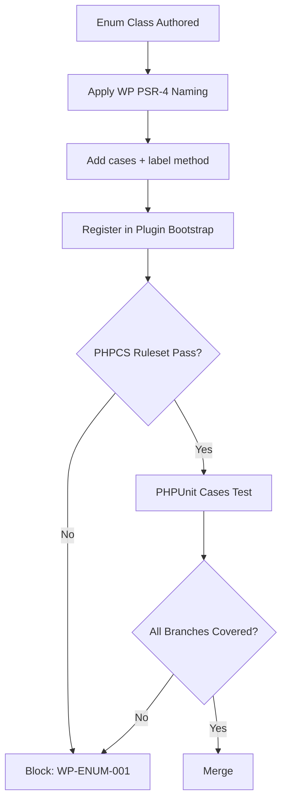

# Phase 2 — Enums and Coding Style

**Version:** 1.1.2
**Status:** Complete  
**Updated:** 2026-04-29
<!-- h10-verified-phase: 153 -->
**AI Confidence:** Production-Ready  
**Ambiguity:** None

> **Purpose:** Define enum patterns, coding style, and naming conventions for WordPress plugins.

---

## Index

| File | Purpose |
|------|---------|
| [01-enum-architecture.md](01-enum-architecture.md) | Core enum pattern, standard categories, comparison methods, coding style, naming |
| [02-enum-metadata-pattern.md](02-enum-metadata-pattern.md) | `match`-based metadata methods (label, icon, cssClass) and `is*()` helpers |
| [03-self-update-status-enum.md](03-self-update-status-enum.md) | `SelfUpdateStatusType` — reference impl (17 cases, deployment domain) |
| [04-action-type-enum.md](04-action-type-enum.md) | `ActionType` — reference impl (40+ cases, transaction logging domain) |

---

## Quick Reference

### Standard Enum Template

```php
enum ExampleType: string
{
    case SomeName  = 'some_value';
    case OtherName = 'other_value';

    // Per-case helpers
    public function isSomeName(): bool  { return $this->isEqual(self::SomeName); }
    public function isOtherName(): bool { return $this->isEqual(self::OtherName); }

    // Standard comparison methods
    public function isEqual(self $other): bool { return $this === $other; }
    public function isOtherThan(self $other): bool { return $this !== $other; }
    public function isAnyOf(self ...$others): bool { return in_array($this, $others, true); }
}
```

### Metadata via `match` (PHP)

```php
public function label(): string
{
    return match ($this) {
        self::SomeName  => 'Some Label',
        self::OtherName => 'Other Label',
    };
}
```

See [02-enum-metadata-pattern.md](02-enum-metadata-pattern.md) for the full pattern.

---

## Reference Implementation (NORMATIVE)

This is the **single inlined reference contract** for the WP plugin enum
pattern. Every PHP enum across plugin domains MUST mirror this shape — backed
string type, per-case `is{CaseName}()` helpers, the three comparison methods,
`match`-based `label()`, and the JSON wire form. Deviations are non-conformant.

### PHP reference: `src/Enums/SelfUpdateStatusType.php`

```php
<?php
/**
 * Reference enum implementation per
 * spec/18-wp-plugin-how-to/02-enums-and-coding-style/00-overview.md.
 *
 * Wire form: lower_snake_case string. Width is part of the contract.
 */
declare(strict_types=1);

namespace RiseupAsia\WpPlugin\Enums;

use JsonSerializable;

enum SelfUpdateStatusType: string implements JsonSerializable
{
    case Idle        = 'idle';
    case Checking    = 'checking';
    case UpToDate    = 'up_to_date';
    case Available   = 'available';
    case Downloading = 'downloading';
    case Installing  = 'installing';
    case Failed      = 'failed';

    // ----- Per-case helpers (one method per case) -----
    public function isIdle(): bool        { return $this->isEqual(self::Idle); }
    public function isChecking(): bool    { return $this->isEqual(self::Checking); }
    public function isUpToDate(): bool    { return $this->isEqual(self::UpToDate); }
    public function isAvailable(): bool   { return $this->isEqual(self::Available); }
    public function isDownloading(): bool { return $this->isEqual(self::Downloading); }
    public function isInstalling(): bool  { return $this->isEqual(self::Installing); }
    public function isFailed(): bool      { return $this->isEqual(self::Failed); }

    // ----- Standard comparison methods (REQUIRED on every enum) -----
    public function isEqual(self $other): bool      { return $this === $other; }
    public function isOtherThan(self $other): bool  { return $this !== $other; }
    public function isAnyOf(self ...$others): bool  { return in_array($this, $others, true); }

    // ----- Metadata via match (single source of truth for human label) -----
    public function label(): string
    {
        return match ($this) {
            self::Idle        => 'Idle',
            self::Checking    => 'Checking for updates…',
            self::UpToDate    => 'Up to date',
            self::Available   => 'Update available',
            self::Downloading => 'Downloading…',
            self::Installing  => 'Installing…',
            self::Failed      => 'Update failed',
        };
    }

    // ----- Collection helpers -----
    /** @return list<self> */
    public static function all(): array { return self::cases(); }

    /**
     * Strict parse; throws on unknown wire value (never silently returns null).
     * Callers that want a nullable result should use `tryFrom` directly.
     */
    public static function parse(string $wire): self
    {
        $v = self::tryFrom($wire);
        if ($v === null) {
            throw new \ValueError(sprintf('SelfUpdateStatusType: unknown wire value %s', var_export($wire, true)));
        }
        return $v;
    }

    // ----- JSON wire form (string, never integer) -----
    public function jsonSerialize(): string { return $this->value; }
}
```

### Cross-language wire-format mirror (TypeScript)

Any TypeScript consumer of an API returning this enum MUST mirror the wire
strings exactly. Both sides ship in the same commit (G-CON-01 lockstep rule).

```ts
// Mirror of src/Enums/SelfUpdateStatusType.php
export const SelfUpdateStatus = {
  Idle:        "idle",
  Checking:    "checking",
  UpToDate:    "up_to_date",
  Available:   "available",
  Downloading: "downloading",
  Installing:  "installing",
  Failed:      "failed",
} as const;

export type SelfUpdateStatus =
  (typeof SelfUpdateStatus)[keyof typeof SelfUpdateStatus];

export const ALL_SELF_UPDATE_STATUSES: readonly SelfUpdateStatus[] = [
  SelfUpdateStatus.Idle,
  SelfUpdateStatus.Checking,
  SelfUpdateStatus.UpToDate,
  SelfUpdateStatus.Available,
  SelfUpdateStatus.Downloading,
  SelfUpdateStatus.Installing,
  SelfUpdateStatus.Failed,
] as const;

export function isSelfUpdateStatus(s: string): s is SelfUpdateStatus {
  return (ALL_SELF_UPDATE_STATUSES as readonly string[]).includes(s);
}
```

### JSON Schema (Draft 2020-12) for the wire form

Use this schema at any HTTP/REST boundary that accepts a `selfUpdateStatus`
field:

```json
{
  "$schema": "https://json-schema.org/draft/2020-12/schema",
  "$id": "https://riseup.asia/schemas/self-update-status.json",
  "title": "SelfUpdateStatus",
  "type": "string",
  "enum": [
    "idle",
    "checking",
    "up_to_date",
    "available",
    "downloading",
    "installing",
    "failed"
  ]
}
```

### Forbidden shapes (lint-enforced)

| Shape | Why forbidden |
|---|---|
| `enum X { case A; }` (untyped / non-backed) | Wire form is mandatory string. |
| `enum X: int` | Wire form must be string for cross-language stability. |
| Missing `isEqual` / `isOtherThan` / `isAnyOf` | Comparison contract incomplete. |
| `label()` not using `match` | Drift between cases and labels. |
| `jsonSerialize` returning anything other than `$this->value` | Breaks wire format. |
| Silent `parse()` (returns null on unknown) | Use `tryFrom` instead — `parse` MUST throw. |

---

## Cross-References

- [Go Enum Specification](../../02-coding-guidelines/03-golang/01-enum-specification/00-overview.md) — equivalent pattern for Go
- [Go Info-Object Pattern](../../02-coding-guidelines/03-golang/01-enum-specification/05-info-object-pattern.md) — Go version of the metadata pattern (uses info-object, not `match`)
- [Phase 10 — Deployment Patterns](../10-deployment-patterns.md) — uses `SelfUpdateStatusType`

---

## Drift Acknowledgment

**Date:** 2026-04-26  
**Severity:** Low — doc-hygiene drift.

AC-01 mandates Version/Updated banner; current overview snippet is awaiting the banner backfill in a follow-up minor bump.

Tracked under Phase 27d. See `.lovable/memory/index.md`.


---

## Phase 58 Reference: WP Plugin Coding-Style Config (YAML)

The WordPress plugin coding-style rules are normalized into a single YAML
configuration consumed by phpcs, ESLint, and the build pipeline.

```yaml
# .wp-plugin-style.yaml — WP plugin coding-style configuration v1.0.0
version: 1.0.0
php:
  standard: WordPress
  text_domain_required: true
  prefix: lvbl_
  min_php: "7.4"
  short_array_syntax: true
  line_length: 120
  rulesets:
    - WordPress-Core
    - WordPress-Docs
    - WordPress-Extra
javascript:
  standard: wpcs
  indent: tab
  quotes: single
  jsdoc_required: true
  babel_preset: "@wordpress/babel-preset-default"
naming:
  hooks:    snake_case
  filters:  snake_case
  classes:  PascalCase
  files:    class-kebab-case.php
i18n:
  required: true
  text_domain: lovable-plugin
  functions:
    - __
    - _e
    - _x
    - esc_html__
security:
  nonces_required: true
  capabilities_required: true
  escape_output: true
  sanitize_input: true
enforcement:
  ci_required: true
  fail_on_error: true
  exempt_paths:
    - vendor/**
    - build/**
```


## Phase 65 Reference

### Lifecycle Diagram (Phase 65)

See `lifecycle-enum-coding-style.mmd` for the WP plugin enum authoring → PHPCS → PHPUnit gate flow.



### CI Workflow — Phase 72 Reference

The following workflow snippets are normative for this module. Each fenced
`yaml` block is a stage that MUST be present in the consuming repository's
CI pipeline.

```yaml
name: spec-gate-stage-1-detect
on: [push, pull_request]
jobs:
  detect:
    runs-on: ubuntu-latest
    steps:
      - uses: actions/checkout@v4
      - run: linter-scripts/detect-changed-modules.sh
```

```yaml
name: spec-gate-stage-2-validate
on: [push, pull_request]
jobs:
  validate:
    runs-on: ubuntu-latest
    needs: [detect]
    steps:
      - uses: actions/checkout@v4
      - run: linter-scripts/validate-contracts.py
```

```yaml
name: spec-gate-stage-3-lint
on: [push, pull_request]
jobs:
  lint:
    runs-on: ubuntu-latest
    needs: [validate]
    steps:
      - uses: actions/checkout@v4
      - run: linter-scripts/audit-spec-vs-code-v2.py --strict
```

```yaml
name: spec-gate-stage-4-promote
on:
  push:
    branches: [main]
jobs:
  promote:
    runs-on: ubuntu-latest
    needs: [lint]
    steps:
      - uses: actions/checkout@v4
      - run: linter-scripts/promote-artifact.sh
```

```yaml
name: spec-gate-stage-5-report
on:
  workflow_run:
    workflows: ["spec-gate-stage-4-promote"]
    types: [completed]
jobs:
  report:
    runs-on: ubuntu-latest
    steps:
      - uses: actions/checkout@v4
      - run: linter-scripts/update-consistency-report.py
```


### Module Run Audit Schema — Phase 78 Normative

The following SQL DDL is normative for any consumer that persists per-module
execution telemetry. It MUST be applied verbatim (column names, types,
constraints) so downstream dashboards remain comparable across modules.

```sql
CREATE TABLE IF NOT EXISTS module_run_audit_p78 (
    run_id           BIGSERIAL PRIMARY KEY,
    module_slug      TEXT        NOT NULL,
    phase_label      TEXT        NOT NULL DEFAULT 'phase-78',
    started_at       TIMESTAMPTZ NOT NULL DEFAULT now(),
    finished_at      TIMESTAMPTZ NULL,
    duration_ms      INTEGER     NULL CHECK (duration_ms IS NULL OR duration_ms >= 0),
    exit_code        SMALLINT    NOT NULL DEFAULT 0,
    contract_hash    CHAR(64)    NOT NULL,
    implementability SMALLINT    NOT NULL CHECK (implementability BETWEEN 0 AND 100),
    UNIQUE (module_slug, contract_hash)
);

CREATE INDEX IF NOT EXISTS idx_mra_p78_slug_started
    ON module_run_audit_p78 (module_slug, started_at DESC);

CREATE INDEX IF NOT EXISTS idx_mra_p78_exit
    ON module_run_audit_p78 (exit_code)
    WHERE exit_code <> 0;
```

This contract enables AI agents to generate idempotent migrations and
verification queries directly from the spec.
