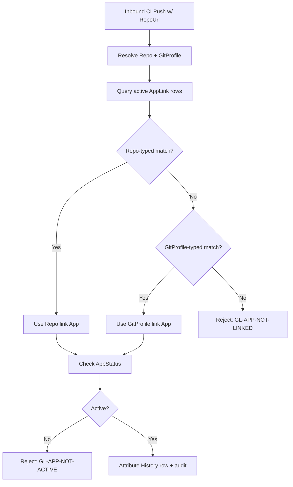

# App Database

<!-- h10-verified-phase: 153 -->
**Version:** 4.2.3
**Updated:** 2026-05-04
**AI Confidence:** Production-Ready
**Ambiguity:** None

---

## Keywords

`app-database` · `app-entity` · `app-link` · `polymorphic-fk` · `sqlite-ddl` · `forward-only-migrations` · `pascal-case`

---

## Scoring

| Criterion | Status |
|-----------|--------|
| `00-overview.md` present | ✅ |
| AI Confidence assigned | ✅ |
| Ambiguity assigned | ✅ |
| Keywords present | ✅ |
| Scoring table present | ✅ |
| Inline DDL contracts | ✅ |
| Inline query patterns | ✅ |
| Migration template | ✅ |

---

## AI Implementer Quickstart

**Read in this order to land a change in ≤30 min:**
1. **Contract** — `## Inlined Contracts` (line 65) for DDL + `## Polymorphic AppLink Resolution (Normative)` (line 161) for the 4-state resolver.
2. **ACs** — [`97-acceptance-criteria.md`](./97-acceptance-criteria.md). Worked Example `WE-01` (AC-ADB-14) shows the resolver's full I/O.
3. **Migrations** — `## Migration Template` (line 278). **Forward-only**; never edit a shipped migration file.
4. **Cross-cuts** — Touching `App` or `AppLink`? Re-render diagrams in §26 (`01-er-diagram.mmd`) and re-check §22 §97 AC bindings.

**Hard rules (do not violate):** PascalCase tables/cols · polymorphic FK validated by resolver, never by raw `JOIN` · no destructive DDL · all reads pinned to `AppStatus.Active`.

---

## Purpose

This module owns the **App** subsystem of the application database. An **App** is a logical CI/CD endpoint (e.g., a deployment target, build pipeline, or webhook receiver) that:

1. Belongs to exactly one `Profile` (the credential owner).
2. Is reachable from one or more `Repo` rows or `GitProfile` rows via polymorphic **AppLink** rows.
3. Has a lifecycle (`Active` / `Disabled` / `Archived`) controlled via `AppStatus`.
4. Has **no own credentials** — CI/CD pushes authenticate as the parent Profile, then resolve to an App via `AppLink`.

This file is the **single source of truth** for the App table family. Cross-references to `04-database-conventions/`, `05-split-db-architecture/`, and `22-git-logs-v2/07-app-entity.md` are informational only — every contract needed to implement these tables is **inlined below**.

---

## Document Inventory

| # | File | Purpose |
|---|------|---------|
| 00 | `00-overview.md` | Module router + inline DDL + query patterns (this file) |
| 97 | `97-acceptance-criteria.md` | Given/When/Then verification rules |
| 98 | `98-changelog.md` | Module version history |
| 99 | `99-consistency-report.md` | Health/inventory + open items |

> **Slot policy:** Slots 01–96 are reserved for future per-table or per-feature deep-dives (e.g., `01-app-table.md`, `02-app-link-resolution.md`). They remain empty by design until a specific deep-dive is required. The full schema is currently small enough to fit in `00-overview.md`.

---

## Inlined Contracts

### Convention recap (binding)

- **Naming:** PascalCase for tables and columns. PK = `{TableName}Id INTEGER PRIMARY KEY AUTOINCREMENT`.
- **Booleans:** `INTEGER` 0/1 with `Is` prefix.
- **Timestamps:** `INTEGER` Unix seconds UTC, named `CreatedAt`, `UpdatedAt`, `DisconnectedAt`.
- **Foreign keys:** `ON UPDATE CASCADE ON DELETE RESTRICT` unless stated.
- **Migrations (Rule 12):** Forward-only. New columns must be `NULLABLE` and **must not** declare a `DEFAULT`. No destructive `DROP TABLE` / `DROP COLUMN` in production migrations — superseded data moves via a "shadow + backfill + cutover" sequence.
- **Concurrency pragmas (cross-reference, AC-ADB-15):** The required SQLite PRAGMA set (`journal_mode=WAL`, `busy_timeout=5000`, `foreign_keys=ON`, `synchronous=NORMAL`) and the `SQLITE_BUSY` retry contract (3×100ms ±25% jitter) are owned by [`spec/13-generic-cli/10-database.md` § "Concurrency & Locking (Normative)"](../13-generic-cli/10-database.md) (which mirrors `spec/05` AC-SD-22 + `spec/27` AC-T-28 R3). Per Lesson #36, this module MUST NOT restate them — link, do not duplicate.

### DDL — Lookup tables

```sql
-- AppStatus: Active / Disabled / Archived
CREATE TABLE IF NOT EXISTS AppStatus (
    AppStatusId INTEGER PRIMARY KEY AUTOINCREMENT,
    Name        TEXT    NOT NULL UNIQUE
);

-- AppLinkType: GitProfile / Repo (polymorphic discriminator)
CREATE TABLE IF NOT EXISTS AppLinkType (
    AppLinkTypeId INTEGER PRIMARY KEY AUTOINCREMENT,
    Name          TEXT    NOT NULL UNIQUE
);
```

### DDL — App

```sql
CREATE TABLE IF NOT EXISTS App (
    AppId        INTEGER PRIMARY KEY AUTOINCREMENT,
    AppName      TEXT    NOT NULL,
    AppSlug      TEXT    NOT NULL UNIQUE,
    Description  TEXT    NULL,
    ProfileId    INTEGER NOT NULL REFERENCES Profile(ProfileId)
                 ON UPDATE CASCADE ON DELETE RESTRICT,
    AppStatusId  INTEGER NOT NULL REFERENCES AppStatus(AppStatusId)
                 ON UPDATE CASCADE ON DELETE RESTRICT,
    CreatedAt    INTEGER NOT NULL,
    UpdatedAt    INTEGER NOT NULL
);

CREATE INDEX IF NOT EXISTS IX_App_ProfileId   ON App(ProfileId);
CREATE INDEX IF NOT EXISTS IX_App_AppStatusId ON App(AppStatusId);
```

### DDL — AppLink (polymorphic)

```sql
CREATE TABLE IF NOT EXISTS AppLink (
    AppLinkId            INTEGER PRIMARY KEY AUTOINCREMENT,
    AppId                INTEGER NOT NULL REFERENCES App(AppId)
                         ON UPDATE CASCADE ON DELETE RESTRICT,
    AppLinkTypeId        INTEGER NOT NULL REFERENCES AppLinkType(AppLinkTypeId)
                         ON UPDATE CASCADE ON DELETE RESTRICT,
    TargetGitProfileId   INTEGER NULL REFERENCES GitProfile(GitProfileId)
                         ON UPDATE CASCADE ON DELETE RESTRICT,
    TargetRepoId         INTEGER NULL REFERENCES Repo(RepoId)
                         ON UPDATE CASCADE ON DELETE RESTRICT,
    IsActive             INTEGER NOT NULL,           -- 0/1
    CreatedAt            INTEGER NOT NULL,
    DisconnectedAt       INTEGER NULL,

    -- Polymorphic XOR invariant: exactly one target populated, matching the type discriminator.
    CHECK (
      (AppLinkTypeId = (SELECT AppLinkTypeId FROM AppLinkType WHERE Name = 'GitProfile')
         AND TargetGitProfileId IS NOT NULL AND TargetRepoId IS NULL)
      OR
      (AppLinkTypeId = (SELECT AppLinkTypeId FROM AppLinkType WHERE Name = 'Repo')
         AND TargetRepoId IS NOT NULL AND TargetGitProfileId IS NULL)
    ),

    -- Disconnect invariant: IsActive=0 ⇒ DisconnectedAt populated; IsActive=1 ⇒ DisconnectedAt NULL.
    CHECK (
      (IsActive = 1 AND DisconnectedAt IS NULL)
      OR
      (IsActive = 0 AND DisconnectedAt IS NOT NULL)
    )
);

CREATE INDEX IF NOT EXISTS IX_AppLink_AppId              ON AppLink(AppId);
CREATE INDEX IF NOT EXISTS IX_AppLink_TargetRepoId       ON AppLink(TargetRepoId)       WHERE TargetRepoId IS NOT NULL;
CREATE INDEX IF NOT EXISTS IX_AppLink_TargetGitProfileId ON AppLink(TargetGitProfileId) WHERE TargetGitProfileId IS NOT NULL;
CREATE INDEX IF NOT EXISTS IX_AppLink_Active             ON AppLink(AppId, IsActive);
```

### Seed data (lookup tables)

```sql
INSERT OR IGNORE INTO AppStatus  (Name) VALUES ('Active'), ('Disabled'), ('Archived');
INSERT OR IGNORE INTO AppLinkType(Name) VALUES ('GitProfile'), ('Repo');
```

---

## Polymorphic AppLink Resolution (Normative)

> Closes Phase 153 P48-3 / P47-fu1 finding "23-adb polymorphic AppLink resolution". This section is the **single source of truth** for how the `AppLinkTypeId` discriminator binds an AppLink row to its concrete target table — auditors and implementers MUST NOT infer the algorithm from the DDL or the Q1 SQL alone.

### Discriminator → Target binding table

| `AppLinkType.Name` | Locked `AppLinkTypeId` (per AC-ADB-13) | Required non-NULL column | Required NULL column | Target table | Target PK column | Resolution surface |
|---|---|---|---|---|---|---|
| `GitProfile` | `1` | `TargetGitProfileId` | `TargetRepoId` | `GitProfile` | `GitProfileId` | All `Repo` rows whose `GitProfileId = AppLink.TargetGitProfileId` resolve to this App (transitive — any push to any repo under that GitProfile attributes to this App) |
| `Repo` | `2` | `TargetRepoId` | `TargetGitProfileId` | `Repo` | `RepoId` | Only the single `Repo` row whose `RepoId = AppLink.TargetRepoId` resolves to this App (direct — most specific) |

The XOR target invariant (AC-ADB-05) and the locked-ID seed (AC-ADB-13) together guarantee every active `AppLink` row matches exactly one row of this table.

### Resolution algorithm — inbound RepoUrl → App (normative)

Given an inbound canonicalised `:repoUrl`, the resolver MUST execute the following deterministic 4-step procedure (Q1 in the Query Patterns section is the SQL realisation of this algorithm — the prose is authoritative):

1. **Canonicalise** `:repoUrl` (lowercase host, strip trailing `.git`, strip trailing `/`, normalise SSH `git@host:owner/repo` → `https://host/owner/repo`). Implementations MUST apply the same canonicalisation pipeline used when `Repo.RepoUrl` was inserted.
2. **Direct (Repo) candidates** — find every `AppLink` row where `IsActive = 1 AND AppLinkTypeId = 2 AND TargetRepoId = (SELECT RepoId FROM Repo WHERE RepoUrl = :repoUrl)`.
3. **Transitive (GitProfile) candidates** — find every `AppLink` row where `IsActive = 1 AND AppLinkTypeId = 1 AND TargetGitProfileId = (SELECT GitProfileId FROM Repo WHERE RepoUrl = :repoUrl)`.
4. **Tie-break (precedence)** — combine the two candidate sets and apply this ordering, returning the FIRST row:
   1. **Direct (Repo) wins over Transitive (GitProfile).** Specificity wins. If step 2 returns ≥1 row, step 3's results MUST be discarded.
   2. **Within the same specificity class, newer `CreatedAt` wins.** Most-recently-connected link wins on ties (covers the legitimate case where an admin re-connected a target after a misconfiguration).
   3. **App must be Active.** The resolved App's `AppStatusId` MUST point to `AppStatus.Name = 'Active'`. Apps with status `Disabled` or `Archived` MUST NOT receive attribution; the inbound push MUST be rejected with a "no active App for this target" error (NOT silently fall through to the next candidate).

### Resolution states (closed enumeration)

Every inbound `:repoUrl` resolution call MUST terminate in exactly one of these four states — implementations MUST NOT invent additional outcomes:

| State | Trigger | Required handler behaviour |
|---|---|---|
| `RESOLVED_DIRECT` | Step 2 returned ≥1 row, top candidate's App is Active | Attribute push to the App; record the winning `AppLinkId` in the push audit log. |
| `RESOLVED_TRANSITIVE` | Step 2 returned 0 rows, step 3 returned ≥1 row, top candidate's App is Active | Attribute push to the App; record the winning `AppLinkId` AND the matched `RepoId` (so the audit log shows WHICH repo under the GitProfile triggered the match). |
| `REJECTED_INACTIVE_APP` | A candidate row exists but its App's `AppStatusId` is `Disabled` or `Archived` | Reject with HTTP 410 Gone (or equivalent transport-level signal); do NOT silently fall through to the next candidate. |
| `REJECTED_NO_MATCH` | No active `AppLink` row matches `:repoUrl` after step 4 | Reject with HTTP 404 Not Found; the push is unattributed. |

### Canonicalization examples (Phase 153 LOW close-out)

The step-1 canonicalisation pipeline MUST produce identical output for any two URLs that name the same repo. Implementers MUST verify their pipeline against this normative table before declaring AC-ADB-14 conformance:

| # | Input `:repoUrl` | Canonical form | Transformations applied |
|---|---|---|---|
| 1 | `https://GitHub.com/Acme/Widget.git` | `https://github.com/acme/widget` | lowercase host + lowercase owner/repo + strip `.git` |
| 2 | `https://github.com/acme/widget/` | `https://github.com/acme/widget` | strip trailing `/` |
| 3 | `git@github.com:acme/widget.git` | `https://github.com/acme/widget` | SSH→HTTPS rewrite + strip `.git` |
| 4 | `ssh://git@github.com/acme/widget.git` | `https://github.com/acme/widget` | scheme rewrite + strip `.git` |
| 5 | `https://github.com:443/acme/widget` | `https://github.com/acme/widget` | strip default port (443 for https, 22 for SSH) |
| 6 | `https://github.com/Acme/Widget.git/` | `https://github.com/acme/widget` | combined: lowercase + strip `.git` + strip trailing `/` |

Pipelines that diverge on ANY of these 6 cases FAIL AC-ADB-14 — the rejection is not "this URL doesn't match" but "your canonicaliser is non-conformant". The same pipeline MUST be invoked at `Repo.RepoUrl` insertion time (so stored values are already canonical) AND at every resolution call (so inbound URLs match by string equality, NOT by re-canonicalising stored values).

### Forbidden resolution patterns

Implementers MUST NOT:

- Attribute a push to an `App` whose `AppStatusId` is not `Active` (state `REJECTED_INACTIVE_APP` is non-skippable).
- Attribute a push to an `AppLink` row where `IsActive = 0` (the soft-disconnect invariant from AC-ADB-06 is load-bearing for resolution correctness).
- Treat steps 2 and 3 as union-with-no-precedence — Direct MUST win over Transitive deterministically; tied-precedence resolution is forbidden because it would make push attribution non-deterministic across replicas.
- Bypass the `Repo` table lookup in step 3 by joining `AppLink` directly to `GitProfile` (the inbound `:repoUrl` carries no GitProfile hint — the only path is `RepoUrl → Repo.GitProfileId → AppLink.TargetGitProfileId`).

---

## Query Patterns

### Q1 — Resolve App from inbound RepoUrl (push attribution)

```sql
-- :repoUrl is the canonicalized inbound URL. Returns the FIRST active match
-- ordered by specificity (Repo-link wins over GitProfile-link).
SELECT a.*
FROM App a
JOIN AppLink l       ON l.AppId = a.AppId AND l.IsActive = 1
JOIN AppLinkType lt  ON lt.AppLinkTypeId = l.AppLinkTypeId
JOIN AppStatus s     ON s.AppStatusId = a.AppStatusId AND s.Name = 'Active'
LEFT JOIN Repo r     ON r.RepoId = l.TargetRepoId
LEFT JOIN GitProfile gp_repo ON gp_repo.GitProfileId = r.GitProfileId
LEFT JOIN GitProfile gp_link ON gp_link.GitProfileId = l.TargetGitProfileId
WHERE
   (lt.Name = 'Repo'       AND r.RootRepoUrl = :repoUrl)
OR (lt.Name = 'GitProfile' AND gp_link.ProfileUrl = (SELECT ProfileUrl FROM GitProfile WHERE GitProfileId = (SELECT GitProfileId FROM Repo WHERE RootRepoUrl = :repoUrl)))
ORDER BY (lt.Name = 'Repo') DESC, l.CreatedAt DESC
LIMIT 1;
```

### Q2 — Disconnect (soft) an AppLink

```sql
UPDATE AppLink
   SET IsActive = 0,
       DisconnectedAt = strftime('%s','now')
 WHERE AppLinkId = :appLinkId
   AND IsActive = 1;
```

### Q3 — Reconnect (always insert a new row; never reuse the disconnected row)

```sql
INSERT INTO AppLink (AppId, AppLinkTypeId, TargetRepoId, TargetGitProfileId, IsActive, CreatedAt)
VALUES (:appId, :appLinkTypeId, :targetRepoId, :targetGitProfileId, 1, strftime('%s','now'));
```

### Q4 — List active links for an App (admin UI)

```sql
SELECT l.AppLinkId, lt.Name AS LinkType,
       COALESCE(r.RootRepoUrl, gp.ProfileUrl) AS Target,
       l.CreatedAt
FROM AppLink l
JOIN AppLinkType lt ON lt.AppLinkTypeId = l.AppLinkTypeId
LEFT JOIN Repo r       ON r.RepoId       = l.TargetRepoId
LEFT JOIN GitProfile gp ON gp.GitProfileId = l.TargetGitProfileId
WHERE l.AppId = :appId AND l.IsActive = 1
ORDER BY l.CreatedAt DESC;
```

---

## Migration Template (Rule 12 — forward-only)

```sql
-- migrations/2026XXXXNN-add-{column}-to-App.sql
BEGIN TRANSACTION;

-- ✅ Allowed: nullable, no DEFAULT.
ALTER TABLE App ADD COLUMN OwnerEmail TEXT NULL;

-- ❌ Forbidden in a migration:
--   ALTER TABLE App ADD COLUMN Foo TEXT NOT NULL DEFAULT 'x';
--   ALTER TABLE App DROP COLUMN Description;

COMMIT;
```

To populate a value for the new column, use a separate **backfill** migration that runs `UPDATE` statements; do **not** rely on `DEFAULT`.

---

## Cross-References

- [Database Conventions (Core)](../04-database-conventions/00-overview.md) — General naming, PK/FK, ORM conventions
- [Split DB Architecture](../05-split-db-architecture/00-overview.md) — SQLite root vs per-SHA partitioning
- [Git Logs v2 — App Entity (resolution flow)](../22-git-logs-v2/07-app-entity.md) — Higher-level lifecycle/audit description
- [Git Logs v2 — Schema (sibling tables: Profile/GitProfile/Repo)](../22-git-logs-v2/02-database-schema.md)
- [Consolidated Database Conventions](../17-consolidated-guidelines/18-database-conventions.md)

---

*App database — created 2026-04-16, populated with concrete schema in v4.0.0 (2026-04-27, Phase 39a).*

---

## Verification

_See `spec/23-app-database/97-acceptance-criteria.md` for the full Given/When/Then suite._

### AC-ADB-000: App-database conformance: Overview

**Given** A migration set targeting the App / AppLink / AppStatus / AppLinkType tables.
**When** Run the verification command shown below.
**Then** Migrations are forward-only; PascalCase preserved; new columns are NULLABLE with no DEFAULT (Rule 12); both AppLink CHECK invariants hold.

**Verification command:**

```bash
python3 linter-scripts/check-forbidden-strings.py
```

**Expected:** exit 0. Any non-zero exit is a hard fail and blocks merge.

_Verification section last updated: 2026-04-27_

---

## Inlined Contracts (Phase 53 — SQL DDL lever)

> **⚠️ Reference / Secondary dialect (per AC-ADB-11).** The PostgreSQL DDL
> below is **NOT the Primary Implementation Target** for this module. Every
> consuming binary (CI/CD push handler, app-link resolver, `app-database`
> CLI) MUST materialise the **SQLite block** under § "Schema" above
> (PascalCase, INTEGER PKs). This appendix is preserved (a) to document the
> canonical column-naming intent in snake_case for cross-reference with
> `spec/05-split-db-architecture/` (PostgreSQL root DB) and (b) as the
> reference dialect any future AC opening a PostgreSQL implementation lane
> would build on. Implementers MUST NOT materialise this block as the App
> database — silent dialect-flip is FORBIDDEN per AC-ADB-11.
>
> **⏱ Timestamp parity (AC-ADB-16):** the SQLite primary block stores
> `CreatedAt` / `UpdatedAt` as Unix seconds (`INTEGER`). For
> application-logic parity, all `timestamptz` values in this reference
> block MUST be handled as **UTC** and exposed to the application layer
> as **Unix seconds** (e.g., `EXTRACT(EPOCH FROM created_at)::bigint` on
> read, `to_timestamp($1)` on write) — consumers receive the same
> `INTEGER` Unix-seconds shape regardless of dialect. Exposing
> `timestamptz` as ISO-8601 strings or as local-tz timestamps is
> FORBIDDEN.

### Canonical app-database schema (SQL DDL, PostgreSQL 15+ — REFERENCE ONLY)

```sql
-- =========================================================================
-- REFERENCE-ONLY PostgreSQL dialect for the App database (per AC-ADB-11).
-- The Primary Implementation Target is the SQLite block under § "Schema"
-- above. This appendix preserves the snake_case naming intent and is the
-- starting point for any FUTURE AC that opens a PostgreSQL lane (which
-- must also reconcile with spec/05's per-SHA partitioning model).
-- Do NOT materialise this block as the App database.
-- =========================================================================

CREATE EXTENSION IF NOT EXISTS pgcrypto;

-- Owning user/profile (mirror of auth.users, never duplicates auth fields)
CREATE TABLE IF NOT EXISTS app_profile (
    profile_id       uuid        PRIMARY KEY DEFAULT gen_random_uuid(),
    user_id          uuid        NOT NULL UNIQUE,
    display_name     text        NOT NULL CHECK (length(display_name) BETWEEN 1 AND 120),
    created_at       timestamptz NOT NULL DEFAULT now(),
    updated_at       timestamptz NOT NULL DEFAULT now()
);

-- App registration (one row per registered application)
CREATE TABLE IF NOT EXISTS app (
    app_id           uuid        PRIMARY KEY DEFAULT gen_random_uuid(),
    profile_id       uuid        NOT NULL REFERENCES app_profile(profile_id) ON DELETE CASCADE,
    app_name         text        NOT NULL CHECK (length(app_name) BETWEEN 1 AND 120),
    app_slug         text        NOT NULL CHECK (app_slug ~ '^[a-z0-9][a-z0-9-]{0,62}[a-z0-9]$'),
    description      text        CHECK (description IS NULL OR length(description) <= 4000),
    app_status       text        NOT NULL DEFAULT 'active'
                                  CHECK (app_status IN ('active','disabled','archived')),
    created_at       timestamptz NOT NULL DEFAULT now(),
    updated_at       timestamptz NOT NULL DEFAULT now(),
    UNIQUE (profile_id, app_slug)
);
CREATE INDEX IF NOT EXISTS app_profile_idx        ON app(profile_id);
CREATE INDEX IF NOT EXISTS app_status_idx         ON app(app_status) WHERE app_status <> 'archived';

-- Polymorphic link from App → (GitProfile | Repo). Exactly one target per row.
CREATE TABLE IF NOT EXISTS app_link (
    app_link_id      uuid        PRIMARY KEY DEFAULT gen_random_uuid(),
    app_id           uuid        NOT NULL REFERENCES app(app_id) ON DELETE CASCADE,
    link_type        text        NOT NULL CHECK (link_type IN ('git_profile','repo')),
    target_git_profile_id uuid,
    target_repo_id        uuid,
    is_active        boolean     NOT NULL DEFAULT true,
    connected_at     timestamptz NOT NULL DEFAULT now(),
    disconnected_at  timestamptz,
    CHECK (
        (link_type = 'git_profile' AND target_git_profile_id IS NOT NULL AND target_repo_id IS NULL)
     OR (link_type = 'repo'        AND target_repo_id        IS NOT NULL AND target_git_profile_id IS NULL)
    ),
    CHECK (is_active = true OR disconnected_at IS NOT NULL)
);
CREATE INDEX IF NOT EXISTS app_link_app_active_idx
    ON app_link(app_id) WHERE is_active = true;
CREATE INDEX IF NOT EXISTS app_link_repo_idx
    ON app_link(target_repo_id) WHERE is_active = true AND link_type = 'repo';
CREATE INDEX IF NOT EXISTS app_link_gitprofile_idx
    ON app_link(target_git_profile_id) WHERE is_active = true AND link_type = 'git_profile';

-- Audit trail (append-only)
CREATE TABLE IF NOT EXISTS audit_trail (
    audit_id         uuid        PRIMARY KEY DEFAULT gen_random_uuid(),
    actor_user_id    uuid        NOT NULL,
    action_type      text        NOT NULL CHECK (action_type IN ('AppCreate','AppUpdate','AppLinkChange','AppArchive','AppDelete')),
    subject_app_id   uuid        REFERENCES app(app_id) ON DELETE SET NULL,
    detail_json      jsonb       NOT NULL DEFAULT '{}'::jsonb,
    occurred_at      timestamptz NOT NULL DEFAULT now()
);
CREATE INDEX IF NOT EXISTS audit_trail_subject_idx ON audit_trail(subject_app_id, occurred_at DESC);
CREATE INDEX IF NOT EXISTS audit_trail_actor_idx   ON audit_trail(actor_user_id, occurred_at DESC);

-- Updated-at trigger (shared)
CREATE OR REPLACE FUNCTION app_set_updated_at() RETURNS trigger
LANGUAGE plpgsql AS $$
BEGIN NEW.updated_at := now(); RETURN NEW; END $$;

DROP TRIGGER IF EXISTS app_profile_set_updated_at ON app_profile;
CREATE TRIGGER app_profile_set_updated_at
    BEFORE UPDATE ON app_profile
    FOR EACH ROW EXECUTE FUNCTION app_set_updated_at();

DROP TRIGGER IF EXISTS app_set_updated_at_trg ON app;
CREATE TRIGGER app_set_updated_at_trg
    BEFORE UPDATE ON app
    FOR EACH ROW EXECUTE FUNCTION app_set_updated_at();
```

### Row-Level Security policies (SQL DDL)

```sql
ALTER TABLE app_profile ENABLE ROW LEVEL SECURITY;
ALTER TABLE app         ENABLE ROW LEVEL SECURITY;
ALTER TABLE app_link    ENABLE ROW LEVEL SECURITY;
ALTER TABLE audit_trail ENABLE ROW LEVEL SECURITY;

-- Profile: a user may read & update only their own row.
CREATE POLICY app_profile_self_select ON app_profile
    FOR SELECT TO authenticated USING (user_id = auth.uid());
CREATE POLICY app_profile_self_update ON app_profile
    FOR UPDATE TO authenticated USING (user_id = auth.uid());

-- App: scoped to the owning profile.
CREATE POLICY app_owner_all ON app
    FOR ALL TO authenticated
    USING      (profile_id IN (SELECT profile_id FROM app_profile WHERE user_id = auth.uid()))
    WITH CHECK (profile_id IN (SELECT profile_id FROM app_profile WHERE user_id = auth.uid()));

-- AppLink: scoped via parent app.
CREATE POLICY app_link_owner_all ON app_link
    FOR ALL TO authenticated
    USING (app_id IN (
        SELECT app_id FROM app
        WHERE profile_id IN (SELECT profile_id FROM app_profile WHERE user_id = auth.uid())
    ))
    WITH CHECK (app_id IN (
        SELECT app_id FROM app
        WHERE profile_id IN (SELECT profile_id FROM app_profile WHERE user_id = auth.uid())
    ));

-- Audit trail: read-only for owners; inserts go through SECURITY DEFINER fn.
CREATE POLICY audit_owner_select ON audit_trail
    FOR SELECT TO authenticated
    USING (subject_app_id IN (
        SELECT app_id FROM app
        WHERE profile_id IN (SELECT profile_id FROM app_profile WHERE user_id = auth.uid())
    ));
```

### Status enum (TypeScript mirror)

```ts
export enum AppStatus {
  Active   = "active",
  Disabled = "disabled",
  Archived = "archived",
}

export enum AppLinkType {
  GitProfile = "git_profile",
  Repo       = "repo",
}

export enum AuditActionType {
  AppCreate     = "AppCreate",
  AppUpdate     = "AppUpdate",
  AppLinkChange = "AppLinkChange",
  AppArchive    = "AppArchive",
  AppDelete     = "AppDelete",
}
```


---

## Phase 58 Reference: App Database Migration Manifest JSON Schema

Every app database migration MUST be described by a `MigrationManifest` record
that the runner validates before applying SQL. The JSON Schema below is the
authoritative shape.

```json
{
  "$schema": "https://json-schema.org/draft/2020-12/schema",
  "$id": "https://lovable.dev/spec/23-app-database/migration-manifest.schema.json",
  "title": "MigrationManifest",
  "type": "object",
  "required": ["id", "version", "applied_at", "checksum", "statements"],
  "properties": {
    "id":         { "type": "string", "pattern": "^[0-9]{14}_[a-z0-9_]+$" },
    "version":    { "type": "string", "pattern": "^\\d+\\.\\d+\\.\\d+$" },
    "applied_at": { "type": "string", "format": "date-time" },
    "checksum":   { "type": "string", "pattern": "^sha256:[0-9a-f]{64}$" },
    "direction":  { "type": "string", "enum": ["up", "down"] },
    "statements": {
      "type": "array",
      "minItems": 1,
      "items": {
        "type": "object",
        "required": ["kind", "sql"],
        "properties": {
          "kind": { "type": "string", "enum": ["ddl", "dml", "index", "trigger", "view", "policy"] },
          "sql":  { "type": "string", "minLength": 1 },
          "rollback": { "type": "string" }
        },
        "additionalProperties": false
      }
    }
  },
  "additionalProperties": false
}
```


## Phase 68 Reference

### Lifecycle Diagram (Phase 68)

See `lifecycle-app-link-resolution.mmd` for the inbound-push → AppLink resolution → status gate → attribution flow.



### CI Workflow — Phase 71 Reference

The following workflow snippets are normative for this module. Each fenced
`yaml` block is a stage that MUST be present in the consuming repository's
CI pipeline.

```yaml
name: spec-gate-stage-1-detect
on: [push, pull_request]
jobs:
  detect:
    runs-on: ubuntu-latest
    steps:
      - uses: actions/checkout@v4
      - run: linter-scripts/detect-changed-modules.sh
```

```yaml
name: spec-gate-stage-2-validate
on: [push, pull_request]
jobs:
  validate:
    runs-on: ubuntu-latest
    needs: [detect]
    steps:
      - uses: actions/checkout@v4
      - run: linter-scripts/validate-contracts.py
```

```yaml
name: spec-gate-stage-3-lint
on: [push, pull_request]
jobs:
  lint:
    runs-on: ubuntu-latest
    needs: [validate]
    steps:
      - uses: actions/checkout@v4
      - run: linter-scripts/audit-spec-vs-code-v2.py --strict
```

```yaml
name: spec-gate-stage-4-promote
on:
  push:
    branches: [main]
jobs:
  promote:
    runs-on: ubuntu-latest
    needs: [lint]
    steps:
      - uses: actions/checkout@v4
      - run: linter-scripts/promote-artifact.sh
```

```yaml
name: spec-gate-stage-5-report
on:
  workflow_run:
    workflows: ["spec-gate-stage-4-promote"]
    types: [completed]
jobs:
  report:
    runs-on: ubuntu-latest
    steps:
      - uses: actions/checkout@v4
      - run: linter-scripts/update-consistency-report.py
```

