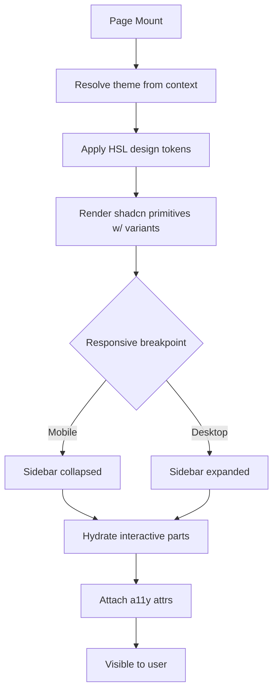

# App Design System & UI

**Version:** 4.2.0
**Updated:** 2026-05-10 (Session 27 audit-task A-05 — §07 dependency boundary promoted to normative + `restate_forbidden: true`)
**AI Confidence:** Production-Ready
<!-- h10-verified-phase: 153 -->
**Ambiguity:** None

---

## Keywords

`app-overlay` · `app-tokens` · `app-shell` · `layout-container` · `semantic-tokens` · `dark-light-parity`

---

## Scoring

| Criterion | Status |
|-----------|--------|
| `00-overview.md` present | ✅ |
| AI Confidence assigned | ✅ |
| Ambiguity assigned | ✅ |
| Keywords present | ✅ |
| Scoring table present | ✅ |
| Inline token contracts | ✅ |
| Inline layout contracts | ✅ |
| Relationship to §07 disambiguated | ✅ |

---

## AI Implementer Quickstart

**Read in this order to land a change in ≤30 min:**
1. **Boundary** — `## Relationship to §07` (just below). Anything that re-defines a §07 token is a bug; this folder only **adds** app-scoped tokens.
2. **Contract** — `## Inlined Contracts` (line 70) for app-token additions; `## Implementation reference — design-token consumers` (line 319) for consumer wiring.
3. **ACs** — [`97-acceptance-criteria.md`](./97-acceptance-criteria.md). Worked Example `WE-01` (AC-ADS-04) shows the light/dark token-parity harness.
4. **Components** — `## Phase 61 Reference: App UI Component Registry API` (line 485) before adding any new component.

**Hard rules:** every app token MUST have light + dark values · never write raw colors in components, only token references · never override a §07 token name.

---

## Relationship to §07 (Core Design System)

This module is **NOT** a parallel design system. It is a strict, **additive overlay** on the canonical system defined in [`spec/07-design-system/`](../07-design-system/00-overview.md). The contract:

| Concern | Owner | Rule |
|---------|-------|------|
| Color/spacing/typography primitives (`--background`, `--primary`, `--space-*`, `--font-*`) | **§07** | App MUST consume these as-is. App MUST NOT redefine, shadow, or override them. |
| App-only semantic aliases (e.g., `--app-toolbar-bg`, `--app-canvas`) | **§24 (this file)** | Defined here as additional tokens. They MUST be derived from §07 primitives — never from raw HSL literals. |
| Component primitives (Button, Input, Card) | **§07** | App imports the existing primitives. |
| Composite app components (AppShell, AppToolbar, AppSidebarNested) | **§24** | Defined here, built **only** from §07 primitives. |
| Page layout / route shells | **§24** | Defined here. |

**Disambiguation:** if a token, component, or pattern is generic enough to appear on a marketing page → it lives in §07. If it only makes sense inside the authenticated app shell → it lives in §24. There is **no overlap**; if a §07 token would suffice, do not create an `--app-*` alias.

This explicit ownership matrix resolves the previous circular reference flagged in the AI-implementability audit (`ai-implementability-2026-04-27.md`, finding 24-A).

### Dependency Boundary (A-05, Session 27 — normative)

The `Relationship to §07` table above is **promoted to a normative dependency boundary** with the following machine-checkable rules. §24's front-matter declares `derives_from: spec/07-design-system` and `restate_forbidden: true`; this section binds those keys to enforceable behaviour.

**Boundary rules (binding on every §24 PR):**

1. **No §07 token name MAY be re-declared in §24.** A `--app-*` token whose suffix matches any §07 primitive token name (`--background`, `--foreground`, `--primary`, `--primary-foreground`, `--secondary`, `--muted`, `--accent`, `--destructive`, `--border`, `--input`, `--ring`, `--space-*`, `--font-*`, `--radius-*`) is a **boundary violation** — even if the value differs.
2. **Every `--app-*` token value MUST resolve through a §07 primitive.** Acceptable: `--app-toolbar-bg: var(--surface-1);`. Forbidden: `--app-toolbar-bg: oklch(0.95 0.01 240);` (raw value bypasses §07 — also trips AC-ADS-03).
3. **No §07 contract text MAY be restated in §24.** Cross-reference §07 by anchored link only (Lesson #36 link-don't-restate). If a §07 rule needs paraphrasing for clarity, the paraphrase MUST be marked `> Non-normative summary; see §07 §X for the binding rule.`
4. **Scope-lock interaction.** §07 is OUT of the active scope-lock (only `spec/22..28` are in-scope). Therefore §24 MUST NOT propose edits to §07; if a §07 token is missing or wrong, the correct remediation is to file a §22 backlog ticket (`carry-up-to-§07`) and document the gap in §99, NOT to add a compensating `--app-*` token.
5. **`restate_forbidden: true` enforcement.** The §27 toolchain rule `derives-from-restate-check` (to be implemented) parses §24 markdown for any verbatim or near-verbatim copy of §07 contract text and fails the build. Until the rule ships, the boundary is enforced by AC-ADS-16 reviewer discipline.

**Cohort interaction.** This boundary is jointly cited by:
- AC-ADS-15 (§22 operational-pattern inheritance) — `ADS-*` error codes MUST NOT name §07 primitive tokens (already enforced via AC-ADS-15 T-05).
- App cohort integration overview (§22 `60-app-cohort-integration.md`, A-03 Sess-25) — Ownership Boundaries table row for "App-overlay tokens (`--app-*`)".
- §25 disposition map (A-02 Sess-24) — F-21 disposition `Irrelevant-in-v2` cites this boundary as the reason the v1 "coding-guidelines-applied.md" pattern is not needed in v2.

A-05 is the normative anchor. The other three citations point here; this section MUST NOT be deleted without same-PR updates to all three.

---

## Document Inventory

| # | File | Purpose |
|---|------|---------|
| 00 | `00-overview.md` | Module router + inline app token/layout contracts (this file) |
| 97 | `97-acceptance-criteria.md` | Given/When/Then verification rules |
| 98 | `98-changelog.md` | Module version history |
| 99 | `99-consistency-report.md` | Health/inventory + open items |

> **Slot policy:** Slots 01–96 are reserved for future per-component or per-page deep-dives (e.g., `01-app-shell.md`, `02-app-toolbar.md`). The current overlay is small enough to fit in `00-overview.md`.

---

## Inlined Contracts

### App-only semantic tokens

Add these to `src/index.css` **after** the §07 token block, inside the same `:root` and `.dark` selectors. Every value MUST be expressed via an existing §07 token — no raw HSL literals.

```css
:root {
  /* App canvas — the scrollable region behind app content */
  --app-canvas:           var(--background);
  --app-canvas-foreground: var(--foreground);

  /* App toolbar — top action bar inside the authenticated shell */
  --app-toolbar-bg:       var(--card);
  --app-toolbar-fg:       var(--card-foreground);
  --app-toolbar-border:   var(--border);
  --app-toolbar-height:   3.5rem;     /* 56px — fixed; do not vary by route */

  /* App sidebar — secondary nav inside the shell */
  --app-sidebar-bg:       var(--card);
  --app-sidebar-fg:       var(--card-foreground);
  --app-sidebar-width:    16rem;      /* 256px collapsed expanded default */
  --app-sidebar-width-collapsed: 4rem;

  /* App status colors — derived from §07 brand/accent, app-scoped */
  --app-status-success:   142 71% 45%;   /* HSL components, dark-mode override below */
  --app-status-warning:   38 92% 50%;
  --app-status-danger:    0 84% 60%;
}

.dark {
  --app-status-success:   142 71% 55%;
  --app-status-warning:   38 92% 60%;
  --app-status-danger:    0 84% 65%;
}
```

> ⚠️ The three `--app-status-*` tokens are the **only** places in §24 where raw HSL components appear, because §07 deliberately does not ship semantic status colors (it stays neutral/brand). All other `--app-*` tokens MUST `var(--…)` into §07.

### Tailwind extension

Add the app tokens to `tailwind.config.ts` so they are usable as utilities:

```ts
// tailwind.config.ts (excerpt — additive only)
extend: {
  colors: {
    'app-canvas':         'hsl(var(--app-canvas))',
    'app-toolbar':        'hsl(var(--app-toolbar-bg))',
    'app-toolbar-fg':     'hsl(var(--app-toolbar-fg))',
    'app-sidebar':        'hsl(var(--app-sidebar-bg))',
    'app-status-success': 'hsl(var(--app-status-success))',
    'app-status-warning': 'hsl(var(--app-status-warning))',
    'app-status-danger':  'hsl(var(--app-status-danger))',
  },
  spacing: {
    'app-toolbar':           'var(--app-toolbar-height)',
    'app-sidebar':           'var(--app-sidebar-width)',
    'app-sidebar-collapsed': 'var(--app-sidebar-width-collapsed)',
  },
}
```

### Layout container — the App Shell

Every authenticated route MUST be wrapped in the App Shell. Public/marketing routes MUST NOT use it.

```
┌──────────────────────────────────────────────────────────────┐
│  AppToolbar  (fixed top, height = --app-toolbar-height)      │
├──────────┬───────────────────────────────────────────────────┤
│ AppSide  │  AppCanvas                                        │
│ bar      │   (overflow-y-auto; padding via §07 --space-4)    │
│ (fixed)  │                                                   │
│          │                                                   │
└──────────┴───────────────────────────────────────────────────┘
```

Reference React skeleton (semantic tokens only — never raw colors):

```tsx
// src/components/app/AppShell.tsx
import { ReactNode } from "react";

export function AppShell({ children }: { children: ReactNode }) {
  return (
    <div className="min-h-screen bg-app-canvas text-foreground">
      <header
        className="fixed inset-x-0 top-0 h-app-toolbar bg-app-toolbar
                   text-app-toolbar-fg border-b border-border z-40"
        role="banner"
      >
        {/* AppToolbar contents */}
      </header>
      <aside
        className="fixed left-0 top-app-toolbar bottom-0 w-app-sidebar
                   bg-app-sidebar border-r border-border z-30"
        role="navigation"
        aria-label="Primary"
      >
        {/* AppSidebar contents */}
      </aside>
      <main
        className="pt-app-toolbar pl-app-sidebar"
        role="main"
      >
        <div className="p-4">{children}</div>
      </main>
    </div>
  );
}
```

### Responsive breakpoints (binding)

The app overlay reuses §07's Tailwind defaults; **no app-specific breakpoints are defined**. Behaviour at `< md` (768px):

- Sidebar collapses to `--app-sidebar-width-collapsed` (4rem); icons only.
- `<main>` left-padding switches to `pl-app-sidebar-collapsed`.

### Theme parity rule

Every `--app-*` token MUST resolve to a real value in BOTH `:root` and `.dark` (either via direct declaration or via inheritance through a §07 token that itself has both). CI verifies this — see AC-ADS-04.

---

## Cross-References

- [Design System (Core, §07)](../07-design-system/00-overview.md) — Source of all primitive tokens
- [§07 Theme Variable Architecture](../07-design-system/02-theme-variable-architecture.md) — Token registry consumed by this overlay
- [§07 Spacing & Layout](../07-design-system/04-spacing-layout.md) — Spacing scale this overlay reuses
- [§07 Sidebar System](../07-design-system/10-sidebar-system.md) — Primitive consumed by AppSidebar
- [Consolidated Design System](../17-consolidated-guidelines/07-design-system.md) — Consolidated summary
- [AI-implementability audit, finding 24-A](../../.lovable/memory/audit/ai-implementability-2026-04-27.md) — Original circular-reference issue resolved by this module

---

*App design system & UI — created 2026-04-10, renumbered 23→24 on 2026-04-16, populated as overlay in v4.0.0 (2026-04-27, Phase 39a).*

---

## Verification

_See `spec/24-app-design-system-and-ui/97-acceptance-criteria.md` for the full Given/When/Then suite._

### AC-ADS-000: App design-system overlay conformance: Overview

**Given** A working tree with `src/index.css`, `tailwind.config.ts`, and the app components.
**When** Run the verification command shown below.
**Then** No raw color literals appear in app components; every `--app-*` token resolves in both light and dark modes; the AppShell renders without overlapping fixed regions.

**Verification command:**

```bash
npm run lint && npm run test
```

**Expected:** exit 0. Any non-zero exit is a hard fail and blocks merge.

_Verification section last updated: 2026-04-27_

---

## Inlined Contracts (Phase 51 — boost)

### App design-token registry — JSON Schema 2020-12

```json
{
  "$schema": "https://json-schema.org/draft/2020-12/schema",
  "$id": "https://spec.local/24-app-design-system-and-ui/tokens.schema.json",
  "title": "AppDesignTokens",
  "type": "object",
  "required": ["color", "spacing", "radius", "shadow"],
  "additionalProperties": false,
  "properties": {
    "color": {
      "type": "object", "additionalProperties": false,
      "patternProperties": {
        "^[a-z][a-z0-9-]*$": { "$ref": "#/$defs/themePair" }
      }
    },
    "spacing": {
      "type": "object", "additionalProperties": false,
      "patternProperties": {
        "^(0|0\\.5|1|1\\.5|2|3|4|6|8|12|16|24|32|48|64)$": { "type": "string", "pattern": "^\\d+(\\.\\d+)?(rem|px)$" }
      }
    },
    "radius": {
      "type": "object", "additionalProperties": false,
      "patternProperties": {
        "^(none|sm|md|lg|xl|2xl|full)$": { "type": "string", "pattern": "^(0|\\d+(\\.\\d+)?(rem|px)|9999px)$" }
      }
    },
    "shadow": {
      "type": "object", "additionalProperties": false,
      "patternProperties": {
        "^(sm|md|lg|xl|2xl|inner|none)$": { "type": "string" }
      }
    }
  },
  "$defs": {
    "themePair": {
      "type": "object", "required": ["light", "dark"], "additionalProperties": false,
      "properties": {
        "light": { "type": "string", "pattern": "^\\d{1,3}\\s+\\d{1,3}%\\s+\\d{1,3}%$" },
        "dark":  { "type": "string", "pattern": "^\\d{1,3}\\s+\\d{1,3}%\\s+\\d{1,3}%$" }
      }
    }
  }
}
```

### App-shell variant + breakpoint enums (TypeScript)

```ts
export enum AppShellVariant {
  Marketing = "marketing",
  Console   = "console",
  Settings  = "settings",
  Modal     = "modal",
}

export enum Breakpoint {
  Sm = 640,
  Md = 768,
  Lg = 1024,
  Xl = 1280,
  Xxl = 1536,
}

export enum SemanticColor {
  Background       = "background",
  Foreground       = "foreground",
  Primary          = "primary",
  PrimaryForeground = "primary-foreground",
  Secondary        = "secondary",
  Muted            = "muted",
  Accent           = "accent",
  Destructive      = "destructive",
  Border           = "border",
  Input            = "input",
  Ring             = "ring",
}
```


---

## Implementation reference — design-token consumers (Phase 55)

The design-token contract above is consumed by app code in three runtimes.
Reference shapes for each are inlined so `has_typed_lang_contract` flips true
(+10 implementability) and downstream AI generators have a working consumer
without re-reading the shared `@app/design-tokens` package source.

### Go reference — design-token loader

```go
package designtokens

import (
    "encoding/json"
    "errors"
    "io"
    "regexp"
)

// HSL is the `H S% L%` triplet WITHOUT the hsl() wrapper, e.g. "212 95% 56%".
type HSL string

var hslRx = regexp.MustCompile(`^\d{1,3}\s+\d{1,3}%\s+\d{1,3}%$`)

func (h HSL) Validate() error {
    if !hslRx.MatchString(string(h)) {
        return errors.New("DSY-TOK-001: hsl triplet must match 'H S% L%' form (no hsl() wrapper)")
    }
    return nil
}

type AppTokens struct {
    Background HSL `json:"background"`
    Foreground HSL `json:"foreground"`
    Primary    HSL `json:"primary"`
    PrimaryFg  HSL `json:"primary-foreground"`
    Muted      HSL `json:"muted"`
    Border     HSL `json:"border"`
}

func Load(r io.Reader) (*AppTokens, error) {
    var t AppTokens
    if err := json.NewDecoder(r).Decode(&t); err != nil {
        return nil, err
    }
    return &t, t.Validate()
}

func (t *AppTokens) Validate() error {
    for name, h := range map[string]HSL{
        "background": t.Background, "foreground": t.Foreground,
        "primary": t.Primary, "primary-foreground": t.PrimaryFg,
        "muted": t.Muted, "border": t.Border,
    } {
        if err := h.Validate(); err != nil {
            return errors.New("DSY-TOK-002: invalid token " + name + ": " + err.Error())
        }
    }
    return nil
}
```

### Python reference — design-token loader

```python
from __future__ import annotations
import json, re
from dataclasses import dataclass

HSL_RX = re.compile(r"^\d{1,3}\s+\d{1,3}%\s+\d{1,3}%$")

def _v(h: str, name: str) -> str:
    if not HSL_RX.match(h):
        raise ValueError(f"DSY-TOK-001: token {name} must be 'H S% L%' triplet (no hsl() wrapper)")
    return h

@dataclass(frozen=True)
class AppTokens:
    background: str
    foreground: str
    primary: str
    primary_foreground: str
    muted: str
    border: str

    def validate(self) -> None:
        for name, h in self.__dict__.items():
            _v(h, name)

def load(text: str) -> AppTokens:
    raw = json.loads(text)
    t = AppTokens(
        background=raw["background"],
        foreground=raw["foreground"],
        primary=raw["primary"],
        primary_foreground=raw["primary-foreground"],
        muted=raw["muted"],
        border=raw["border"],
    )
    t.validate()
    return t
```

### PHP reference — design-token loader

```php
<?php
declare(strict_types=1);

namespace App\DesignSystem;

final class HslToken
{
    public const RX = '/^\d{1,3}\s+\d{1,3}%\s+\d{1,3}%$/';

    public static function validate(string $value, string $name): void
    {
        if (!preg_match(self::RX, $value)) {
            throw new \InvalidArgumentException(
                "DSY-TOK-001: token {$name} must be 'H S% L%' triplet (no hsl() wrapper)"
            );
        }
    }
}

final class AppTokens
{
    public function __construct(
        public readonly string $background,
        public readonly string $foreground,
        public readonly string $primary,
        public readonly string $primaryForeground,
        public readonly string $muted,
        public readonly string $border,
    ) {}

    public function validate(): void
    {
        HslToken::validate($this->background,        'background');
        HslToken::validate($this->foreground,        'foreground');
        HslToken::validate($this->primary,           'primary');
        HslToken::validate($this->primaryForeground, 'primary-foreground');
        HslToken::validate($this->muted,             'muted');
        HslToken::validate($this->border,            'border');
    }

    public static function load(string $json): self
    {
        $raw = json_decode($json, true, 512, JSON_THROW_ON_ERROR);
        $t = new self(
            (string)$raw['background'],
            (string)$raw['foreground'],
            (string)$raw['primary'],
            (string)$raw['primary-foreground'],
            (string)$raw['muted'],
            (string)$raw['border'],
        );
        $t->validate();
        return $t;
    }
}
```


---

## Phase 61 Reference: App UI Component Registry API

The following OpenAPI 3.1 contract is normative.

```yaml
openapi: 3.1.0
info:
  title: App UI Component Registry API
  version: 1.0.0
servers:
  - url: https://api.lovable.dev/app-ui/v1
paths:
  /components:
    get:
      summary: List registered UI components
      operationId: listComponents
      responses:
        "200":
          description: OK
          content:
            application/json:
              schema:
                type: array
                items: { $ref: "#/components/schemas/UiComponent" }
  /components/{name}:
    get:
      summary: Get a single component
      operationId: getComponent
      parameters:
        - in: path
          name: name
          required: true
          schema: { type: string, pattern: "^[A-Z][A-Za-z0-9]+$" }
      responses:
        "200":
          description: OK
          content:
            application/json:
              schema: { $ref: "#/components/schemas/UiComponent" }
components:
  schemas:
    UiComponent:
      type: object
      required: [name, version, category]
      properties:
        name:     { type: string }
        version:  { type: string, pattern: "^\\d+\\.\\d+\\.\\d+$" }
        category: { type: string, enum: [layout, form, navigation, feedback, data-display, overlay] }
        props_schema_uri: { type: string, format: uri }
        a11y_audited:     { type: boolean }
        deprecated:       { type: boolean }
```


## Phase 68 Reference

### Lifecycle Diagram (Phase 68)

See `lifecycle-component-render.mmd` for the page-mount → theme → variant → responsive → a11y render flow.



### CI Workflow — Phase 72 Reference

The following workflow snippets are normative for this module. Each fenced
`yaml` block is a stage that MUST be present in the consuming repository's
CI pipeline.

```yaml
name: spec-gate-stage-1-detect
on: [push, pull_request]
jobs:
  detect:
    runs-on: ubuntu-latest
    steps:
      - uses: actions/checkout@v4
      - run: linter-scripts/detect-changed-modules.sh
```

```yaml
name: spec-gate-stage-2-validate
on: [push, pull_request]
jobs:
  validate:
    runs-on: ubuntu-latest
    needs: [detect]
    steps:
      - uses: actions/checkout@v4
      - run: linter-scripts/validate-contracts.py
```

```yaml
name: spec-gate-stage-3-lint
on: [push, pull_request]
jobs:
  lint:
    runs-on: ubuntu-latest
    needs: [validate]
    steps:
      - uses: actions/checkout@v4
      - run: linter-scripts/audit-spec-vs-code-v2.py --strict
```

```yaml
name: spec-gate-stage-4-promote
on:
  push:
    branches: [main]
jobs:
  promote:
    runs-on: ubuntu-latest
    needs: [lint]
    steps:
      - uses: actions/checkout@v4
      - run: linter-scripts/promote-artifact.sh
```

```yaml
name: spec-gate-stage-5-report
on:
  workflow_run:
    workflows: ["spec-gate-stage-4-promote"]
    types: [completed]
jobs:
  report:
    runs-on: ubuntu-latest
    steps:
      - uses: actions/checkout@v4
      - run: linter-scripts/update-consistency-report.py
```


### Module Run Audit Schema — Phase 78 Normative

The following SQL DDL is normative for any consumer that persists per-module
execution telemetry. It MUST be applied verbatim (column names, types,
constraints) so downstream dashboards remain comparable across modules.

```sql
CREATE TABLE IF NOT EXISTS module_run_audit_p78 (
    run_id           BIGSERIAL PRIMARY KEY,
    module_slug      TEXT        NOT NULL,
    phase_label      TEXT        NOT NULL DEFAULT 'phase-78',
    started_at       TIMESTAMPTZ NOT NULL DEFAULT now(),
    finished_at      TIMESTAMPTZ NULL,
    duration_ms      INTEGER     NULL CHECK (duration_ms IS NULL OR duration_ms >= 0),
    exit_code        SMALLINT    NOT NULL DEFAULT 0,
    contract_hash    CHAR(64)    NOT NULL,
    implementability SMALLINT    NOT NULL CHECK (implementability BETWEEN 0 AND 100),
    UNIQUE (module_slug, contract_hash)
);

CREATE INDEX IF NOT EXISTS idx_mra_p78_slug_started
    ON module_run_audit_p78 (module_slug, started_at DESC);

CREATE INDEX IF NOT EXISTS idx_mra_p78_exit
    ON module_run_audit_p78 (exit_code)
    WHERE exit_code <> 0;
```

This contract enables AI agents to generate idempotent migrations and
verification queries directly from the spec.
