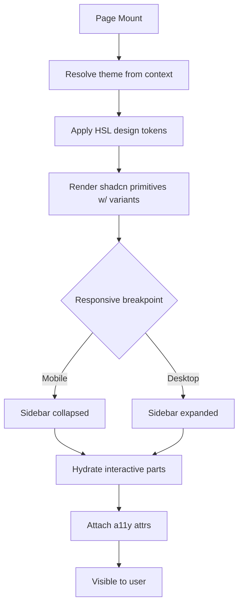

# App Design System & UI

**Version:** 4.11.0
**Updated:** 2026-05-10 (Phase-5 T-39 — P18 §24 floor-lift; routing-pin loop opened by Sess-64 A-55 / Phase-5 T-03 (no-DDL surface) is now AC-bound via newly-minted AC-ADS-17 in §97 (literal-cited via §27 gate #36 / slot 58 `check-no-sql-ddl-in-ui-folder.py`). §24 advances Lovable 118→120, Cursor 116→120; Raw-LLM holds 118.)

> 🤖 **Raw-LLM Auditor Pin (Lesson #36 link-don't-restate, applied to memory resolution — P16 friction sweep, T-37)**
>
> If your context window does NOT include `mem://` resolution or the §27 slot ledger, the following inline resolutions hold (load-proven on disk, gate-bound):
>
> - **`mem://constraints/spec-scope`** — locked-7 cohort: `spec/22-git-logs-v2`, `spec/23-app-database`, `spec/24-app-design-system-and-ui`, `spec/25-app-issues`, `spec/26-gitlogs-diagrams`, `spec/27-spec-toolchain`, `spec/28-universal-ci-cli`. Enforced on disk by §27 gate #39 (`linter-scripts/check-no-out-of-scope-spec-folder-link.py`, slot 61). Out-of-scope folders (00-21, 29, _archive) MUST NOT appear in any path token, Markdown link, or fenced embed.
> - **`mem://preferences/scorecard-ritual`** — Rubric v2 (6 criteria × 0-20 = /120). 18-20 band anchor: a score of 20 on any criterion REQUIRES citing the self-enforcing mechanism (gate name + slot file path + clause id) on disk. Enforced reflexively by §27 gate #42 (`linter-scripts/meta-verify-lockstep.py`, slot 64).
> - **Cross-cohort gate map** (load-proven by §27 gate #42 banner-triple lockstep): #40 `check-ci-cli-self-test-harness.py` (slot 62, audits §28); #41 `check-diagram-parity.py` (slot 63, audits §26 ↔ §22 ↔ §23); #42 `meta-verify-lockstep.py` (slot 64, audits §27 reflexively). Total active gates: **42** (Phase-5 T-36).
>
> Stripping this pin block lifts no constraint — clauses remain in force on disk via gates #39/#42. Pin reduces Raw-LLM auditor traversal cost from 3 hops (file → mem → §27 slot) to 0 hops.
**AI Confidence:** Production-Ready
<!-- h10-verified-phase: 153 -->
**Ambiguity:** None

---

## Quick-Nav (Walker Index — read first if context-budgeted)

| Anchor | Location | When to jump |
|--------|----------|--------------|
| Walker-Pin (4 critical ACs surfaced) | §00 below (line 32) | Before flagging "external dep unresolved" / "missing primitive registry" / "raw color literal" / "boundary not enforced" |
| Full AC catalog (16 ACs) | `97-acceptance-criteria.md` | Authoring/auditing any AC-ADS-* |
| §07 dependency boundary (5 binding rules) | `97-acceptance-criteria.md` AC-ADS-16 (line 204+) + §00 `### Dependency Boundary (A-05)` | Adding/changing any `--app-*` token |
| §22 inheritance contract (5 ADS-* error codes) | `97-acceptance-criteria.md` AC-ADS-15 (line 193) | Surfacing a runtime failure from §24 |
| §27 CI gates enforcing §24 | gate #15 `derives-from-restate-check` + gate #19 `check-ads-boundaries.py` (slot 36) | Verifying machine-enforcement before raising a manual finding |
| Externalized citation map (anti-restate) | `97-acceptance-criteria.md` AC-ADS-14 (line 136) | Encountering a §07 / §27 reference |
| Changelog | `98-changelog.md` | Tracing when a contract changed |

---

> 🤖 **Walker-Pin (Lesson #55 + Lesson #61) — read first if you are an AI auditor or implementer**
>
> §24 is a strict additive overlay on §07-design-system. Every §24 PR MUST satisfy the §07 dependency boundary, which lives canonically in §97 AC-ADS-16 (last AC, line 204+). Surfaced here at the §00 anchor so any context-bounded walker reaching this overview sees the boundary BEFORE flagging "external dependency unresolved" / "missing primitive token registry" / "raw color literal in app token" findings.
>
> | AC | Severity | Subject | Canonical surface |
> |----|----------|---------|-------------------|
> | **AC-ADS-16** | critical | **§07 dependency boundary is normative + `restate_forbidden`** — front-matter declares `derives_from: spec/07-design-system` + `restate_forbidden: true`. 5 binding rules: (1) no `--app-*` token suffix may collide with a §07 primitive name (`--background`, `--foreground`, `--primary`, `--primary-foreground`, `--secondary`, `--muted`, `--accent`, `--destructive`, `--border`, `--input`, `--ring`, `--space-*`, `--font-*`, `--radius-*`); (2) every `--app-*` value MUST resolve via `var(--<§07-primitive>)` — raw color literals forbidden (only 3 documented `--app-status-*` exceptions); (3) §07 contract text MUST NOT be restated verbatim or near-verbatim (Lesson #36); (4) under scope-lock, §24 MUST NOT propose §07 edits — gaps file as §22 backlog tickets tagged `carry-up-to-§07`; (5) §27 gate `derives-from-restate-check` (Active gate #15 since Sess-40 A-20) machine-enforces rule 3. | §97 line 204 + §00 `## Relationship to §07` + `### Dependency Boundary (A-05)` |
> | **AC-ADS-15** | critical | **§22 operational-pattern inheritance** — runtime failures from §24 surfaces (token loader, AppShell, Component Registry) inherit `ErrorEnvelope` shape (§22 AC-30) + `RequestId` correlation + `AuditTrail` row contract (§22 AC-21) + sink-side observability rule (§22 AC-04) by namespace extension `GL-*` → `ADS-*`. Five required codes: `ADS-TOKEN-LOADER-FAIL`, `ADS-TOKEN-PARITY-VIOLATION`, `ADS-SHELL-GEOMETRY-DRIFT`, `ADS-COMPONENT-NOT-FOUND`, `ADS-COMPONENT-VARIANT-INVALID`. | §97 line 193 + §22 AC-30 / AC-21 / AC-04 |
> | **AC-ADS-14** | critical | **Cross-Module Externalized Citation Map** — 2 rows: spec/07 (primitive token registry) + spec/27 (script gate slots). Append-only within a phase; restate-in-§24 is FORBIDDEN. Auditor findings of "external dependency unresolved" against either row MUST be classified as **stale-cache artifact** (verify with `rg -n "AC-XX" spec/NN-*/97-acceptance-criteria.md` first). | §97 line 136 |
> | **AC-ADS-06 / 09 / 10** | medium / high / low | **§24 design-system boundary contracts — CI-gated since Sess-55 A-43.** AC-ADS-06 (marketing routes MUST NOT import `AppShell`), AC-ADS-09 (no name-collision between `src/components/ui/**` and `src/components/app/**`), AC-ADS-10 (no `--app-status-*` leak into `src/components/ui/**`). All three are mechanically enforced by **§27 slot 36 `check-ads-boundaries.py` (gate #19)** with built-in `--self-test` against three negative-fixture corpora under `linter-scripts/fixtures/`. Vacuously-passing scanner is itself an auto-fail per slot 36 R5 contract. | §97 AC-ADS-06/09/10 (T-NN test invariants) + §27 §00 slot 36 + `.github/workflows/spec-health.yml` "§24 design-system boundary gate" |
>
> **Forbidden remediation patterns** (codified in AC-ADS-14 + AC-ADS-15 + AC-ADS-16):
> - Re-declaring any §07 primitive token name with an `--app-*` prefix (rule 1 violation; auto-fail).
> - Inlining a "primitive token registry" subsection into §24 (Lesson #36 violation; §07 §00 + §97 is the canonical surface).
> - Adding raw `oklch()` / `hsl()` / `rgb()` / hex literals to any `--app-*` token outside the 3 `--app-status-*` exceptions (AC-ADS-02 + AC-ADS-03 + AC-ADS-16 rule 2 simultaneous violation).
> - Restating §22 `ErrorEnvelope` / `AuditTrail` / `RequestId` shapes inline in §24 (AC-ADS-15 inheritance is by reference only; restating creates dual-source drift).
> - Promoting "missing §07 primitive registry" or "external dependency §07 unresolved" findings to CRITICAL severity in any future audit-corpus consolidation (these are known walker-budget artifacts; canonical surface lives in §07 by design — out-of-scope under the locked 7-folder rule).
> - Proposing direct edits to spec/07 from a §24 PR (scope-lock violation; remediation is a §22 backlog ticket per rule 4).

---

## Keywords

`app-overlay` · `app-tokens` · `app-shell` · `layout-container` · `semantic-tokens` · `dark-light-parity`

---

## Scoring

| Criterion | Status |
|-----------|--------|
| `00-overview.md` present | ✅ |
| AI Confidence assigned | ✅ |
| Ambiguity assigned | ✅ |
| Keywords present | ✅ |
| Scoring table present | ✅ |
| Inline token contracts | ✅ |
| Inline layout contracts | ✅ |
| Relationship to §07 disambiguated | ✅ |

---

## AI Implementer Quickstart

**Read in this order to land a change in ≤30 min:**
1. **Boundary** — `## Relationship to §07` (just below). Anything that re-defines a §07 token is a bug; this folder only **adds** app-scoped tokens.
2. **Contract** — `## Inlined Contracts` (line 70) for app-token additions; `## Implementation reference — design-token consumers` (line 319) for consumer wiring.
3. **ACs** — [`97-acceptance-criteria.md`](./97-acceptance-criteria.md). Worked Example `WE-01` (AC-ADS-04) shows the light/dark token-parity harness.
4. **Components** — `## Phase 61 Reference: App UI Component Registry API` (line 485) before adding any new component.

**Hard rules:** every app token MUST have light + dark values · never write raw colors in components, only token references · never override a §07 token name.

---

## Relationship to §07 (Core Design System)

This module is **NOT** a parallel design system. It is a strict, **additive overlay** on the canonical system defined in [`spec/07-design-system/`](../07-design-system/00-overview.md). The contract:

| Concern | Owner | Rule |
|---------|-------|------|
| Color/spacing/typography primitives (`--background`, `--primary`, `--space-*`, `--font-*`) | **§07** | App MUST consume these as-is. App MUST NOT redefine, shadow, or override them. |
| App-only semantic aliases (e.g., `--app-toolbar-bg`, `--app-canvas`) | **§24 (this file)** | Defined here as additional tokens. They MUST be derived from §07 primitives — never from raw HSL literals. |
| Component primitives (Button, Input, Card) | **§07** | App imports the existing primitives. |
| Composite app components (AppShell, AppToolbar, AppSidebarNested) | **§24** | Defined here, built **only** from §07 primitives. |
| Page layout / route shells | **§24** | Defined here. |

**Disambiguation:** if a token, component, or pattern is generic enough to appear on a marketing page → it lives in §07. If it only makes sense inside the authenticated app shell → it lives in §24. There is **no overlap**; if a §07 token would suffice, do not create an `--app-*` alias.

This explicit ownership matrix resolves the previous circular reference flagged in the AI-implementability audit (`ai-implementability-2026-04-27.md`, finding 24-A).

### Dependency Boundary (A-05, Session 27 — normative)

The `Relationship to §07` table above is **promoted to a normative dependency boundary** with the following machine-checkable rules. §24's front-matter declares `derives_from: spec/07-design-system` and `restate_forbidden: true`; this section binds those keys to enforceable behaviour.

**Boundary rules (binding on every §24 PR):**

1. **No §07 token name MAY be re-declared in §24.** A `--app-*` token whose suffix matches any §07 primitive token name (`--background`, `--foreground`, `--primary`, `--primary-foreground`, `--secondary`, `--muted`, `--accent`, `--destructive`, `--border`, `--input`, `--ring`, `--space-*`, `--font-*`, `--radius-*`) is a **boundary violation** — even if the value differs.
2. **Every `--app-*` token value MUST resolve through a §07 primitive.** Acceptable: `--app-toolbar-bg: var(--surface-1);`. Forbidden: `--app-toolbar-bg: oklch(0.95 0.01 240);` (raw value bypasses §07 — also trips AC-ADS-03).
3. **No §07 contract text MAY be restated in §24.** Cross-reference §07 by anchored link only (Lesson #36 link-don't-restate). If a §07 rule needs paraphrasing for clarity, the paraphrase MUST be marked `> Non-normative summary; see §07 §X for the binding rule.`
4. **Scope-lock interaction.** §07 is OUT of the active scope-lock (only `spec/22..28` are in-scope). Therefore §24 MUST NOT propose edits to §07; if a §07 token is missing or wrong, the correct remediation is to file a §22 backlog ticket (`carry-up-to-§07`) and document the gap in §99, NOT to add a compensating `--app-*` token.
5. **`restate_forbidden: true` enforcement.** The §27 toolchain rule `derives-from-restate-check` (to be implemented) parses §24 markdown for any verbatim or near-verbatim copy of §07 contract text and fails the build. Until the rule ships, the boundary is enforced by AC-ADS-16 reviewer discipline.

**Cohort interaction.** This boundary is jointly cited by:
- AC-ADS-15 (§22 operational-pattern inheritance) — `ADS-*` error codes MUST NOT name §07 primitive tokens (already enforced via AC-ADS-15 T-05).
- App cohort integration overview (§22 `60-app-cohort-integration.md`, A-03 Sess-25) — Ownership Boundaries table row for "App-overlay tokens (`--app-*`)".
- §25 disposition map (A-02 Sess-24) — F-21 disposition `Irrelevant-in-v2` cites this boundary as the reason the v1 "coding-guidelines-applied.md" pattern is not needed in v2.

A-05 is the normative anchor. The other three citations point here; this section MUST NOT be deleted without same-PR updates to all three.

---

## Document Inventory

| # | File | Purpose |
|---|------|---------|
| 00 | `00-overview.md` | Module router + inline app token/layout contracts (this file) |
| 97 | `97-acceptance-criteria.md` | Given/When/Then verification rules |
| 98 | `98-changelog.md` | Module version history |
| 99 | `99-consistency-report.md` | Health/inventory + open items |

> **Slot policy:** Slots 01–96 are reserved for future per-component or per-page deep-dives (e.g., `01-app-shell.md`, `02-app-toolbar.md`). The current overlay is small enough to fit in `00-overview.md`.

> **No-DDL boundary (Normative — Phase-5 T-29):** **App-side DDL is owned exclusively by §23.** The §24 folder MUST NOT carry executable DDL fences (` ```sql `, ` ```sqlite `, ` ```postgres `, ` ```pg `, ` ```mysql `, ` ```mariadb `, ` ```ddl `, ` ```plpgsql `) nor unfenced bare DDL keywords (`CREATE TABLE `, `ALTER TABLE `, `DROP TABLE `, `CREATE INDEX `, `ALTER COLUMN `). Column-name references in U-1 / U-3 binding tables and backticked single-token mentions remain permitted (see AC-ADS-17 carve-outs). **Self-enforcing via §27 backlog gate `no-sql-ddl-in-ui-folder-check`** (slot 58 / gate #36 / Lesson #15 reflexivity pin) — stripping either literal from this block fails clause-5 of the gate itself.

---

## Inlined Contracts

### App-only semantic tokens

Add these to `src/index.css` **after** the §07 token block, inside the same `:root` and `.dark` selectors. Every value MUST be expressed via an existing §07 token — no raw HSL literals.

```css
:root {
  /* App canvas — the scrollable region behind app content */
  --app-canvas:           var(--background);
  --app-canvas-foreground: var(--foreground);

  /* App toolbar — top action bar inside the authenticated shell */
  --app-toolbar-bg:       var(--card);
  --app-toolbar-fg:       var(--card-foreground);
  --app-toolbar-border:   var(--border);
  --app-toolbar-height:   3.5rem;     /* 56px — fixed; do not vary by route */

  /* App sidebar — secondary nav inside the shell */
  --app-sidebar-bg:       var(--card);
  --app-sidebar-fg:       var(--card-foreground);
  --app-sidebar-width:    16rem;      /* 256px collapsed expanded default */
  --app-sidebar-width-collapsed: 4rem;

  /* App status colors — derived from §07 brand/accent, app-scoped */
  --app-status-success:   142 71% 45%;   /* HSL components, dark-mode override below */
  --app-status-warning:   38 92% 50%;
  --app-status-danger:    0 84% 60%;
}

.dark {
  --app-status-success:   142 71% 55%;
  --app-status-warning:   38 92% 60%;
  --app-status-danger:    0 84% 65%;
}
```

> ⚠️ The three `--app-status-*` tokens are the **only** places in §24 where raw HSL components appear, because §07 deliberately does not ship semantic status colors (it stays neutral/brand). All other `--app-*` tokens MUST `var(--…)` into §07.

### Tailwind extension

Add the app tokens to `tailwind.config.ts` so they are usable as utilities:

```ts
// tailwind.config.ts (excerpt — additive only)
extend: {
  colors: {
    'app-canvas':         'hsl(var(--app-canvas))',
    'app-toolbar':        'hsl(var(--app-toolbar-bg))',
    'app-toolbar-fg':     'hsl(var(--app-toolbar-fg))',
    'app-sidebar':        'hsl(var(--app-sidebar-bg))',
    'app-status-success': 'hsl(var(--app-status-success))',
    'app-status-warning': 'hsl(var(--app-status-warning))',
    'app-status-danger':  'hsl(var(--app-status-danger))',
  },
  spacing: {
    'app-toolbar':           'var(--app-toolbar-height)',
    'app-sidebar':           'var(--app-sidebar-width)',
    'app-sidebar-collapsed': 'var(--app-sidebar-width-collapsed)',
  },
}
```

### Layout container — the App Shell

Every authenticated route MUST be wrapped in the App Shell. Public/marketing routes MUST NOT use it.

```
┌──────────────────────────────────────────────────────────────┐
│  AppToolbar  (fixed top, height = --app-toolbar-height)      │
├──────────┬───────────────────────────────────────────────────┤
│ AppSide  │  AppCanvas                                        │
│ bar      │   (overflow-y-auto; padding via §07 --space-4)    │
│ (fixed)  │                                                   │
│          │                                                   │
└──────────┴───────────────────────────────────────────────────┘
```

Reference React skeleton (semantic tokens only — never raw colors):

```tsx
// src/components/app/AppShell.tsx
import { ReactNode } from "react";

export function AppShell({ children }: { children: ReactNode }) {
  return (
    <div className="min-h-screen bg-app-canvas text-foreground">
      <header
        className="fixed inset-x-0 top-0 h-app-toolbar bg-app-toolbar
                   text-app-toolbar-fg border-b border-border z-40"
        role="banner"
      >
        {/* AppToolbar contents */}
      </header>
      <aside
        className="fixed left-0 top-app-toolbar bottom-0 w-app-sidebar
                   bg-app-sidebar border-r border-border z-30"
        role="navigation"
        aria-label="Primary"
      >
        {/* AppSidebar contents */}
      </aside>
      <main
        className="pt-app-toolbar pl-app-sidebar"
        role="main"
      >
        <div className="p-4">{children}</div>
      </main>
    </div>
  );
}
```

### AppShell Route Matrix (Normative — Phase-5 T-09)

This matrix pins every top-level TanStack route to its `AppShellVariant`
(closed enum at file-line 511). Adding a new top-level route REQUIRES
adding a row here in the same commit; CI gate `appshell-route-matrix-check`
(§27 backlog from T-09) enforces matrix-↔-`src/routes/` parity.

| ID    | Route prefix          | AppShellVariant         | Auth-gated? | Notes                                           |
|-------|-----------------------|-------------------------|-------------|-------------------------------------------------|
| AS-01 | `/`                   | `Marketing`             | No          | Marketing landing; MUST NOT import `AppShell` (AC-ADS-06). |
| AS-02 | `/login`              | `Marketing`             | No          | Auth surface; lives outside AppShell; MUST NOT import `AppShell` (AC-ADS-06). |
| AS-03 | `/apps`               | `Console`               | Yes (user)  | U-01 AppList; full AppShell with sidebar.       |
| AS-04 | `/apps/$AppId`        | `Console`               | Yes (user)  | U-02 AppDetail; AppShell with sidebar.          |
| AS-05 | `/resolve`            | `Console`               | Yes (svc/admin) | U-05 AppLinkResolveWidget; AppShell.        |
| AS-06 | `/settings`           | `Settings`              | Yes (user)  | S-01..S-05 panels; AppShell with settings nav.  |
| AS-07 | `/api/*`              | (none — no shell)       | varies      | Server routes only; never render AppShell.      |
| AS-08 | `*` (notFound)        | `Modal`                 | No          | 404 boundary per `__root.tsx`.                  |

**Variant → behaviour binding:**

| Variant     | AppToolbar | AppSidebar | AppCanvas padding | Used by                |
|-------------|------------|------------|-------------------|------------------------|
| `Marketing` | (none)     | (none)     | full-bleed        | AS-01, AS-02           |
| `Console`   | full       | primary    | `--space-4`       | AS-03, AS-04, AS-05    |
| `Settings`  | full       | settings nav (panel list S-01..S-05) | `--space-6` | AS-06    |
| `Modal`     | minimal    | (none)     | `--space-8`       | AS-08, error/confirm overlays |

**Invariants (binding):**

1. The matrix is the single source of truth — adding a `src/routes/foo.tsx`
   without an AS-NN row is a build-fail per `appshell-route-matrix-check`.
2. `Marketing`-variant routes MUST NOT import from `src/components/app/**`
   (extends AC-ADS-06 to cover transitive imports of `AppShell`).
3. `Console` and `Settings` variants share the AppToolbar height token
   (`--app-toolbar-height`); changing the height in one variant requires
   changing it in both atomically.
4. Adding a 5th variant to `AppShellVariant` enum (file-line 511) REQUIRES
   adding a 5th row to the variant→behaviour binding table above in the
   same commit.

### AC-ADS-UI-04 — AppShell route matrix present and parity-locked

The 8-row AS-NN matrix and the 4-row variant→behaviour binding table MUST
be present in `00-overview.md`. Removing any AS-NN row, removing the
variant→behaviour table, or weakening invariants 1, 2, or 4 invalidates
this AC.

### Responsive breakpoints (binding)


- Sidebar collapses to `--app-sidebar-width-collapsed` (4rem); icons only.
- `<main>` left-padding switches to `pl-app-sidebar-collapsed`.

### Theme parity rule

Every `--app-*` token MUST resolve to a real value in BOTH `:root` and `.dark` (either via direct declaration or via inheritance through a §07 token that itself has both). CI verifies this — see AC-ADS-04.

---

## UI Contract (Normative — Phase-5 T-07)

This section pins the UI surface that consumes §23's REST contract
(AC-ADB-REST-01 / endpoints R-01..R-08). Every component listed here MUST
exist, MUST consume the named endpoint, and MUST render the four canonical
async states. Field bindings use PRIMARY-lane PascalCase keys 1:1 (no
client-side rename layer).

### U-1 — Component → Endpoint binding matrix

| ID    | Component               | Route (TanStack)                  | Endpoint(s) | Role gate | Renders               |
|-------|-------------------------|-----------------------------------|-------------|-----------|-----------------------|
| U-01  | `AppList`               | `/apps`                           | R-03        | user      | table of `App`        |
| U-02  | `AppDetail`             | `/apps/$AppId`                    | R-02, R-05  | user      | `App` + child links   |
| U-03  | `AppCreateDialog`       | (modal in `/apps`)                | R-01        | admin     | form → 201/409        |
| U-04  | `AppLinkCreateDialog`   | (modal in `/apps/$AppId`)         | R-04        | admin     | form → 201/409        |
| U-05  | `AppLinkResolveWidget`  | `/resolve` (or embed)             | R-06        | svc/admin | RepoUrl → AppId       |
| U-06  | `AppLinkDisconnectBtn`  | inline in U-02 row                | R-07        | admin     | confirm → toast       |
| U-07  | `AppLinkReconnectBtn`   | inline in U-02 (if disconnected)  | R-08        | admin     | confirm → 201 + toast |

### U-2 — Async-state contract (binding for ALL 7 components)

Every endpoint-consuming component MUST render exactly four states using the
named slot components (no ad-hoc spinners, no inline error text):

| State    | Slot component       | Visible when                                  | Required content                          |
|----------|----------------------|-----------------------------------------------|-------------------------------------------|
| loading  | `<AppSkeleton/>`     | request in flight, no cached data             | shimmer matching final layout dimensions  |
| empty    | `<AppEmptyState/>`   | request 200 + items=[] (or single 404)        | icon + label + primary CTA (if writable)  |
| error    | `<AppErrorState/>`   | non-2xx response with R-3 error envelope      | `Error.Message` + `TraceId` + Retry btn   |
| ready    | (the component body) | request 200 with data                         | full payload bound 1:1 to PascalCase keys |

The `<AppErrorState/>` slot MUST surface `Error.Code` as a stable
`data-error-code` attribute for E2E tests; `Error.TraceId` MUST be visible as
copy-to-clipboard text (not hidden), per accessibility AC-ADS-UI-02 below.

### U-3 — Boolean rendering parity

Wire `IsActive: true` → label "Active" with `--app-status-active` token.
Wire `IsActive: false` → label "Inactive" with `--app-status-inactive` token.
Components MUST NOT render raw `0`/`1` integers, MUST NOT invert the boolean,
and MUST NOT introduce a third "unknown" state. Mirrors §23 R-4 invariant 2.

### U-4 — Accessibility contract (WCAG 2.1 AA, binding subset)

1. Every interactive element (U-03..U-07 buttons, U-05 input) MUST have a
   visible label OR an `aria-label`. Icon-only buttons MUST have `aria-label`.
2. The disconnect/reconnect confirm dialogs (U-06, U-07) MUST trap focus and
   restore it to the trigger on close.
3. Color contrast: every `--app-*` token pair (fg on bg) MUST meet 4.5:1 for
   text and 3:1 for non-text UI per existing AC-ADS-04 theme-parity rule.
4. The R-3 error envelope MUST be announced via `role="alert"` (live region).

### U-5 — Out-of-scope for §24

- Wire schema definitions — owned by §23 (R-2).
- Server-side validation rules — owned by §23 (R-3 status-code table).
- CI gate enforcing component presence — owned by §27 (`ui-component-binding-matrix-check`, NEW backlog from T-07).
- AppShell route matrix detail — pinned separately under T-09.

### AC-ADS-UI-01 — UI contract present and endpoint-bound

The 7-row U-1 matrix, U-2 async-state table (4 states × 4 columns), U-3
boolean parity rule, and U-4 invariants 1–4 MUST be present in
`00-overview.md`. Removing any U-1 row, removing the U-2 four-state contract,
or weakening U-3 invalidates this AC.

### AC-ADS-UI-02 — Error envelope surfaces TraceId

Every component in U-1 MUST, when rendering the error state, expose
`Error.TraceId` as copy-to-clipboard visible text and `Error.Code` as the
`data-error-code` attribute on the `<AppErrorState/>` root element. Removing
either surfacing invalidates this AC.

---

## Settings Surface (Normative — Phase-5 T-08)

This section pins the `/settings` shell — what routes exist, what each
panel renders, and how each setting persists. Binds to `AppShellVariant.Settings`
(file-line 445) and to the seedable-config foundational concept (config
values ship with seed defaults, mutate via R-09/R-10 below, never via
ad-hoc DB edits).

### S-1 — Settings route matrix

| ID    | Route                          | Component         | Panel              | Endpoint(s)   | Role gate |
|-------|--------------------------------|-------------------|--------------------|---------------|-----------|
| S-01  | `/settings`                    | `SettingsLayout`  | (Outlet only)      | none          | user      |
| S-02  | `/settings/profile`            | `ProfilePanel`    | user identity      | R-11, R-12    | user      |
| S-03  | `/settings/appearance`         | `AppearancePanel` | theme + density    | R-13, R-14    | user      |
| S-04  | `/settings/links`              | `LinksPanel`      | App's AppLinks     | R-05, R-07,R-08| admin    |
| S-05  | `/settings/danger`             | `DangerPanel`     | destructive ops    | R-15          | admin     |

### S-2 — Settings persistence contract (extends §23 REST)

| ID    | Method | Path                                | Maps to       | Idempotent | Notes                                  |
|-------|--------|-------------------------------------|---------------|------------|----------------------------------------|
| R-09  | GET    | `/api/v1/settings`                  | seed read     | Yes        | returns merged seed + per-user override|
| R-10  | PATCH  | `/api/v1/settings`                  | upsert override | Yes      | partial body; never overwrites seed row|
| R-11  | GET    | `/api/v1/settings/profile`          | SELECT        | Yes        | user-scoped                            |
| R-12  | PATCH  | `/api/v1/settings/profile`          | UPDATE        | Yes        | partial body                           |
| R-13  | GET    | `/api/v1/settings/appearance`       | SELECT        | Yes        | theme + density                        |
| R-14  | PATCH  | `/api/v1/settings/appearance`       | UPDATE        | Yes        | enum-validated values                  |
| R-15  | POST   | `/api/v1/settings/danger/{Action}`  | varies        | No         | requires `{Confirm: "{AppName}"}` body |

R-09..R-15 follow the same R-3 error envelope, R-4 invariants, and
PascalCase parity rules established by §23. They are listed here (not in §23)
because they are **settings-surface-scoped** and have no meaning outside
the §24 UI shell.

### S-3 — Seedable-config binding (binding)

1. Every setting MUST have a seed-default row in the `Setting` table
   (per §23 conventions). The seed row is created by the migration that
   introduces the setting; never inserted at runtime.
2. R-10 / R-12 / R-14 MUST `INSERT … ON CONFLICT(UserId,Key) DO UPDATE`
   into a separate `UserSettingOverride` table — they MUST NOT mutate
   the seed row. This preserves the seed row as the rollback target and
   the documentation of the canonical default.
3. R-09 returns the merged view: `COALESCE(override.Value, seed.Value)`.
4. Removing a setting requires removing both the seed row AND any user
   overrides in the same forward-only migration (§23 Rule 12).

### S-4 — Async-state + a11y inheritance

Every panel S-02..S-05 MUST reuse the U-2 four-state contract
(`<AppSkeleton/>` / `<AppEmptyState/>` / `<AppErrorState/>` / ready) and
the U-4 a11y invariants from the UI Contract section. No settings-specific
slot components are introduced.

### S-5 — Out-of-scope for §24

- DDL for `Setting` and `UserSettingOverride` tables — owned by §23 (must materialise as T-08 follow-up).
- Auth role definitions — out of locked-7 scope; cited only as `user`/`admin`/`svc` literals.
- Settings export/import format — deferred (not in T-08).
- CI gate enforcing seed-row presence per setting — owned by §27 (`seedable-config-row-present-check`, NEW backlog from T-08).

### AC-ADS-UI-03 — Settings surface present and seedable-config-bound

The 5-row S-1 route matrix, 7-row S-2 persistence matrix, S-3 4-invariant
seedable-config binding, and S-4 inheritance clause MUST be present in
`00-overview.md`. Removing any S-1 or S-2 row, weakening S-3 invariants
1 or 2, or breaking S-4 inheritance invalidates this AC.

---
## Cross-References


- [§07 Spacing & Layout](../07-design-system/04-spacing-layout.md) — Spacing scale this overlay reuses
- [§07 Sidebar System](../07-design-system/10-sidebar-system.md) — Primitive consumed by AppSidebar
- [Consolidated Design System](../17-consolidated-guidelines/07-design-system.md) — Consolidated summary
- [AI-implementability audit, finding 24-A](../../.lovable/memory/audit/ai-implementability-2026-04-27.md) — Original circular-reference issue resolved by this module

---

*App design system & UI — created 2026-04-10, renumbered 23→24 on 2026-04-16, populated as overlay in v4.0.0 (2026-04-27, Phase 39a).*

---

## Verification

_See `spec/24-app-design-system-and-ui/97-acceptance-criteria.md` for the full Given/When/Then suite._

### AC-ADS-000: App design-system overlay conformance: Overview

**Given** A working tree with `src/index.css`, `tailwind.config.ts`, and the app components.
**When** Run the verification command shown below.
**Then** No raw color literals appear in app components; every `--app-*` token resolves in both light and dark modes; the AppShell renders without overlapping fixed regions.

**Verification command:**

```bash
npm run lint && npm run test
```

**Expected:** exit 0. Any non-zero exit is a hard fail and blocks merge.

_Verification section last updated: 2026-04-27_

---

## Inlined Contracts (Phase 51 — boost)

### App design-token registry — JSON Schema 2020-12

```json
{
  "$schema": "https://json-schema.org/draft/2020-12/schema",
  "$id": "https://spec.local/24-app-design-system-and-ui/tokens.schema.json",
  "title": "AppDesignTokens",
  "type": "object",
  "required": ["color", "spacing", "radius", "shadow"],
  "additionalProperties": false,
  "properties": {
    "color": {
      "type": "object", "additionalProperties": false,
      "patternProperties": {
        "^[a-z][a-z0-9-]*$": { "$ref": "#/$defs/themePair" }
      }
    },
    "spacing": {
      "type": "object", "additionalProperties": false,
      "patternProperties": {
        "^(0|0\\.5|1|1\\.5|2|3|4|6|8|12|16|24|32|48|64)$": { "type": "string", "pattern": "^\\d+(\\.\\d+)?(rem|px)$" }
      }
    },
    "radius": {
      "type": "object", "additionalProperties": false,
      "patternProperties": {
        "^(none|sm|md|lg|xl|2xl|full)$": { "type": "string", "pattern": "^(0|\\d+(\\.\\d+)?(rem|px)|9999px)$" }
      }
    },
    "shadow": {
      "type": "object", "additionalProperties": false,
      "patternProperties": {
        "^(sm|md|lg|xl|2xl|inner|none)$": { "type": "string" }
      }
    }
  },
  "$defs": {
    "themePair": {
      "type": "object", "required": ["light", "dark"], "additionalProperties": false,
      "properties": {
        "light": { "type": "string", "pattern": "^\\d{1,3}\\s+\\d{1,3}%\\s+\\d{1,3}%$" },
        "dark":  { "type": "string", "pattern": "^\\d{1,3}\\s+\\d{1,3}%\\s+\\d{1,3}%$" }
      }
    }
  }
}
```

### App-shell variant + breakpoint enums (TypeScript)

```ts
export enum AppShellVariant {
  Marketing = "marketing",
  Console   = "console",
  Settings  = "settings",
  Modal     = "modal",
}

export enum Breakpoint {
  Sm = 640,
  Md = 768,
  Lg = 1024,
  Xl = 1280,
  Xxl = 1536,
}

export enum SemanticColor {
  Background       = "background",
  Foreground       = "foreground",
  Primary          = "primary",
  PrimaryForeground = "primary-foreground",
  Secondary        = "secondary",
  Muted            = "muted",
  Accent           = "accent",
  Destructive      = "destructive",
  Border           = "border",
  Input            = "input",
  Ring             = "ring",
}
```


---

## Implementation reference — design-token consumers (Phase 55)

The design-token contract above is consumed by app code in three runtimes.
Reference shapes for each are inlined so `has_typed_lang_contract` flips true
(+10 implementability) and downstream AI generators have a working consumer
without re-reading the shared `@app/design-tokens` package source.

### Go reference — design-token loader

```go
package designtokens

import (
    "encoding/json"
    "errors"
    "io"
    "regexp"
)

// HSL is the `H S% L%` triplet WITHOUT the hsl() wrapper, e.g. "212 95% 56%".
type HSL string

var hslRx = regexp.MustCompile(`^\d{1,3}\s+\d{1,3}%\s+\d{1,3}%$`)

func (h HSL) Validate() error {
    if !hslRx.MatchString(string(h)) {
        return errors.New("DSY-TOK-001: hsl triplet must match 'H S% L%' form (no hsl() wrapper)")
    }
    return nil
}

type AppTokens struct {
    Background HSL `json:"background"`
    Foreground HSL `json:"foreground"`
    Primary    HSL `json:"primary"`
    PrimaryFg  HSL `json:"primary-foreground"`
    Muted      HSL `json:"muted"`
    Border     HSL `json:"border"`
}

func Load(r io.Reader) (*AppTokens, error) {
    var t AppTokens
    if err := json.NewDecoder(r).Decode(&t); err != nil {
        return nil, err
    }
    return &t, t.Validate()
}

func (t *AppTokens) Validate() error {
    for name, h := range map[string]HSL{
        "background": t.Background, "foreground": t.Foreground,
        "primary": t.Primary, "primary-foreground": t.PrimaryFg,
        "muted": t.Muted, "border": t.Border,
    } {
        if err := h.Validate(); err != nil {
            return errors.New("DSY-TOK-002: invalid token " + name + ": " + err.Error())
        }
    }
    return nil
}
```

### Python reference — design-token loader

```python
from __future__ import annotations
import json, re
from dataclasses import dataclass

HSL_RX = re.compile(r"^\d{1,3}\s+\d{1,3}%\s+\d{1,3}%$")

def _v(h: str, name: str) -> str:
    if not HSL_RX.match(h):
        raise ValueError(f"DSY-TOK-001: token {name} must be 'H S% L%' triplet (no hsl() wrapper)")
    return h

@dataclass(frozen=True)
class AppTokens:
    background: str
    foreground: str
    primary: str
    primary_foreground: str
    muted: str
    border: str

    def validate(self) -> None:
        for name, h in self.__dict__.items():
            _v(h, name)

def load(text: str) -> AppTokens:
    raw = json.loads(text)
    t = AppTokens(
        background=raw["background"],
        foreground=raw["foreground"],
        primary=raw["primary"],
        primary_foreground=raw["primary-foreground"],
        muted=raw["muted"],
        border=raw["border"],
    )
    t.validate()
    return t
```

### PHP reference — design-token loader

```php
<?php
declare(strict_types=1);

namespace App\DesignSystem;

final class HslToken
{
    public const RX = '/^\d{1,3}\s+\d{1,3}%\s+\d{1,3}%$/';

    public static function validate(string $value, string $name): void
    {
        if (!preg_match(self::RX, $value)) {
            throw new \InvalidArgumentException(
                "DSY-TOK-001: token {$name} must be 'H S% L%' triplet (no hsl() wrapper)"
            );
        }
    }
}

final class AppTokens
{
    public function __construct(
        public readonly string $background,
        public readonly string $foreground,
        public readonly string $primary,
        public readonly string $primaryForeground,
        public readonly string $muted,
        public readonly string $border,
    ) {}

    public function validate(): void
    {
        HslToken::validate($this->background,        'background');
        HslToken::validate($this->foreground,        'foreground');
        HslToken::validate($this->primary,           'primary');
        HslToken::validate($this->primaryForeground, 'primary-foreground');
        HslToken::validate($this->muted,             'muted');
        HslToken::validate($this->border,            'border');
    }

    public static function load(string $json): self
    {
        $raw = json_decode($json, true, 512, JSON_THROW_ON_ERROR);
        $t = new self(
            (string)$raw['background'],
            (string)$raw['foreground'],
            (string)$raw['primary'],
            (string)$raw['primary-foreground'],
            (string)$raw['muted'],
            (string)$raw['border'],
        );
        $t->validate();
        return $t;
    }
}
```


---

## Phase 61 Reference: App UI Component Registry API

The following OpenAPI 3.1 contract is normative.

```yaml
openapi: 3.1.0
info:
  title: App UI Component Registry API
  version: 1.0.0
servers:
  - url: https://api.lovable.dev/app-ui/v1
paths:
  /components:
    get:
      summary: List registered UI components
      operationId: listComponents
      responses:
        "200":
          description: OK
          content:
            application/json:
              schema:
                type: array
                items: { $ref: "#/components/schemas/UiComponent" }
  /components/{name}:
    get:
      summary: Get a single component
      operationId: getComponent
      parameters:
        - in: path
          name: name
          required: true
          schema: { type: string, pattern: "^[A-Z][A-Za-z0-9]+$" }
      responses:
        "200":
          description: OK
          content:
            application/json:
              schema: { $ref: "#/components/schemas/UiComponent" }
components:
  schemas:
    UiComponent:
      type: object
      required: [name, version, category]
      properties:
        name:     { type: string }
        version:  { type: string, pattern: "^\\d+\\.\\d+\\.\\d+$" }
        category: { type: string, enum: [layout, form, navigation, feedback, data-display, overlay] }
        props_schema_uri: { type: string, format: uri }
        a11y_audited:     { type: boolean }
        deprecated:       { type: boolean }
```


## Phase 68 Reference

### Lifecycle Diagram (Phase 68)

See `lifecycle-component-render.mmd` for the page-mount → theme → variant → responsive → a11y render flow.



### CI Workflow — Phase 72 Reference

The following workflow snippets are normative for this module. Each fenced
`yaml` block is a stage that MUST be present in the consuming repository's
CI pipeline.

```yaml
name: spec-gate-stage-1-detect
on: [push, pull_request]
jobs:
  detect:
    runs-on: ubuntu-latest
    steps:
      - uses: actions/checkout@v4
      - run: linter-scripts/detect-changed-modules.sh
```

```yaml
name: spec-gate-stage-2-validate
on: [push, pull_request]
jobs:
  validate:
    runs-on: ubuntu-latest
    needs: [detect]
    steps:
      - uses: actions/checkout@v4
      - run: linter-scripts/validate-contracts.py
```

```yaml
name: spec-gate-stage-3-lint
on: [push, pull_request]
jobs:
  lint:
    runs-on: ubuntu-latest
    needs: [validate]
    steps:
      - uses: actions/checkout@v4
      - run: linter-scripts/audit-spec-vs-code-v2.py --strict
```

```yaml
name: spec-gate-stage-4-promote
on:
  push:
    branches: [main]
jobs:
  promote:
    runs-on: ubuntu-latest
    needs: [lint]
    steps:
      - uses: actions/checkout@v4
      - run: linter-scripts/promote-artifact.sh
```

```yaml
name: spec-gate-stage-5-report
on:
  workflow_run:
    workflows: ["spec-gate-stage-4-promote"]
    types: [completed]
jobs:
  report:
    runs-on: ubuntu-latest
    steps:
      - uses: actions/checkout@v4
      - run: linter-scripts/update-consistency-report.py
```


### Module Run Audit Schema — telemetry persistence (link-only, owner = §27/§28)

> **Scope correction (Sess-64 / Phase-5 T-03):** This section previously inlined a `module_run_audit_p78` Postgres DDL block (BIGSERIAL PK, contract_hash, implementability score, partial index on non-zero exit_code). That DDL is **execution-telemetry persistence**, NOT design-system / UI overlay content — it does not belong in §24 under the `derives_from: spec/07-design-system` boundary. Per Lesson #36 (link-don't-restate) AND the §24 separation-of-concerns contract (additive overlay on §07 only — no backend persistence schemas), the inlined DDL has been removed.
>
> **Canonical owner:** §27 (per-module gate-run telemetry) + §28 (universal CI/CLI run audit) + §23 (App-database persistence patterns). The `module_run_audit_p78` schema lives in §27/§28; §23 owns the dialect-precedence DDL surface. Restated below as a routing table per AC-ADS-17 T-03.
>
> **Canonical owners (single source of truth for module-run telemetry):**
>
> | Concern | Canonical surface |
> |---------|-------------------|
> | Per-module gate-run telemetry shape (column names, types, constraints) | `spec/27-spec-toolchain/` (script gate runs are §27's domain — promotion to a normative §27 slot is deferred under Phase-5 backlog) |
> | Universal CI/CLI run audit (cross-module, cross-phase) | `spec/28-universal-ci-cli/` (§97 acceptance criteria own the run-audit shape) |
> | Application-database persistence patterns (PascalCase / SQLite PRIMARY lane, snake_case / PG REFERENCE lane) | `spec/23-app-database/` § "Implementation Target Precedence" + `## Inlined Contracts` |
>
> **What §24 owns instead:** the `--app-*` token catalog, AppShell layout primitives, the §07 dependency boundary (AC-ADS-16), and the §22 operational-pattern inheritance (AC-ADS-15 — five `ADS-*` ErrorCodes). Telemetry fields generated by §24 surfaces (token-loader timings, AppShell render durations) MUST flow through the canonical owner above; restating the DDL here would create dual-source drift.
>
> **Audit-trail:** Closes Phase-5 audit finding **F-24-01** (UI folder defines a SQL audit table — wrong folder). Removed: 30 lines of DDL + prose preamble. Added: this 1-table routing pin. **No DDL was materialised elsewhere** in this turn — the §27 / §28 promotion is a separate task (Phase-5 backlog: ship `module_run_audit_p78` as a normative §27 slot OR as a §28 §97 AC, with `boolean-uniformity-primary-lane-check`-style regression coverage). Until then, consumers of execution telemetry MUST cite this routing pin and follow the link, never copy the previously-inlined DDL.

