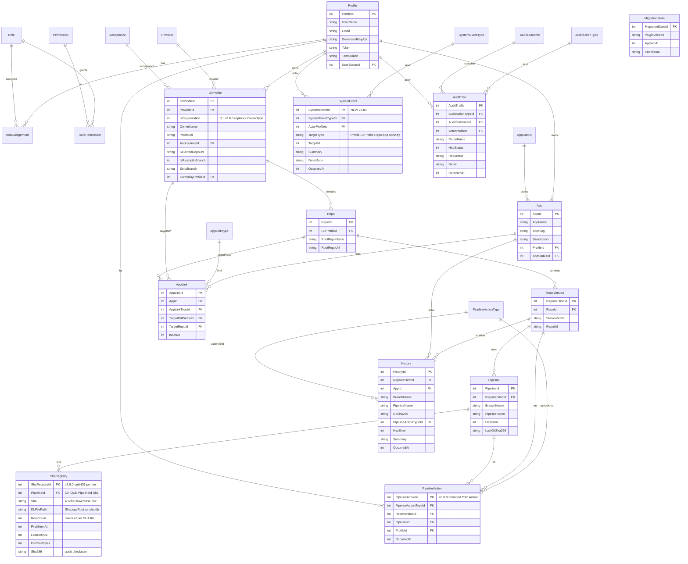
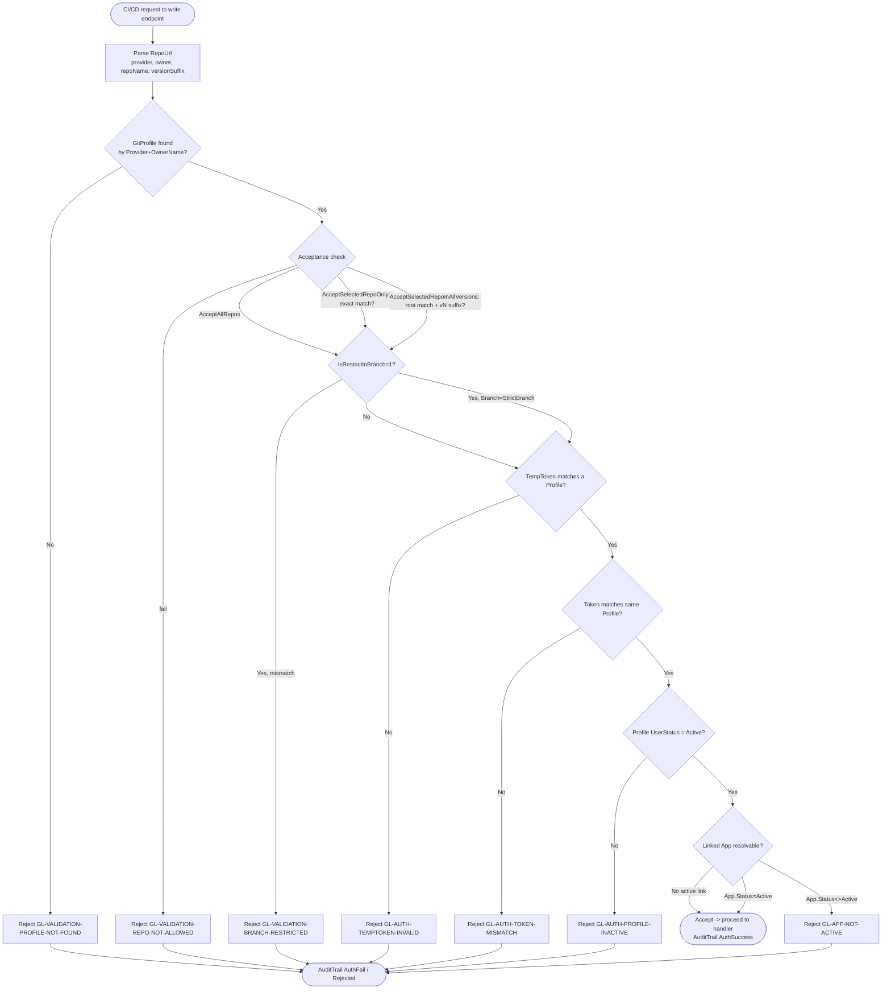
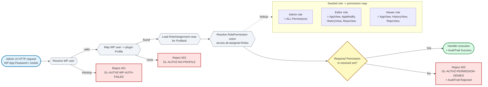
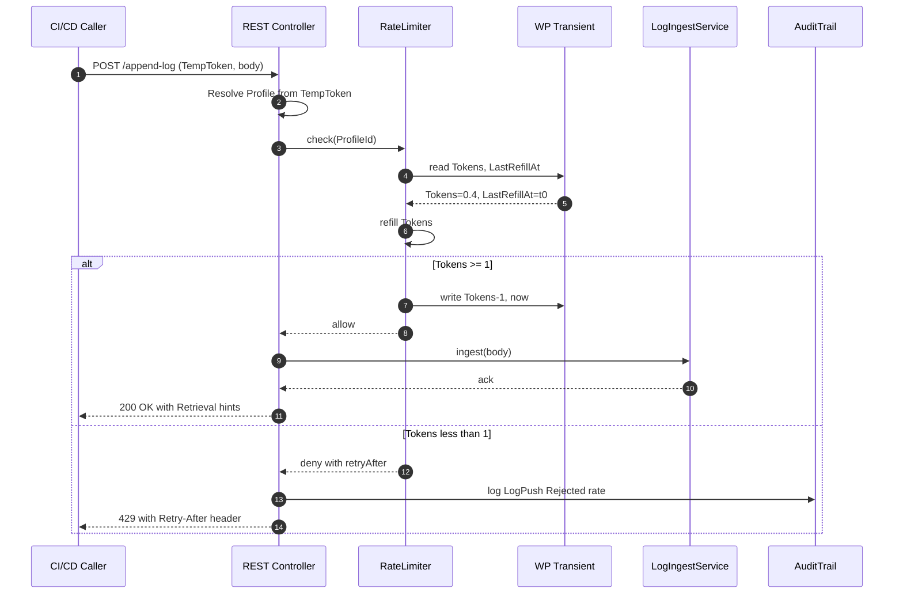
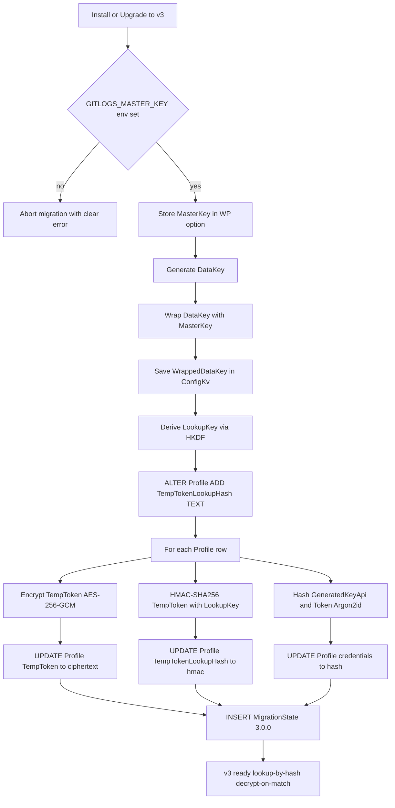
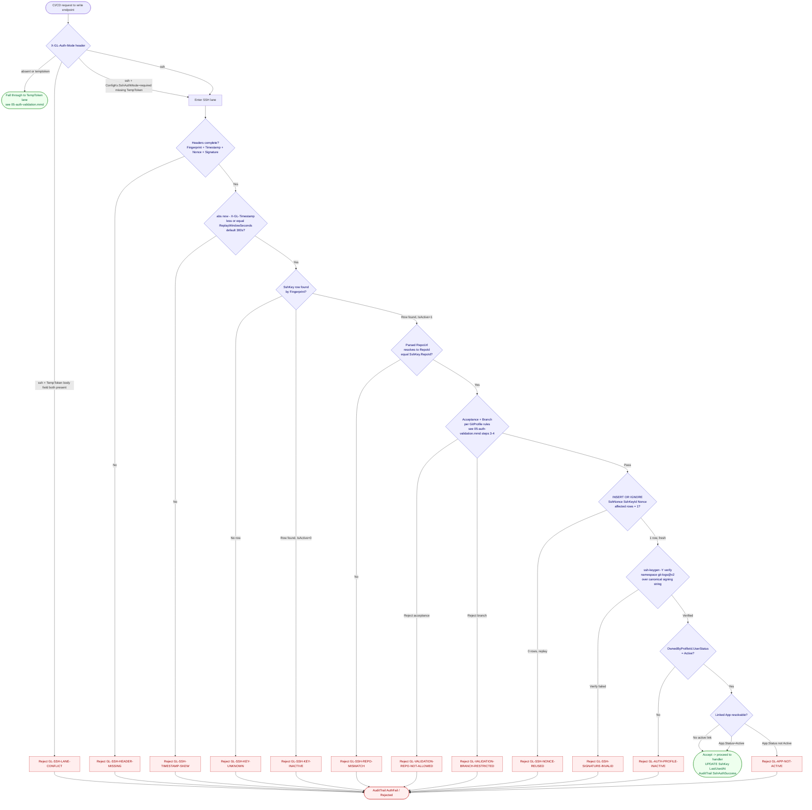

# Diagram Sources (inlined .mmd)

**Version:** 1.0.0
**Updated:** 2026-05-10 (Phase 153 Task S26-D4 — embed .mmd sources for auditor walker visibility; sibling .mmd files remain canonical, this file is regenerated from them)
**Canonical sources:** the `.mmd` files alongside this document remain the single source of truth. This file is a **mechanical mirror** kept in lockstep by the regen pipeline (AC-DG-12). Edits MUST go to the `.mmd` source, then regenerate this file via `bash linter-scripts/regen-diagram-sources-mirror.sh` (or equivalent paste). Any drift between this file and the `.mmd` files is an AC-DG-12 violation.

> **Why this file exists:** the auditor walker (`linter-scripts/audit-ai-implementability.py:47` `WALK_GLOBS = ("*.md", "*.json", "*.yaml", "*.yml", "*.tmpl", "*.toml")`) does NOT include `*.mmd`. Without this mirror, the AI auditor cannot read the diagram sources and flags D4 LOW "Missing .mmd Source Content" on every run. Embedding here gives the auditor full visibility AND keeps the canonical .mmd files renderable by Mermaid CLI / Puppeteer (per `puppeteer.json`).


## `01-er-diagram.mmd`

**Source:** [`./01-er-diagram.mmd`](./01-er-diagram.mmd) · **Rendered:** [`./01-er-diagram.svg`](./01-er-diagram.svg)



## `05-auth-validation.mmd`

**Source:** [`./05-auth-validation.mmd`](./05-auth-validation.mmd) · **Rendered:** [`./05-auth-validation.svg`](./05-auth-validation.svg)



## `06-permission-flow.mmd`

**Source:** [`./06-permission-flow.mmd`](./06-permission-flow.mmd) · **Rendered:** [`./06-permission-flow.svg`](./06-permission-flow.svg)



## `07-rate-limit-flow.mmd`

**Source:** [`./07-rate-limit-flow.mmd`](./07-rate-limit-flow.mmd) · **Rendered:** [`./07-rate-limit-flow.svg`](./07-rate-limit-flow.svg)



## `08-encryption-v3-flow.mmd`

**Source:** [`./08-encryption-v3-flow.mmd`](./08-encryption-v3-flow.mmd) · **Rendered:** [`./08-encryption-v3-flow.svg`](./08-encryption-v3-flow.svg)



## `09-endpoints-mindmap.mmd`

**Source:** [`./09-endpoints-mindmap.mmd`](./09-endpoints-mindmap.mmd) · **Rendered:** [`./09-endpoints-mindmap.svg`](./09-endpoints-mindmap.svg)

```mermaid
%% Diagram type: mindmap (NOT an ER diagram)
%% What this answers: "Show me every git-logs/v2 REST endpoint at a glance —
%%   verb, path, request body, response shape, required permission/auth,
%%   audit category, and possible error codes."
%% Authoritative source: spec/22-git-logs-v2/04-rest-api-endpoints.md + 14-endpoint-examples.md
%% Note: in v3.8.0 LogEntry/ErrorLogEntry live in per-SHA SQLite files (see §39).
%%       Reads transparently fan out across the matched ShaRegistry rows.

mindmap
  root((git-logs/v2<br/>REST API))
    Writes (CI/CD callers)
      append-log
        Verb POST
        Path /wp-json/git-logs/v2/append-log
        Auth TempToken plus Token plus Profile Active plus App Active
        Body
          RepoUrl string
          RootRepo string
          Branch string
          PipelineName string
          GitSha256 string 64-hex
          TempToken string
          Token string
          HasError 0 or 1
          Logs array of LogText FilePath Severity
          ErrorLogs array of LogText FilePath
        Response 200
          Status Success
          TraceId uuid
          Retrieval URLs array
        Errors
          GL-VALIDATION-PROFILE-NOT-FOUND 400
          GL-VALIDATION-REPO-NOT-ALLOWED 400
          GL-VALIDATION-BRANCH-RESTRICTED 400
          GL-AUTH-TEMPTOKEN-INVALID 401
          GL-AUTH-TOKEN-MISMATCH 401
          GL-RATE-LIMIT-EXCEEDED 429
          GL-SHA-DB-CREATE-FAILED 500
        Audit LogPush Success or Rejected
      fixed-log
        Verb PUT
        Path /wp-json/git-logs/v2/fixed-log
        Auth same as append-log
        Body RepoUrl Branch RootRepo PipelineName TempToken Token
        Effect Pipeline.HasError 0 plus History Fixed plus PipelineAction Fixed
        Response 200 ack
        Audit LogPush Fixed
      clear-log
        Verb POST
        Path /wp-json/git-logs/v2/clear-log
        Auth same as append-log
        Body RepoUrl Branch RootRepo PipelineName TempToken Token
        Effect drop the per-SHA file rows for one Pipeline plus History Clear
        Response 200 ack
        Audit LogPush Clear
      clear-log-all
        Verb POST
        Path /wp-json/git-logs/v2/clear-log-all
        Auth same as append-log
        Body RepoUrl Branch RootRepo TempToken Token (no PipelineName)
        Effect drop all Pipeline rows on a RepoVersion plus Branch plus History ClearAll
        Response 200 ack
        Audit LogPush ClearAll
    Reads (Admin UI plus viewers)
      get-logs
        Verb GET
        Path /wp-json/git-logs/v2/get-logs (body or ?q= base64 JSON)
        Auth WP App Password or cookie plus Permission HistoryView
        Body RepoUrl GitSha256
        Response 200
          RepoUrl RootRepo BranchName
          PipelineNames array
          IsPass HasError
          Logs array
          ErrorLogs array
        Errors
          GL-AUTHZ-PERMISSION-DENIED 403
          GL-VALIDATION-REPO-NOT-ALLOWED 400
          GL-SHA-DB-NOT-FOUND 404
        Audit LogQuery Success or Rejected
      get-pipeline-logs
        Verb GET
        Path /wp-json/git-logs/v2/get-pipeline-logs
        Auth same as get-logs
        Body RepoUrl GitSha256 PipelineName
        Response 200 scoped to one Pipeline
        Audit LogQuery
      get-error-logs
        Verb GET
        Path /wp-json/git-logs/v2/get-error-logs
        Auth same as get-logs
        Body RepoUrl GitSha256
        Response 200 ErrorLogs only across all pipelines
        Audit LogQuery
      get-pipeline-error-logs
        Verb GET
        Path /wp-json/git-logs/v2/get-pipeline-error-logs
        Auth same as get-logs
        Body RepoUrl GitSha256 PipelineName
        Response 200 ErrorLogs for one Pipeline
        Audit LogQuery
    Cross-cutting
      Common request shape application slash json
      Common error envelope ErrorCode TraceId Message Details
      Rate limit per Profile token bucket Retry-After header
      ID generation TraceId uuid v4 server side
      Idempotency append-log keyed on PipelineId LineNumber GitSha256
```



## `10-ssh-auth-validation.mmd`

**Source:** [`./10-ssh-auth-validation.mmd`](./10-ssh-auth-validation.mmd) · **Rendered:** [`./10-ssh-auth-validation.svg`](./10-ssh-auth-validation.svg)



---

## Verification

```bash
# Confirm this file is in lockstep with the canonical .mmd sources
for mmd in 01-er-diagram 05-auth-validation 06-permission-flow 07-rate-limit-flow 08-encryption-v3-flow 09-endpoints-mindmap 10-ssh-auth-validation; do
  if ! awk "/^## \\\`${mmd}\\.mmd\\\`/,/^\\\`\\\`\\\`$/" 00-diagram-sources.md \
     | sed -n '/^```mermaid$/,/^```$/p' | sed '1d;$d' \
     | diff -q - "${mmd}.mmd" > /dev/null; then
    echo "DRIFT: ${mmd}.mmd diverges from inlined mirror"
    exit 1
  fi
done
echo "OK: all 7 .mmd sources match their inlined mirror in 00-diagram-sources.md"
```

Drift here is an **AC-DG-12 (regen lockstep) violation** and MUST block merge.
