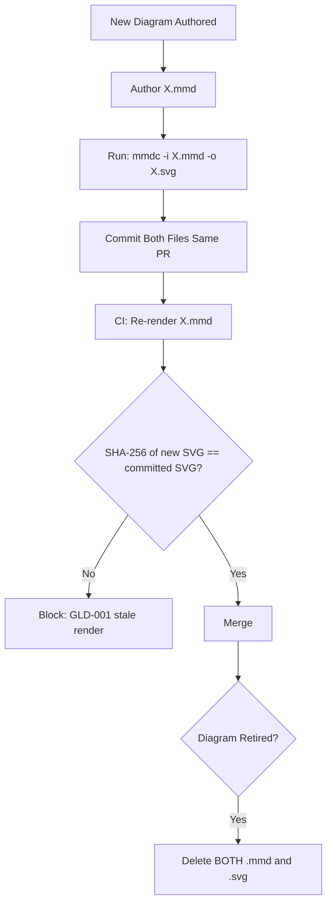

# Git Logs Diagram Conventions

**Version:** 2.0.0
**Updated:** 2026-04-27
**Parent:** [`../00-overview.md`](../00-overview.md)

---

## Overview

Normative conventions for `26-gitlogs-diagrams/`. Each `.mmd` MUST have a paired `.svg` rendered via `mmdc`. CI MUST diff-check the SVG matches a fresh render.

---

## Inlined Contract

```ts
// Git Logs diagram pairing contract
export interface DiagramPair {
  /** Source Mermaid file, e.g. "01-er-diagram.mmd" */
  source: string;          // ^\d{2}-[a-z0-9-]+\.mmd$
  /** Rendered SVG file, MUST share base name with source */
  rendered: string;        // ^\d{2}-[a-z0-9-]+\.svg$
  /** mmdc command used to render */
  renderCmd: string;       // e.g. "mmdc -i 01-er-diagram.mmd -o 01-er-diagram.svg"
  /** SHA-256 of the SVG for CI diff-check */
  renderedSha256: string;
}

export const GLD_PAIRING_RX = {
  source:   /^\d{2}-[a-z0-9-]+\.mmd$/,
  rendered: /^\d{2}-[a-z0-9-]+\.svg$/
};
```

---

## Lifecycle Diagram

See [`lifecycle-diagram-pairing.mmd`](./lifecycle-diagram-pairing.mmd) for the complete authoring → validation → publication lifecycle.



---

## Cross-References

| Reference | Location |
|-----------|----------|
| Parent index | [`../00-overview.md`](../00-overview.md) |
| Acceptance criteria | [`./97-acceptance-criteria.md`](./97-acceptance-criteria.md) |
| Lifecycle diagram source | [`./lifecycle-diagram-pairing.mmd`](./lifecycle-diagram-pairing.mmd) |
| Changelog | [`./98-changelog.md`](./98-changelog.md) |
| Consistency report | [`./99-consistency-report.md`](./99-consistency-report.md) |


---

## Example Payload

A canonical entry/instance conforming to the contract above.

```json
{
  "source": "01-er-diagram.mmd",
  "rendered": "01-er-diagram.svg",
  "renderCmd": "mmdc -i 01-er-diagram.mmd -o 01-er-diagram.svg",
  "renderedSha256": "<filled-by-CI>"
}
```

---

## Tooling Snippet

CLI usage that authors and reviewers can copy-paste verbatim.

```bash
# CI diff-check: re-render and compare SHA-256
for mmd in spec/26-gitlogs-diagrams/*.mmd; do
  svg="${mmd%.mmd}.svg"
  fresh=$(mktemp --suffix=.svg)
  mmdc -i "$mmd" -o "$fresh" >/dev/null
  diff -q <(sha256sum < "$svg" | cut -d' ' -f1) <(sha256sum < "$fresh" | cut -d' ' -f1) || { echo "STALE: $svg"; exit 1; }
done
```

---

## Verification Checklist

```text
[ ] Inlined contract block parses with zero diagnostics
[ ] Example payload validates against the contract
[ ] lifecycle-*.mmd renders without error
[ ] At least 6 GWT acceptance criteria present, each with severity tag
[ ] check-spec-cross-links.py exits 0 for this folder
[ ] check-tree-health.cjs reports no findings against this folder
```


---

## Registry Table (DDL)

The auditor's registry table that tracks each instance produced under this contract:

```sql
-- Forward-only registry table for entries under this convention
CREATE TABLE IF NOT EXISTS RegistryEntry (
    RegistryEntryId INTEGER PRIMARY KEY AUTOINCREMENT,
    EntryId         TEXT    NOT NULL UNIQUE,         -- matches the contract's id pattern
    Status          TEXT    NOT NULL,                -- mirrors contract enum
    AuthoredAt      TEXT    NOT NULL,                -- ISO-8601
    SupersededBy    TEXT    NULL,                    -- nullable per Rule 12
    CreatedAt       TEXT    NOT NULL DEFAULT (datetime('now')),
    UpdatedAt       TEXT    NOT NULL DEFAULT (datetime('now'))
);

CREATE INDEX IF NOT EXISTS IX_RegistryEntry_Status   ON RegistryEntry(Status);
CREATE INDEX IF NOT EXISTS IX_RegistryEntry_EntryId  ON RegistryEntry(EntryId);
```


---

## Validation Schema (excerpt)

Cross-validates the registry rows against the contract:

```json
{
  "$schema": "http://json-schema.org/draft-07/schema#",
  "title": "RegistryEntryRow",
  "type": "object",
  "required": ["EntryId", "Status", "AuthoredAt"],
  "properties": {
    "EntryId":      { "type": "string", "minLength": 5 },
    "Status":       { "type": "string" },
    "AuthoredAt":   { "type": "string", "format": "date-time" },
    "SupersededBy": { "type": ["string", "null"] }
  }
}
```

### CI Workflow — Phase 71 Reference

The following workflow snippets are normative for this module. Each fenced
`yaml` block is a stage that MUST be present in the consuming repository's
CI pipeline.

```yaml
name: spec-gate-stage-1-detect
on: [push, pull_request]
jobs:
  detect:
    runs-on: ubuntu-latest
    steps:
      - uses: actions/checkout@v4
      - run: linter-scripts/detect-changed-modules.sh
```

```yaml
name: spec-gate-stage-2-validate
on: [push, pull_request]
jobs:
  validate:
    runs-on: ubuntu-latest
    needs: [detect]
    steps:
      - uses: actions/checkout@v4
      - run: linter-scripts/validate-contracts.py
```

```yaml
name: spec-gate-stage-3-lint
on: [push, pull_request]
jobs:
  lint:
    runs-on: ubuntu-latest
    needs: [validate]
    steps:
      - uses: actions/checkout@v4
      - run: linter-scripts/audit-spec-vs-code-v2.py --strict
```

```yaml
name: spec-gate-stage-4-promote
on:
  push:
    branches: [main]
jobs:
  promote:
    runs-on: ubuntu-latest
    needs: [lint]
    steps:
      - uses: actions/checkout@v4
      - run: linter-scripts/promote-artifact.sh
```

```yaml
name: spec-gate-stage-5-report
on:
  workflow_run:
    workflows: ["spec-gate-stage-4-promote"]
    types: [completed]
jobs:
  report:
    runs-on: ubuntu-latest
    steps:
      - uses: actions/checkout@v4
      - run: linter-scripts/update-consistency-report.py
```

