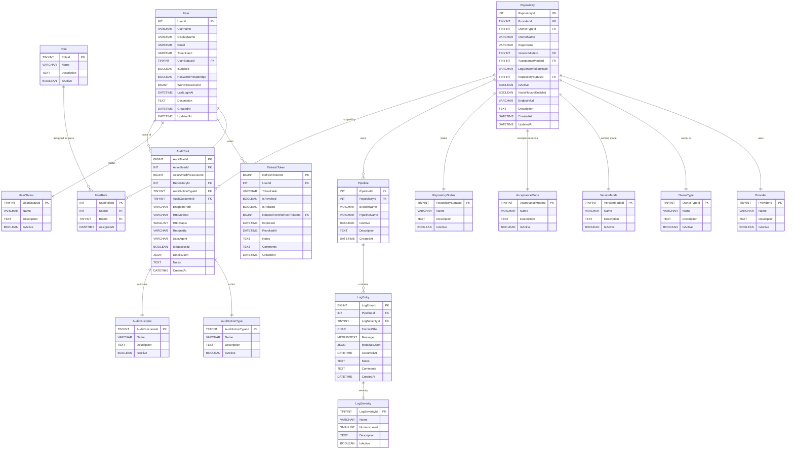

> ⚠️ **DEPRECATED — Legacy v1 Spec (folder 21)**  
> This document is preserved for historical reference only. **Do not implement against it.**  
> The active specification is **v2** in [`spec/22-git-logs-v2/`](../../22-git-logs-v2/00-overview.md) (SQLite, no JWT, SSH-key auth).  
> See [`spec/22-git-logs-v2/00-overview.md`](../../22-git-logs-v2/00-overview.md) for the current canonical source.  
> Deprecated: 2026-04-25

---

# Database Schema and ERD

**Version:** 2.0.0  
**Updated:** 2026-04-24  
**Status:** Draft  
**AI Confidence:** Production-Ready  
**Ambiguity:** None

---

## Overview

This document defines the complete persistent data model for the `git-logs` WordPress plugin. The schema is engineered to satisfy the project's database conventions ([../../04-database-conventions/01-naming-conventions.md](../../04-database-conventions/01-naming-conventions.md), [../../04-database-conventions/02-schema-design.md](../../04-database-conventions/02-schema-design.md), [../../04-database-conventions/05-relationship-diagrams.md](../../04-database-conventions/05-relationship-diagrams.md)).

It describes:
- 7 entity tables (`User`, `RefreshToken`, `Repository`, `Pipeline`, `LogEntry`, `AuditTrail`, plus the WordPress bridge view)
- 1 junction table (`UserRole`)
- 10 enum-backed lookup tables (every `*Type`/`*Status`/`*Mode`/`*Severity`/`*Outcome` value is normalized into a lookup table — no raw enum strings stored on entity tables)
- All indexes (`Idx{Table}_{Column}` convention)
- 2 reporting views (`Vw{DescriptiveName}` convention)
- Mandatory free-text columns (`Description` for entity/lookup tables; `Notes` + `Comments` for transactional tables)
- Full Mermaid ERD with column-level detail
- Activation seed data for every lookup table

> **Storage engine:** WordPress MySQL via `$wpdb`. Engine `InnoDB`, charset `utf8mb4`, collation `utf8mb4_unicode_ci`.  
> **Table prefix:** `{wp_prefix}gitlogs_` (e.g., `wp_gitlogs_User`). For brevity the prefix is omitted in this document — apply `{wp_prefix}gitlogs_` to every table name at runtime.

---

## 1. Convention Compliance Summary

| Convention | Applied? | Notes |
|------------|---------|-------|
| Table name PascalCase, **singular** | ✅ | `User`, `Repository`, `LogEntry` |
| Column name PascalCase | ✅ | `UserId`, `CreatedAt`, `IsActive` |
| Primary key = `{TableName}Id` | ✅ | `UserId`, `RepositoryId`, `LogEntryId` |
| Foreign key column = same name as referenced PK | ✅ | `RepositoryId` references `Repository.RepositoryId` |
| Boolean column `Is`/`Has` + positive, `NOT NULL DEFAULT` | ✅ | `IsRevoked`, `HasLicense` (no `Not`/`No` prefix) |
| Index name `Idx{Table}_{Column}` | ✅ | `IdxLogEntry_PipelineId` |
| View name `Vw{DescriptiveName}` | ✅ | `VwLogEntryDetail`, `VwAuditTrailDetail` |
| Abbreviations: `Id`, `Url`, `Json`, `Ip` (never `ID`/`URL`/`JSON`/`IP`) | ✅ | `RequestIp`, `MetadataJson`, `EndpointUrl` |
| Enum values normalized into lookup tables (no raw strings) | ✅ | 10 lookup tables with `{TableName}Id` PK |
| `Description TEXT NULL` on entity & reference tables (Rule 10) | ✅ | Present on `User`, `Repository`, all lookup tables |
| `Notes TEXT NULL` + `Comments TEXT NULL` on transactional tables (Rule 11) | ✅ | Present on `LogEntry`, `AuditTrail`, `RefreshToken` |
| Smallest-fitting integer key type (Rule §2 schema-design) | ✅ | `TINYINT` for lookups, `INT` for entities, `BIGINT` for high-volume `LogEntry`/`AuditTrail` |

---

## 2. Volume Estimates (drives PK type sizing)

| Table | 10-Year Volume | PK Type |
|-------|----------------|---------|
| `User` | < 100,000 | `INT` |
| `RefreshToken` | < 10,000,000 | `BIGINT` |
| `Repository` | < 100,000 | `INT` |
| `Pipeline` | < 10,000,000 | `INT` |
| `LogEntry` | > 2,000,000,000 (CI logs are high-volume) | `BIGINT` |
| `AuditTrail` | > 2,000,000,000 (every endpoint hit) | `BIGINT` |
| `UserRole` | < 1,000,000 | `INT` |
| All lookup tables (`UserStatus`, `Role`, `Provider`, …) | < 50 | `TINYINT` |

---

## 3. Entity Tables

### 3.1 `User`

**Purpose:** Plugin-managed identity (decoupled from `wp_users`). Authenticates via plugin token; receives short-lived JWTs.  
**Category:** Entity → requires `Description`.  
**Expected volume:** < 100,000 rows.

| Column | Type | Constraints | Description |
|--------|------|-------------|-------------|
| `UserId` | INT | PK, AUTO_INCREMENT | Primary key |
| `Username` | VARCHAR(64) | NOT NULL, UNIQUE | Login identifier |
| `DisplayName` | VARCHAR(128) | NULL | Human-friendly label |
| `Email` | VARCHAR(255) | NULL | RFC 5322 |
| `TokenHash` | VARCHAR(255) | NULL | Argon2id hash; NULL after revoke |
| `UserStatusId` | TINYINT | NOT NULL, FK → `UserStatus.UserStatusId` | Active / Suspended / Revoked |
| `IsLocked` | BOOLEAN | NOT NULL DEFAULT 0 | Lockout flag (after N failed auths) |
| `HasWordPressBridge` | BOOLEAN | NOT NULL DEFAULT 0 | True if user was created via WP bridge |
| `WordPressUserId` | BIGINT | NULL | `wp_users.ID` of the creator (bridge mode) |
| `LastLoginAt` | DATETIME(6) | NULL | Last successful auth |
| `Description` | TEXT | NULL | Free-form context (Rule 10) |
| `CreatedAt` | DATETIME(6) | NOT NULL DEFAULT CURRENT_TIMESTAMP(6) | Row creation |
| `UpdatedAt` | DATETIME(6) | NOT NULL DEFAULT CURRENT_TIMESTAMP(6) ON UPDATE CURRENT_TIMESTAMP(6) | Row last update |

**Indexes:**

```sql
CREATE UNIQUE INDEX IdxUser_Username       ON User(Username);
CREATE INDEX        IdxUser_UserStatusId   ON User(UserStatusId);
CREATE INDEX        IdxUser_WordPressUserId ON User(WordPressUserId);
```

---

### 3.2 `RefreshToken`

**Purpose:** Tracks rotating refresh tokens (7-day TTL) per user.  
**Category:** Transactional → requires `Notes` + `Comments`.  
**Expected volume:** < 10,000,000 rows over 10 years.

| Column | Type | Constraints | Description |
|--------|------|-------------|-------------|
| `RefreshTokenId` | BIGINT | PK, AUTO_INCREMENT | Primary key |
| `UserId` | INT | NOT NULL, FK → `User.UserId` | Owning user |
| `TokenHash` | VARCHAR(255) | NOT NULL | Argon2id of refresh token |
| `IsRevoked` | BOOLEAN | NOT NULL DEFAULT 0 | True after rotation/logout |
| `IsRotated` | BOOLEAN | NOT NULL DEFAULT 0 | True once a successor token has been issued |
| `RotatedFromRefreshTokenId` | BIGINT | NULL, FK → `RefreshToken.RefreshTokenId` | Predecessor in the rotation chain |
| `ExpiresAt` | DATETIME(6) | NOT NULL | Hard expiry |
| `RevokedAt` | DATETIME(6) | NULL | When `IsRevoked` flipped |
| `Notes` | TEXT | NULL | System / operational context (Rule 11) |
| `Comments` | TEXT | NULL | Human-facing context (Rule 11) |
| `CreatedAt` | DATETIME(6) | NOT NULL DEFAULT CURRENT_TIMESTAMP(6) | Row creation |

**Indexes:**

```sql
CREATE INDEX IdxRefreshToken_UserId    ON RefreshToken(UserId);
CREATE INDEX IdxRefreshToken_ExpiresAt ON RefreshToken(ExpiresAt);
CREATE INDEX IdxRefreshToken_IsRevoked ON RefreshToken(IsRevoked);
```

---

### 3.3 `Repository`

**Purpose:** Allowlisted GitHub repository (or owner-wildcard) authorized to push CI logs.  
**Category:** Entity → requires `Description`.  
**Expected volume:** < 100,000 rows.

| Column | Type | Constraints | Description |
|--------|------|-------------|-------------|
| `RepositoryId` | INT | PK, AUTO_INCREMENT | Primary key |
| `ProviderId` | TINYINT | NOT NULL, FK → `Provider.ProviderId` | `GitHub` (only active value in v1) |
| `OwnerTypeId` | TINYINT | NOT NULL, FK → `OwnerType.OwnerTypeId` | `User` or `Organization` |
| `OwnerName` | VARCHAR(128) | NOT NULL | GitHub user/org login |
| `RepoName` | VARCHAR(128) | NOT NULL | Base repo (e.g., `repo`, not `repo-v2`) |
| `VersionModeId` | TINYINT | NOT NULL, FK → `VersionMode.VersionModeId` | `Exact` or `Wildcard` |
| `AcceptanceModeId` | TINYINT | NOT NULL, FK → `AcceptanceMode.AcceptanceModeId` | `RepoUrl` or `OwnerWildcard` |
| `LogSenderTokenHash` | VARCHAR(255) | NOT NULL | Argon2id of per-repo HMAC secret |
| `RepositoryStatusId` | TINYINT | NOT NULL, FK → `RepositoryStatus.RepositoryStatusId` | `Active` or `Disabled` |
| `IsActive` | BOOLEAN | NOT NULL DEFAULT 1 | Fast filter (mirrors status) |
| `HasWildcardEnabled` | BOOLEAN | NOT NULL DEFAULT 0 | Computed convenience flag |
| `EndpointUrl` | VARCHAR(512) | NULL | Canonical repo URL for display |
| `Description` | TEXT | NULL | Free-form context (Rule 10) |
| `CreatedAt` | DATETIME(6) | NOT NULL DEFAULT CURRENT_TIMESTAMP(6) | |
| `UpdatedAt` | DATETIME(6) | NOT NULL DEFAULT CURRENT_TIMESTAMP(6) ON UPDATE CURRENT_TIMESTAMP(6) | |

**Indexes:**

```sql
CREATE UNIQUE INDEX IdxRepository_OwnerRepo       ON Repository(ProviderId, OwnerName, RepoName);
CREATE INDEX        IdxRepository_OwnerName       ON Repository(OwnerName);
CREATE INDEX        IdxRepository_StatusId        ON Repository(RepositoryStatusId);
CREATE INDEX        IdxRepository_AcceptanceMode  ON Repository(AcceptanceModeId);
```

---

### 3.4 `Pipeline`

**Purpose:** Logical container for log entries within `(Repository, Branch)`. Auto-created on first log push for a `(RepositoryId, BranchName, PipelineName)` triple.  
**Category:** Entity → requires `Description`.  
**Expected volume:** < 10,000,000 rows.

| Column | Type | Constraints | Description |
|--------|------|-------------|-------------|
| `PipelineId` | INT | PK, AUTO_INCREMENT | Primary key |
| `RepositoryId` | INT | NOT NULL, FK → `Repository.RepositoryId` | Owning repo |
| `BranchName` | VARCHAR(255) | NOT NULL | e.g., `main`, `feature/x` |
| `PipelineName` | VARCHAR(255) | NOT NULL | e.g., `build`, `lint`, `deploy-prod` |
| `IsActive` | BOOLEAN | NOT NULL DEFAULT 1 | Soft-disable without delete |
| `Description` | TEXT | NULL | Free-form context (Rule 10) |
| `CreatedAt` | DATETIME(6) | NOT NULL DEFAULT CURRENT_TIMESTAMP(6) | |

**Indexes:**

```sql
CREATE UNIQUE INDEX IdxPipeline_RepoBranchName  ON Pipeline(RepositoryId, BranchName, PipelineName);
CREATE INDEX        IdxPipeline_RepositoryId    ON Pipeline(RepositoryId);
CREATE INDEX        IdxPipeline_BranchName      ON Pipeline(BranchName);
```

---

### 3.5 `LogEntry`

**Purpose:** Single timestamped, severity-tagged CI log line.  
**Category:** Transactional → requires `Notes` + `Comments`.  
**Expected volume:** > 2,000,000,000 rows (BIGINT PK).

| Column | Type | Constraints | Description |
|--------|------|-------------|-------------|
| `LogEntryId` | BIGINT | PK, AUTO_INCREMENT | Primary key |
| `PipelineId` | INT | NOT NULL, FK → `Pipeline.PipelineId` | Owning pipeline |
| `LogSeverityId` | TINYINT | NOT NULL, FK → `LogSeverity.LogSeverityId` | `Trace`…`Fatal` |
| `CommitSha` | CHAR(40) | NULL | Git commit hash |
| `Message` | MEDIUMTEXT | NOT NULL | Log line body |
| `MetadataJson` | JSON | NULL | Arbitrary structured metadata |
| `OccurredAt` | DATETIME(6) | NOT NULL | Original event time (from CI) |
| `Notes` | TEXT | NULL | Operational context (Rule 11) |
| `Comments` | TEXT | NULL | Reviewer / human context (Rule 11) |
| `CreatedAt` | DATETIME(6) | NOT NULL DEFAULT CURRENT_TIMESTAMP(6) | Row creation (server time) |

**Indexes:**

```sql
CREATE INDEX IdxLogEntry_PipelineId      ON LogEntry(PipelineId);
CREATE INDEX IdxLogEntry_PipelineOccurred ON LogEntry(PipelineId, OccurredAt);
CREATE INDEX IdxLogEntry_LogSeverityId   ON LogEntry(LogSeverityId);
CREATE INDEX IdxLogEntry_CommitSha       ON LogEntry(CommitSha);
CREATE INDEX IdxLogEntry_CreatedAt       ON LogEntry(CreatedAt);
```

---

### 3.6 `AuditTrail`

**Purpose:** Append-only record of every endpoint hit (auth or anonymous) and every business transaction (token issue/revoke, repo CRUD, log push, log query, auth fail).  
**Category:** Transactional / Audit → requires `Notes` (audit-only variant per [../../04-database-conventions/02-schema-design.md §6.1](../../04-database-conventions/02-schema-design.md)).  
**Expected volume:** > 2,000,000,000 rows (BIGINT PK).

| Column | Type | Constraints | Description |
|--------|------|-------------|-------------|
| `AuditTrailId` | BIGINT | PK, AUTO_INCREMENT | Primary key |
| `ActorUserId` | INT | NULL, FK → `User.UserId` | NULL for anonymous log push |
| `ActorWordPressUserId` | BIGINT | NULL | `wp_users.ID` for WP-bridge calls |
| `RepositoryId` | INT | NULL, FK → `Repository.RepositoryId` | Set when action is repo-scoped |
| `AuditActionTypeId` | TINYINT | NOT NULL, FK → `AuditActionType.AuditActionTypeId` | What happened |
| `AuditOutcomeId` | TINYINT | NOT NULL, FK → `AuditOutcome.AuditOutcomeId` | `Success` / `Rejected` / `Error` |
| `EndpointPath` | VARCHAR(255) | NOT NULL | `/git-logs/v1/...` |
| `HttpMethod` | VARCHAR(8) | NOT NULL | `GET`, `POST`, … |
| `HttpStatus` | SMALLINT | NOT NULL | Final response code |
| `RequestIp` | VARCHAR(45) | NOT NULL | IPv4 or IPv6 |
| `UserAgent` | VARCHAR(512) | NULL | Raw `User-Agent` header |
| `IsSuccessful` | BOOLEAN | NOT NULL DEFAULT 0 | Fast filter (mirrors `AuditOutcomeId = Success`) |
| `DetailsJson` | JSON | NULL | Reason, validation errors, signed claims, etc. |
| `Notes` | TEXT | NULL | Reviewer remarks (Rule 11 audit variant) |
| `CreatedAt` | DATETIME(6) | NOT NULL DEFAULT CURRENT_TIMESTAMP(6) | Indexed |

**Indexes:**

```sql
CREATE INDEX IdxAuditTrail_CreatedAt       ON AuditTrail(CreatedAt);
CREATE INDEX IdxAuditTrail_ActorUserId     ON AuditTrail(ActorUserId);
CREATE INDEX IdxAuditTrail_RepositoryId    ON AuditTrail(RepositoryId);
CREATE INDEX IdxAuditTrail_ActionTypeId    ON AuditTrail(AuditActionTypeId);
CREATE INDEX IdxAuditTrail_OutcomeId       ON AuditTrail(AuditOutcomeId);
CREATE INDEX IdxAuditTrail_HttpStatus      ON AuditTrail(HttpStatus);
```

---

## 4. Junction Table

### 4.1 `UserRole` (n-to-m: `User` ↔ `Role`)

| Column | Type | Constraints | Description |
|--------|------|-------------|-------------|
| `UserRoleId` | INT | PK, AUTO_INCREMENT | Junction PK |
| `UserId` | INT | NOT NULL, FK → `User.UserId` | |
| `RoleId` | TINYINT | NOT NULL, FK → `Role.RoleId` | |
| `AssignedAt` | DATETIME(6) | NOT NULL DEFAULT CURRENT_TIMESTAMP(6) | Audit-friendly |

**Indexes:**

```sql
CREATE UNIQUE INDEX IdxUserRole_UserRole ON UserRole(UserId, RoleId);
CREATE INDEX        IdxUserRole_RoleId   ON UserRole(RoleId);
```

> Pure junction table — `Description`/`Notes`/`Comments` not required (per Rule 12 / §6.1 of [02-schema-design.md](../../04-database-conventions/02-schema-design.md)).

---

## 5. Lookup Tables (Enum-Backed, PascalCase)

> **Shape (canonical):** Each lookup table has `{TableName}Id TINYINT PK AUTO_INCREMENT`, `Name VARCHAR(64) NOT NULL UNIQUE`, `Description TEXT NULL` (Rule 10), `IsActive BOOLEAN NOT NULL DEFAULT 1`. They are seeded on plugin activation (see §8).

### 5.1 `UserStatus`

| Column | Type | Constraints |
|--------|------|-------------|
| `UserStatusId` | TINYINT | PK, AUTO_INCREMENT |
| `Name` | VARCHAR(32) | NOT NULL UNIQUE |
| `Description` | TEXT | NULL |
| `IsActive` | BOOLEAN | NOT NULL DEFAULT 1 |

### 5.2 `Role`

| Column | Type | Constraints |
|--------|------|-------------|
| `RoleId` | TINYINT | PK, AUTO_INCREMENT |
| `Name` | VARCHAR(32) | NOT NULL UNIQUE |
| `Description` | TEXT | NULL |
| `IsActive` | BOOLEAN | NOT NULL DEFAULT 1 |

### 5.3 `Provider`

| Column | Type | Constraints |
|--------|------|-------------|
| `ProviderId` | TINYINT | PK, AUTO_INCREMENT |
| `Name` | VARCHAR(32) | NOT NULL UNIQUE |
| `Description` | TEXT | NULL |
| `IsActive` | BOOLEAN | NOT NULL DEFAULT 1 |

### 5.4 `OwnerType`

| Column | Type | Constraints |
|--------|------|-------------|
| `OwnerTypeId` | TINYINT | PK, AUTO_INCREMENT |
| `Name` | VARCHAR(32) | NOT NULL UNIQUE |
| `Description` | TEXT | NULL |
| `IsActive` | BOOLEAN | NOT NULL DEFAULT 1 |

### 5.5 `VersionMode`

| Column | Type | Constraints |
|--------|------|-------------|
| `VersionModeId` | TINYINT | PK, AUTO_INCREMENT |
| `Name` | VARCHAR(32) | NOT NULL UNIQUE |
| `Description` | TEXT | NULL |
| `IsActive` | BOOLEAN | NOT NULL DEFAULT 1 |

### 5.6 `AcceptanceMode`

| Column | Type | Constraints |
|--------|------|-------------|
| `AcceptanceModeId` | TINYINT | PK, AUTO_INCREMENT |
| `Name` | VARCHAR(32) | NOT NULL UNIQUE |
| `Description` | TEXT | NULL |
| `IsActive` | BOOLEAN | NOT NULL DEFAULT 1 |

### 5.7 `RepositoryStatus`

| Column | Type | Constraints |
|--------|------|-------------|
| `RepositoryStatusId` | TINYINT | PK, AUTO_INCREMENT |
| `Name` | VARCHAR(32) | NOT NULL UNIQUE |
| `Description` | TEXT | NULL |
| `IsActive` | BOOLEAN | NOT NULL DEFAULT 1 |

### 5.8 `LogSeverity`

| Column | Type | Constraints |
|--------|------|-------------|
| `LogSeverityId` | TINYINT | PK, AUTO_INCREMENT |
| `Name` | VARCHAR(16) | NOT NULL UNIQUE |
| `NumericLevel` | SMALLINT | NOT NULL UNIQUE (e.g., 10/20/30/40/50/60) |
| `Description` | TEXT | NULL |
| `IsActive` | BOOLEAN | NOT NULL DEFAULT 1 |

### 5.9 `AuditActionType`

| Column | Type | Constraints |
|--------|------|-------------|
| `AuditActionTypeId` | TINYINT | PK, AUTO_INCREMENT |
| `Name` | VARCHAR(32) | NOT NULL UNIQUE |
| `Description` | TEXT | NULL |
| `IsActive` | BOOLEAN | NOT NULL DEFAULT 1 |

### 5.10 `AuditOutcome`

| Column | Type | Constraints |
|--------|------|-------------|
| `AuditOutcomeId` | TINYINT | PK, AUTO_INCREMENT |
| `Name` | VARCHAR(16) | NOT NULL UNIQUE |
| `Description` | TEXT | NULL |
| `IsActive` | BOOLEAN | NOT NULL DEFAULT 1 |

---

## 6. Views

### 6.1 `VwLogEntryDetail`

Flattens `LogEntry` → `Pipeline` → `Repository` → enum lookups so the business layer can query by view without writing JOINs.

```sql
CREATE VIEW VwLogEntryDetail AS
SELECT
    le.LogEntryId,
    le.PipelineId,
    p.RepositoryId,
    r.OwnerName       AS RepositoryOwnerName,
    r.RepoName        AS RepositoryRepoName,
    p.BranchName,
    p.PipelineName,
    le.CommitSha,
    le.Message,
    le.MetadataJson,
    le.OccurredAt,
    le.CreatedAt,
    ls.Name           AS LogSeverityName,
    ls.NumericLevel   AS LogSeverityNumericLevel,
    pr.Name           AS ProviderName
FROM LogEntry   le
INNER JOIN Pipeline    p  ON p.PipelineId      = le.PipelineId
INNER JOIN Repository  r  ON r.RepositoryId    = p.RepositoryId
INNER JOIN Provider    pr ON pr.ProviderId     = r.ProviderId
INNER JOIN LogSeverity ls ON ls.LogSeverityId  = le.LogSeverityId;
```

### 6.2 `VwAuditTrailDetail`

Flattens `AuditTrail` with action/outcome names and (optionally) actor/repo context.

```sql
CREATE VIEW VwAuditTrailDetail AS
SELECT
    at.AuditTrailId,
    at.CreatedAt,
    at.EndpointPath,
    at.HttpMethod,
    at.HttpStatus,
    at.RequestIp,
    at.UserAgent,
    at.IsSuccessful,
    at.DetailsJson,
    aat.Name          AS AuditActionTypeName,
    ao.Name           AS AuditOutcomeName,
    u.Username        AS ActorUsername,
    at.ActorWordPressUserId,
    r.OwnerName       AS RepositoryOwnerName,
    r.RepoName        AS RepositoryRepoName
FROM AuditTrail        at
INNER JOIN AuditActionType aat ON aat.AuditActionTypeId = at.AuditActionTypeId
INNER JOIN AuditOutcome    ao  ON ao.AuditOutcomeId     = at.AuditOutcomeId
LEFT  JOIN User            u   ON u.UserId              = at.ActorUserId
LEFT  JOIN Repository      r   ON r.RepositoryId        = at.RepositoryId;
```

---

## 7. Entity-Relationship Diagram (Mermaid)

> Renders in any Mermaid 10+ viewer. PKs marked `PK`, FKs marked `FK`. Cardinality follows the project's `||--o{` (one-to-many) and `||--||` (one-to-one logical lookup) notation.



---

## 8. Activation Seed Data

Inserted by the activation hook the first time the plugin runs. Idempotent (`INSERT IGNORE`).

```sql
INSERT IGNORE INTO UserStatus (UserStatusId, Name, Description) VALUES
    (1, 'Active',    'Authentication permitted; tokens valid'),
    (2, 'Suspended', 'Authentication blocked; tokens not revoked'),
    (3, 'Revoked',   'Authentication blocked; all tokens invalidated');

INSERT IGNORE INTO Role (RoleId, Name, Description) VALUES
    (1, 'Admin',       'Full access to all endpoints'),
    (2, 'CanAddRepo',  'May create/update/delete repositories'),
    (3, 'CanAddUser',  'May create/update plugin users'),
    (4, 'CanViewLogs', 'May query log retrieval endpoints'),
    (5, 'CanPushLogs', 'Reserved for future authenticated push variant');

INSERT IGNORE INTO Provider (ProviderId, Name, Description, IsActive) VALUES
    (1, 'GitHub', 'Active in v1', 1),
    (2, 'GitLab', 'Reserved for future use', 0);

INSERT IGNORE INTO OwnerType (OwnerTypeId, Name, Description) VALUES
    (1, 'User',         'A GitHub user account'),
    (2, 'Organization', 'A GitHub organization');

INSERT IGNORE INTO VersionMode (VersionModeId, Name, Description) VALUES
    (1, 'Exact',    'Match RepoName exactly'),
    (2, 'Wildcard', 'Match RepoName or RepoName-v{N}');

INSERT IGNORE INTO AcceptanceMode (AcceptanceModeId, Name, Description) VALUES
    (1, 'RepoUrl',       'Only this exact (OwnerName, RepoName) accepted'),
    (2, 'OwnerWildcard', 'Any repo by this OwnerName accepted');

INSERT IGNORE INTO RepositoryStatus (RepositoryStatusId, Name, Description) VALUES
    (1, 'Active',   'Accepts log pushes'),
    (2, 'Disabled', 'Rejects log pushes; remains queryable');

INSERT IGNORE INTO LogSeverity (LogSeverityId, Name, NumericLevel, Description) VALUES
    (1, 'Trace', 10, 'Verbose tracing'),
    (2, 'Debug', 20, 'Debug detail'),
    (3, 'Info',  30, 'Informational'),
    (4, 'Warn',  40, 'Warning'),
    (5, 'Error', 50, 'Error'),
    (6, 'Fatal', 60, 'Fatal / abort');

INSERT IGNORE INTO AuditActionType (AuditActionTypeId, Name, Description) VALUES
    (1,  'UserCreate',   'Plugin user created'),
    (2,  'UserUpdate',   'Plugin user updated'),
    (3,  'UserDelete',   'Plugin user deleted'),
    (4,  'TokenIssue',   'Token generated'),
    (5,  'TokenRevoke',  'Token revoked'),
    (6,  'RepoCreate',   'Repository registered'),
    (7,  'RepoUpdate',   'Repository updated'),
    (8,  'RepoDelete',   'Repository deleted'),
    (9,  'LogPush',      'Log push attempted'),
    (10, 'LogQuery',     'Log retrieval performed'),
    (11, 'AuthSuccess',  'Authentication succeeded'),
    (12, 'AuthFail',     'Authentication failed');

INSERT IGNORE INTO AuditOutcome (AuditOutcomeId, Name, Description) VALUES
    (1, 'Success',  'Action completed successfully'),
    (2, 'Rejected', 'Action rejected by validation/policy'),
    (3, 'Error',    'Action failed due to runtime error');
```

---

## 9. Retention

Per the locked decision in [00-overview.md](./00-overview.md): log retention is **indefinite** in v1. No scheduled deletion job runs. A future module may introduce rolling retention via `wp-cron`. `RefreshToken` rows expire by `ExpiresAt` and may be hard-deleted by a maintenance job after 30 days past expiry.

---

## 10. Cross-References

| Reference | Location |
|-----------|----------|
| DB naming conventions (canonical) | [../../04-database-conventions/01-naming-conventions.md](../../04-database-conventions/01-naming-conventions.md) |
| Schema design rules | [../../04-database-conventions/02-schema-design.md](../../04-database-conventions/02-schema-design.md) |
| Relationship diagram patterns | [../../04-database-conventions/05-relationship-diagrams.md](../../04-database-conventions/05-relationship-diagrams.md) |
| ORM and views | [../../04-database-conventions/03-orm-and-views.md](../../04-database-conventions/03-orm-and-views.md) |
| REST API JSON format (PascalCase keys) | [../../04-database-conventions/06-rest-api-format.md](../../04-database-conventions/06-rest-api-format.md) |
| Glossary & enums | [./01-glossary-and-enums.md](./01-glossary-and-enums.md) |
| Audit trail behavior | ./10-audit-trail.md (`10-audit-trail` — removed in v1 deprecation) |

---

## Continuation Marker

If you have any questions or confusion, feel free to ask. If you are creating multiple tasks — especially bigger ones — do it in a way so that when we say `next`, you continue with the remaining tasks.
