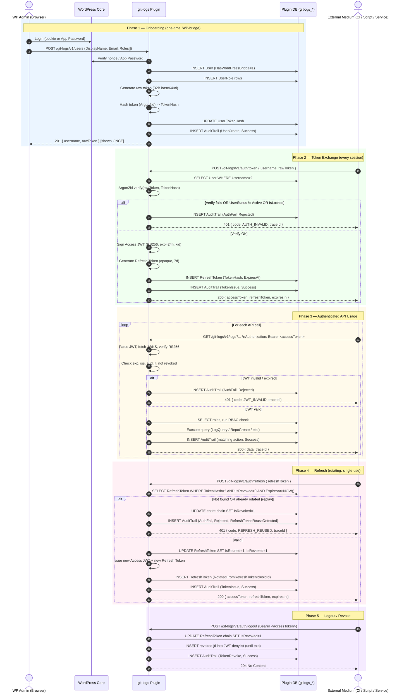

> ⚠️ **DEPRECATED — Legacy v1 Spec (folder 21)**  
> This document is preserved for historical reference only. **Do not implement against it.**  
> The active specification is **v2** in [`spec/22-git-logs-v2/`](../../22-git-logs-v2/00-overview.md) (SQLite, no JWT, SSH-key auth).  
> See [`spec/22-git-logs-v2/00-overview.md`](../../22-git-logs-v2/00-overview.md) for the current canonical source.  
> Deprecated: 2026-04-25

---

# JWT Onboarding & Token Usage Flow

**Version:** 1.0.0  
**Updated:** 2026-04-24  
**Status:** Draft  
**AI Confidence:** Medium  
**Ambiguity:** Low

---

## Overview

This document explains, end-to-end, how an **external medium** (a CI runner, a script, a service, or any non-WordPress consumer) gets onboarded into the `git-logs` plugin and then uses **JWT-based authentication** to call the plugin's REST endpoints under `/wp-json/git-logs/v1`.

It is the operational README for integrators. It does **not** redefine schemas — those live in `02-database-schema-and-erd.md`. It does **not** redefine error envelopes — those live in `11-error-management.md` (planned). It is the connective tissue between the WP admin onboarding flow and the daily request loop performed by the external medium.

---

## Cross-References

| Reference | Location |
|-----------|----------|
| Database schema | [./02-database-schema-and-erd.md](./02-database-schema-and-erd.md) |
| Glossary & enums | [./01-glossary-and-enums.md](./01-glossary-and-enums.md) |
| JWT signing details (planned) | [./05-auth-jwt-flow.md](./05-auth-jwt-flow.md) |
| WordPress bridge (planned) | ./06-auth-wordpress-bridge.md (`06-auth-wordpress-bridge` — removed in v1 deprecation) |
| Logging strategy | [./12-logging-strategy.md](./12-logging-strategy.md) |
| Locked decisions | [./00-overview.md](./00-overview.md) §Locked Decisions |

---

## 1. Actors

| Actor | Role |
|-------|------|
| **WP Admin** | A WordPress administrator authenticated via cookie+nonce or Application Password. Onboards plugin users via the WP admin UI or the `POST /users` endpoint. |
| **WordPress Core** | Provides the auth bridge (cookie auth, App Passwords). Does not issue or validate plugin JWTs. |
| **`git-logs` Plugin** | Issues plugin tokens, signs RS256 JWTs, exposes JWKS, validates incoming JWTs, enforces RBAC, writes audit rows. |
| **Plugin DB** | The `gitlogs_*` tables (`User`, `RefreshToken`, `Repository`, `AuditTrail`, lookup tables). |
| **External Medium** | The non-WP consumer (CI job, automation script, internal service) that holds a plugin token and consumes the REST API. |

---

## 2. Token Types — Quick Reference

| Token | Algo | TTL | Storage on server | Storage on client | Replay-safe |
|-------|------|-----|-------------------|-------------------|-------------|
| **Plugin token** (raw) | n/a (high-entropy secret, ≥ 32 B base64url) | Until revoked | `User.TokenHash` (Argon2id) only | Long-lived, secret-vault | Yes (one-shot exchange for JWT) |
| **Access JWT** | RS256 | **24 h** | Not stored — verified via JWKS | In memory / short-lived store | Yes (`exp` + `jti` denylist on revoke) |
| **Refresh token** | n/a (opaque high-entropy) | **7 d**, rotating | `RefreshToken.TokenHash` (Argon2id), with `IsRotated` / `IsRevoked` | Secret-vault, single-use | Yes (rotation + reuse-detection chain revoke) |
| **Envelope JWT** *(out of scope here)* | HS256 with `LogSenderToken` | Short (minutes) | Per-repo HMAC secret hashed in `Repository.LogSenderTokenHash` | CI runner | Used only for `POST /logs/push` |

> The **plugin token** is the long-lived secret the external medium stores. It is **never** sent on every API call. It is exchanged once per session for a short-lived **access JWT** (+ a rotating **refresh token**). The access JWT is what travels on the `Authorization: Bearer …` header for normal API calls.

---

## 3. End-to-End Sequence Diagram



A standalone copy of this diagram is delivered as the artifact `JwtOnboardingFlow.mmd`.

---

## 4. Phase-by-Phase Walk-Through

### Phase 1 — Onboarding (WP-bridge, one-time per external medium)

**Triggered by:** A WP admin in the browser (cookie+nonce) **or** a server-side automation using an **Application Password**.

**Endpoint:** `POST /wp-json/git-logs/v1/users`

**Request body:**

```json
{
  "displayName": "GitHub CI Runner",
  "email": "ci@example.com",
  "roles": ["CanPushLogs", "CanViewLogs"]
}
```

**Server steps:**

1. WP-bridge auth verified (cookie+nonce **or** Application Password header).
2. Validate `roles[]` against the `Role` lookup table.
3. `INSERT INTO User (Username, DisplayName, Email, UserStatusId=Active, HasWordPressBridge=1, WordPressUserId=<creator>)`. Username is generated as a slug derived from `displayName` + collision-safe suffix.
4. `INSERT INTO UserRole` for each role.
5. Generate a 32-byte cryptographically random secret, base64url-encode it.
6. Argon2id-hash the secret; store the hash in `User.TokenHash`. The raw secret is **never persisted**.
7. Write `AuditTrail (AuditActionType=UserCreate, Outcome=Success)`.

**Response (201):**

```json
{
  "username": "github-ci-runner-7f3a",
  "rawToken": "v1.AbCdEf...ZyXw",
  "warning": "This rawToken is shown ONCE. Store it now in your secret vault."
}
```

**Critical rules:**

- `rawToken` is returned **exactly once** and never retrievable again. If lost, the admin must rotate it via `POST /users/{id}/token:rotate`.
- The external medium stores `username` + `rawToken` in its own secret vault (GitHub Actions secret, Vault, etc.).

---

### Phase 2 — Token Exchange (start of each session)

The external medium does **not** send the plugin token on every request. It exchanges it for a short-lived JWT.

**Endpoint:** `POST /wp-json/git-logs/v1/auth/token`

**Request body:**

```json
{
  "username": "github-ci-runner-7f3a",
  "rawToken": "v1.AbCdEf...ZyXw"
}
```

**Server steps:**

1. Lookup `User` by `Username`. If missing → uniform 401 (do not leak existence).
2. Argon2id-verify the supplied `rawToken` against `User.TokenHash`.
3. Reject if `UserStatusId != Active`, `IsLocked = 1`, or verification fails. Increment failed-attempt counter; lock after N failures (see §6).
4. On success: sign an **Access JWT** (RS256) with claims:
   ```json
   {
     "iss": "https://example.com/wp-json/git-logs/v1",
     "aud": "git-logs",
     "sub": "<UserId>",
     "username": "<Username>",
     "roles": ["CanPushLogs", "CanViewLogs"],
     "iat": 1714000000,
     "exp": 1714086400,
     "jti": "<uuid>"
   }
   ```
   `kid` header references the active key in the JWKS.
5. Generate a high-entropy opaque **refresh token**, Argon2id-hash it, store in `RefreshToken (UserId, TokenHash, ExpiresAt = NOW + 7d)`.
6. Write `AuditTrail (TokenIssue, Success)`.

**Response (200):**

```json
{
  "accessToken": "eyJraWQiOiJrMSIsImFsZyI6IlJTMjU2In0...",
  "refreshToken": "rt_v1.QwErTy...",
  "tokenType": "Bearer",
  "expiresIn": 86400
}
```

---

### Phase 3 — Authenticated API Usage

Every plugin endpoint other than the bootstrap (`/auth/token`, `/auth/refresh`, `/.well-known/jwks.json`, and the unauthenticated `/logs/push` envelope-JWT path) requires:

```
Authorization: Bearer <accessToken>
X-Request-Id: <optional client-supplied trace id>
```

**Server steps per request:**

1. Resolve / generate `traceId` per `12-logging-strategy.md` §2.
2. Parse the JWT header, look up `kid` in the cached JWKS (`/wp-json/git-logs/v1/.well-known/jwks.json`, `Cache-Control: max-age=3600`).
3. Verify RS256 signature with the public key.
4. Validate `iss`, `aud`, `exp` (with ≤ 60 s skew tolerance), and that `jti` is not in the revocation denylist.
5. Run RBAC check against the `roles[]` claim.
6. Execute the business action.
7. Write **exactly one** terminal `AuditTrail` row matching the action (`LogQuery`, `RepoCreate`, etc.) with the final HTTP status.

Any failure in steps 2–5 → uniform 401 with `code` from the error registry; the user is **not** told which check failed (avoids oracle attacks). Full reason is in `AuditTrail.DetailsJson` for operators.

---

### Phase 4 — Refresh (rotating, single-use, reuse-detected)

When the access JWT expires (or proactively, before expiry), the external medium calls:

**Endpoint:** `POST /wp-json/git-logs/v1/auth/refresh`

**Request body:**

```json
{ "refreshToken": "rt_v1.QwErTy..." }
```

**Server steps:**

1. Argon2id-verify the supplied refresh token against `RefreshToken.TokenHash`. The lookup is by `UserId` (carried in an opaque prefix) to avoid full-table scans.
2. If the row is **not found** OR has `IsRevoked = 1` OR `IsRotated = 1` → **reuse detected**:
   - Walk the `RotatedFromRefreshTokenId` chain forward and back; set `IsRevoked = 1` on every node.
   - Write `AuditTrail (AuthFail, Rejected)` with `eventName = RefreshTokenReuseDetected` (severity `Error`).
   - Return `401 { code: REFRESH_REUSED, traceId }`.
3. If valid: mark the old row `IsRotated = 1, IsRevoked = 1, RevokedAt = NOW`. Issue a new access JWT and a new refresh token; insert a new `RefreshToken` row with `RotatedFromRefreshTokenId` pointing at the old row.
4. Write `AuditTrail (TokenIssue, Success)`.

This implements **single-use refresh tokens with reuse detection** — the standard OAuth 2.1 / OWASP recommendation.

---

### Phase 5 — Logout / Revoke

**Endpoint:** `POST /wp-json/git-logs/v1/auth/logout`

**Server steps:**

1. Authenticate via the active access JWT.
2. Revoke the entire active refresh-token chain for this user/session.
3. Insert the access JWT's `jti` into the revocation denylist (TTL = its remaining `exp`).
4. Write `AuditTrail (TokenRevoke, Success)`.
5. Return `204 No Content`.

---

## 5. JWKS Endpoint

The plugin publishes its public key(s) at:

```
GET /wp-json/git-logs/v1/.well-known/jwks.json
```

- Response: standard JWKS document (`keys[]` with `kty=RSA`, `n`, `e`, `kid`, `use=sig`, `alg=RS256`).
- Cacheable: `Cache-Control: public, max-age=3600`.
- During key rotation, both the outgoing and incoming keys are listed simultaneously for at least 24 h.

---

## 6. Lockout & Rate-Limit Behavior

| Trigger | Effect |
|---------|--------|
| 5 consecutive failed `POST /auth/token` for the same `Username` within 10 min | `User.IsLocked = 1`; subsequent attempts return 423 until admin unlocks. |
| 60 requests / minute / IP on `/auth/token` | `429 RATE_LIMITED`, `Retry-After` header. |
| 60 requests / minute / repository on `/logs/push` | `429 RATE_LIMITED` (per Locked Decision #6). |

All trigger events log a `Security` event per `12-logging-strategy.md` §4.6.

---

## 7. Failure Matrix (External Medium → Plugin)

| Symptom on client | HTTP | `code` | Action |
|-------------------|------|--------|--------|
| Wrong `username` or `rawToken` | 401 | `AUTH_INVALID` | Verify secret-vault values; do not retry blindly. |
| User suspended/revoked | 401 | `AUTH_INVALID` | Contact WP admin; do not retry. |
| Account locked (too many fails) | 423 | `AUTH_LOCKED` | Wait or contact admin. |
| Access JWT expired | 401 | `JWT_INVALID` | Call `/auth/refresh`. |
| Refresh token reused / revoked | 401 | `REFRESH_REUSED` | Treat as session compromise; re-onboard from `/auth/token`. |
| Missing role for endpoint | 403 | `RBAC_DENIED` | Ask admin to add the role. |
| Rate-limited | 429 | `RATE_LIMITED` | Honor `Retry-After`. |
| Unknown server error | 500 | `INTERNAL_ERROR` | Capture `traceId`, share with operator. |

Every response includes the `X-Request-Id` header for cross-referencing in `AuditTrail`.

---

## 8. Client Integration Recipes

### 8.1 Bash (CI runner)

```bash
set -euo pipefail
USERNAME="$GITLOGS_USER"
RAW_TOKEN="$GITLOGS_RAW_TOKEN"
BASE="https://example.com/wp-json/git-logs/v1"

# 1. Exchange for JWT (once per CI job)
RESP=$(curl -fsS -X POST "$BASE/auth/token" \
  -H 'Content-Type: application/json' \
  -d "{\"username\":\"$USERNAME\",\"rawToken\":\"$RAW_TOKEN\"}")
ACCESS=$(echo "$RESP" | jq -r .accessToken)

# 2. Use it
curl -fsS -X GET "$BASE/logs?repo=acme/widget&limit=50" \
  -H "Authorization: Bearer $ACCESS" \
  -H "X-Request-Id: $(uuidgen)"
```

### 8.2 PHP (server-to-server)

```php
$ch = curl_init('https://example.com/wp-json/git-logs/v1/auth/token');
curl_setopt_array($ch, [
    CURLOPT_POST => true,
    CURLOPT_RETURNTRANSFER => true,
    CURLOPT_HTTPHEADER => ['Content-Type: application/json'],
    CURLOPT_POSTFIELDS => json_encode([
        'username' => getenv('GITLOGS_USER'),
        'rawToken' => getenv('GITLOGS_RAW_TOKEN'),
    ]),
]);
$body = json_decode(curl_exec($ch), true);
$access = $body['accessToken'];
```

---

## 9. Acceptance Criteria

| # | Criterion |
|---|-----------|
| AC-JWT-01 | A newly onboarded user receives `rawToken` exactly once; subsequent reads of the user record never expose it. |
| AC-JWT-02 | `POST /auth/token` issues an RS256 JWT with `iss`, `aud`, `sub`, `roles`, `iat`, `exp`, `jti`, and a valid `kid` referencing JWKS. |
| AC-JWT-03 | An expired access JWT returns `401 JWT_INVALID` and writes one `AuthFail`-`Rejected` `AuditTrail` row. |
| AC-JWT-04 | Re-using a refresh token revokes the entire chain and returns `401 REFRESH_REUSED`. |
| AC-JWT-05 | Logout revokes the refresh chain and adds the access JWT's `jti` to the denylist for the remaining `exp`. |
| AC-JWT-06 | JWKS endpoint returns at least one active key and is cacheable for 1 hour. |
| AC-JWT-07 | All five phases produce the matching `AuditTrail` rows specified in §3 and never swallow errors. |
| AC-JWT-08 | An access JWT with a tampered signature is rejected with `401 JWT_INVALID` and never reaches business logic. |
| AC-JWT-09 | Account lockout triggers after 5 failed `/auth/token` attempts within 10 minutes and returns `423 AUTH_LOCKED`. |
| AC-JWT-10 | Every response carries an `X-Request-Id` header that matches `AuditTrail.DetailsJson.traceId`. |

---

## 10. Open Items

| # | Item | Notes |
|---|------|-------|
| OI-JWT-01 | Final `kid` rotation cadence | Default 90 d; needs operator confirmation. |
| OI-JWT-02 | Storage of revoked `jti` denylist | WP transient vs. dedicated table. Affects `/auth/logout` performance under load. |
| OI-JWT-03 | Whether `roles[]` is embedded in the JWT or re-resolved per request | Embedding = faster, role changes lag until refresh; re-resolving = always current, extra DB hit. |
| OI-JWT-04 | App Password vs. cookie+nonce parity for `POST /users` | Confirm both paths produce identical audit rows. |
